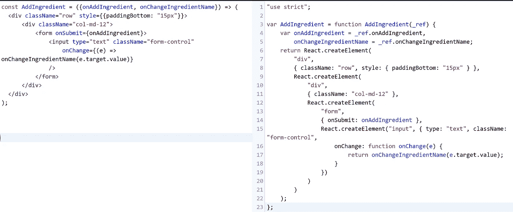
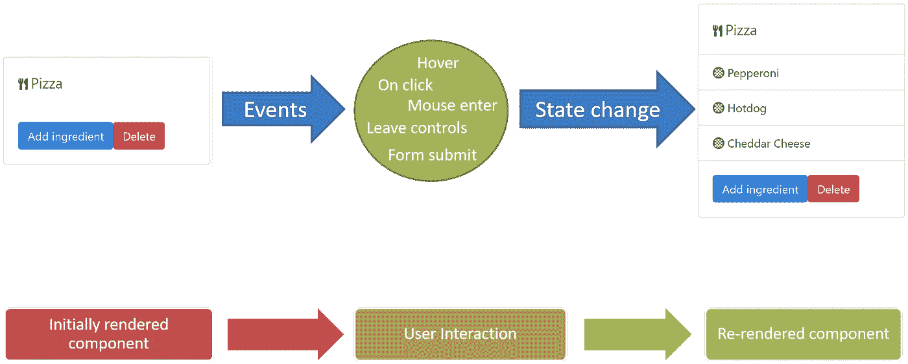

# ReactJS 快速入门:5 分钟内您需要了解的一切

> 原文：<https://medium.com/hackernoon/quickstart-with-reactjs-everything-you-need-to-know-in-5-minutes-8c78d0ef9680>

## 并开始构建 react 应用

ReactJS 是一个令人惊叹的 [JavaScript](https://hackernoon.com/tagged/javascript) 库，因为它的灵活性允许你以自己喜欢的方式构建组件。但这同时也很危险，因为如果你不小心，很多事情都会出错。

厌倦了一个人打或读官方文件？以下是您现在需要在 React 中学习的内容:

# **使用初学者工具包/样板文件快速反应**

如果你只是想开始使用 React 构建一个应用程序，你需要在这个页面下载 facebook 的样板代码:

 [## Facebook/创建-反应-应用程序

### 创建没有构建配置的 react 应用程序。

github.com](https://github.com/facebook/create-react-app) 

从头开始构建自己的项目需要时间。如果您只想试水并快速构建 React 项目，而不想在设置上浪费时间，我向您强烈推荐样板文件。

您也可以尝试这个站点，它包含并过滤您可能特别寻找的所有现有 React 样板/初学者工具包列表(例如提前使用 TypeScript):

 [## React 启动项目

### 您可以复制和修改这些存储库来创建自己的 React 应用程序。选择一个具有所有…

www.javascriptstuff.com](https://www.javascriptstuff.com/react-starter-projects/) 

脸书团队还推荐了一些初学者工具包，您应该看看这个:

 [## 初学者工具包-反应

### 用于构建用户界面的 JavaScript 库

reactjs.org](https://reactjs.org/community/starter-kits.html) 

最后，如果您真的想自己从头开始构建 React 项目，那么首先开始学习这些东西:

## 巴比伦式的城市

 [## 下一代 JavaScript 的编译器

### 下一代 JavaScript 的编译器

下一代 JavaScriptbabeljs.io 的编译器](https://babeljs.io/) 

Babel 是一个神奇的工具，可以将 JavaScript 文件从最新版本的 ECMAScript 转换到以前的版本，从而保持与旧版本浏览器的兼容性。因此，当您打算使用最新的 ES 版本的 JavaScript 时，比如使用析构或 rest、spread 或 arrow 函数语法的 ***，就不会有问题。***

JSX syntax (left) and Babel-transpiled as plain JavaScript (right)

默认情况下，ReactJS 的 JSX 语法不被支持为 JavaScript 的官方语法。所以我们需要利用巴别塔将 JSX 语法转换成普通的 JavaScript(很遗憾)。

如果你真的想在没有这些设置的情况下使用 React，你可以用它的简单形式来编码，就像你在图片右侧看到的那样。

## **网络包**

 [## 网络包

### webpack 是一个模块捆绑器。它的主要目的是捆绑 JavaScript 文件以便在浏览器中使用，但它也…

webpack.js.org](https://webpack.js.org/) 

> webpack 的核心是现代 JavaScript 应用程序的静态模块捆绑器。当 webpack 处理您的应用程序时，它会在内部构建一个依赖图，映射您的项目需要的每个模块，并生成一个或多个包

正如文档所说，Webpack 是一个模块捆绑器，可以将 JavaScript 文件捆绑成一个文件，或者拆分成不同的部分，以提高性能。Webpack 与 Babel 配合得非常好，因此将 JSX 语法转换成普通的 javascript 并无缝地捆绑到您的项目中相当容易。

# **基于组件、事件、状态、道具 React 的要素**

Component, Events, State Change, Re-rendering

## ***一切都是组件***

每个 React 文件都被视为一个组件。这与您使用 jQuery 时不同，在 jQuery 中，您以牺牲代码的可重用性和可读性为代价来手动更新 DOM。

## ***事件让用户与*** 进行交互

在您开始 React 之旅的时候，文档告诉您可能必须使用事件作为处理用户交互的一种方式。这是我在库中非常喜欢的东西，尽管在一些 javascript 库中并不明显，我很高兴 React 更多地关注事件和状态。

## ***定义你的组件属性的道具***

Displaying component props

道具是一个组件的配置，它的选项。它们是从上面接受的，是不可改变的。你可以说它们是组件的属性，就像面向对象编程的属性一样。

## ***保持和改变你的组件的状态***

Issuing a state change in your component

您使用状态来发布组件行为、数据及其外观的更改。当它出现时，React 会发出一个重新渲染命令来更新客户端的 UI。当你试图操作对象时，这是很有用的，当用户与它交互时，用户界面会改变。或者附加数据数组并设置其状态。

# 您将需要的状态管理库

有时候，使用 vanilla React 不足以构建大规模的 web 应用程序。如果发生这种情况，您可能需要使用状态管理库来填补空白，并有效地管理您的状态。

为什么需要它们？因为使用普通 React 将只允许您在组件级别管理状态。因此，当两个或更多组件需要使用相同的状态时，这样做将会更加困难。状态管理库为您做到了这一点。你自己看吧。

## Redux

 [## 读我

### 编辑描述

redux.js.org](https://redux.js.org/) 

如果您正在寻找一个结构良好、定义明确的状态管理库，我可以向您推荐 Redux。我已经在我的个人项目中使用它很长时间了，我可以说这完成了工作。它已经被许多开发者用来开发复杂的应用程序。

虽然它的简单性值得商榷，因为你仍然需要知道什么是 ***动作、动作创建者、减少者、连接器、mapStateToProps 等等*** 。作者本人不推荐使用 Redux，除非你的应用变得复杂，这是事实。你可以在这里阅读他的文章:

 [## 你可能不需要 Redux

### 人们往往在需要之前就选择 Redux。“如果没有它，我们的应用无法扩展怎么办？”后来，开发商皱眉…

medium.com](/@dan_abramov/you-might-not-need-redux-be46360cf367) 

所以在使用它之前，总是问你自己它是否值得你的团队努力和时间，以及你的应用的用例。如果很小，那就**这个。SetState()** 足以满足你的需求。；)

## 流量

 [## Flux |用于构建用户界面的应用架构

### 用于构建用户界面的应用程序架构

构建用户界面的应用架构](https://facebook.github.io/flux/) 

早在 Redux 建立之前，脸书团队开发了 Flux 来补充 React，并使用 ***单向数据流*** 来管理单独库中的状态。

现在，Redux 使用的是和 Flux 一样的设计模式，但 Redux 是 Flux 的改进版。尽管 Flux 有它自己的一套优点，这取决于你的使用情况。我知道有些人仍然在他们的大型项目中使用 Flux，所以根据你的需求，这仍然值得考虑。

## MobX

 [## 简介| MobX

### React 和 MobX 都为应用程序开发中的常见问题提供了非常优化和独特的解决方案。反应…

mobx.js.org](https://mobx.js.org/) 

> MobX 是一个久经考验的库，它通过透明地应用函数式反应式编程(TFRP)使状态管理变得简单和可伸缩。MobX 背后的理念非常简单:
> 
> 任何可以从应用程序状态派生的东西都应该被派生。自动地。
> 
> 其中包括 UI、数据序列化、服务器通信等。

React 社区的许多开发人员似乎向我介绍了这种状态管理。到目前为止，我还没有亲自用过这个。

似乎 MobX 生态系统围绕着可观测状态的使用。所以也许值得考虑。

## **一些州管理层的竞争者**

这里有一些你想用的竞争者:

 [## Jamie builds/未声明

### 无状态-状态如此简单，不言而喻

github.com](https://github.com/jamiebuilds/unstated) 

当我有机会对现有的状态管理库进行更多的研究时，我会更新这个列表。

如果你喜欢我的故事，请在推特上关注我，或者给我买杯咖啡捐款。:)

 [## 桑尼·雷西奥(@YellowFlashDev) |推特

### 桑尼·r·雷西奥的最新推文(@YellowFlashDev)。10%的企业家/健身爱好者/软件工程师/…

twitter.com](https://twitter.com/YellowFlashDev)  [## BuyMeACoffee.com，给桑尼·r·雷西奥买杯咖啡

### 给我买杯咖啡帮助创作者以友好的方式获得观众的支持。快速接受捐赠和…

buymeacoff.ee](https://buymeacoff.ee/f8AFXLh)