# 不要犯年龄歧视的错误| 3 种方法来消除你自己的观念偏见

> 原文：<https://medium.com/hackernoon/quit-making-ageist-mistakes-3-ways-to-hack-your-idea-bias-5fdfd2d522>

我们又来了。

谈论年龄、天真、经历，以及它们是如何联系在一起的。

对我来说很可笑的是，自从我们都年轻、天真和缺乏经验以来，有多少人(包括我自己)在生活中面临年龄歧视。

最近我想起了一件事，我想和大家分享，那就是想法没有年龄限制。

我和一万多名女生一起度过了周六的德克萨斯大学奥斯汀校区[德克萨斯大学女孩日](https://girlday.utexas.edu/)，我们的活动主要是通过思考以下三个问题来激励她们成为公民领袖:

*   他们会如何改善奥斯汀
*   他们将如何提高他们的教育水平
*   他们将如何改善他们的交通

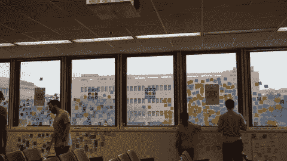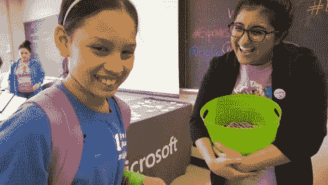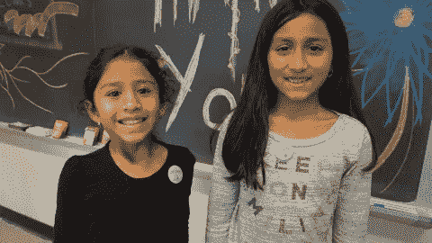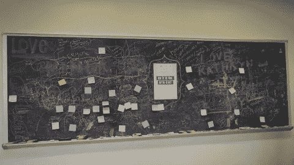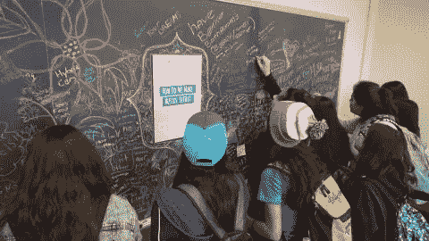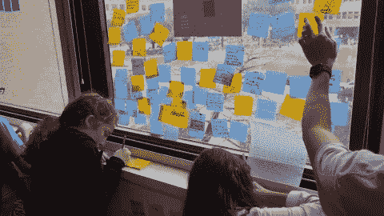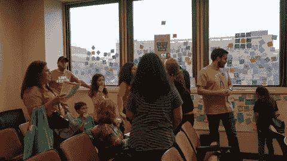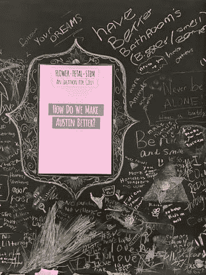

UT 女生节致力于为我们未来的 STEM 教育领导者，尤其是年轻女性赋权。

设计思维在这个领域发挥着巨大的作用，因为我们未来的工程师和科学家必须处于他们知识的边缘，才能把我们带到人类的下一个阶段。我严肃地说，因为这很重要，也很真实。他们将需要新的、动态的问题解决工具来增强他们的创造力，并最终为我们最严峻的挑战提供革命性的解决方案。

我甚至不能**开始**告诉你分享的答案是我听过的最深刻、最简单、最精炼的陈述。

因此，从这次经历中，我想分享我是如何消除自己的年龄歧视偏见的:

# 诚实地听

就这么简单。

现在，我知道我们可以坐在这里做一个积极的听力练习，你会记得如何在接下来的几个小时里积极参与……但从现在起的一周内，你可能会谈论某人或发现自己在某人说话时不听。

但是说到我们的青春，除了听，你别无选择。有些人说个不停，有些人一句话都不说，但他们的交流方式与成年人完全不同。

他们总是在等待真诚的接触，在这些时刻，你可以为他们建立一个更开放、更脆弱的分享空间。分享它们，你每次都会学到一些东西。

在我们的活动中，看着父母和他们的孩子一起出主意是很有趣的…父母会鼓励他们的孩子在活动中想出一个主意，并且经常会被分享的答案震惊…从生物燃料汽车到人类爱心活动到火箭船到教师耐心培训…不要错过任何一个想法。

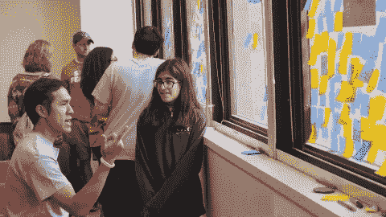

# **挖出原因**

当我在两个站点之间的房间里转圈时，我发现这很有意思，我很清楚，当我们的年轻设计师规划出他们的答案时，如果我们的设计思考者志愿者问他们“为什么这对你很重要？”或者“为什么这很重要？”—一种新的兴奋和活力被点燃了。

孩子们会被这个问题点燃，在短短的几秒钟内…我们会发现自己处于这个想法背后的“为什么”的核心。太棒了。

> 示例:
> 
> 我:“你会如何改善奥斯汀？”
> 
> 年轻女孩:“发起垃圾运动。”
> 
> 我:“为什么这对你很重要？”
> 
> 少女:“我们需要尊重自然。”
> 
> 我:“这有什么关系？”
> 
> 少女:“我们需要它来生活。”

简单。干净利落。切中要害。

我参加过一些会议，会上我们一直在讨论“为什么”和“投资回报”这样的术语，直到我们脸色发青。不管想法如何，毫不犹豫地一次又一次被原始的原因击中，这是令人耳目一新的。

# 拥抱你的发现

人们很容易放弃一个想法，因为你觉得这个想法的来源可能没有足够的经验，或者他们可能看起来很天真，但无论是不是我们想要认识的，每件事情中都有真理。

我可以轻易地抛弃我的同龄人的想法，但我不会。永远不会。我听着。

我们谈论“为什么”我们不断发现他们想要达到的更深层次的真相。从那里，学到的经验和更大的整体理解可以成为一个强大的工具，尤其是在涉及组织政治的时候。

但我不是在谈论想法的执行，我只是在谈论拥有 T2 想法本身。

它可以来自任何地方。所以，努力寻找真相，拥抱你可能发现的一切。

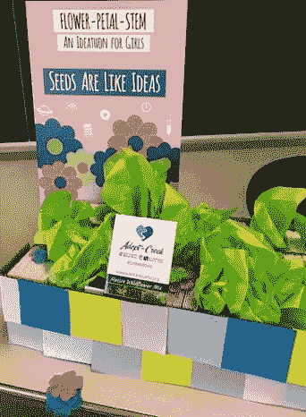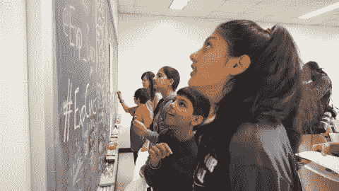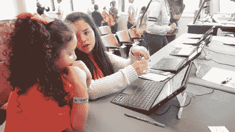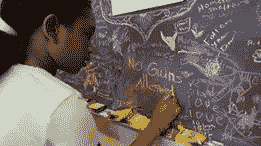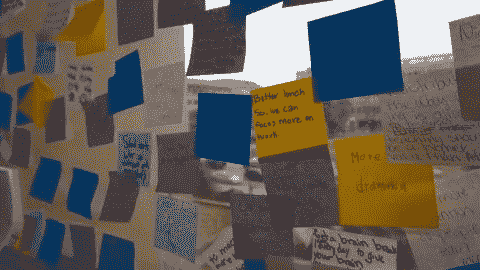

我感到被赋予了力量和灵感，能够和我新任命的同事们一起成为一名公民冠军，我真的获得了比我期望的多得多的东西。

我们将根据通过在线表格追踪到的 300 多份回复，构建不同的亲和力地图。我知道我们无法捕捉到一切，当人们专注于玩粉笔时，引导他们提交可能会很棘手，但我迫不及待地想看到更大的画面。

如果任何人对举办类似的活动感兴趣，或者对我们的活动进展感到好奇，请随时通过[实验公民学](https://www.experimentalcivics.io/)联系我，让我们谈谈！

> 一个孩子的声音，无论多么诚实和真实，对那些已经忘记如何倾听的人来说都毫无意义。—邓布利多