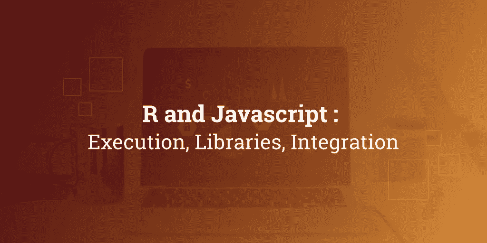

# r 和 Javascript:执行、库、集成

> 原文：<https://medium.com/hackernoon/r-and-javascript-execution-libraries-integration-40a30726f295>

在今天，R 是大数据分析的超级明星语言。在本文中，我将讨论 R 和 JavaScript 的协调、可视化和执行。然而，你可能会问这样一个问题:出于什么原因，有人可能想要将 R 集成到 web 应用程序中？

这其中有不少原因。当您将 R 添加到您的解决方案中时，大量的分析机会就出现了，如统计、预测数据建模、预测、机器学习、可视化等等。

r 是由统计学家、科学家或专业分析师使用脚本开发的，但他们在桌面上生成的报告和结果可以很容易地通过电子邮件发送或以演示的形式呈现，但这限制了商业用途和其他潜在用途。

如果 R 与 JavaScript 结合，那么 web 交付可以顺利进行，并且它可以帮助制定有效的业务决策。将 R 集成到 web 应用程序中自然成为精髓。

# 将 R 集成到 JavaScript 中

您可以通过多种方式将 R 与 JavaScript 集成。在这里，我将讨论以下我更喜欢的 Rand Javascript 集成方法。

**1。展开 R 打开**

通过 Deploy R opens，您可以轻松地将各种 R 函数的结果(如数据和图表)嵌入到任何应用程序中。这个特定的结构是一个开放源码的基于服务器的系统，是专门为 R 设计的，这使得实时调用 R 代码变得很简单。

其工作流程很简单:首先，程序员开发 R 脚本，然后在 Deploy R 服务器上发布。发布的 R 脚本可以从任何使用 DeployR API 的标准应用程序中执行。使用客户端库 JavaScript 现在可以调用服务器。调用返回的结果可以嵌入到显示中，或者根据应用程序进行处理。

**2。打开 CPU JavaScript API**

这通过 Ajax 策略提供了简单的 RPC 和信息输入/输出，这些策略可以融合到 HTML 页面的 JavaScript 中。

# 用 R 和 JavaScript 实现可视化

您可以利用大量的 JavaScript 库来帮助创建动态数据可视化的 web 功能。

在这里，我将详细阐述其中一些工具，如 D3，Highchart 和传单。您可以在 R 中快速实现这些工具，JavaScript 编程知识对此并不是强制性的。

正如我已经提到的，R 是一个开源的分析软件，它可以创建高维数据可视化。Ggplot2 是下载量最大的软件包中的佼佼者，它帮助 R 实现了作为数据可视化工具的最佳质量水平。

Javascript 也是一种脚本方言，其中 R 可以被合并以使数据可视化。众多的 javascript 库可以帮助创建伟大的直观的情节，其中一些是 d3。Js，c3.js，vis.js，plotly.js，sigma.js，dygraphs.js。

HTM 小部件充当 R 和 JavaScript 之间的桥梁。它是在两种语言之间构建连接器的主要支持。HTM 窗口小部件 r 的程序流程可以被可视化为:

信息被仔细阅读到 R

数据由 R 处理(可以想象是控制)

数据被转换为 JavaScript 对象符号(JSON)排列

信息与 JavaScript 绑定

信息是由 JavaScript 准备的(并且可以想象是由 JavaScript 控制的)

信息被映射到绘图亮点并被渲染

现在让我们讨论一些数据可视化包:

**·研发 d3 包**

数据驱动文档或 d3 是流行的 JavaScript 可视化库之一。D3 可以产生几乎所有的可视化效果，包括柱状图、散点图、图表、网络可视化等等。多个 R 包只使用 D3 绘图方法。可以参考 r d3 包教程了解一下这个。

**ggplot2**

在 R 中创建剧情确实非常容易，但是你可能会问我创建自定义剧情是否也是如此，答案是“是的”，这也是 ggplot 产生的主要动机。使用 ggplot，您可以有效地进行复杂的多层设计。

在这里，您可以开始绘制轴，然后添加点和线。但是它唯一的缺点是比 base R 慢，新开发人员可能会觉得很难学习。

**传单**

该传单在 GIS(制图)中有着深远的用途，这是一个开源库。该组件的其余组件由 RStudio 和 ports 维护。使用这个开发者可以创建弹出文本，自定义缩放级别，瓷砖，多边形，规划等等。

javaScript 的 ggmap 包可用于估计纬度和经度。

**点阵**

Lattice 有助于绘制可视化的多元数据。在这里，您可以绘制图表，帮助比较给定变量的值或子组。在这里，你会发现大量的网格亮点已经获得了利用网格包为其使用。lattice 使用的底层逻辑与 base R 非常相似。

**可视网络**

对于节点和边的图形表示，参考视觉网络。Vis.js 是众多可以进行这种绘图的著名库中的佼佼者。visNetwork 是与 R 包相关的。

网络图应该完成节点和边的记忆。对于 visNetwork，这两个数据帧应该分成两个不同的数据帧，一个用于节点，另一个用于节点

**high Carter**

这是另一个非常类似于 D3 的可视化工具。您可以使用此工具绘制各种图形，如折线图、样条线图、面积线范围图、柱形图、极坐标图等等。对于 Highcarter 的商业用途，您需要获得许可证，而对于非商业用途，您不需要许可证。

使用各种 chart()函数可以非常容易地访问 Highcarter 库。使用此功能，您可以在单个任务中创建一个图。这个函数非常类似于 D3 的 ggplot2 的 qplot()。chart()可以根据数据输入和规范产生不同类型的场景。

**有了这个包，你可以为你的绘图，图表和地图使用颜色。这个包可以很好地与 schemes 一起工作。**

****阴谋地****

**这是一个非常出色数据可视化平台，可以与 R 和 Python notebook 配合使用。它与 high career 有相似之处，因为两者都以交互式绘图而闻名。但是在这里你得到了一些额外的东西，因为它提供了一些大多数软件包不喜欢的等高线图、烛台图表和三维图表。**

****太阳信托****

**这是表示数据可视化的方式，因为它很好地描述了事件的顺序。它产生的图表说明了它自己。你不需要解释这个图表，因为它是不言自明的。**

**RGL**

**要在 R 中创建三维图形，你应该去看看 RGL。它与 lattice 有可比性，如果你是一个有成就的 R 开发人员，你可能会认为它很简单。**

****三个 j****

**这是一个 R 包和一个 HTML 小部件，有助于整合 JavaScript 库中的一些数据可视化。**

**一些可视化功能三如下:**

**Graphjs:用于实现 3D 交互式数据可视化。这个函数接受 igraph 作为第一个参数。它管理节点和边的定义。**

**散点图 3js:该功能用于创建三维散点图。**

**globe js:JavaScript 的这个功能用于绘制地球上的表面地图和数据点。**

****闪亮的****

**JavaScript 可视化最大的好处是它可以自动移植到 web 应用程序中。它们可以被注入到几个框架中，其中一个这样的 R 开发环境是闪亮的。**

**Shiny 由 R Studio 创建和维护。它是一个[软件应用程序开发](https://www.cuelogic.com/custom-software-development)工具，在很大程度上被用来制作与 R. R shiny 的智能界面。**

**Shiny 是一个促进 R web 开发的平台。**

**使用库将 R 与 javascript 连接起来**

**网络混战已经形成了一个原始的一块考试，通过这个运动，你可以折叠你所需要的信息。但是，在任何 web 开发人员开始将 javascript 呈现内容插入到 web 页面之前，都应该提取数据。为了在这种情况下提供帮助，R 提供了一个名为 V8 的优秀包，作为 JavaScript 的接口。R v8 是 javascript 中接口 r 最常用的容量。毫无疑问，您可以在不分离当前会话的情况下用 R 实现 JS 代码。用于此目的的库函数是 rvest()。**

**要在 R 中运行 JavaScript，我们需要一个上下文处理程序，在这个上下文处理程序中，您可以开始编程。然后可以将 R 数据导出到 JavaScript 中。**

**其他一些有助于分析编程的 JavaScript 库，如线性回归、支持向量机等。如下所示:**

**Brain.js()**

**Mljs**

**Webdnn**

**Convnetjs**

# **结论:**

**r 和 Javascript 实际上可以开启数据科学和分析中无数可能性。这两种技术都致力于开发更好的集成、知识库、库和用例。这是同时使用这两者的好时机。未来看起来很光明。**