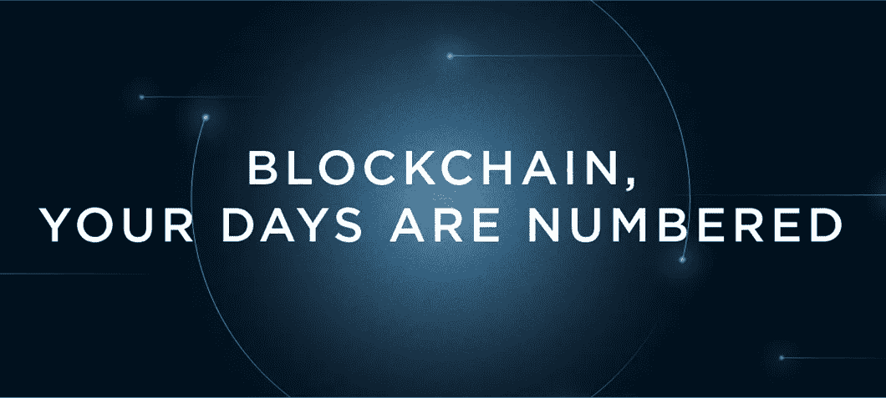
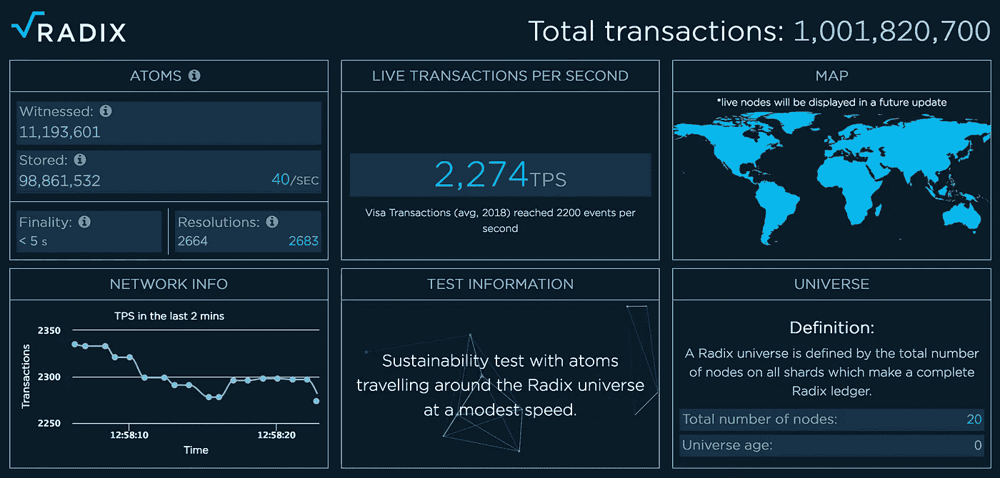
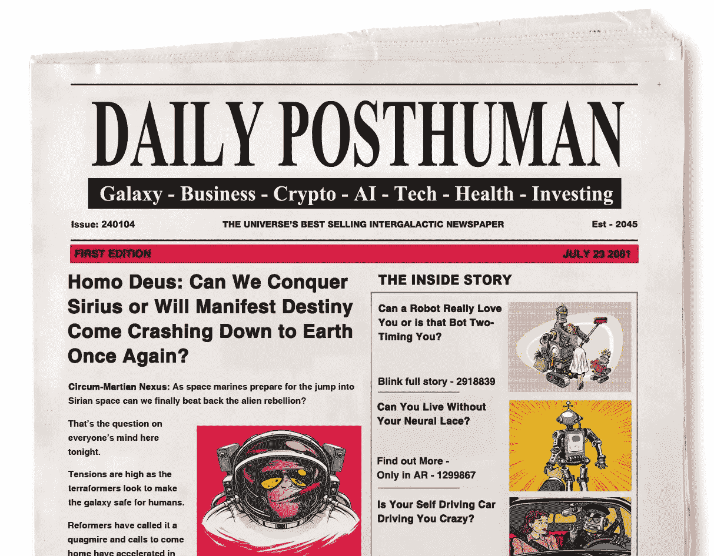
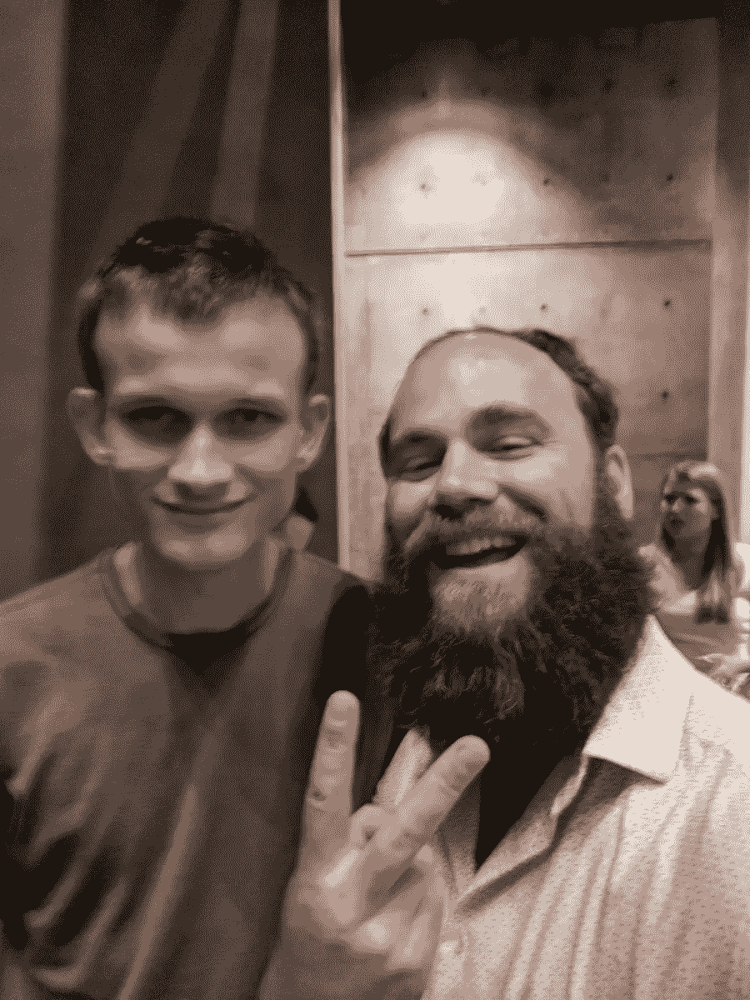

# 基数和区块链的死亡

> 原文：<https://medium.com/hackernoon/radix-and-the-death-of-blockchain-22dab6d98d0e>

############################################

*注:请查看* [***本伴播客***](http://dailyposthuman.com/interview-with-radix-team/)**到本片上我的节目，* [***【每日邮报人***](http://dailyposthuman.com/) ***。****

*############################################*

*区块链，你的日子不多了。*

*这是一个来自[惊人基数项目](https://www.radixdlt.com/)的精彩口号，它是第一个能够线性扩展并每秒处理 Visa 级别事务的分散系统之一，是加密领域可扩展性的圣杯。*

*Visa 每天推送[1.5 亿笔交易，每秒 2.4 万笔](https://usa.visa.com/run-your-business/small-business-tools/retail.html)。*

*比特币每秒只推六个。*

**

*Live transactions per second on the [Radix Explorer](https://explorer.radixdlt.com/).*

*在 alpha 中，Radix 已经[以每秒 8000 次的速度突破了每天 5000 万次的交易](https://twitter.com/radixdlt/status/958820977022038018?lang=en)，理论上它是无限的。它拥有的节点越多，可以处理的事务就越多。最终，它可能会让 Visa 望尘莫及。*

*它也是第一个**非区块链**，非 [DAG](https://en.wikipedia.org/wiki/Directed_acyclic_graph) 加密平台之一。*

*但是等等，区块链不是密码世界的中心吗？难道它们不是创造奇迹的关键吗？*

*没有。*

*区块链开创了这一切，但这只是分散资金的开始。它们是第一个解决方案，是使这一切成为可能的突破，但它们只是第一个解决方案。*

*第一种解决方案很难持久。*

*区块链是分散一致技术的穴居人之火。他们是 t 型车。*

**

*要理解为什么，你只需要知道技术的迭代和技术的类别之间有巨大的差异。从长远来看，技术类别会成功，但迭代会失败。*

*以蒸汽机为例。第一个概念蒸汽机没有工作。后来蒸汽机器的迭代爆炸，杀死或致残的人。其他人太容易也太经常崩溃。*

*几乎过了一千年，第一台真正工作的蒸汽机才彻底改变了全世界的旅行和工作。不是所有的技术都需要那么长时间，但它总是比大多数人想象的要长，通常是几十年。*

*很难想象一个没有互联网的世界，但是二十年来，几乎没有人看到互联网从 T2 起飞，成为今天这个跨越全球、改变生活的网络。*

*迭代是我们在*单一时间点*的最佳想法。*

*它们受制于想象力的极限以及发明时的技术和材料。技术怀疑论者很难看到未来，因为他们总是将迭代误认为是类别。他们看到了所有的局限和缺陷，并把它们无限期地投射到未来，好像什么都没有改变。*

*但是未来*是*变。*

*怀疑论者没有意识到某个地方有一个工程师正在研究这些缺陷并试图找到答案，通过他或她头脑中的所有排列，试图发现秘密的灵丹妙药。最终，他们中的一个人看到了世界上其他人都忽略的东西，一个新的迭代诞生了，比之前的任何东西都好。*

**

*想想电子书。第一版糟透了。它们是光盘，你必须在又大又丑的 CRT 屏幕上阅读，那会在你的视网膜上烧出洞来。它们很容易刮擦、跳跃、加载速度慢，而且你不能在地铁里拖着一台巨大的电脑到处跑。*

*多年来，许多公司试图制造电子阅读器，但都以惨败告终。就连苹果也尝试过，也没能做出早期的 pad。*

*直到亚马逊利用其巨大的市场力量，并将其与电子墨水技术和超长电池寿命相结合，真正的数字图书革命才随着 Kindle 的出现而开始。他们拥有市场力量和技术力量的完美风暴来实现这一目标。*

*每项技术都是如此。*

*类别没有失败，只是迭代失败了。*

# ***密码革命的钥匙***

*许多事情阻碍了 crypto 的大规模应用。我在我的文章[中谈到了最大的问题，即密码进化的五个关键](https://hackernoon.com/the-five-keys-to-crypto-evolution-94be921e6354)，但最大的问题是这些系统可以扩展得多快多远。*

**

*我们知道如何构建每天推动 1.5 亿笔信用卡交易的集中式系统。这不容易，但是大男孩们能做到。这需要时间、金钱和知识。这些系统是三十年技术突破和人类智慧的结晶。*

*但是当谈到分散式系统时，没有模板可以匹配集中式系统的能力和性能。这是一个最高级的计算机工程问题，我们还不知道如何完美地解决它。我们拥有比特币才八年。可怜的八年！*

*加密货币是全新的技术，我们只是还不知道它能做什么和不能做什么。*

*当人们嘲笑 crypto 并说它不会工作时，这是非常短视的。没有库可以下载，没有论文可以阅读，没有代码可以借用。没有关于扩展分散系统的最佳实践的 O'Reilly 书。我们仍在研究，还有很长的路要走。*

*这就是 Radix 项目如此激动人心的原因。*

*六年来，他们一直在秘密解决最大的问题，经历了一千次起起落落，走过了死胡同和错误的开始，才到达现在的位置，这是一个 alpha 版本，具有真实的实时工作代码，可以像云系统一样线性扩展。*

*如果你是加密新手，你可能会想为什么我们不在比特币中增加更多的节点来提高速度，但事实并非如此。更多的矿工只是让比特币更安全而不是更快。你可以再增加 10 亿个节点，但这不会让比特币快一点。它仍然每秒钟在链上推送六个事务。*

*云系统的工作方式非常不同。如果你在一个分布式应用中增加一堆 Docker 容器，你可以处理越来越多的流量。最终，您可能会遇到收益递减点，但这几乎总是代码的限制，而不是底层系统的限制。程序员可以回过头来重构代码，分解片段，把一个平台变成微服务，让它越来越快。*

*今天的加密系统做不到这一点。*

*基数罐。*

*添加更多的节点会加快速度，每秒处理越来越多的事务。*

*如果它能工作，并且没有人能破坏它的核心设计，它可能就是我们一直在等待的突破，打开大规模采用的闸门。*

# ***创造性突破的喜悦和痛苦***

*Radix 内核的设计花了很长时间，实现它并不容易。*

*他们经历了一系列错误的开始，试图将比特币扭曲成不自然的扭曲。在那之后，他们接受了 IOTA 的 Dag，只是抛弃了它们，并在量子力学和狭义相对论的启发下建立了自己的共识系统。*

*是的，真的。*

**

*在我的播客《每日邮报》上，我采访了 Radix 的首席技术官兼首席开发者丹·休斯和首席执行官 Piers Ridyard。*

*休斯的旅程始于比特币，就像许多其他人一样。比特币就像一个永远向下的分形。一旦你看到它，你就会想潜入它无尽的深处。休斯感觉到了它所承诺的可能性，津津有味地钻研白皮书和代码，通过分形的催眠漩涡一落千丈。*

*但像许多其他有远见的开发者一样，他意识到比特币不会做他想让它做的所有事情。*

**

*Vitalik and the author at a recent reunion*

*当我在 2013 年和 2014 年为《比特币》杂志撰写文章时，我看到同样的事情发生在 Vitalik Buterin 身上，当时他正在思考以太坊，并在作者的 Skype 频道上谈论它。无论布特林或休斯如何努力，他们都无法让它完成后空翻和空翻。*

*这是设计好的。*

*比特币之所以有效，是因为它的核心极其简单。它不想成为一个游戏、智能合约和应用的巨型分散平台。*

*只是钱而已。*

*这是一种发送、保存和消费的方式。就是这样。*

*它非常简单，这就是它工作的原因，没有人能够破解协议层，从每个人的钱包里掏出 10 亿美元。*

*但是现在是时候做更复杂的事情了，这意味着重新开始。*

*比特币只是暗示了未来伟大的事情。在它令人难以置信的深处隐藏着一千个其他想法的碎片。是那张发动了一千艘船的脸。*

*在休斯花了数年时间试图让比特币做它不该做的事情后，他最终不得不放弃它。*

*很难把几年的工作扔进垃圾桶，但休斯做到了。沮丧和渴望找到解决方案，他在计算机科学文献中寻找答案。他翻遍了每一块岩石，找到了每一条隐藏的通道。*

*最终他发现了 [DAGs(有向无环图](https://www.coinbureau.com/education/directed-acyclic-graphs-dags/))。很多人认为是加密人发明了 DAGs，但是他们已经存在了几十年了。休斯对 Dag 寄予厚望，并在编码狂潮中钻研它们。*

*然而两年后，当谈到可伸缩性和安全性时，他开始碰壁。当他试图分割它时，或者当它受到攻击时，因为信息在网络上泛滥并快速传播，事情就真的崩溃了。疯狂的指数级垃圾流量削弱了网络，因为它越来越大，最终休斯意识到他走进了死胡同。*

*他不得不重新开始。*

*又来了。*

*扔掉你所有的工作，重新开始一次是困难的，但两次是残酷的。*

*这花了一段时间，但最终他回到马背上，开始寻找。他从麻省理工学院等尖端学院中搜寻论文和新发展。*

*但是什么都没有。没有人真正找到分散线性可伸缩性的好答案。*

*意识到没人想明白这一点在某种程度上是一种解脱。*

*这意味着他可以寻找其他的灵感，这就是休斯所做的。他开始观察自然和宇宙保持时间的方式。毕竟，宇宙经历了几十亿年的进化，它知道一些关于构建可扩展、可持续系统的事情。*

*一旦 Hughes 开始掌握他自己的想法，代码就真正开始组合起来了。他意识到每一步的关键都是简化堆栈。少即是多。*

*本质上，支撑我们世界的过程看似简单，休斯想要反映它们。*

*从简单到复杂。*

*就像我们最近在 AI 里看到的一样。深度学习系统超级复杂，而长期不受欢迎的遗传算法却非常简单。深度学习主导了今天的人工智能领域，但当 OpenAI 复活遗传算法时，他们[发现它们在任务上表现得一样好，甚至更好](https://blog.openai.com/evolution-strategies/)深度学习和强化学习很容易消化，但所需的处理能力要少得多。*

*遗传算法受到自然和进化的启发。大自然善于用最简单的想法创造出你每天在身边看到的所有奇迹。*

**

*从自然中汲取灵感，休斯不惜一切代价寻求简化。他没有将越来越多的复杂性移植到他的系统中，而是不断地试图找出一种更好、更简单、更优雅的方法来做某事。*

*如果他的平台上的外来攻击导致它崩溃，每秒钟发出 30 万条消息，他就努力工作，直到只产生两三条消息。*

*所有这些都需要时间、勤奋和耐心。*

*我们不会在一夜之间到达应许之地，但是休斯一步一步地向它靠近，锁在他的编码洞穴里，敲打着键盘，做着最深的[深度工作](https://amzn.to/2w5ZjLE)。*

# ***新的希望***

*只有时间才能证明丹·休斯是否在他的宏伟设计中遗漏了什么，是否需要重新开始。*

*但如果成功的话，这将是一个非常好的时机。*

*在我的文章《比特币 20 年后会是什么样子》中，我写道“区块链只是分散共识的开始。”我说过，在未来的几年或几十年里，我们会看到几十种，如果不是几百种的方法来达成分散的共识。*

*区块链是使这一切成为可能的突破，但没有人再拥有 T 型车是有原因的。我们学会了如何制造更好、更快、更时尚、更舒适的汽车。任何技术都是如此。最初的突破导致一连串的突破。*

*区块链就是迭代。分散共识技术就是这一类。*

*分散的共识是加密的真正力量，它能做的不仅仅是防止双重花费。*

*这是分布式系统达成一致的一种方式。这就是朋友、敌人和敌友如何决定现实的状态。可能性是无限的，但区块链限制和缩小了这些可能性。*

*区块链这个词限制了我们对可能性的理解。当我们用迭代这个词来代替“分散的共识”时，它框定了我们的想法，让我们相信没有其他方法可以远距离达成共识。这是因为语言框定了我们对思想和世界的看法。*

*这就是为什么爱斯基摩人有五十多个表示雪的词。*

**

*这是一个多世纪前由人类学家弗朗茨·博厄斯推广的观点，但被其他人类学家质疑。事实证明他是对的。爱斯基摩人确实有超过五十个关于雪的单词。*

*博厄斯在日记和给他妻子的信中捕捉到了一些迷人的词汇:“aqilokoq 代表‘轻柔的雪花’，piegnartoq 代表‘适合驾驶雪橇的雪’，仅举两个例子。”*

*为什么我们有一个单词代表雪还是五十个单词有关系呢？*

*因为只有一个词限制了我们理解细微差别和提出新想法的能力。一个告诉我们雪有多湿或多粉，以及它对越野滑雪有多好的单词，在一个单词中带来了巨大的深度和洞察力，而用英语来描述需要几十个单词。*

*反之亦然。如果我们只有一个词来形容雪，那么所有的雪都差不多，不管是湿的还是冰的，也不管是大块的、脂肪状的、粉状的、非常适合滑雪的雪花。*

*当我们说区块链是我们创造的，所以我们只能用一种方式来思考如何让未来的加密成为现实。*

**

*换个角度思考。*

*Radix 发展到今天的位置，需要超越区块链的新思维。他们不得不离开 Satoshi 最初想法的监狱，转而逃离比特币承诺的隐藏可能性。*

*这就是他们今天的处境。他们准备向世界展示他们所做的一切。*

*阿尔法代码激活了。*

*他们已经准备好让人们试图打破它，把它撕碎。*

*开始吧。弯曲它。撕了它。把它变成你自己的。*

*与此同时，他们开始向价值链上游移动。*

*他们致力于抽象出你在 crypto 中要做的所有日常任务，比如写智能合同。大多数人一生中都不需要或不想写一份巧妙的合同。他们会抓起一些已经很重的乐高积木，把它们堆在一起，做成漂亮的东西。*

*他们也以完全不同的方式释放自由基。自以太坊早期以来，ico 一直占据主导地位，但 Radix 没有 ERC-20 代币，也没有对私人投资者的早期折扣。每个人都是平等的。*

*连工作人员都没有得到任何代币。*

*这是因为他们试图建立一个稳定的经济，在网络中快速移动，而不是疯狂翻转。*

*所有这些构成了下一代平台，将在未来几年与以太坊、 [EOS](https://hackernoon.com/eos-goddess-of-the-crypto-dawn-4b2959c03a35) 和其他公司争夺加密王冠。*

*竞争是一件美好的事情。*

*在过去的几年里，我已经介绍了很多平台，但是 Radix 可能是我现在最感兴趣的一个。*

*他们坚持自己的原则，丹·休斯继续努力工作，使他的去中心化未来的梦想成为现实。*

*时间会证明一切。*

*正如《肖申克的救赎》告诉我们的:*

*“需要的只是压力和时间。”*

*区块链，你的日子可能终究只是屈指可数。*

*###########################################*

**文章版本:20180822002.beta.3a】**

*############################################*

## *我有一个新的播客，[每日邮报](http://dailyposthuman.com/)，涵盖加密，人工智能，科技，未来，历史，社会等等！查看我最著名的文章和想法的扩展报道，以及像[我刚刚与 Radix 团队](http://dailyposthuman.com/interview-with-radix-team/)一起做的令人敬畏的采访。上 RSS 频道，不要错过任何一集，请在接下来的几个月里关注一些非常特别的嘉宾！*

**

*###########################################*

## *如果你喜欢我的作品，请访问我的个人主页，因为这是我与所有粉丝分享特别见解的地方。*

*A message from me to my fantastic patrons.*

## *顶级赞助人可以独享这么多东西:*

*   ***每篇文章、播客和私人谈话的早期链接。你比任何人都先阅读和聆听！***
*   ***一个月月虚拟的和我见面问&一个。问我任何问题，我都会回答。我也分享我正在做的一切，并给你一个幕后看我的过程。***

## *访问传说中的硬币表 Discord，您会发现:*

*   ***市场来电**来自我和其他专业技术分析大师。*
*   ***投币者**只能**私聊**。*
*   ***私人海龟滩频道，程序员们在这里分享各种版本的** [**密码海龟操盘策略**](https://hackernoon.com/my-super-secret-crypto-turtle-strategy-revealed-ae7492fb01a6) **等信号和交易软件**。*
*   ***幕后**看看我和其他专业人士是如何解读市场的。*

*############################################*

*你也可以在 [**DecStack 停下来，这是加密货币和分散式应用项目**](http://decstack.com/) 的虚拟合作点，在这里你可以接触多个项目。永远完全免费。只是进来和社交，一起工作，分享代码和想法。通过反馈让你的想法更好。寻找新朋友。见见你的新家人。*

*############################################*

**

*[Photo credit](https://extranewsfeed.com/the-winds-of-world-war-iii-8bc369584f67)*

*关于我:我是一名作家、工程师和连续创业者。在过去的二十年中，我涉及了从 Linux 到虚拟化和容器的广泛技术。*

**你可以看看我的最新小说，* [***一部史诗般的中国科幻内战传奇***](http://amzn.to/2gAg249) *在这部小说中，中国挣脱了共产主义的枷锁，成为世界上第一个直接民主国家，运行着一个高度先进、人工智能的去中心化应用平台，没有领导人。**

## *当你加入我的读者群，你可以免费得到一本我的第一部小说《蝎子游戏》。读者称之为“神经癌的第一次严重竞争”和“黑色侦探会见约翰尼记忆术。”*

*############################################*

## *最后，你可以[加入我的私人脸书小组，Nanopunk Posthuman 刺客](https://www.facebook.com/groups/1736763229929363/)，在这里我们讨论所有的科技、科幻、幻想等等。*

*############################################*