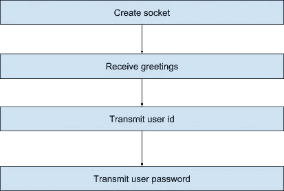
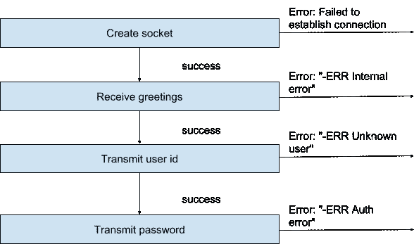
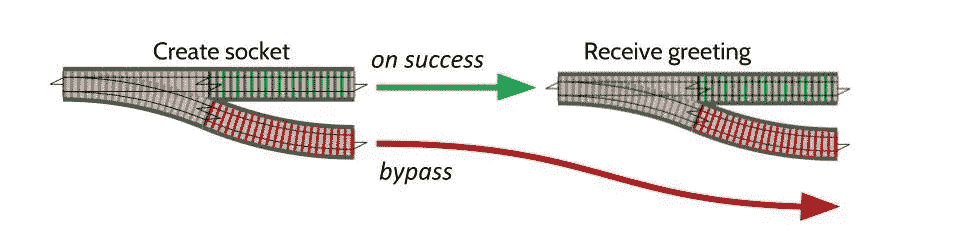
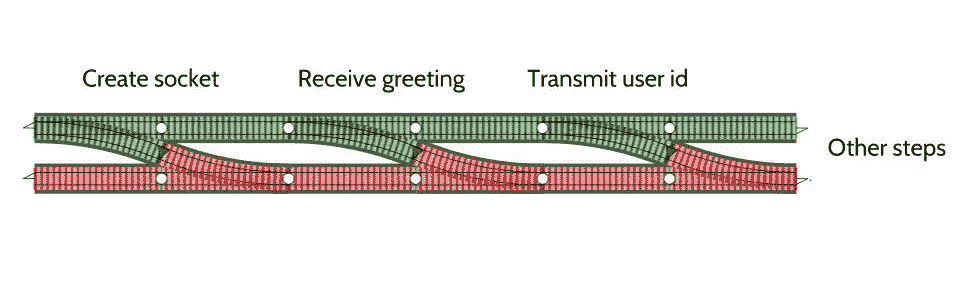

# 使用 Erlang 进行面向铁路的开发

> 原文：<https://medium.com/hackernoon/railway-oriented-development-with-erlang-46ea6db4a795>

作者奥列格·塔拉森科


这篇博客提出了另一种构建程序的方法，这种方法受到了 Elixir pipe 宏' | > '的启发，但是不需要使用我最近编写的小小的 [epipe](https://github.com/oltarasenko/epipe) 库来进行可怕的解析转换。Epipe 本身的灵感来自 Scott Wlaschin 发表的这篇[文章](https://fsharpforfunandprofit.com/rop/)。

# 入门指南

让我们执行一个小的实际任务来演示函数式编程的这种铁路方法。

考虑我们使用 Erlang 构建 POP3 电子邮件客户端的情况。我们的目标是实现与 POP 服务器建立连接的控制流。

下图说明了完成此操作所需的步骤:



首先，让我们构建一个实现连接功能的函数:

```
connect(Addr, Port, ConnOptions, User, Password) ->
    {ok, Socket} = ssl:connect(Addr, Port, ConnOptions),
    ok = receive_greetings(Socket),
    ok = send_user(Socket, User),
    ok = send_password(Socket, Password).
```

上面的代码非常漂亮，只有四行代码，我们就完成了！但是等等…上面的实现是最好的情况。显然我们需要添加一些错误处理来处理边缘情况。我是说，“还能出什么差错”？

# 添加错误处理

让我们在下图中总结所有可能的边缘情况:



让我们添加错误处理代码，看看现在是什么样子！

剧透:下面的例子很简单，可以通过将操作分解成独立的函数来美化，但是嵌套的 case 语句是不可避免的。

```
connect(Addr, Port, ConnOptions, User, Password) ->
    case ssl:connect(Addr, Port, ConnOptions) of
        {ok, Socket} ->
            case receive_greetings(Socket) of
                ok ->
                    case send_user(Socket, User) of
                        ok ->
                            case send_password(Socket, Password) of
                                ok -> ok;
                                _Err -> error_logger:error_msg("Auth error")
                            end;
                        _Err ->
                            error_logger:error_msg("Unknown user")
                    end;
                Err -> error_logger:error_msg("Could not receive_greetings")
            end;
        _Error -> error_logger:error_msg("Could not connect")
    end.
```

哇哦。现在我们已经添加了所有的错误代码。哇，代码的大小增加了 400%…可读性却相应降低了。哎哟！

也许有更干净的方法来实现这一点？

# 用“铁路”方法设计更好的错误处理(理论)

[铁路](https://fsharpforfunandprofit.com/rop/)方法背后的想法是分解“步进”功能块，使用铁路道岔作为模拟:


* Image source: Scott Wlaschin

这可以翻译成下面的 Erlang 代码:

```
switch_component(Input) ->
    case some_action() of
        {ok, Response} -> {ok, Response}; % Green track
        Error          -> {error, Error}  % Red track
    end.
```

一旦您为所有要求的操作创建了两种方式(ok/error)开关，您就可以像在铁路上一样优雅地组合它们:



* Image source: Scott Wlaschin

所以，概括一下，到底发生了什么:

在成功场景的情况下，所有功能(“铁路道岔”)被顺序执行，我们沿着“成功轨道”行进。否则，我们的列车会切换到“错误轨道”,绕过所有其他步骤，沿着这条路线行驶:



* Image source: Scott Wlaschin

# 用“铁路”方法设计更好的错误处理

我们发布了一个小小的 [erlang 库](https://github.com/oltarasenko/epipe)，它简化了 erlang 的 railway 分解。因此，给定上面的例子，让我们看看如何使用 Epipe 实现我们的用例:

```
-record(connection, {
    socket,
    user,           
    addr,
    port,
    passwd
}).

connect(Addr, Port, User, Password) ->
    Connection = #connection{
        user = User,
        passwd = Password,
        add = Addr,
        port = Port
    },
    % Defining list of railway switches to follow
    ConnectionSteps = [
        {get_socket, fun get_socket/1},
        {recv_greetings, fun recv_greetings/1},
        {send_user, fun send_user/1},
        {send_passwd, fun send_passwd/1}
    ],
    % Running through switches
    case epipe:run(ConnectionSteps, Connection) of
        {error, Step, Reason, _State} ->
            error_logger:error_msg("Failed to establish connection. Reason: ~p", [Step]),
            {error, Reason};
        {ok, _Conn} = Success -> Success
    end.

% Building blocks. Note that every function can return either {ok, Connection} or {error, Reason}

get_socket(Connection) ->
    case ssl:connect(Addr, Port, ExtraOptions) of
        {ok, Socket} -> {ok, Connection#connection{socket = Socket}};
        Error        -> {error, Error}
    end.

recv_greetings(Connection) ->
    case recv(Connection) of
        {ok, <<"+OK", _Rest/binary>>}   -> {ok, Connection};
        {ok, <<"-ERR ", Error/binary>>} -> {error, Error};
        Err                             -> {error, Err}
    end.

send_user(Connection = #connection{user = User}) ->
    Msg = list_to_binary(User),
    send(Connection, <<"USER ", Msg/binary>>),

    case recv(Connection) of
        {ok, <<"+OK", _Rest/binary>>}   -> {ok, Connection};
        {ok, <<"-ERR ", Error/binary>>} -> {error, Error};
        Err                             -> {error, Err}
    end.

send_passwd(Connection = #connection{passwd = Passwd}) ->
    Msg = list_to_binary(Passwd),
    send(Connection, <<"PASS ", Msg/binary>>),

    case recv(Connection) of
        {ok, <<"+OK", _Rest/binary>>}   -> {ok, Connection};
        {ok, <<"-ERR ", Error/binary>>} -> {error, Error};
        Err                             -> {error, Err}
    end.
```

与嵌套的 case 语句实现相比，生成的代码在代码行数方面并没有减少，但是可读性更好，更易于调试和支持。

如果您想看看真实世界的实现，请看看这个使用 railway 方法执行的[重构示例。](https://github.com/oltarasenko/erlpop/blob/master/src/epop_client.erl#L38-L115)

*原载于 2018 年 6 月 13 日*[*【www.erlang-solutions.com*](http://www2.erlang-solutions.com/l/23452/2018-06-13/5kmnlh)*。*