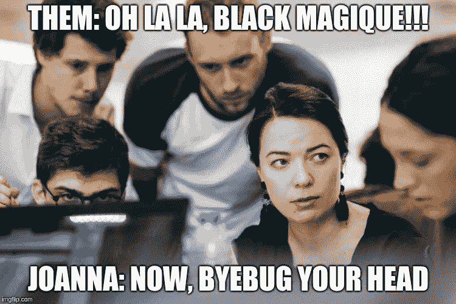

# 举起你的隐形魔杖，这是编码训练营的反向魔法

> 原文：<https://medium.com/hackernoon/raise-your-invisible-wands-this-is-the-amount-of-magic-going-into-a-coding-bootcamp-c8b41e93b59b>

从帮助书迷到将你的生活变成黄金时间，在为期 9 周的编码训练营的幕后发生了什么。

魔法很棒。孩子和成人都被它所诱惑。通过耳语一些无意义的话语或用魔杖做手势，你会得到你想要的结果。史前社会举行仪式来释放它的力量，甚至现代人也无法避免将她生活中的一些事件归因于魔法。

你遇到的人，你做的活动，你参观的地方，你创造的东西，不完全也不完全是你理性和有计划倾向的努力的结果，在某种程度上是魔法、意外收获、命运、随机的结果，不管你喜欢怎么称呼它。生活中充满了它们。

大多数时候，我们不会感到失去控制，而是被生活中的一点点魔力所陶醉并心存感激。在拥挤的地铁里丢失的手机，几天后你能找到想要分享你的沙滩巾的瓢虫，显然是从哪里冒出来的。

不那么浪漫，但不乏某种形式的魔力，是做一个编码训练营。事实上，忘记哈利波特教室的牛津式墙壁吧，如果你正在寻找一些魔法，一个时髦的开放空间的翻新的仓库墙壁，可能是你会看到大多数隐形魔杖被举起的地方。

## **1。将您想象的产品带入生活的魔力**

对于像我这样从零开始创造东西中找到最大乐趣的人来说，训练营提供了机会和[工具](https://hackernoon.com/tagged/tools)，让他们不必等待别人来实现你的愿景。你现在可以为你的想法制作一个工作原型了。或者训练营结束后你想看多少就看多少。冲洗并重复。

在训练营期间，我的 3 人团队开发了一个 web 应用程序的工作原型，以方便与附近的书迷会面和从他们那里借书——BookaBook——以及一个移动优先的 web 应用程序，以改善人们利用业余时间的方式——prime time。这两个问题对我来说都很重要，值得尝试解决。现在我们有了尝试它们的工具。

我们从零开始，讨论概念，绘制屏幕草图，设计和验证数据库模式——请给这一步留出时间，否则以后将面临一生的迁移——生成和编码模型、视图和控制器，并看到我们的新生儿第一次(真正地)被推到 web 上。

## **2。看穿咒语的(反向)魔法**

看到曾经神奇的东西——互联网的工作方式、登录页面上出现按钮的方式、搜索提供结果的方式——现在变得更容易理解，也是一件神奇的事情。从天真和被欺骗的巫师学徒变成有点像巫师自己。

现在我们可以用 x 光透视网络应用程序，检查它们的外观(也因为我们可能太喜欢它了，以至于我们想用它作为我们自己创作的灵感😁)，并想象模型-视图-控制器的骨架，让他们可以移动和生活。

就像弗兰肯斯坦博士一样，我们现在也能够用来自 codepen 的代码(或者你可以找到那个很酷的 javascript 动画的其他地方)来修补我们自己的代码，然后希望有一个活着的生物。

现在，我们总是可以决定用一个温暖的夏夜来孕育一个新的创作，相信一个按钮不需要两个星期就能完成。

当然，仍然有一些东西会保持有点神奇，但这似乎是学习的每个阶段的情况，即使是对某个主题的经验丰富的从业者来说——一些东西变得不神奇，让位于你视野中其他更复杂的神奇事物。事实上，学习者类似于魔法猎人，他们寻找并摧毁魔法以发现更多的魔法。一遍又一遍。

## **3。让你的大脑两边都沉浸在纯粹的快乐中的魔力**

这个世界有时认为是冲突或对立的，创造性和分析性，大脑的左右侧，在这里一起工作，提出最具创新性和功能性的产品。我说的不是不同的人，而是同一个人的两面，被召唤去合作。

事实上，没有好的产品仅仅由好的后端或好的前端组成，最好的产品在将好的设计与好的后端性能相结合方面非常出色，因此将定量与创意相分离不仅危险，而且很可能产生低于标准的服务。更不用说产品本身的创意需要喝大量的创意果汁才能在噪音中脱颖而出。

也就是说，尽管已经学习了完整的堆栈(包括前端和后端)，但在项目中有一些团队使用前/后规则来划分任务——我总是对两者都做一点最感兴趣。

## **4。独自工作和独自工作的魔力**

有这样一个神话，开发者是孤立的生物，依靠他们的降噪耳机来保护自己不受外界影响，住在自己的小泡泡里。虽然这种形象对喜欢长时间深度专注工作的人来说很有吸引力，但事实是他们会合作，而且比你想象的要多得多。

这方面的证据是备受喜爱的协作工具，最近被微软收购的 spot light——GitHub，旨在让人们以更顺畅的方式一起构建东西。

我们的团队有 3 到 4 个人，我们都必须学习 GitHub 的诀窍，经历合并代码并将其推给 master 的最初令人不寒而栗的时刻。

为了增加复杂性，引入了 web 主机服务 heroku(第三个存储库……)。你可以放心，不管有没有警告，在推进到 GitHub 之前，还是会有人推进到 heroku 的。尽管这些工具有很多优点，但它们并不是防人的。LOL。

## **5。以新颖的方式分享知识和学习的魔力**

我们在训练营的最后三周开发了两个原型。在最初的 6 个星期里，我们会在早上进行简短的讲座，然后在剩下的时间里练习我们刚刚学过的话题。

每天我们都被分配给一个新的“伙伴”，另一个学生，这样我们就可以一起做练习。这与大学不同，在大学里，我们倾向于和一群我们已经认识的人呆在一起，在工作中，团队通常不会经常改变。挑战你每天向一个新的人学习和教导。

我们也得到了助教们的帮助，他们本身也是年轻人，是来自 LeWagon bootcamp 的校友，他们可能与我们的奋斗和抱负有关，他们来自世界各地。

*with people from many nationalities, hybrids such as “black magique” were common. byebug is a debugger for the Ruby language.

对新手来说，一些助教表现出如此多的恶意，完全符合巫师的比喻。我不会忘记助教 Joanna 在处理我们最迫切的问题时所表现出的泰然自若，她审视着我们半生不熟的代码，从中提取出最大的意义，平静地引导我们找到一个不那么糟糕的代码。

虽然有大量的在线内容可以学习编码，但我们会有一个平台，准备好任务来跟踪我们的嵌入式测试进度，这些测试在我们编写代码时验证我们的代码，考虑代码的风格等因素，例如，如果您编写了 100 行代码，而只需要一行，您将获得“糟糕的风格”，并且必须重构代码才能继续。

## **6。让白色魔法再次变得性感的魔法**

虽然黑魔法往往更性感——你知道，穿着黑色衣服的巫师——但带来好结果的好事也是如此。其中一个原型——保持安全——允许人们在与火灾蔓延相关的紧急情况下进行通信，这种情况一再困扰着我们的国家，证明了利用[技术](https://hackernoon.com/tagged/technology)可以做很多好事。

帮助爱书人认识他们的同龄人，普通人充分利用他们的业余时间，以及其他更平凡但有用的任务，如从隔壁邻居那里得到你的食物，这些都是使用一些白色魔法和美好目标的想法，他们穿着白色礼服看起来非常性感。

我不能说这是每个训练营都会发生的情况——每个训练营都有自己的结构、课程、教师、学生、地点等，即使在同一个组织内，这些方面的任何细微变化都会造成差异——也不能说在一个训练营之后会发生什么。

总有改进的空间——有些人比其他人更有教学天赋，每天与不同的人合作并不总是没有摩擦，你可以争论一些主题可能比其他主题占用更长的讲课时间。

但是当这一个持续的时候，这些是我已经注意到的魔法元素，它们看起来是一些非常闪亮的元素。

参加过编码训练营吗？欢迎分享你的经验！