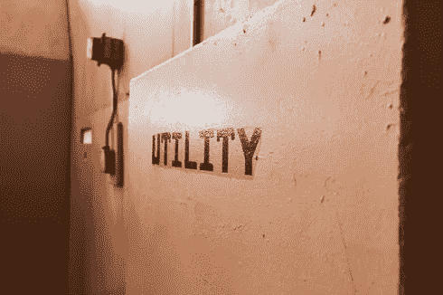

# 提高实用工具令牌的标准

> 原文：<https://medium.com/hackernoon/raising-the-bar-for-a-utility-token-2a6b661fd73f>

## 它是否产生边际公共价值(MCV)？

“Utility”, by GrinningPhD, DeviantArt.com

大约在 2017 年，监管机构无意中将术语“公用令牌”(又名“非安全令牌”)推向了广泛使用。现在已经是既成事实了——改名为时已晚。这太糟糕了。这对代币市场是误导和有害的。这意味着应该根据代币创造了多少效用来判断代币。

相反，应该根据代币通过合作创造了多少新价值来判断它们。

我提议称这种价值为边际公共价值，或 MCV。

为什么要注入 commons 这个词？它清楚地标识了所创造的价值的类型。所有设在区块链的分散项目都作为一个公共领域运作。commons 最初是一个共享的分类账和一套智能合约；然后，它添加资源(身份、声誉、专业知识、数据、资产等)。)来自参与者自己。提供对这些资源的共享是不够的:在缺乏中央权威的情况下，必须存在某种激励机制来协调激励措施并防止公地悲剧。

简单地说，项目令牌的工作是通过激励合作来产生 MCV。不是为了“提供效用”。许多交易在没有令牌生成 MCV 的情况下也是有用的。

让我们探索一下这个概念。

如果我付钱给我的医生在菲亚特做检查，这对我们双方都有好处。我们中的绝大多数人相信菲亚特的未来价值和流动性。这种“价值储存”(SoV)和“交换媒介”(MoE)的信念存在于尤瓦尔·赫拉利所说的我们的“共享想象”或“主体间性”中。这种主体间性是一种共有物，它神奇地从无价值的纸片中创造出价值。正如哈拉里在《智人》中指出的，货币的发明(菲亚特是其中的一部分)产生了大量的 MCV。对他来说，它与宗教和语言并列为人类文化的主要适应。[【1】](#_ftn2)

“Worthless”, by AlyOh, DeviantArt.com

如果下一次，我用比特币支付给同一个医生，加密货币作为一种支付手段获得了少量认可。看到这一点，其他人可能会提高他们的共同信念，即比特币是未来的价值储存手段。付款后，我将 MCV 加入了比特币 SoV 共享空间。请注意，这是一种特定类型的价值——储存财富和支付的共有物——由特定的共同信念创造。创建这种 MCV 是其创始人的意图。

现在让我们说，我用一个 dapp 代币支付医生。姑且称之为“医生令牌”。这个 dapp 是一个分散的公共资源，旨在改善医疗保健的可及性。这个想法是，医生可以形成一个专门的网络来提供护理，病人可以用一个代币来补偿他们的服务。许多 dapp“劳动力市场”代币都有这样的设计:劳动力用户用代币支付劳动力供应商。

托肯医生创造了 MCV 吗？

不仅仅是基于这些细节。原因是我们已经可以使用菲亚特 MoE commons 作为支付这些医生的平台。我们新的 dapp 令牌几乎没有添加任何 MCV。加入公共领域的医生的行为变化可以忽略不计。很少产生新的合作。所发生的一切就是创始人们推出了一个与菲亚特竞争的 MoE commons，一个注定要逊色的。

请注意，医生代币具有大量的“效用”,因为它可以用来交换有用的商品或服务。这就是为什么这个术语如此具有误导性。项目设计者和代币市场可能都认为他们通过交易创造了价值。

在现实中，病人和医生将很少有动力作为公共参与者(而不是投机者)持有代币。这个令牌的速度可能会非常高，不是因为它缺乏人为的速度汇，而是因为它首先没有产生 MCV。支付或创造价值储存根本不是绝大多数 dapp commons 的目的。在他们有缺陷的代币的设计中加入速度下沉——比如打桩——就像试图支撑起一座叠木塔。[2]

“Just a Number”, by Tom-Ripley, DeviantArt.com

医疗保健 dapp 团队应该问自己的问题是，“我们的令牌如何以菲亚特或其他 SoV 公共资源无法做到的方式激励公共资源(MCV 的来源)中的合作和共享？

一种方法是让 commons 作为“开源”医疗协议网络存在。任何接受公共代币的医生都同意遵守一套共享的公共医疗协议，以获得持续的预防性护理；他们还同意预付一定价值的代币。如果他们在遵守协议方面低于患者反馈的某个指数，他们就失去了他们的股份。公地中的任何患者也同意下注某一最低数量的代币来补偿医生，以便从业者有支付的保证(即，他们获得已知的收入池)。他们还同意将去身份化的数据提供给研究人员进行分析。此外，任何研究人员产生一个新的协议，一个被投票给开源集的协议，也可以从令牌池中获得一定的百分比。在这种特殊情况下，commons tokens 做了两件事:1)它实施并管理开放源代码保健协议的使用；2)调整三种类型的公共参与者(医生、患者、研究人员)的激励机制，使*预防保健服务在菲亚特公共参与者*中无法获得。这是一个没有中央权威也能运作的公共领域。这种开源的特性使得网络很容易扩展和继续创新——也就是说，它是一台 MCV“机器”。

不过，有一个问题。医生、患者和研究人员都有以 SoV/MoE commons token (fiat)计价的成本。《MCV》的制作需要将医生代币转换成纸币，以支付租金、设备租赁费、交通费等。换句话说，MCV 的很大一部分公共资源实际上来自公共资源之外。想象一下价值链:它延伸到菲亚特被用来实现合作的地方。如果说这种被迫转换为菲亚特是一个“速度”问题，那就是把它弄反了。速度快是因为太多的 MCV 来自公共领域之外；这并不是因为公地缺乏人为的速度下沉来防止平板流出。不管怎样，一个木桩或另一个木桩，菲亚特会流出，速度会上升到它的自然吸引子。

这就引出了一个前提。代币的 MCV 取决于两个因素:1)由公域内的合作和共享创造的 MCV；以及 2)价值链中*实际驻留在公地*的百分比。

第二部分是对大量 dapps 进行估值的挑战。他们的 MCV 来自于一个很长的价值链，只有最后几个环节涉及到公地内部的合作。即使他们的网络创造了大量的价值，其中大部分也会从他们各自的代币中流出。

问题是:我们不应该在乎。我说的“我们”是指那些希望看到公地作为一种新的、在许多方面更好的经济组织方式出现的人。代币的初始值只与投机者和资本筹集者有关，而与公地能否成功创造新行为无关。是的，前期资金对于建立公共基金是必要的，但是需要多少呢？机会是，一个较低的感知 MCV 可能仍然足以资助实际上是开源项目。也许这些 dapps 产生的亿万富翁比一些早期的加密货币少得多。或许，dapp 团队成员仍然会从他们付出的时间中获得回报。

此外，这些团队成员可以选择通过提供安全令牌来筹集资金，这实际上与作为令牌类型的 commons 令牌没有什么关系。安全令牌代表对项目权益或收入的要求，而不是在 MCV 的直接股份。如果该项目的价值主要由 MCV 获得，那么两者的估值将密切相关。然而，项目团队也有可能设计出一些方法，让自己作为*中央权威*发挥作用。这不是亵渎。参与者可能会信任团队来执行某些服务，包括那些通常驻留在 fiat commons 的服务。为什么不呢？我们一直信任人和机构。只有“不信任”的 dapps 可以解决问题的观念是无政府主义者梦寐以求的，但不是[的普通主义者](/@dvespinosa/why-tokens-signal-the-end-of-an-era-62410b5067da)。平民主义者只是希望看到更多的平民行为，更多的合作和分享，而不是缺乏规则或制度。

因此，在项目团队可以将他们对 MCV 作为中央当局的贡献货币化的情况下，项目的安全令牌的价值将是 MCV 的函数，并且是通过菲亚特公用事业提供非合作的传统公用事业所获取的价值。如果后者相对于前者过高，团队被视为在剥削公地，参与者总是可以用脚投票(竞争项目可以帮助他们做到这一点)。

[区块链](https://hackernoon.com/tagged/blockchain)拥有巨大的潜力来实现新的公共领域。在我们经济和生活的许多领域，合作早就应该进行了，而且是治愈我们社会疾病所必需的。Commons 令牌将支持并反映大量的这种价值创造。他们将会成功和繁荣。他们也需要被判断为他们打算做什么——产生 MCV 而不是“效用”——作为他们评估的标准。

[【1】](#_ftnref2)说清楚一点，“货币”是一个使 SoV 或 MoE 成为公共的令牌；“公用令牌”支持 SoV 或 MoE 之外的公共合作(非公用)。两者都是公共令牌总体概念的子集。

我非常感谢 Duncan Chiah 在《T2》中关于公用令牌价值的精彩文章，这篇文章促使我思考价值是如何从公共资源中流失的。

[【3】](#_ftnref3)MCV 是否要求产生涌现的、自我强化行为的*网络动力*的存在？也许吧。这是另一篇文章的主题。