# 使用最大似然估计对 NFL 球队进行排名

> 原文：<https://medium.com/hackernoon/ranking-nfl-teams-using-maximum-likelihood-estimation-7a4ed8994a67>

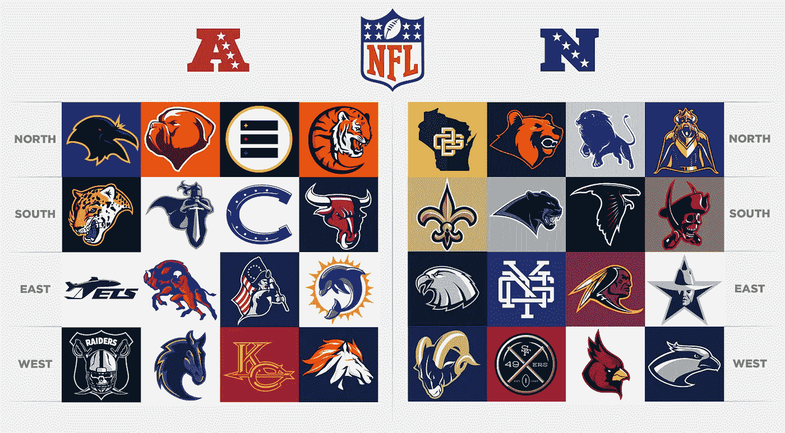

I almost like these better.

2017 [NFL](https://hackernoon.com/tagged/nfl) 赛季按输赢记录排名前四的球队是:

1.  **新英格兰爱国者**，13–3
2.  **匹兹堡钢人**，13-3
3.  费城老鹰队，13-3
4.  **明尼苏达维京人**，13–3

那么哪个队是最好的呢？

乍一看，这个问题听起来无法回答。如果输赢记录是对球队在整个赛季中表现的完整评估，那么所有这些球队都一样好，没有区别。

但是任何观看体育比赛的人都知道，这不是真的。即使不考虑老鹰队在第 14 周失去了他们的首发四分卫卡森·温兹，你仍然会看到大多数球迷将爱国者队和维京队置于老鹰队和钢人队之上。为什么？因为球队的比赛方式有明显的不同:他们的策略，他们的优势和劣势，以及他们在比赛中的关注点。

简而言之，每一次胜利都不是平等的。

所以，人们想出了排名系统。Ringer，FiveThirtyEight，那些以在*上大喊大叫为工作的笨蛋们都开发了一个系统，根据他们记录之外的数据对 NFL 球队进行评估和排名。*

这些质量不一。任何有半个大脑的人都可以想象，斯基普·贝勒斯的推理糟透了。在我看来，ESPN 的系统非常好，我认为 FiveThirtyEight 位于 ELO 的系统非常有趣，并且给出了一贯合理的预测。

今天，我将忽略所有这些系统，基于完全不同的推理，建立我自己的系统。为什么？因为我可以。

先说个例子。想象一个有三支球队的联赛: **X，Y，Z** 。假设这一系列的结果发生了:

1.  **X** 拍 **Y** 。
2.  **Y** 击败 **Z** 。
3.  **Z** 击败 **X** 。
4.  **Y** 打 **X** 。

然后，打了四场比赛，我们三个队的记录如下:

*   **X**:1–2
*   **Y**:2–1
*   **Z**:1–1

因此，我们的目标是给每个团队分配一个等级， *R* ，代表该团队的真正实力。

首先，让我们对每个团队的评级施加一个约束:

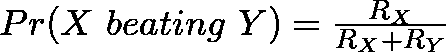

也就是说，X 队击败 Y 队的概率等于它在这两个队之间的总评分中所占的份额。然后，我们可以得出以下结论:

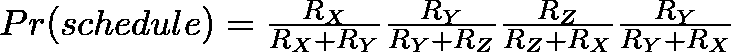

上面陈述了本赛季结果的总概率等于每场单独比赛结果概率的乘积。但是，我们知道这些游戏导致了给定的结果:我们自己观察到的！因此，最大化我们观察到的结果的概率的评级是每个团队的“真实”评级。

也就是说，我们希望找到每个 *R* 的值，使得 *Pr(schedule)* 最大化:团队评级的 ***最大似然估计*** 。

实际上找到这个需要一些数学知识，我们将在下一节中讨论，但是首先，让我们直观地思考这个优化问题。假设您有三个杠杆，每个杠杆代表一个团队的评级。我们从 1 开始所有三个杠杆，然后慢慢开始增加 X 的杠杆。你可以看到，X 既在我们优化的分数的分子中，也在分数的分母中，所以增加它只会增加 *Pr(schedule)* 一个点。然后我们跳到 Y 的杠杆，开始增加它，直到值再次开始下降。然后我们跳回 X，或者向前移动到 Z，等等，直到我们在三者之间找到最大化等式的完美平衡。

但是当然，现实没有杠杆，计算我们的最大值需要数学。我们本质上是要推导这个方程的梯度下降(最终，编程并运行它！)，这就从找梯度开始。

同样，这是我们的等式:

你会注意到的第一件事是，这将是一个令人沮丧的求导表达式。我们有除法和乘法，这将导致一些痛苦的代数。但是，事实证明，我们对这个特定的方程没有任何特别的忠诚:我们可以优化一个等价的方程，这个方程更容易推导，但行为方式与这个方程相同(也就是说，具有与这个方程相同的极值)。

我任意选择自然对数，因为它是一个单调递增的函数，保持了原始方程的全局极值，它将这个复杂的数学问题转化为更容易处理的加法和减法。然后:

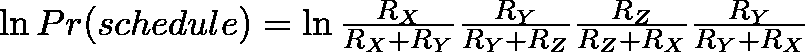

对于某些代数，这变成了:

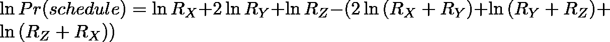

下一步是依次对每个 *R* 求偏导数。我会给你这些方程。如果你愿意，可以验证我的数学！

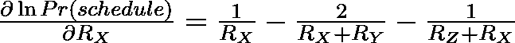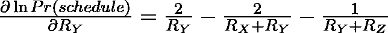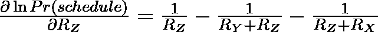

现在，我们将每个导数设置为 0(因为我们想找到函数不变的点，在这个函数中，这个点是最大值)，并将我们的方程转换为更好的形式:

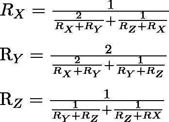

现在我们只剩下一个由三个等式组成的系统，代表我们每个团队的评分。显而易见的下一步是求解这个系统，但是即使粗略地看一下，你也会发现找到一个代数解是非常困难的，如果不是不可能的话。矩阵方法在这里也不起作用，因为这是一个非线性系统，不能被改造成更好的形式。

所以让我们退一步，换个角度看这个问题。如果我们只是任意选择每个 *R* 的值作为初始估计值会怎么样？例如，假设每个等级为 1。

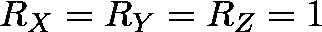

然后让我们把这些值代入每个方程。这给了你:

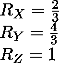

这告诉我们什么？嗯，它告诉我们，在上述方程的一次*迭代*之后，我们发现这是最大[可能性](https://hackernoon.com/tagged/likelihood)的当前估计。虽然这不是一个特别好的估计，但它已经表达了我们之前讨论过的很多直观的想法。y 对 X 和 Z 都赢了，所以评级最高。X 打败了 Y，但也输给了 Y，而且输给了 Z，一个被 Y 打败的队伍，所以在 Y 下面，而 Z 在 X 上面是因为它打败了 X，输给了 Y，X 也输给了 Y。

现在，我们可以再次运行相同的过程，插入这些新的 *R* 值，并找到更新的估计值。有整整一个世纪的学术文献，可以追溯到 20 世纪 20 年代，指出最终，这些值会收敛，你会找到你的最大似然估计。

恭喜你！你刚刚跑了梯度下降。现在，做同样的事情，但是对于 32 支球队和 15 * 17 = 180 场比赛的完整 NFL 赛季。

我们上面的数学解决了一个残缺和缩短的 NFL 赛季，但它很容易扩展到整个赛季。这是我们最后的方程式:

现在，如果你盯着这个看一会儿，你就能说服自己，上述方程的一般形式是:

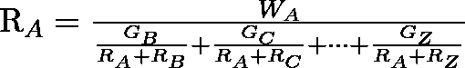

其中 *R_A* 是团队 *A* 的评分， *W_A* 是团队 *A* 的总胜场数，*G _ω*是 A 对战团队*ω*的场次。

解决了上面的数学问题，我们终于可以编写代码来寻找一些真实数据的最大似然估计量了。我将用 2017 年 NFL 赛季作为我们的例子，我将从头开始写一切，因为再次，*我可以*。

让我们首先实现我们想要优化的通用评定公式:

这里，`current_weights`是长度为 32 的数组，在我们的第一次迭代中被初始化为 1，其中`current_weights[i]`是团队 *i 的当前评估值，* `games_matrix`是二维数组，使得`games_matrx[i][j]`是团队 *i* 与团队 *j* 比赛的次数，`wins_array`是一维数组，其中`wins_array[i]`是团队 *i.* 的获胜次数

然后，这和我们上面推导的方程完全一样。现在，为了迭代它，我们可以这样做:

这个函数相当简单:它从上面获取`games_matrix`和`wins_array`参数，初始化一个`current_weights`数组，然后当迭代之间仍然有变化时，它沿着梯度曲线(也就是我们的`optimization_function`)向局部最大值行进。

现在，我们只需要样本数据！为了实现这一点，我使用了非常有用的 [nflgame 模块](https://github.com/BurntSushi/nflgame)，它从[NFL.com](https://nfl.com)的 GameCenter JSON feeds 中提取数据。下面是代码:

现在我们可以将它们连接在一起:

以下是我在 2017 年 NFL 赛季用上述代码运行得到的结果:

我觉得很可靠。你可以在这里看到 ESPN 最终的常规赛实力排名。他们的前五名是新英格兰爱国者队、匹兹堡钢人队、明尼苏达维京人队、新奥尔良圣徒队和洛杉矶公羊队，这和我的很接近，特别是因为我们没有使用任何比赛结果以外的信息。(例如，我敢肯定卡森·温茨撕裂他的 ACL 与老鹰队跌出他们的前五名有很大关系)。

到目前为止，这种方法的核心问题是，它对每一次胜利都一视同仁，这是完全不正确的。老鹰队在分区赛中以 15 比 10 险胜猎鹰队，这应该和他们上周在分区赛中以 38 比 7 击败维京人队一样对待吗？显然，不应该。猎鹰队以微弱优势输掉了比赛，而维京队则被彻底摧毁。事实上，猎鹰队的排名似乎应该随着这两个结果而上升，因为他们以微弱优势输给了一支被高排名的维京人队。

表达这一点的最简单的标准是胜率:胜方与败方之间的分数差。将这一点融入我们的方法的一个简单方法是，在计算每个团队的胜率时，对较大的胜率给予更多的权重，对较小的胜率给予较少的权重。

经过反复试验，我想出了这个公式:

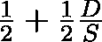

其中 *D* 为得分差， *S* 为总得分。这实质上说的是，每一场胜利都自动给予 1/2，然后，我们加上一个与分数差成比例的因子。如果 *D* 接近 *S* ，意味着获胜的团队赢了很多，我们最终得到的数字接近 1/2，这导致总的获胜权重接近 1。然而，如果 *D* 比*S*小得多，我们最终会得到一个接近 1/2 的 win 权重。

每一次胜利都将在这个范围内的某个地方结束，但是它的价值将与获胜者赢得的金额成比例。下面是它在代码中的样子:

在这里，game 是 nflgame 模块中的一个对象，它包含关于特定 NFL 游戏的数据。

如果你还记得，我们在`generate_matrices`函数中计算了我们的胜利。这又是一个例子，但是调用了`wins_update_formula`函数，而不是简单地为每次胜利加 1:

当然，这是结果:

他们变了一点。我会给你一个完整的比较，但新奥尔良上升了一位，而卡罗莱纳下降了。明尼苏达仍然是我们常规赛的最爱，但是费城上升了一位，亚特兰大下降了一点。

你可以做更多的事情。想办法考虑主场优势，或者更精细的进攻/防守指标。找到一个更智能的公式来衡量胜利。在一个更大的数据集上运行这个，也许能找到有史以来最好的团队。比较一个球队的常规赛平均得分和季后赛得分(唯一有足够数据的球队可能是钢人队和爱国者队)。修复我的劣质代码，在更大的数据量上运行得更快。

但在此之前，我目前的方法有一个问题。我的统计知识更丰富的读者可能已经意识到，纳入胜率的自相关问题:更好的球队将更经常获胜，也更经常以更大的优势获胜，这将随着时间的推移抬高我们的评级。对此的解决方案是找到一种获胜更新公式，当较低评级的团队获胜时，该公式对胜利的约束进行更多的加权，而当较高评级的团队获胜时，该公式对胜利的约束进行更少的加权。我将引导我的沉闷的教授，并把它作为一个练习(提示: [*使用自然日志，卢克！*](https://www.youtube.com/watch?v=o2we_B6hDrY) )。

这里是包含本文中使用的所有代码的存储库。另外，你可以在推特上找到我，地址是@AakashJapi，电子邮件地址是: *aakashjapi，gmail dot com，*和脸书。请随时联系我，告诉我你的想法/想法/nfl 迷因/爱国者垃圾言论，或者任何事情。