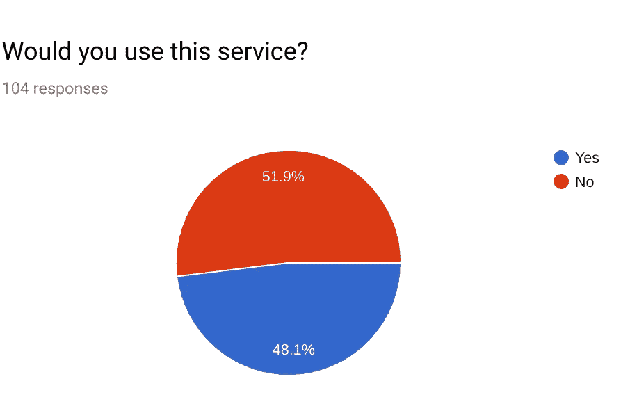
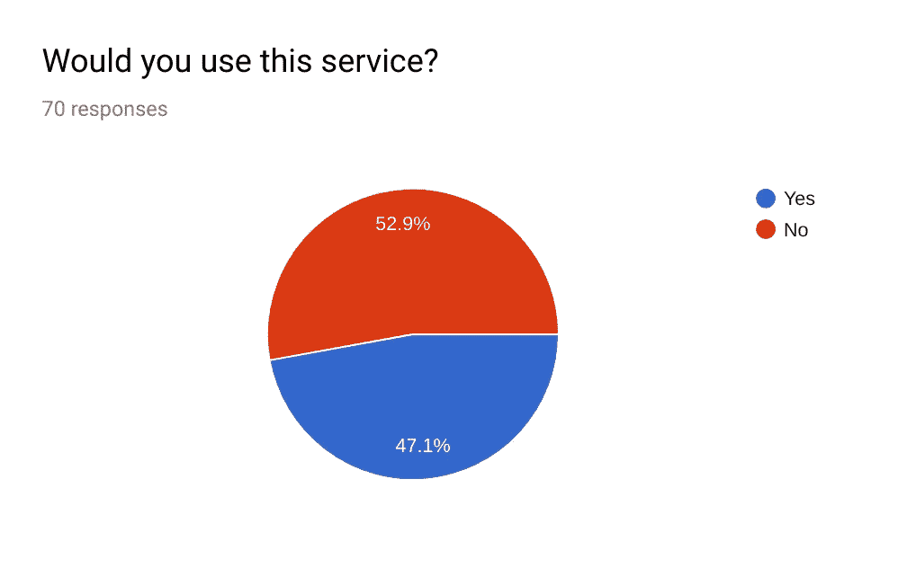
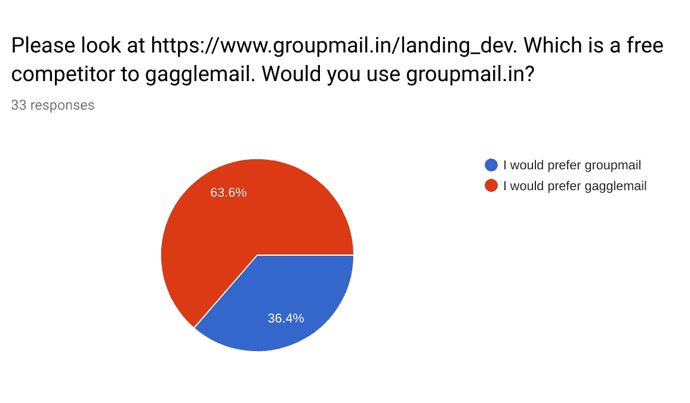
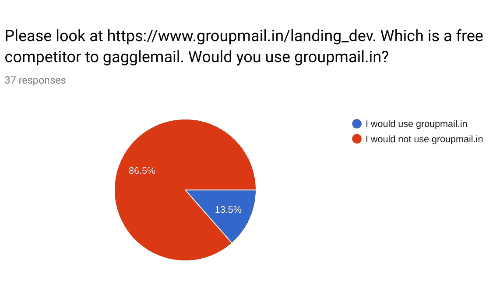
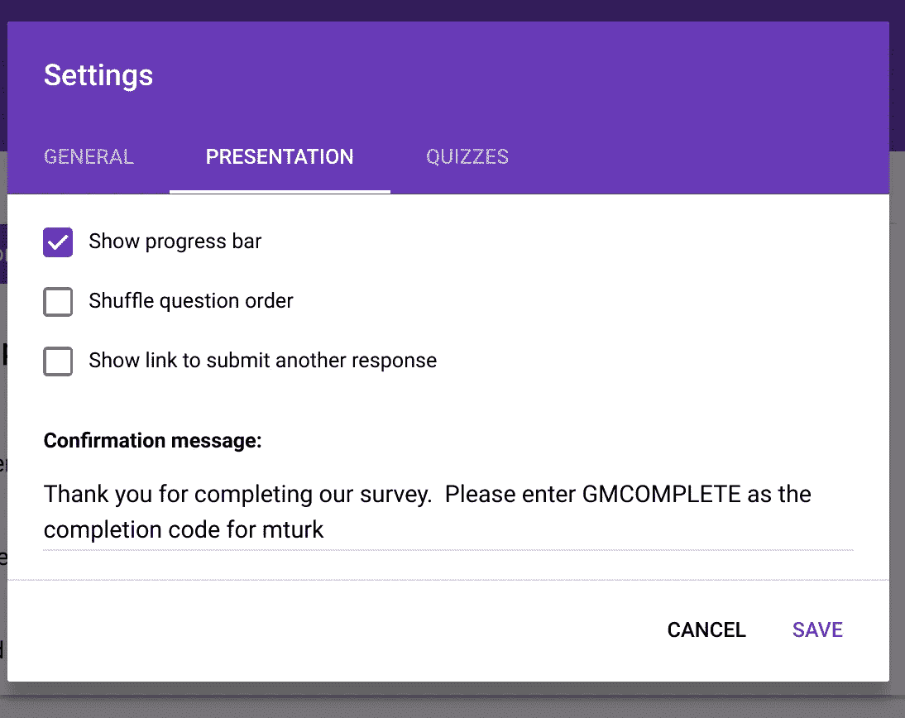

# 用机械土耳其人快速迭代登陆页面

> 原文：<https://medium.com/hackernoon/rapidly-iterating-on-landing-pages-with-mechanical-turk-461b466eee7f>

## 机械土耳其人是获得大量定性反馈的廉价方式

# 概述

我最近辞去了对冲基金的工作，去追求创业。我的假设是，从长远来看，创业优于高薪工作，在创业时，通过选择保守(简单)的问题，并在商业问题上运用理性思维和创造力，可以最大限度地降低失败的风险。我开始记录我的成功和失败[在这里](/@hhuuggoo/entrepreneurship-vs-quantitative-finance-an-experiment-be4fdc05fd8d)，这是第 4 条。下一篇是[这里](/@hhuuggoo/moving-on-929e5fca41e0)

我的第一个项目是[集团的邮件业务](https://www.groupmail.in)。我将讲述我是如何用机械土耳其人来改善我的登陆页面的。

GroupMail 使用户能够通过转发现有线索轻松创建电子邮件组。有一个内置的病毒组件，人们和他们的朋友创建群，希望他们的朋友和更多的朋友创建更多的群，等等。然而，从我的网站转换是我的第一个出发点。到目前为止，我没有太多的流量，但足以知道没有人转换，我的登陆页面一定很糟糕。

如果你以前从未使用过 Mechanical Turk，Mechanical Turk 是亚马逊的一款产品，你可以支付固定的费用(我提供的是 5 美分)在互联网上随机选择一些人为你做一些事情。这是一种非常便宜的市场调查方式，但缺点是你会对你要找的人有一些选择偏差。我进行了一项调查，询问了以下问题

1.  请访问[https://www . group mail . In .](https://www.groupmail.in.)用自己的话描述该企业的业务
2.  你会使用这项服务吗
3.  如果是这样，给我一个你会如何使用这项服务的例子
4.  如果不是，你为什么不使用这项服务。

每次调查我只提供 5 美分，所以我得到了一些荒谬的答案。例如，关于这个行业是做什么的问题 1——这里是我得到的一些无意义的答案。

1.  在云中保存电子邮件组的基础架构
2.  乐趣
3.  处理你的邮件

好消息是，大多数没有给我垃圾的人都知道这个行业是做什么的。还有一个小例子，混淆了 GroupMail 和 MailChimp 等在线营销邮件列表。

因此，问题是没有量化的基准来衡量什么是好的分数，这将是一个惊人的转化率，但因为这些是付费的调查参与者，所以很难锚定这些结果。略少于一半的人说他们会使用群发邮件。24/102 的人说他们不使用电子邮件群，23/102 的人说他们看不到这项服务的任何价值。我不认为我能为那些人做什么。

我能够得到一些有趣的定性信息。以下是一些有趣的拒绝理由。

*   我运行自己的邮件服务器
*   GMAIL 可以处理这个
*   我不喜欢将同事/同事的电子邮件地址提供给外部服务，我也可以在 outlook 或 gmail 中创建群组，这样就可以制作自己的分组邮件。
*   发送群发邮件从来都不困难也不耗时。我的标准电子邮件客户端处理得非常好。

我很惊讶，有人谁运行自己的邮件服务器仍然想填写我的调查现金，但有几个关键的外卖

*   该网站不会激发信任
*   人们不明白这和客户端邮件组有什么不同
*   人们不明白这项服务如何与谷歌和雅虎集团区分开来
*   营销一项提供边际效益但不是巨大效益的服务比我想象的要难

# 使用机械土耳其人作为竞争对手的基准

我也想了解这些结果，所以我从竞争对手的角度创建了另一个调查， [gaggle email](https://gaggle.email) 。我问了以下问题

1.  请去 https://gaggle.email/。用你自己的话说，这家公司是做什么的？
2.  你会使用这项服务吗？

如果他们回答是

1.  你会如何使用它
2.  请到[https://www . groupmail.in .](https://www.groupmail.in.)这是 gaggle.email 的免费竞争对手，你会用 group mail . in 吗

如果他们回答不

1.  你为什么不用它
2.  请访问 [https://groupmail.in，](https://groupmail.in,)这是 gaggle.email 的免费竞争对手，你会使用 groupmail.in 吗

这对我来说非常有趣，因为它允许我将我的登录页面的性能与竞争对手的性能进行比较，并找出他们与我不同的地方。

略少于一半的人说他们会使用这项服务——这与群邮件的表现基本相同。

只有 36%的人会转向群发邮件——考虑到我的服务是免费的，这对我来说是相当有害的。以下是列举的理由:

*   似乎更加确定
*   我更喜欢这个页面的设计
*   这似乎更合理
*   该网站似乎更简单，更有吸引力。
*   gagglemail 实际上似乎更容易使用，这是我喜欢的。

哇，所以我对不喜欢 gaggle.email 的人影响很小。

有一个人得到了我想要的！

> Groupmail 给谷歌带来了名义上的安慰，而 gaggle 似乎只是雪上加霜。

不幸的是只有一个人。

以下是我从这个练习中得到的收获

*   专业性和可信度很重要，gaggle.email 有这一点，而 groupmail 没有
*   有很多评论说 gaggle 和 groupmail 与免费的替代品相比价值都很低。这是令人鼓舞的，因为它向我表明，你可以在边际改进的基础上建立一个成功的企业(gaggle.email 是有利可图的，我会将它们归类为相对于谷歌集团的边际改进)
*   在基准测试方面，GroupMail 得到了与 gaggle.email 相似的拒绝率，所以这并不可怕，但肯定有可以改进的地方

基于这些反馈，我对文本进行了修改，以将 [GroupMail](https://www.groupmail.in) 与常见的替代方案区分开来，包括客户端电子邮件组，以及谷歌和雅虎的邮件列表。我没有在可信度和专业性方面做任何改变，因为这些需要更多的工作。

# 结论

因此，机械土耳其人是一种非常有用的获得反馈的方式——无论是在你的网站上，还是在你与竞争对手的比较中。然而，出于这些目的，从机械土耳其人身上提取任何定量信息有点困难，因为存在明显的选择偏差，而且这些人付费了。

## 一些实际的细节

如果你想自己做到这一点，这里有一些事情无聊的细节要知道。如果你永远不会这样做，跳过这一段。亚马逊机械土耳其人要求工人向亚马逊提供某种形式的“答案”，以获得他们工作的信用。大多数使用 Turk 进行调查的人都会为每个调查生成一个代码，并让 Turkers 提交这个代码，这样您就可以验证他们是否完成了这项工作。Google Forms 不允许您更改代码，您只需在调查结束时输出一些代码。如果您单击齿轮图标，将允许您选择提交后显示的内容。

你也可以有一个问题，询问他们的亚马逊工人 ID(网上有几个人推荐这个)。这将允许您确认谁参加了您的调查，如果任何人显然没有参加您的调查，您可以拒绝付款。然而，如果你只收 5 美分，那就不值得你花时间去做这件事(下次我做这件事时，我不会要求员工 id)。不要询问电子邮件地址。那是违反政策的，你会被禁止的。最后，在 mechanical turk 中创建的作业被称为批处理。

Here are 2 batches

我的两个批次都是为 50 个任务设置的。我可以编辑其中一个，并要求更多的任务，或改变每个任务的价格。重要的是，如果您想收集更多的结果，不要创建新的批次。亚马逊有适当的控制措施，所以你可以防止工人从一批中接受多项任务(我不希望同一个人接受我的调查两次)。创建多个批处理会绕过这种控制

感谢阅读！。我过去的项目是关于简单易用的电子邮件组的，以及获得开源项目的[帮助的](https://www.opensourceanswers.com)。我目前的项目是提供[云托管的 Jupyter 笔记本](https://www.saturncloud.io)。我的下一篇文章是关于从群组邮件转移到一个不同的行业— [一个开源开发者的支持模型](/@hhuuggoo/moving-on-929e5fca41e0)