# 每个机器学习专家都必须使用的罕见的计算机视觉数据集

> 原文：<https://medium.com/hackernoon/rare-datasets-for-computer-vision-every-machine-learning-expert-must-work-with-2ddaf52ad862>

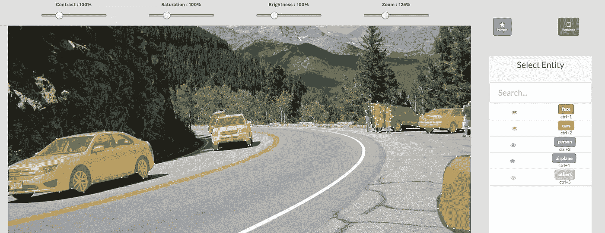

你曾经有过猜测另一个人年龄的情况吗？嗯可能是的！！玩最短时间找东西之类的游戏怎么样？或者关于在你生病的时候找到你的医生在处方上写的文字？

每个人在现实生活中都面临这些问题。让你的机器或者你最喜欢的电脑来帮你完成任务怎么样？是不是很棒？计算机实际上是通过机器学习做到的。因此，为了做到这一点，我们实际上需要使用一些强大的数据集来训练机器。

提高生活中大多数领域的关键是实践。练习从图像处理到语音识别的各种问题。这些问题中每一个都有自己独特的技术和方法。但是你怎么得到这些数据呢？

我们列出了一组高质量的数据集，每个机器学习爱好者都应该努力应用和提高他们的技能。处理这些数据集将使你成为更好的数据专家，你将学到的知识对你的职业生涯将是无价的。

# **图像数据集**

[**汽车牌照检测**](https://dataturks.com/projects/Mohan/Car%20License%20Plate%20Detection)

有大约 500 张汽车牌照的图片，在道路和街道上的汽车图片中被标记为矩形边框。

[将](https://dataturks.com/projects/Mohan/Car%20License%20Plate%20Detection)链接到数据集。

## [**名人脸关键点**](https://dataturks.com/projects/frerk.saxen/celebA_relabel3a)

一个大约有 2500 张照片的数据库，上面标有名人的脸和重要的关键点，如眼睛、鼻子等。

[将](https://dataturks.com/projects/frerk.saxen/celebA_relabel3a)链接到数据集。

[**服装电子商务标签**](https://dataturks.com/projects/devika.mishra/E-commerce%20Tagging%20for%20clothing)

来自电子商务网站的图片，带有围绕衬衫、夹克、太阳镜等绘制的边框。

大约有 500 张图片被手动标记为物品检测。

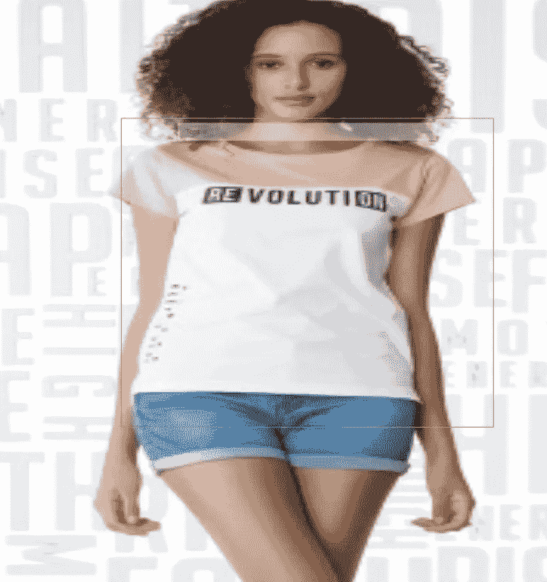

将链接到数据集。

## [伤口数据集](https://dataturks.com/projects/lolongcovas/wound)

大约 300 张外科手术图片，伤口周围画有边框。

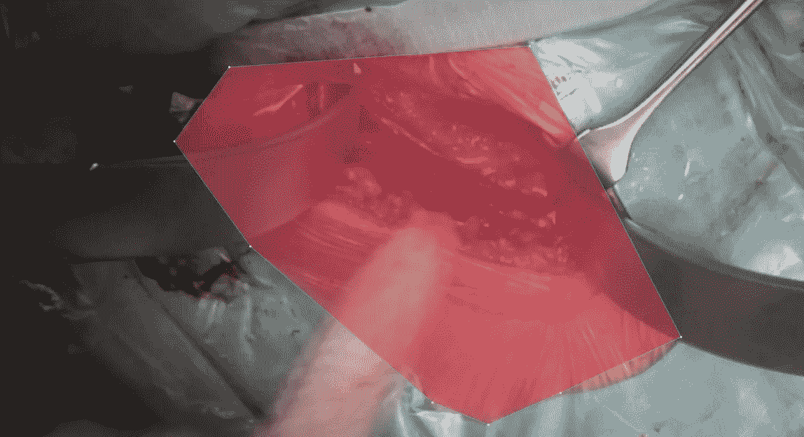

[将](https://dataturks.com/projects/lolongcovas/wound)链接到数据集。

## IMDB-WIKI 数据集:

****互联网电影数据库**的缩写，是一个[在线数据库](https://en.wikipedia.org/wiki/Online_database)与世界电影、电视节目、家庭视频和视频游戏以及互联网流相关的信息，包括演员、制作团队和人员传记、情节摘要、琐事以及粉丝评论和评级。2017 年 2 月放弃了一个额外的粉丝功能，留言板。这个数据库最初是一个粉丝运营的网站，由亚马逊的子公司 IMDb.com 公司拥有和运营。这并不罕见，但却是所有图像数据集的始祖。**

**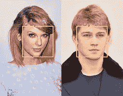**

**face recognition**

*   **描述:IMDB 和维基百科的人脸图像，带有性别和年龄标签。**
*   **实例:523 051**
*   **格式:图像**
*   **默认任务:性别分类，人脸检测，人脸识别，年龄估计**
*   **创建时间:2015 年，作者:r .罗斯、r .蒂莫夫特、L. V .古尔**
*   **下载链接:[https://data.vision.ee.ethz.ch/cvl/rrothe/imdb-wiki/](https://data.vision.ee.ethz.ch/cvl/rrothe/imdb-wiki/)**

## **[房间:](https://dataturks.com/projects/sheerun/rooms)**

**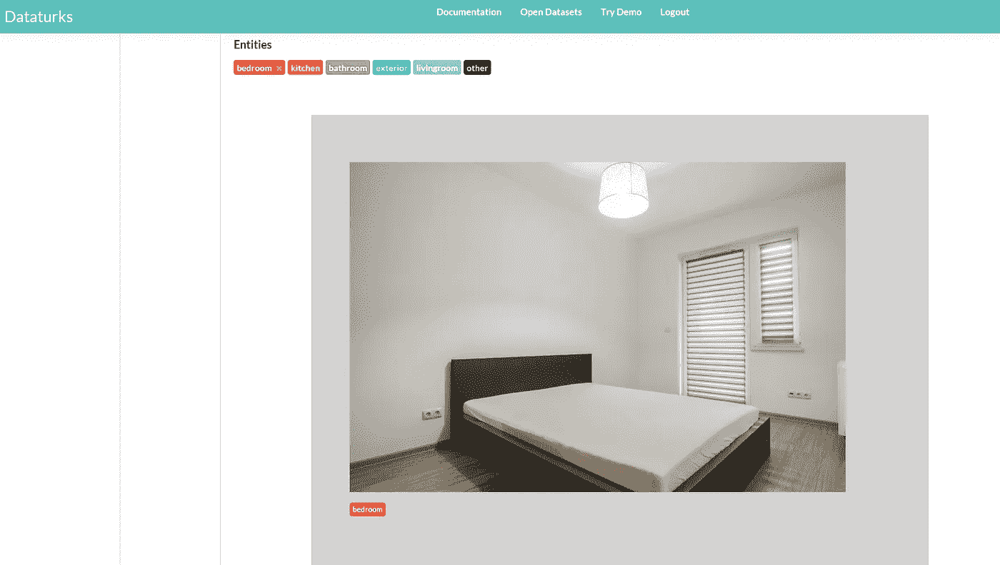**

**identified as bedroom**

**该数据集是一个图像分类数据集，用于将房间图像分类为卧室、厨房、浴室、客厅、室外等。来自不同房屋的图像被收集并保存在一起，作为计算机测试和训练的数据集。这个数据集有助于找到哪个图像属于房子的哪个部分。**

**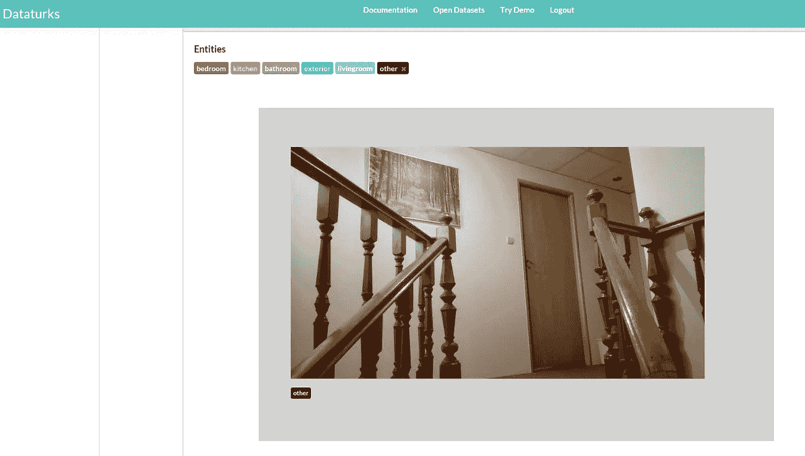**

*   **描述:数据集有 20001 个项目，其中 4404 个项目已被手动标记。**
*   **类别:卧室，厨房，浴室，外部，客厅，其他**
*   **默认任务:图像分类，图像字幕。**
*   **格式:图像**
*   **创建者:DataTurks**
*   **下载链接:[https://dataturks.com/projects/sheerun/rooms](https://dataturks.com/projects/sheerun/rooms)**

## **可视化基因组数据集:**

**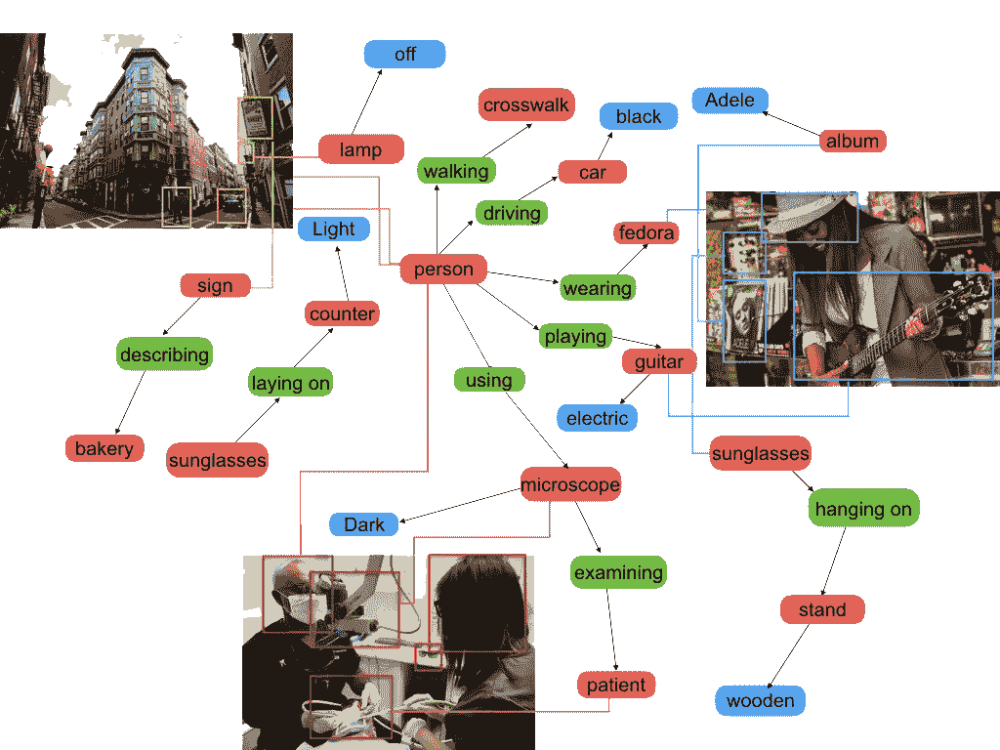**

**视觉基因组是一个数据集，一个知识库，一个将结构化图像概念与语言联系起来的持续努力。**

1.  **描述:**

*   **108，077 张图片**
*   **540 万个区域描述**
*   **170 万个可视化问题答案**
*   **380 万个对象实例**

**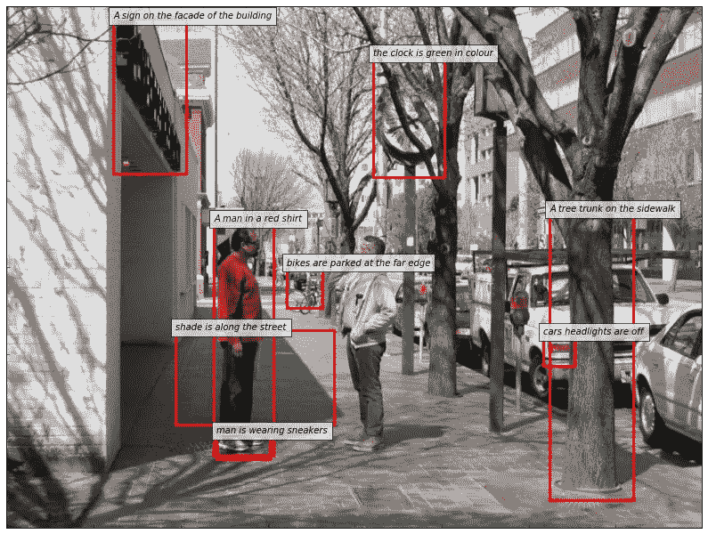**

*   **280 万个属性**
*   **230 万个关系**
*   **映射到 Wordnet 同义词集的所有内容**

**2)格式:图像、文本**

**3)默认任务:图像字幕**

**4)创建于:2016 年，作者 R. Krishna 等人。**

**5)下载链接:[http://visualgenome.org/api/v0/api_home.html](http://visualgenome.org/api/v0/api_home.html)**

## **裂缝分类数据集:**

**该数据集用于对墙壁上的裂缝进行分类。数据集由有或没有裂缝的墙壁图像组成**

**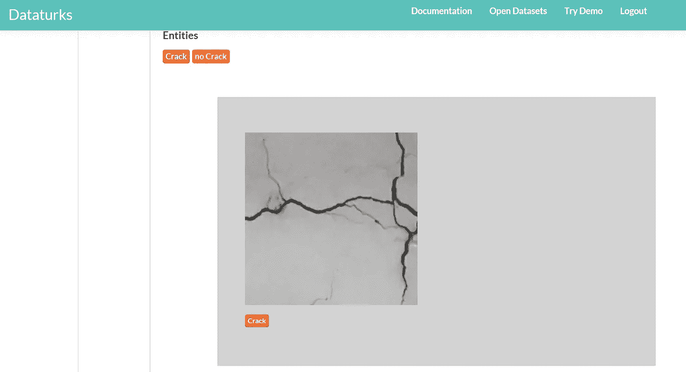**

**identified as crack**

**它有一些电线阴影的图像，看起来就像墙上的裂缝，我们应该仔细训练系统，使它能够区分裂缝和阴影。这个数据集非常具有挑战性，它将改进你的编码技能。**

**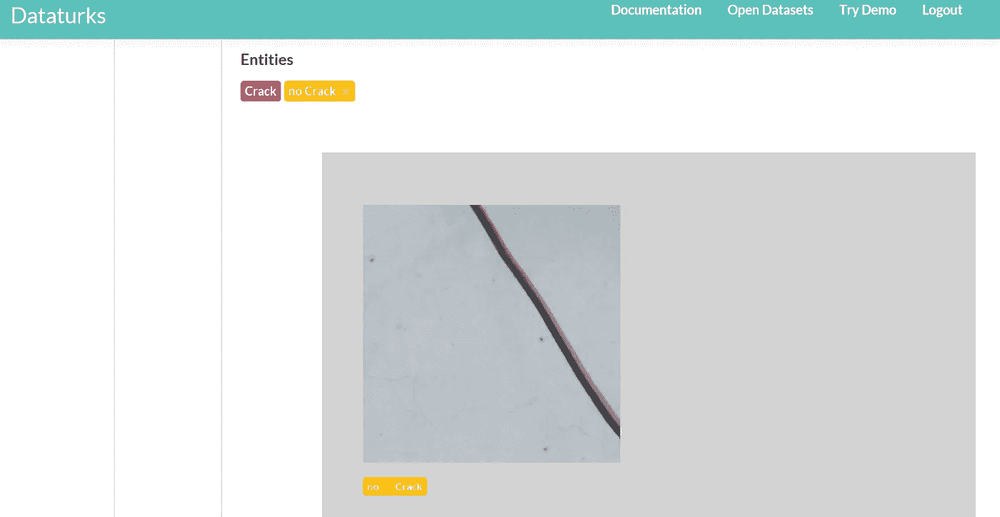**

**identified as not-crack**

*   **描述:数据集有 1428 个项目，其中 1428 个项目已被手动标记。**
*   **类别:有裂纹、无裂纹**
*   **格式:图像**
*   **默认任务:图像分类**
*   **创建者:土耳其数据公司**
*   **下载链接:[https://data Turks . com/projects/miaozh 17/Crack % 20 分类](https://dataturks.com/projects/miaozh17/Crack%20Classification)**

## **IIT-5K 光学字符识别数据集**

**具有 5K 标记的街道标志图像，被裁剪为仅包含具有文本的部分。这是一个非常困难的数据集，即使是最好的视觉算法也只有 80%的准确率。(阅读:该数据集上[谷歌、AWS、微软 OCR API](https://dataturks.com/blog/compare-image-text-recognition-apis.php)的比较)**

****

**[将](https://dataturks.com/projects/Mohan/OCR%20IIT-5K%20Dataset)链接到数据集。**

## **汽车数据集:**

****

**identified as car**

**该数据集用于识别图像中的汽车。该组有不同的图像，其中有或没有汽车。该数据集的主要目的是识别图像中汽车的小零件。这个数据集是人类标注的数据集。**

**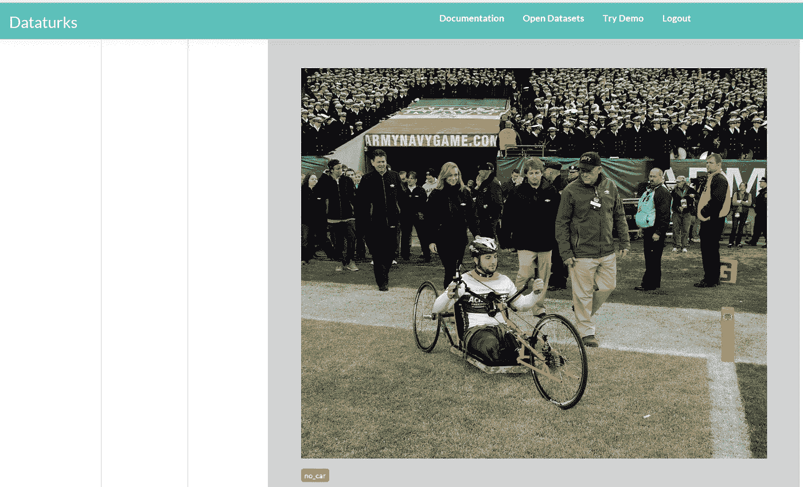**

**identified as no-car**

*   **描述:数据集有 613 项，其中 604 项已被手动标记。**
*   **分类:汽车，非汽车。**
*   **格式:图像**
*   **默认任务:图像分类。**
*   **创建者:土耳其数据。**
*   **下载链接:[https://dataturks.com/projects/dominique.paul.info/cars2](https://dataturks.com/projects/dominique.paul.info/cars2)**

****FERET 数据集:****

**人脸识别技术(FERET)项目由国防高级研究计划局(DARPA)和国家标准与技术研究所(NIST)管理。**

**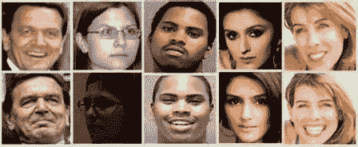**

**with different expressions**

**国防部(DoD)禁毒技术发展计划办公室发起了面部识别技术(FERET)计划。FERET 计划的目标是开发自动人脸识别能力，用于协助安全、情报和执法人员履行职责。FERET 数据库是在 1993 年 8 月至 1996 年 7 月期间的 15 次会议中收集的。该数据库包含总共 14，126 幅图像的 1564 组图像，包括 1199 个个体和 365 组重复图像。副本集是数据库中已经存在的一个人的第二组图像，通常是在不同的一天拍摄的。**

**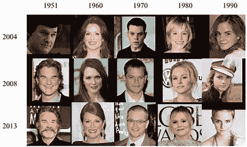**

**pics at different times**

*   **描述:1199 个人在不同位置和不同时间的 11338 张照片。**
*   **格式:图像**
*   **默认任务:分类，人脸识别**
*   **创建时间:2003 年由美国国防部创建**
*   **下载链接:[https://**www.nist.gov**/.../ **人脸识别技术 feret**](https://www.nist.gov/.../face-recognition-technology-feret)**

## ****人脸检测****

**在图像中有大约 1300 个面被标记为矩形边界框。图像的范围从局部照片到街上随机出现的人。**

****

**[将](https://dataturks.com/projects/laurynasgiriunas/Face%20Detection)链接到数据集。**

## **加州理工学院-101 数据集:**

**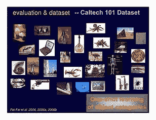**

**caltech-101 dataset**

****加州理工学院 101** 是[数字图像](https://en.wikipedia.org/wiki/Digital_images)的[数据集](https://en.wikipedia.org/wiki/Data_set)。Caltech 101 数据集用于训练和测试几种机器学习、计算机视觉识别和分类算法。为每个图像提供一组注释。每组注释包含两条信息:对象所在的一般边界框和包围该对象的人类指定的详细轮廓。注释附带了一个 MATLAB 脚本。它加载一个图像及其相应的注释文件，并将它们显示为一个 MATLAB 图形。**

**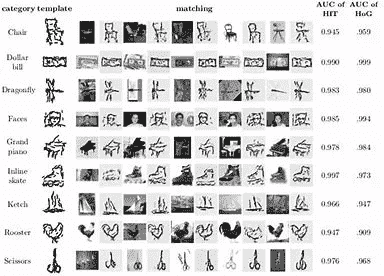**

**加州理工学院 101 数据集旨在缓解这些常见问题。**

1.  **图像被裁剪并调整大小。**
2.  **表示了许多类别，这适合于单个和多个类别识别算法。**
3.  **详细的物体轮廓被标记。**
4.  **加州理工学院 101 可用于一般用途，作为一个共同的标准，通过它来比较不同的算法，没有偏见，由于不同的数据集。**

*   **描述:实物图片，详细标注实物轮廓。**
*   **实例:9，146 个图像，分为 101 个不同的对象类别，以及一个附加的背景/杂波类别。**
*   **格式:图像**
*   **默认任务:分类，物体识别。**
*   **创建:2003 年 9 月编制[费](https://en.wikipedia.org/wiki/Fei-Fei_Li)**
*   **下载链接:[http://www.vision.caltech.edu/Image_Datasets/Caltech101/](http://www.vision.caltech.edu/Image_Datasets/Caltech101/)**

## **UXBOT 数据集:**

**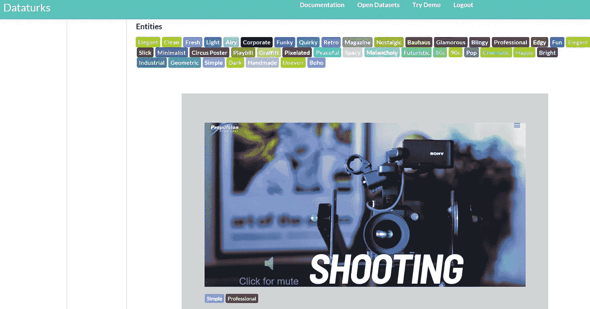**

**shooting point**

**这个数据集是将 uxbot 图片分为暗黑、专业、极简、美艳等。……uxbot 是现在聊天的平台。这个数据集用来训练计算机掌握新的技术技能。这是人类标注的数据集。**

**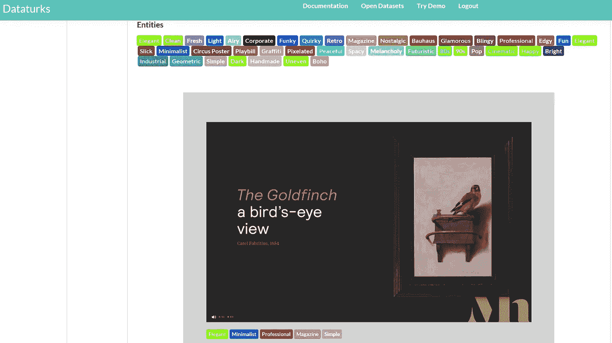**

**identified as magazine cover**

*   **描述:数据集有 129 项，其中 129 项已被手动标记。**
*   **格式:图像**
*   **类别:优雅、干净、清新、轻盈、通风、协作、时髦、复古、漩涡、趣味等。….**
*   **默认任务:图像分类**
*   **创建:数据土耳其人。**
*   **下载链接:[https://dataturks.com/projects/briannaorg/UXBot](https://dataturks.com/projects/briannaorg/UXBot)**

## **LABELME 数据集:**

****

**official logo**

**LabelMe 是由麻省理工学院计算机科学和人工智能实验室(CSAIL)创建的一个项目，它提供了一个带有注释的数字图像数据集。该数据集是动态的，免费使用，并向公众开放。创造 LabelMe 背后的动机来自计算机视觉研究人员公开可用数据的历史。大多数可用数据都是针对特定研究小组的问题定制的，这导致新的研究人员不得不收集额外的数据来解决他们自己的问题。创建 LabelMe 是为了解决现有数据的几个常见缺点**

**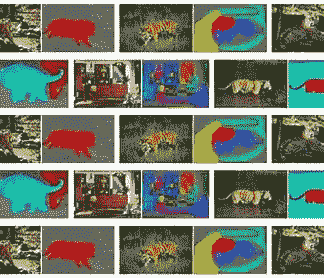**

**label figures**

*   **描述:用于对象分类的大型图像数据集。**
*   **格式:图像、文本。**
*   **默认任务:图像分类，目标检测。**
*   **创建:[麻省理工学院计算机科学与人工智能实验室](https://en.wikipedia.org/wiki/MIT_Computer_Science_and_Artificial_Intelligence_Laboratory)2005 年**
*   **下载链接:[http://label me . csail . MIT . edu/release 3.0/browser tools/PHP/dataset . PHP](http://labelme.csail.mit.edu/Release3.0/browserTools/php/dataset.php)**

## ****你可以在这里找到上千个这样的** [**开放数据集**](https://dataturks.com/projects/trending) **。****