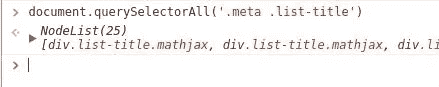

# Raschietto:一个简单的网页抓取库

> 原文：<https://medium.com/hackernoon/raschietto-a-simple-library-for-web-scraping-46957c6aa5b7>

我经常发现自己需要从一个没有 API 或 RSS 提要的网站获取数据。有许多不同的网页抓取库，但我不满意，我想要的东西能够:

*   **使用 CSS 选择器**。我在[做过全栈开发人员](https://matteo.ronchetti.xyz/#resume)，所以比起 XPath，我更喜欢使用 CSS 选择器。
*   **几乎不需要多长时间就能制造出工作刮刀**。大多数时候我不需要非常复杂或先进的东西，我只需要非常快速地制作一个简单的刮刀。

这促使我创建了一个名为 [Raschietto](https://github.com/matteo-ronchetti/raschietto) (意大利语中 scraper 的意思)的简单刮库。以下是它的主要特点:

*   CSS 选择器
*   HTML 页面的单行获取和解析
*   用于匹配页面中元素的简单且可扩展的方法
*   针对常见任务的预构建匹配器(例如提取链接和图像)

该库目前处于测试阶段(但足够稳定)，并且只支持 Python3(添加 Python2 支持相当简单)。

我分享这个库是因为我认为它可以加速构建简单的刮刀的过程，并且因为它的小代码库(<170 lines of code) can be useful for learning purpose.

You can install it with:

```
pip install raschietto
```

# Scraping arXiv

As an example to learn how to use [raschietto](https://hackernoon.com/tagged/raschietto) )为了展示它的能力，我将指导你完成一个 arXiv 网页的刮削。请注意，arXiv 有一个非常好的 RSS 提要，所以它的数据可以很容易地访问，不需要抓取，但我们仍然会出于教育目的抓取它。

我们将重点关注包含最新机器学习论文的页面。


The page with Chrome dev tools opened

作为起点，我们从获取最新论文的标题开始。由于 raschietto 使用 CSS 选择器，这个任务是非常容易的。使用 Chrome，我们可以复制 CSS 选择器，使用开发工具选择特定的元素。只需将鼠标放在想要的元素上(在 DOM 视图中)>右键单击>复制>复制选择器


How to get a CSS selector with Chrome dev tools

我们得到以下选择器:

# dl page > dl > DD:n-child(2)> div > div . list-title . math jax

该选择器特定于该标题元素，因此它不会选择其他标题元素。通过查看页面的 HTML 代码，我们可以修改它以获得一个更简单的选择器，它将选择所有需要的元素:

。meta。列表标题

如果我们不确定选择器的正确性，我们可以使用控制台(在开发工具中)来测试它



用 raschietto 获取论文标题的代码简单明了

我们使用两个 raschietto 组件:

*   Raschietto 是一个包含该库所有主要功能的类。在这个例子中，我们用它来获取和解析一个 HTML 页面
*   **Matcher** 是一个封装了匹配逻辑的类。默认情况下，它返回匹配元素的内部文本，我们将在后面看到如何改变这种行为。

我们现在得到一个标题列表，所有标题都以“Title:”开头，为了删除前 7 个字符，我们可以使用 Matcher 类的映射功能

我们所做的唯一改变是将映射参数添加到我们的匹配器中。这个函数有两个参数:匹配的元素和包含的页面。我们使用 Raschietto 函数将匹配的元素映射到它的内部文本，然后使用 python 切片来删除前 7 个字符，获得清理后的标题列表。

我们现在希望做一些更高级的事情:我们希望匹配每篇论文的标题和作者列表。为此，我们需要:

1.  匹配所有的”。元”元素
2.  对于每个匹配的元素，获取包含的论文标题
3.  对于每个匹配的元素，获取包含的作者列表

Matcher 类的映射功能使得这个任务非常简单，我们只需要匹配所有的。元”元素，并将它们映射到包含标题和作者列表的*字典*。

只用几行代码，我们就创建了一个漂亮的刮刀！

当然，这对我们来说还不够:我们还想获得论文的链接。由于 arXiv 页面的结构，这似乎有问题。


I’m terrible at drawing

标题和链接包含在不同的元素中，使用它们的第一个公共父元素是没有用的，因为它包含了所有的论文元素。要获得链接，我们必须:

1.  匹配的”。元”元素
2.  选择其父元素(“dd”元素)
3.  选择“dd”元素之前的元素(因此我们得到“dt”元素)
4.  匹配链接到“https://arxiv.org/abs/ <paper id="">”的“a”元素</paper>
5.  从匹配的链接中提取 *href*

我们已经完成了步骤 1。为了实现步骤 2 和 3，我们可以利用传递给映射函数的“el”参数是[lxml](http://lxml.de/index.html)[html element](http://lxml.de/api/lxml.html.HtmlElement-class.html)的实例这一事实，因此我们可以使用 lxml 方法通过选择 *el* 的父元素的前一个元素来获取“dt”元素。

```
dt = el.getparent().getprevious()
```

为了完成步骤 4 和 5，我们可以使用一个预构建的匹配器来匹配链接，从每个链接中提取 *href* ，并使每个 url 成为绝对 url(例如，它将“/abs/1802.08246”映射到绝对 URL“https://arxiv . org/ABS/1802.08246”)。抓取时匹配链接很常见，所以我在 raschietto 库中包含了这个匹配器。这个匹配器还有一个参数 *startswith* ，当指定时，它将告诉匹配器只保留以给定字符串开头的结果。使用这个匹配器，我们任务的代码非常短:

```
link_matcher = Matcher.link(".list-identifier > a", startswith="https://arxiv.org/abs/")
```

经过这些改动，我们得到了 arXiv 刮刀的最终版本

注意，我们将*页面*参数传递给了 *link_matcher* ，让它知道元素的源 url(否则就不可能使 url 成为绝对的)

# 结论

只用了 15 行优雅的代码(空行不算)，我们开发了一个能够从网页中提取信息的工作刮刀。我们能够轻松地将匹配的元素分组，克服“没有有用的公共父元素”的问题，并从每个元素中提取所需的信息，而无需编写大量代码。

我真心希望你喜欢这个小图书馆。如果你对此有任何问题，欢迎在评论中提问。如果您想合作开发该库，请随时联系我:)

你可以在我的网站[https://Matteo . ronche tti . XYZ](https://matteo.ronchetti.xyz)上找到更多关于我、我的所有项目和我的所有帖子的信息