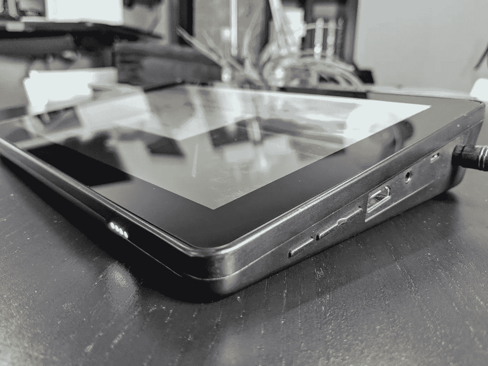

# RasPad 评论:把你的树莓皮变成平板电脑

> 原文：<https://medium.com/hackernoon/raspad-review-turn-your-raspberry-pi-into-a-tablet-499579033214>

The [RasPad](https://www.kickstarter.com/projects/35410622/raspad-raspberry-pi-tablet-for-your-creative-proje?ref=6jamvw) turns the Raspberry Pi into a convenient, portable tablet. Disclosure: I received a payment and a [RasPad Kit](https://www.kickstarter.com/projects/35410622/raspad-raspberry-pi-tablet-for-your-creative-proje?ref=6jamvw) in exchange for writing this review, but these are my honest impressions of the experience.

比巧克力棒还小，比外出过夜还便宜，树莓派创造了一个全新的计算类别。从最初的版本发布到现在已经六年了，我们已经看到它被用在从 DIY 项目到企业服务器的方方面面。

Raspberry Pi 是学习电子和编程的一个很好的工具。但是，即使是基本的设置也会令人生畏——一大堆笨重的外围设备和电缆。

[SunFounder](https://www.sunfounder.com/) ，一家专注于创客教育的公司，想要让事情变得简单。他们正在为便携式 Raspberry Pi 平板电脑 [RasPad](https://www.kickstarter.com/projects/35410622/raspad-raspberry-pi-tablet-for-your-creative-proje?ref=6jamvw) 结束一场大获成功的 [Kickstarter 活动](https://www.kickstarter.com/projects/35410622/raspad-raspberry-pi-tablet-for-your-creative-proje?ref=6jamvw)。

# 拉斯帕德:这是什么

RasPad 并不是要与 iPad 和其他平板电脑竞争。相反，它利用了 Raspberry Pi 生态系统，为数字创意人员的项目提供了一个便携、方便的工具。

RasPad 将 Raspberry Pi、10 英寸多点触控显示屏、立体声扬声器和 3 小时电池整合到一个简单、优雅的包装中。

The RasPad Kit. The final version will ship with a Raspberry Pi 3 Model B+. Plant not included.

Kickstarter 上有几个不同价格的不同版本:

*   RasPad:RasPad 和电源，但没有 Raspberry Pi 或 SD 卡
*   RasPad 套件:RasPad、电源、Raspberry Pi 和 SD 卡
*   RasPad 初学者工具包:RasPad 工具包中的所有东西，加上传感器工具包
*   RasPad x 配有视觉摄像头的 uArm:RasPad 套件中的所有组件，外加一个 uArm 机械臂和视觉摄像头套件

如果你选择获得 [RasPad 套件](https://www.kickstarter.com/projects/35410622/raspad-raspberry-pi-tablet-for-your-creative-proje?ref=nav_search&result=project&term=raspad)(升级选项)，它会预装 Raspbian 操作系统和一些初学者友好但功能强大的应用程序。对于那些希望开始接触树莓派的人来说，这是最好的选择之一。

# 设置

这篇评论的其余部分包括升级选项之一的 [RasPad 套件](https://www.kickstarter.com/projects/35410622/raspad-raspberry-pi-tablet-for-your-creative-proje?ref=6jamvw)。 [RasPad 套件](https://www.kickstarter.com/projects/35410622/raspad-raspberry-pi-tablet-for-your-creative-proje?ref=6jamvw)配有让树莓派快速运行所需的一切。除了 RasPad 单元本身，它还包括一个 Raspberry Pi 3 型号 B+、电源适配器和预装 Raspbian 的 MicroSD 卡。

设置很简单。安装 SD 卡后，将 Pi 插入 RasPad 托盘。连接 USB 电源线、HDMI 线和 USB 外设线。装上 Pi 盖。

The USB peripheral interface must be connected to the Pi to use the touchscreen.

插上电源，按住设备右下角的电源按钮。30 秒内，Raspbian 将完全启动并准备就绪。

# 硬件印象

[RasPad](https://www.kickstarter.com/projects/35410622/raspad-raspberry-pi-tablet-for-your-creative-proje?ref=6jamvw) 的制造质量让我吃惊。虽然塑料外壳的贴合性和光洁度不如 iPad，但它感觉非常坚固，制作精良。

10 英寸 IPS 多点触控显示屏明亮而充满活力。它的最大亮度比 iPad 稍暗，但对于任何室内应用来说都绰绰有余。对于这个价格范围的东西来说，颜色质量非常好。

Installing the Pi in the RasPad. I was told the plastic imperfections will be limited in the final version.

立体声扬声器类似于大多数笔记本电脑中的扬声器。不如高保真系统好，但对许多应用来说已经足够了。如果您需要更好的音质，您可以连接蓝牙或有线扬声器。

该装置的后部包括一个插槽，用于连接外部硬件模块。

电池电量由设备前面的四个 led 指示。此外，充电时屏幕上会显示一个闪电图标。

RasPad controls and battery indicator.

该设备右下角的三个按钮控制电源、音量、亮度和屏幕锁定。操作与其他平板电脑类似。

# 使用锉刀

我的评测单元来自 Raspberry Pi 3 Model B，但最终版本将与 Model B+一起发布。在 Pi 上运行完整的桌面操作系统是资源密集型的，但是它可以很好地处理大多数任务。

Booting up.

Chromium、Scratch 2、Terminal 和 LibreOffice Writer 等应用程序的加载和运行速度都快得惊人。我注意到的唯一例外是 Sonic Pi，它花了几乎一分钟才打开，但运行后表现良好。

我顺利地将 Pi 连接到了我的 Wi-Fi 网络。虽然我的评测单元只支持 2.4 GHz 网络，但最终版本将支持 5 GHz 网络。

触摸屏在许多情况下工作良好，但 Raspbian 操作系统并不是纯触摸屏操作的最佳匹配。虽然你可以在许多应用程序中缩放，但其他应用程序不是触摸优化的。屏幕键盘可以工作，但不支持多点触摸(不能按住 shift 键按字母)。很难准确地按下一些小的 UI 元素，比如退出和最小化按钮。

Using the RasPad with the onscreen keyboard and a Bluetooth mouse.

除非你需要打很多字，否则我认为屏幕键盘很好。但是我建议你买个鼠标，USB 或者蓝牙都可以。我将我的 RasPad 与蓝牙鼠标配对，此后的体验流畅多了。

因为 RasPad 有电池，您的项目不再局限于桌面。尽管您的特定任务可能涉及一些连接，但 RasPad 比我见过的任何其他 Pi 设置都更易于移植。因为它包括一个真正的网络浏览器和办公应用程序，你可以把它当作日常电脑使用。

# 用 Scratch 学习编程

学习编程最棘手的部分之一是跟踪语法。麻省理工学院的可视化编程语言 Scratch 抛弃了代码，取而代之的是拖放块。

Intro to [Scratch](https://scratch.mit.edu/).

你能用 Scratch 做什么？您可以创建游戏、音乐、动画和交互式界面。您甚至可以连接传感器和外围设备，例如传感器套件中提供的设备，将您的程序带到现实世界中。

SunFounder 团队用 Dragit 扩展了 Scratch，使触摸屏操作积木变得容易。Dragit 使 [RasPad](https://www.kickstarter.com/projects/35410622/raspad-raspberry-pi-tablet-for-your-creative-proje?ref=6jamvw) 成为终极刮擦工具。

Working on a Scratch interactive dance floor project.

# 更多的项目想法

[RasPad](https://www.kickstarter.com/projects/35410622/raspad-raspberry-pi-tablet-for-your-creative-proje?ref=6jamvw) 为一系列 DIY 项目打开了大门。仅举几个例子:

*   互动艺术
*   气象站
*   无人机控制
*   赌博
*   摄像系统
*   机器人学
*   照明控制
*   娱乐中心
*   警报系统
*   感觉
*   现场编码音乐

SunFounder 出售一个可选的传感器套件，其中包括支持许多这些项目的外围设备。与单独采购所有零件相比，这种包装物有所值。

The optional Sensor Kit expands the number of possibilities for projects.

[RasPad](https://www.kickstarter.com/projects/35410622/raspad-raspberry-pi-tablet-for-your-creative-proje?ref=6jamvw) 中的侧边通道便于连接这些外围设备，而无需修改外壳。特别方便的是 40 引脚带状电缆和 T 形补钉，这是一种将试验板元件连接到 RasPad 的干净方式。您还可以使用摄像头连接器。

# 裁决

Raspberry Pi 已经改变了游戏规则，但是结合了 RasPad，数字项目变得前所未有的简单。RasPad 是任何想要了解树莓派的人的必备之物。经验丰富的数字创意人员也可以从 RasPad 的便捷包装和改进的便携性中受益。

今天就在 Kickstarter 上预订你的[。](https://www.kickstarter.com/projects/35410622/raspad-raspberry-pi-tablet-for-your-creative-proje?ref=6jamvw)

**感谢阅读。**如果你喜欢这篇文章，请点击上面的拍手按钮，并与你的朋友分享。我也鼓励你订阅我的 YouTube 频道来获取更多科技内容。

> 披露:作为写这篇评论的交换，我收到了一笔钱和一个 RasPad 工具包，但这些是我对这次经历的真实印象。