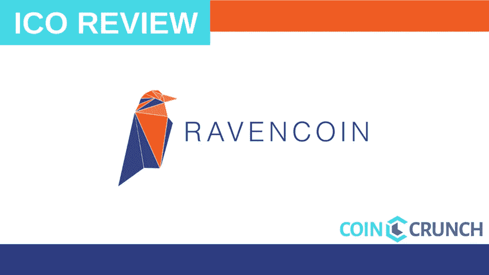
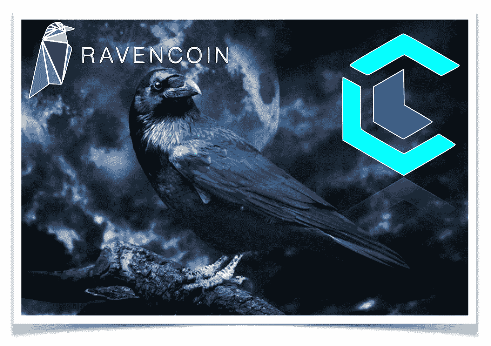
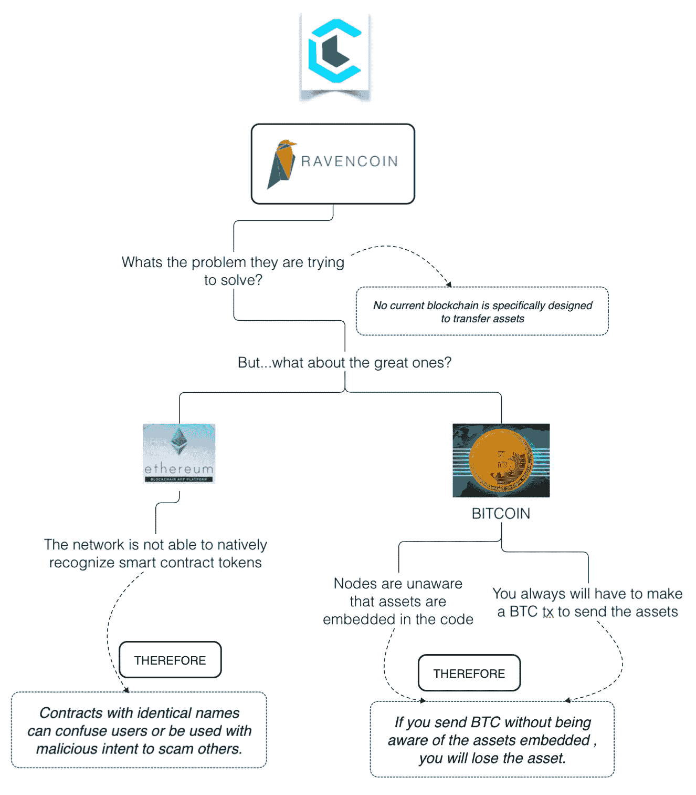
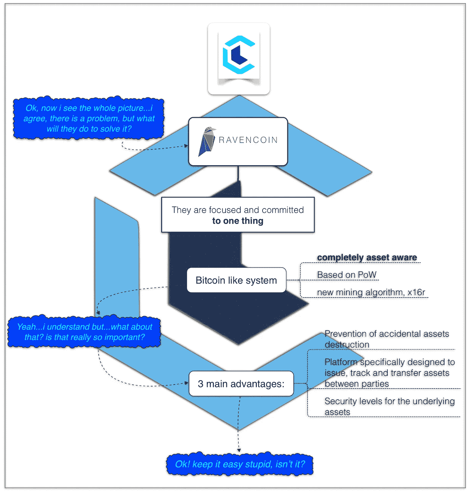
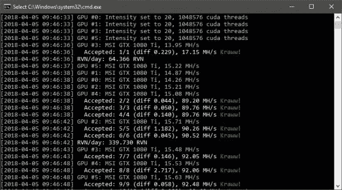
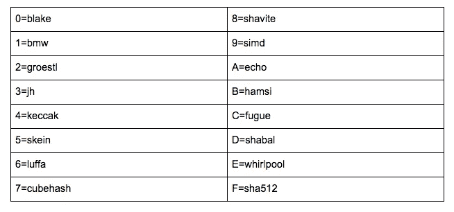
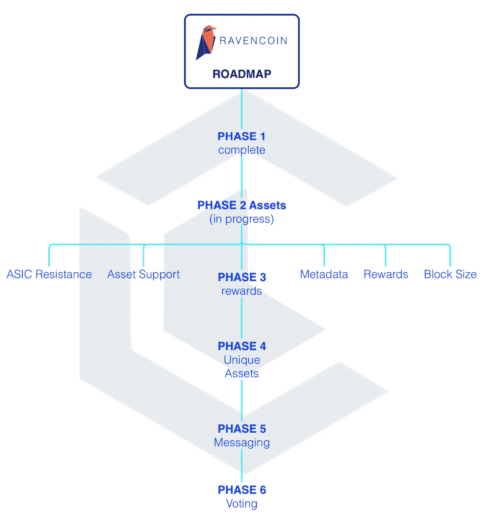
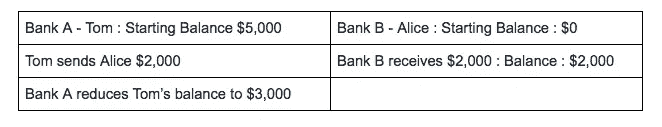
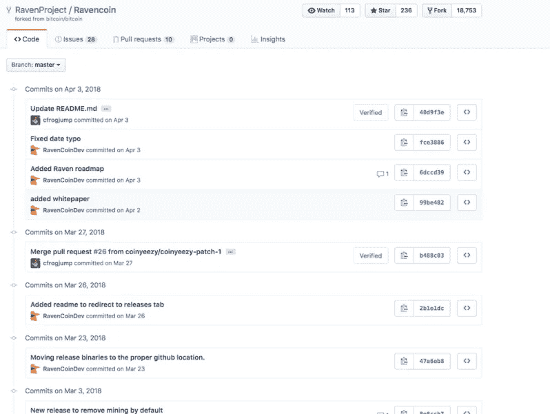
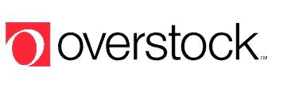

# raven coin Review——一个比特币代码分叉，旨在将现实世界的资产引入区块链

> 原文：<https://medium.com/hackernoon/ravencoin-review-a-bitcoin-code-fork-looking-to-bring-real-world-assets-onto-blockchain-f4df1fe27ee7>

乌鸦是一种高度象征性的生物，在各种文化中都有提及，有着不同的目的。其中一个意思是转型。

由于 Ravencoin 是比特币代码的一个分支，它很可能就是开发者想要表达的意思。正是凭借这一意象，我们推出了**乌鸦币**。

**Ravencoin** 是 2017 年 10 月 31 日公布的新项目，在 2018 年 1 月 3 日比特币 9 岁生日当天随着挖矿软件的发布而登场。

**Ravencoin** 不仅仅是比特币代码的一个分支，它是一个建立在比特币原始愿景基础上的项目，但增加了新的功能，有机地扩展了比特币的功能和内在价值。

Ravencoin:将用于资产的比特币克隆。为资产打造的改进型比特币

Ravencoin 是一个免费的开源平台，专为将资产(如令牌支持资产)从一个持有者转移到另一个持有者的特定用例而设计。

虽然看起来随着比特币和以太坊等伟大区块链的发展，在不同方之间转移资产已经是一个解决的问题，但事实并非如此。比特币和以太坊都不是专门为促进额外资产所有权而设计的，因为它们只是将注意力集中在其他功能上。

Ravencoin 建立在比特币代码的分叉上。它已经通过一分钟的较小块奖励(块奖励是创造新硬币的唯一方式，并且它是对矿工向网络添加散列能力的激励)以及资产创造和消息能力的增加来实现。

如果你是一个*密码爱好者*，我们确信你是，因为你现在正在读这篇文章。你会同意区块链理工确实会改变我们今天所知道的全球经济模式。

然而，能够在几秒钟内，在没有第三方参与的情况下，在国际上发送财富交易，只是这一新革命所代表的冰山一角。

在不可阻挡的发展道路上，Ravencoin 将实现资产所有者运营油井的方式。这将使他们能够有效地处理其资产向另一方的转移。

为了在这场世界秩序革命中不失去任何关键点:

# 问题

尽管比特币和以太坊获得了成功和广泛采用，但这两种区块链都不是专门设计来促进通过各自网络交易的代币之外的额外资产的所有权。

在比特币中，必须遵守管理区块链和协议的原始规则，因此这意味着比特币节点无法注册资产被嵌入到令牌中。

这意味着，在比特币网络上进行的每一笔资产交易，都必须有一笔伴随的比特币交易费用，即使交易是简单地发送资产。

这导致每当转移资产时都产生不必要的交易费用。此外，另一个主要缺点是，如果资产被送到交易所或钱包，它们很容易被“破坏”。

对于以太坊，网络本身无法识别智能合约令牌，由于多个 ERC20 令牌具有相同的名称，这可能会导致一些混淆。具有相同名称的合同之间的唯一区别因素是合同哈希，这可能会使用户困惑，或者被恶意利用来欺骗他人。

由于 Ravencoin 将采用分散的模式，由独立的采矿者支持区块链的稳定，并联合 ASIS 抵抗运动，因此该硬币将很有可能留在个人手中，而不是由一个政党或一群政党集中控制，这些政党或政党可以相互勾结，影响事件、投票甚至硬币本身的价格。

*   用于创建和转移资产的点对点电子系统
*   为转移资产而优化
*   代币提供了传统共享或其他参与机制的几个优势:更快的传输速度、增强的用户控制和审查阻力，以及减少或消除对可信第三方的需要。

# 解决办法

上述问题的解决方案是创建一个类似比特币的系统，该系统完全具有资产意识，以便它能够识别令牌何时被设计为资产。

为了解决这个问题，Ravencoin 将使这个说法变得生动起来:

*《保持简单愚蠢》*

通过专注于创建一个东西，只是一个特定的东西…一个类似比特币的系统，完全知道令牌何时被设计为资产(基于 PoW，但使用新的挖掘算法 x16r)。

**这提供了三个优势:**

1.  可以保护资产不被意外破坏。由于协议和系统知道这些资产——它们可以像火车上的乘客一样被带到区块链上，最终将它们安全地送到目的地。
2.  用户能够轻松地相互发送消息，相互发布、跟踪和转移资产。*现在，用户将依赖一个专门设计的完整平台，在各方之间发布、跟踪和转移资产。*
3.  它将为基础资产提供适当的安全级别。要做到这一点，Ravencoin 将依赖于广泛的分布、强大的矿业社区和市场价值来发挥作用。

# 主要功能—技术概述

好了，现在我们了解了当前区块链需要解决的问题(在许多现有问题中提出的问题),我们也知道了 Ravencoin 致力于开发的解决方案，以超越这一限制。

那么…下一步是什么？。我们需要深入他们的技术…这似乎很无聊，但我们会处理好的。只有这样，我们才会真正有知识和基础来对项目做出决策。

Ravencoin 给我们带来了以下功能:

**X16R 算法**

在我们描述 X16R 是什么之前，我们将首先提供其他硬币为其算法实现的细节。

在寻找创建和实现抗 ASIC 的算法(意味着不能开发具有高哈希速率的专用矿机)从而减少通过大型采矿场集中化的机会的过程中，项目尝试了各种策略来阻碍这种集中化(就像我们在比特币采矿中看到的那样)。

第一种方法是采用内存密集型算法，如 Scrypt 和 Equihash 所使用的算法。这种对额外内存计算的需求降低了 ASIC 的性能，使其与使用相同算法的基于 GPU 的挖掘性能相差甚远

另一种方法是 Dash 的方法，它采用 X11 算法。这是使用 11 个链式散列算法(因此得名)来减缓 ASIC 硬件的创建。

这并不妨碍专用 ASIC 的设计，因此一旦有了 X11 的 ASIC，其他人就添加更多的散列算法来创建被命名为 X13、X15 和 X17 的附加算法。这使得制造 ASIC 变得更加困难，但是因为算法的顺序大致相同，所以制造 ASIC 是困难的，但不是不可能的。

Ravecoin 正在做的事情被称为 X16r，该实现与前面描述的其他实现一样，使用 16 种算法进行哈希运算(见下表)。关键的区别是他们增加了算法重新排序。正是这种基于来自前一个块的结果的重新排序提供了比其他散列算法更大的 ASIC 阻力。

示例:

**前一个块哈希:**00000000000000007 E8 a 29 f 052 AC 2870045 AE 3970270 F9 7da 00919 b8e 86287

**最后 8 个字节:** 0x7da00919b8e86287 决定了接下来的 16 个哈希应该是什么。

# 路标

**第一阶段—完成**

Ravencoin (RVN)是一种基于比特币 UTXO 模型构建的工作证明币。与其他比特币衍生品一样，RVN 硬币通过开采 Raven 分发给扩大 Raven 网络的人。

*   x1000 硬币发行(总计 210 亿)
*   快 10 倍的数据块(每分钟 1 个)
*   在应用程序 CPU 挖掘中
*   ~1.4 天难度调整(2016 块)
*   对于常规地址，地址以 r…开头；对于多重地址，地址以 R…开头
*   网络端口:8767
*   RPC 端口:8766

**UTXO —未用交易输出定义**

未用完的交易输出是比特币的关键，因为这是比特币在区块链上跟踪输入和输出的方式。首先让我们看看银行是如何运作的。

假设 Tom 在银行 A 有 5000 美元的余额，并且假设在银行 B 办理所有银行业务的 Alice 没有余额。

汤姆想给爱丽丝汇 2000 美元。为此，汤姆要求他的银行以爱丽丝的名义向 B 银行汇去 2000 美元。

在实际交易中，汤姆的余额从 5，000 美元减少到 3，000 美元，而爱丽丝的余额从 0 美元增加到 2，000 美元。

把这个带到比特币区块链:

汤姆已经收到了 5 BTC 的投入。这来自 4 个交易(输入)

**输入**

*   收到 2 BTC
*   收到 1 BTC = **5 BTC**
*   收到 1.5 BTC
*   收到 0.5 BTC

在本例中，汤姆想给爱丽丝 2 BTC。与银行不同，区块链不知道上例中的余额，因此交易记录为:

**输出**

*   2 BTC 发给爱丽丝
*   3 BTC 发回给汤姆→这是未用完的事务输出或 UTXO

**第 2 阶段—资产(进行中)ASIC 电阻**

ASIC 电阻——公开承诺继续尝试 ASIC 电阻。如果 ASIC 是为 x16r 创建的，那么我们将在特定的块号处修改其中一个算法，以添加 Equihash、EthHash 或类似的努力来增加对 Raven 的 ASIC 矿工的抵抗力。

**独特的资产支持**

Ravencoin 将是一个硬分叉，它扩展了 Raven，使其包括发行和转移资产的能力。资产能力的预期发布将在 RVN 发布后大约七个月。Raven 将被扩展以允许发行、重新发行和转移资产。资产可以重新发行或在发行时限于一套供应。

创建任意数量的资产的成本为 500 卢比。每个资产名称必须是唯一的。资产名称将限于 A-Z 和 0–9、'【T10 和'.'并且必须至少有三个字符长。“.”并且''不能是第一个字符，也不能是最后一个字符，也不能是连续的。

**有效资产示例:**

*_ 游戏*
*A .令牌*
*123*

**无效资产的例子:**

*_ TOKEN*
*THEEND。*
*一..B* (连续标点)
*AB*
*12*
*。第一个*

用于发行资产的 RVN 将被发送到烧录地址，这将减少可用 RVN 的数量。

资产转移需要从一个地址转移到另一个地址的标准 RVN 交易费。

**元数据**

关于令牌的元数据可以存储在 IPFS。最初，这是无法改变的。如果有需求，可以更新系统以允许令牌发放者更新元数据。

**奖励**

将增加奖励功能，允许向资产的所有持有者支付(以越南盾计)。RVN 的付款将按比例分配给所有资产持有人。这对于支付红利、分割付款或奖励一组代币持有者非常有用。

例如:一家小型软件公司发行了代表项目份额的资产 GAMECO。GAMECO 代币可以与他人交易。一旦软件公司盈利，这些利润可以通过将利润(通过 RVN)发送给 GAMECO 的所有持有人来分配给 GAMECO 的所有持有人。

**块大小**

Raven 可能会将块大小从 1 MB 增加到 X MB，以允许更多的链上事务。

**第三阶段——奖励**

奖励系统将允许创造坐在乌鸦区块链上的代币。这些代币可以被创建，然后作为做某事的奖励或作为筹集资金的一种方式发送给人们。筹集的资金可以用来将乌鸦区块链上的任何货币发送给另一方。

**第 4 阶段—独特资产**

一旦创建，资产可以以 5 卢比的成本变得唯一。只有不可分割的资产才是唯一的。这将资产移动到 UTXO，并将唯一标识符与 txid 相关联。从这一点来看，资产可以从一个地址移动到另一个地址，并可以追溯到它的来源。只有原始资产的发行者才能使资产具有唯一性。

制造独特资产的成本将被发送到一个焚烧地址。

独特资产的一些示例:

*   假设一个艺术品经销商发行了名为“艺术品”的资产。然后，经销商可以通过在每件艺术品上附加一个名称或序列号来制作独特的艺术品资产。这些独特的令牌可以与艺术品一起转让给新的所有者，作为真实性的证明。象征艺术:梦娜丽沙和艺术:VenusDeMilo 是不可替代的，代表不同的艺术作品
*   软件开发人员可以用其软件 ABCGAME 的名称发行资产，然后为每个 ABCGAME 令牌分配一个唯一的 id 或许可证密钥。游戏代币可以随着许可证的转移而转移。每个令牌 ABCGAME:398222 和 ABCGAME:都是唯一的令牌。
*   在游戏资产中。游戏 ZYX _ 游戏可以创建由游戏玩家拥有和使用的独特的限量版游戏内资产。例如:ZYX _ 游戏:Sword005 和 ZYX _ 游戏:钱包
*   基于 RVN 的独特资产可以绑定到真实世界的资产。创建名为 GOLDVAULT 的资产。金库中的每个金币或金条都可以被序列化和审计。可以创建相关联的唯一资产 GOLDVAULT:444322 和 GOLDVAULT:555994，以表示实物黄金保险库中的特定资产。该链的公共性质允许完全透明。

**第 5 阶段——信息传递**

授权发送者向令牌持有者发送的消息将位于第 3 阶段唯一资产的顶层。更多信息请参见 KAAAWWW 协议。

**第 6 阶段—投票**

投票将通过创建并行令牌并将其分发给令牌持有者来完成。这些令牌可以发送到 RVN 地址来记录投票。

# 团队+顾问

被称为社区硬币。任何人都可以对项目做出贡献。

涉及的开发者数量尚不确定，但根据 Github 的数据，有 430 名比特币开发者提交了超过 14，000 份申请。

[**Tron Black**](https://www.linkedin.com/in/tron-black-90287) — *Core Developer*

*   Tron 作为软件开发人员已经在区块链和加密货币领域工作了 5 年多。目前是美第奇公司的首席软件开发商，该公司是一家在区块链投资的风险投资公司。他的职业使命是提高技术来解决现实世界的问题。
*   他在蓝松鼠公司担任了 17 年多的总裁兼首席执行官。Blue Squirrel 是一家软件开发公司，他们最初的产品是 SQURL，这是当时互联网的 google。
*   已获专利—验证加密货币钱包的身份和信誉的系统地址:
*   专利申请日为 2013 年 6 月 6 日，专利发行人和编号为 61831802。
*   专利描述用于向公共加密货币地址自愿识别公司或个人身份的方法和系统，以及可通过 API 访问的一位数信誉评级系统。

[**Bruce Fenton**](https://www.linkedin.com/in/brucefenton) — *Advisor*

*   布鲁斯是区块链经济顾问。他在金融领域拥有超过 23 年的经验，在区块链和加密货币领域拥有超过 3 年的经验。
*   在他的职业生涯中，他在投资基金上投入了超过 50 亿美元。
*   担任比尔和梅林达·盖茨基金会的顾问——安排、参加比尔·盖茨与沙特阿拉伯商界和政府领导人之间的高层会议，并为其配备工作人员，与基金会中东地区负责人合作(请注意，关于数字货币和经济问题的观点与基金会无关)。
*   主持了 Satoshi 圆桌会议私人务虚会，这是区块链技术领域 75 位顶级领导者的聚会。
*   SpeechWorks 的天使投资人(现为上市公司 Nuance，市值 50 亿美元)。
*   ShapeShift 等比特币公司的天使投资人。
*   Factom、BTCS 和其他公司的顾问。
*   目前担任 3 个角色:
*   比特币基金会董事会成员(2 年以上)，该基金会是比特币技术领域最大、历史最悠久的行业组织。
*   Satoshi 圆桌私人区块链务虚会(3 年以上)的创始人，这是一个只邀请 VIP 的年度活动。
*   常务董事。大西洋金融公司首席信息官(23 岁以上)

# 合作伙伴和投资者

**投稿公司:**

**附加资源:**

*   [Cointelegraph 新闻文章](https://cointelegraph.com/news/what-does-overstock-see-in-the-digital-bank-of-westeros-ravencoin)
*   [SeekinAlpha 文章](https://seekingalpha.com/instablog/3186521-jim-roof/5127973-ravencoin-take-flight)
*   [BitcoinMagazine 文章](https://bitcoinmagazine.com/articles/cryptocurrency-project-ravencoin-gets-back-p2p-asset-transfer-basics/)
*   [CryptoCoinSpy 文章](https://cryptocoinspy.com/ravencoin-rvn-publishes-whitepaper-roadmap-website-crashes-in-minutes/)

# 想要了解区块链和加密货币的最佳新闻、评论和信息，请访问 [coincrunch.io](https://coincrunch.io) 或查看我们的网站:[Youtube](https://www.youtube.com/channel/UCXyrBCWaRJzHfOtnWaR47Qw)|[Twitter](https://twitter.com/coincrunchio)|[脸书](https://www.facebook.com/realcoincrunch/) | [Reddit](https://www.reddit.com/user/coincrunchio)