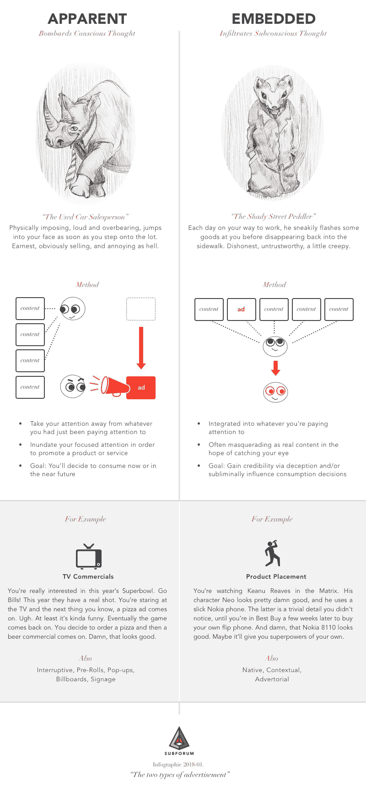

# 重新评估在线广告

> 原文：<https://medium.com/hackernoon/re-evaluating-online-ads-be3b4bee6939>

我[最近向上议院](http://data.parliament.uk/writtenevidence/committeeevidence.svc/evidencedocument/communications-committee/the-internet-to-regulate-or-not-to-regulate/written/82470.html)[交通委员会](https://www.parliament.uk/business/committees/committees-a-z/lords-select/communications-committee/)提交了书面证据，关于他们[对网络平台](https://www.parliament.uk/business/committees/committees-a-z/lords-select/communications-committee/inquiries/parliament-2017/the-internet-to-regulate-or-not-to-regulate/)监管的调查。线上平台是注意力收割机。他们利用人类对各种奖励的接受能力和保持警惕的自然倾向来获得尽可能多的关注。

然后，这些平台通过显示有针对性的广告来利用收获的注意力。

自从把这些材料放在一起，我一直在思考广告是如何展示的，并重新评估我自己对什么是好广告的看法…相对而言。

# 显性广告与嵌入式广告

你每天都会看到成千上万的广告。营销人员有无数的术语来描述广告，但基本上有两种类型。明显的广告是你注意到的广告；**嵌入式广告**是你不会做的广告:

作为消费者，你如何体验这些不同类型的广告？让我们来看看:

# 你生命中的一天

工作令人疲惫不堪。你晚饭吃了剩菜，刚让孩子们上床睡觉。你是对的，在一个真人秀节目中，突然又一个该死的啤酒广告出现了。叹气。你可以坐着看完，或者去尿尿，或者再检查一下你的手机。你决定看看你的手机。你好，脸书。随着状态更新一闪而过，你几乎不会注意到其中一些是伪装成朋友更新的品牌公司信息(广告)。这些伪装者溜进了你的潜意识，脸书只是赚了几个便士。

有多少个广告就有多少个时刻，你刚刚被耍了:爱上了一种广告形式，同时避开了另一种。

# 你的生活，在线

你可以在互联网上看到这两种广告，平台有复杂的定位机制，使用你的个人数据——人口统计数据、兴趣和社会关系——来选择向你显示哪些特定的广告。

一如既往，明显的广告在网上总是非常明显:中断、弹出窗口、接管、加载时或用户与页面元素互动后出现的预播放视频。这些广告占据了全部或部分屏幕空间，你必须找到并点击通常隐藏的“不，谢谢”或“跳过”链接，才能让广告消失。

不出所料，在线嵌入广告隐藏在众目睽睽之下。最初，它们与真实内容一起放在网页中，并通过一些原始/标准大小的容器显示。多年来，它们越来越多地融入到主要内容中。

谷歌是第一个朝这个方向迈出重大步伐的平台。在通过建立一个更强大和有效的搜索引擎达到规模后，谷歌开始开发他们自己的定制广告平台，以使他们的业务盈利。谷歌保持了对广告模式经济的完全控制，也获得了以他们想要的方式展示广告的能力。

除此之外，谷歌选择将他们的广告伪装成搜索结果，并在用户的结果页面上显示出来。这个策略实际上[违背了用户的期望](https://www.ftc.gov/system/files/documents/public_events/171321/final_transcript_1.pdf):用户已经开始期望谷歌会简单地显示与搜索查询最匹配的网页，然而谷歌显示的是一些最匹配的网页，并且在顶端偷偷的撒上了广告。这种违反的基本原理是，用户已经给予谷歌**许可**通过表达搜索查询向他们显示相关广告。

这种基本原理反过来又根植于许可营销的概念。在谷歌推出 AdWords 之前，许可营销已经在行业中流行了一年多。营销人员 Seth Godin 甚至写了一本关于它的书。许可营销人员会说，通过向谷歌表达查询，用户向谷歌提供了三个级别的许可来显示广告:

*   选择了谷歌平台(静脉注射许可)
*   确定谷歌搜索功能有足够的价值与(积分许可)互动
*   告知谷歌感兴趣的主题/关键词(情境许可)

上面的用户行为代表了一个广告邀请的概念对你来说可能有点荒谬，但这个世界上没有什么是免费的，对吗？查询词使谷歌能够显示与这一领域相关的广告。通过这种方式，广告与用户更加相关。无论用户喜不喜欢，谷歌都会展示广告；至少在许可营销的情况下，广告会比以前更有意义，也不那么烦人。

或者至少，这是一个想法和借口。

但是为什么要隐藏广告呢？虽然没那么烦人，但谷歌的新广告比以往的广告更具欺骗性和隐蔽性。他们的广告实际上伪装成真实的内容，希望你点击广告*而不是真实搜索结果的*。骗局成功了，非常成功。谷歌的用户要么适应了这种新常态，要么没有意识到这些广告，或者两者兼而有之，[谷歌](https://hackernoon.com/tagged/google)赚了一大笔钱。欺诈行为创造了利润。时至今日——尽管谷歌的技术创新多种多样——它的绝大部分资金仍然来自广告收入。由于其财务上的成功，谷歌成为了消费者平台的事实上的模型:

1.  建立一个具有某种内在价值的平台
2.  达到大规模
3.  在你的平台体验中嵌入广告
4.  假设你有显示和定向广告的“许可”
5.  利润

你不能在第一天就植入广告，因为它们会稀释平台价值并阻碍增长，但我们一会儿会回到这一点。

# 社交广告

达到一定规模后，脸书将谷歌的方法向前推进了一步，将许可的概念扩展到了社交领域:

*   您的社交图表:*您的朋友喜欢此产品或服务，因此您现在允许我们通过与他们成为朋友来向您展示此产品或服务。*
*   你的社交互动:*你喜欢耐克的状态更新，所以现在我们有权向你展示鞋子广告。*

当然，这也是为什么脸书在你的个人数据问题上，以及如何与他们的开发者和广告商分享这些数据的问题上，表现得如此反常。他们的整个平台都是围绕这样一个理念构建的:你可以看到与你朋友制作的“真实”内容整合在一起的广告。脸书已经承担了为你管理内容的责任，并有动力向你展示广告，因为这是他们赚钱的方式。个人定位一直是脸书方法的重要组成部分，也是他们的主要区别。他们现在臭名昭著的开发者计划曾经与你从未见过的开发者分享你的个人数据，仅仅是因为你的一个朋友与该开发者的应用程序进行了交互。这对脸书来说是一个显而易见的举动，考虑到用户并没有故意给予许可，脸书只是假设许可并努力扩大规模。

# 评论

嵌入式和明显的在线广告都以个人数据为目标，并引入隐私和信任问题。尽管如此，我还是认为嵌入式广告更糟糕。为什么？因为消费者对广告的认识越少，这些广告就越有害:

*   **消费者代理权的丧失:**嵌入式广告剥夺了消费者实时做出主动、自觉购买决定的机会。植入式广告寻求在一段时间内影响消费者的潜意识思维，而不是根据优点或价值直接吸引消费者。嵌入式广告平台更容易被虚假信息和宣传活动渗透，因为这些平台不能清楚地识别广告，并且与广告内容的联系更少。
*   缺乏产品/平台的完整性:嵌入式广告伪装成真实的内容，试图欺骗消费者与他们互动。这是彻头彻尾的欺骗。这也直接违背了用户对内容合法的期望。当网络用户浏览网页时，他们通常不会意识到嵌入的广告。用户可能意识到她错误地点击了广告；具有讽刺意味的是，对用户来说，最好的补救方法是返回并点击其他东西，这通过创造更多的用户参与来使平台受益。
*   **产品/平台价值的损失:**嵌入式广告创造了一种降低结果有用性的平台激励，首先通过稀释真实内容以便为广告腾出空间，然后通过推广只有参与价值而没有文化、历史、社会或其他价值的内容。在嵌入式广告驱动的平台中，价值被剥离到一个维度:这完全取决于点击量，因为这是广告的定价方式。消费者没有主动意识到稀释或促销。

明显的广告很烦人。但至少你知道它们是什么，以及你什么时候处理它们。你知道他们试图向你推销某些东西，即使他们可能是间接的(比如用顺口溜)，你也可以相信他们会在完成后离开。有了明显的广告，你总是知道发生了什么。我个人经历的一个很好的例子:Spotify。在最终购买包月服务之前，我有一个免费版的 Spotify 将近一年。那段时间，Spotify 会定期用广告打断我的音乐流。一旦我厌倦了听到广告，我就购买了订阅服务，因为我重视这项服务。作为一名消费者，我可能时不时会被 Spotify 的广告惹恼，但我的期望从未被它们违背。此外，我能够辨别广告是如何针对我的，因为它们被清楚地识别出来。

植入式广告就不同了。他们藏在平原地区。他们试图在你不注意的情况下影响你的想法。你并不总是知道他们什么时候在附近，或者他们到底想卖什么。他们假装自己不是。他们操纵你，随着时间的推移侵蚀你的意志力。它们迫使广告客户欺骗和寻求更深层次的参与，同时忽视其他形式的价值。对于嵌入式广告，你是在黑暗中，也是最后知道的。

# 你怎么想呢?

平台和在线营销人员认为，嵌入式广告是两种类型中更好的一种，因为它们不那么烦人，也更吸引人。

你同意吗？