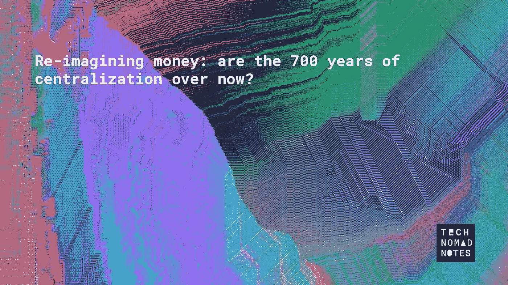

# 重新想象货币:700 年的中央集权结束了吗？

> 原文：<https://medium.com/hackernoon/re-imagining-money-are-the-700-years-of-centralization-over-now-be97979d30f9>

奥尔加·格里尼纳

(金钱)…驱动着这个世界，不管是好是坏。经济激励驱使整个人类群体的行为"

*查马斯·帕里哈皮提亚*

T4:我们大多数人习惯于透过传统的交易媒介来看待货币，即由政府发行和支持的硬币和纸币。然而，看起来这个定义既不完整，也没有反映出由分散式账本技术的进步所推动的正在进行的经济转变。在过去几年中，后者引发了加密经济工程的快速扩张，这基本上是重新发明了所有核心的传统经济概念，货币是这一持续变革的核心。

密码经济学位于密码学、经济学、博弈论和心理学的交叉点，是关于设计和工程新的经济生态系统，由一组特定的激励机制驱动，推动参与者以特定的方式行为。经济激励设计是区块链技术的重要组成部分。因此，金钱的概念现在正转移到一个复杂的工程问题领域。随着货币价值概念的变化，金融基础设施也在变化:将建立一套加密经济和加密金融原语，通过基于协议的自我维持激励系统来利用分散的金融治理。一种假设认为，金融服务的未来可能由一些普遍采用的负责低价值交易任务的加密金融协议和数百个专注于为最终用户体验构建 dApps 的实体组成。

更重要的是，随着政府在社会和金融权力方面的逐渐削弱，它们最终将失去对资金流动的控制。中央集权的公共治理时代正在让位于分散化的金融协议，政府和公共机构无法像过去那样有效地行使监管全球社会领域的核心职能。我们在许多传统上强势的政府职能中看到了这种迹象，比如养老金。这种现象是一种特定的经济现实，主要是由于政府收入的减少:税收变得越来越不可行，因为越来越多的实体选择在离岸管辖区或秘密领域的灰色地带运作。政府支持的货币体系正在失去信誉，专家们质疑这个公共金融机构的生存能力。我们或许应该质疑由黄金或其他资产支持的货币这一事实，事实上，这种情况早已不复存在:随着 70 年代金本位制的取消，通胀率自那以来一直在不断攀升。以最近阿根廷比索的暴跌为例。

然而，随着所有这些陷阱变得越来越明显，大多数人仍然对加密货币和 DLT 持相当怀疑的态度。主要原因可能是他们坚持认为合法货币必须是有形的，并存放在国库或中央银行。事实上，历史可能会证明他们是错的。早在 19 世纪，横跨北美、瑞典、苏格兰、香港等多个国家的非政府资金，作为中央政府资金的替代品，已经被证明是可行的。所有这些债券都是由信任度最低的地方银行发行的，因为它们没有中央政府的支持。所有这些货币在某种程度上形成了银行之间的点对点互动系统，在那里它们可以兑换竞争对手的纸币——就像比特币网络将矿工和其他用户联系在一起。通过这种操作方式，整个货币流通系统与中央集权的系统相比，成为了更可靠的储备形式。私人发行的纸币和私人铸造的硬币可以追溯到古代，货币金属作为“纸币”的动力层，是最接近比特币结算层的类似物。更有甚者，这种类比被完美地延伸到了传统货币体系的更高层次:例如，支票账户和银行券与加密交易最为接近。就计算而言，这些更高的级别通常不如其底层有效(流通中的钞票比美国国债中的黄金更难控制)，对攻击的安全性也更低，因此具有更高的可信度。

非政府货币是当今加密货币最接近的对应货币吗？尽管有明显的相似之处，但仍有许多实质性的差异。虽然前者是由黄金支持的本地货币，但加密货币本质上是全球社会公认的交换媒介。正是社区决定了什么样的货币会给新创造的硬币赋予某种价值。融入社区并意识到这种支付媒介是“新货币”的另一个重要特征。因此，作为全球加密社区的重要参与者，加密交易所正在引入交易令牌，以允许社区购买和出售新附加的价值。或许，我们可以在传统的法定货币和比特币之间找到的最接近的类比是美元:它的价值被世界上的每个人接受，不管它不再由任何资产支持，也不管它来自哪个国家。

权力下放对于资金问题来说并不陌生，这在历史上已经被证明是可行的。不像现代的法定货币，除了政府的承诺之外，它已经变成了一纸空文。当比特币基本上成为第一个具有附加价值并被社区认可的加密金融原语时，新的去中心化数字货币需要相应的机制来运作。最终，这将触发下一层更复杂协议的建立:这些智能合约由以太坊区块链公司提供支持，旨在让各方能够以一种去中心化、无信任的方式提供金融服务。这是新兴的无信任资产管理生态系统正在解决的首要目标。让养老金受益人完全控制其储蓄的拥有和处置，并在提供资产管理服务的实体之间提供多种选择，同时能够以透明和有效的方式监测这一过程，并随时跟踪其资金的使用情况，这是消除资金滥用或腐败案件的一套基本特征。

当实施时，这些协议有可能通过引入真正的财务独立的概念，将个人所有权和占有权授予每个用户，给行业带来重大转变。在类似于[达摩](https://dharma.io/)和[阿克罗波利斯](https://akropolis.io/)的系统中，用户有权拥有和控制他的资产和储蓄，在开放的无边界竞争市场中进行资产管理服务，该市场由一组加密金融原语组成，向几乎每个人开放有效的资产管理策略。自然，为了构建这些基本块，应该引入和测试大量的[加密金融和加密经济原语](https://blog.coinbase.com/the-emergence-of-cryptoeconomic-primitives-14ef3300cc10)，以证明它们的可靠性和效率。我们将在下一篇文章中详细讨论这些问题的细节和含义，等等。

*更多精彩内容请看:*[*t.me/technomadnotes*](http://t.me/technomadnotes)