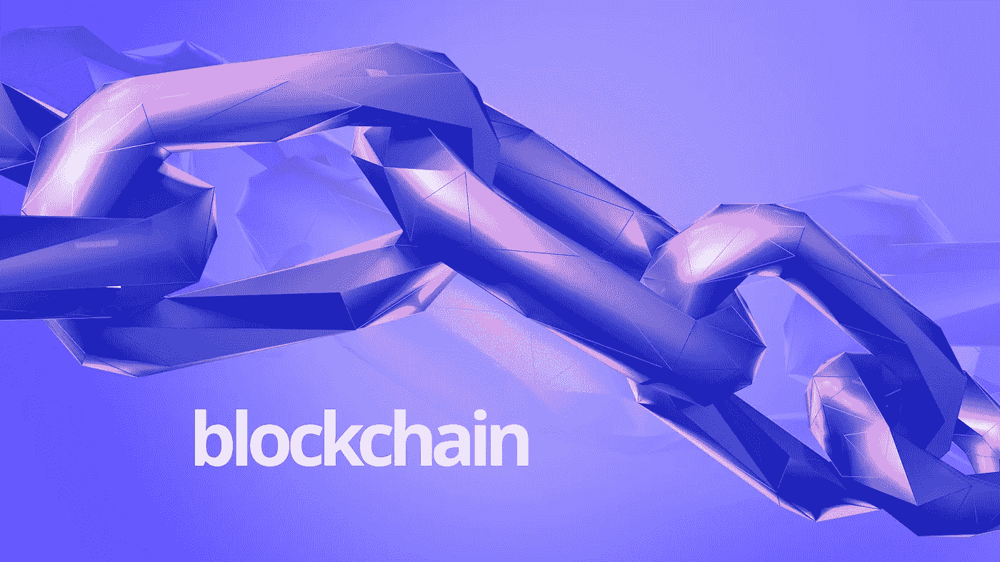

# 如果栈溢出是建立在区块链上的呢？

> 原文：<https://medium.com/hackernoon/re-imagining-stack-overflow-4be363c69931>

在这篇文章中，我将解释我们如何拥有像 Stack Overflow 这样的问答网站，它可以利用区块链的所有优势，如零停机时间，安全等。

## 实施:

1.  我们将有一个私人的区块链生态系统，因为我们正在与一个组织打交道。
2.  用户将在网站上提出/发布一个问题。
3.  任何用户(类似于矿工)都可以解决问题。每个用户将有一个虚拟分数，称为“技能”点。
4.  当用户解决一个问题时，基于所解决问题的难度(类似于“以太坊中的气体”)我们会增加和更新用户“技能”点数。
5.  用户的“技能”点越多，开发者越好。

## 优势:

1.  这个应用程序将帮助招聘人员为他们的组织雇佣最好的开发人员。
2.  因为它将是分散的，所以服务器将不会停机。
3.  这种特殊的产品理念可以用在招聘最优秀人才非常重要的各个领域。例如:**医疗保健领域**可以使用该产品，其中“候选人(未来的医生)”可以解决医疗诊断练习和场景。

加密货币可能上涨，也可能下跌。但区块链将会继续存在，我们必须专注于它的各种用例及应用。

下面这段话是我写这篇文章的动机:

*“让代码自己说话。”~摘自唐·塔斯考特和* Alex Tapscott 撰写的《区块链革命》

感谢您阅读我的文章。

*如有任何问题，欢迎随时给我发* [*邮件*](mailto:pamanalionline@gmail.com) *。也可以通过*[*Linkedin*](https://www.linkedin.com/in/amanali1/)*联系我。你也可以关注我的* [*微博*](https://twitter.com/aliandco) *。*

*为了区块链入门阅读我的* [*文章*](https://hackernoon.com/blockchain-learning-path-2019-e54d6763dd6c) *发表于*[*Hackernoon*](https://hackernoon.com/)