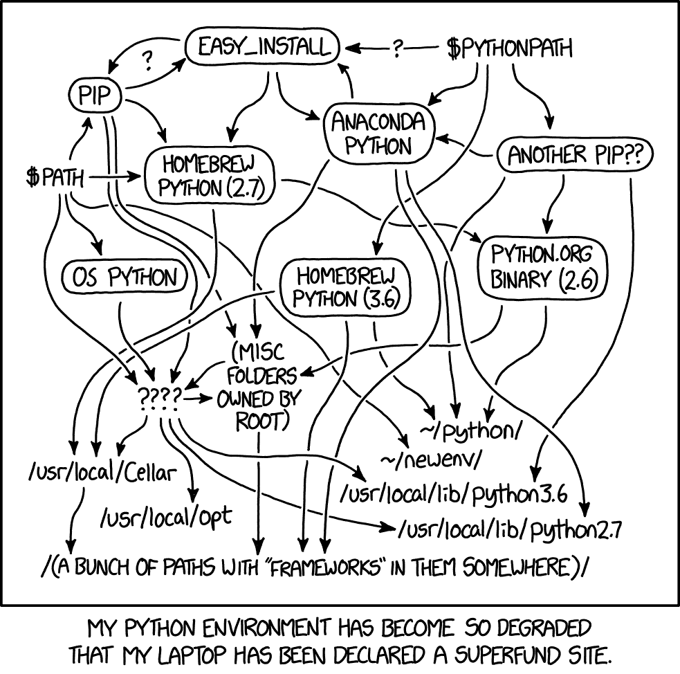

# 为什么应该在 Python 项目中使用 pyenv + Pipenv

> 原文：<https://medium.com/hackernoon/reaching-python-development-nirvana-bb5692adf30c>

## 为 Python 项目设置出色的本地开发工作流的缺失指南。



[“Python Environment” by xkcd](https://xkcd.com/1987/)

这是一种用 Python 进行本地开发的自以为是的方式。您可能已经发现，在您的本地机器上管理具有针对不同 Python 版本的依赖关系的不同项目是一件痛苦的事情。

更复杂的是，安装 Python 也有多种方式:

*   操作系统预安装😔
*   使用像`brew`或`apt`这样的包管理器😕
*   使用来自 www.python.org[的二进制文件](http://www.python.org/)😫
*   使用[pyenv](https://github.com/pyenv/pyenv)——安装和管理 Python 安装的简单方法😎

> ***本指南使用***[***pyenv***](https://github.com/pyenv/pyenv)***管理 Python 安装，使用***[***Pipenv***](https://github.com/pypa/pipenv)***管理项目依赖关系(而不是原始 pip)。***

# 安装 pyenv

让我们通过`brew`安装:

```
**$ brew install pyenv**
```

*如果你不在 Mac 上，请参见 pyenv 的* [*安装说明*](https://github.com/pyenv/pyenv#installation) *。*

将以下内容添加到您的`~/.bash_profile`或`~/.bashrc`(取决于您的 shell)中，以便在您的终端加载时自动初始化 pyenv:

```
**eval "$(pyenv init -)"**
```

# pyenv 是如何工作的？

查看所有可用的 Python 版本:

```
**$ pyenv install --list**
```

让我们安装 Python 3.6.6

```
**$ pyenv install 3.6.6**Installed Python-3.6.6 to /Users/dvf/.pyenv/versions/3.6.6
```

pyenv 不会改变你的全局解释器，除非你告诉它:

```
**$ python --version**Python 2.7.14**$ pyenv global 3.6.6**Python 3.6.6
```

pyenv 允许你安装不同版本的 Python **local** 到一个目录下。让我们创建一个针对 Python 3.7.0 的项目:

```
**$ pyenv install 3.7.0**Installed Python-3.7.0 to /Users/dvf/.pyenv/versions/3.7.0**$ mkdir my_project && cd my_project
$ python --version**Python 3.6.6**$ pyenv local 3.7.0
$ python --version**Python 3.7.0
```

现在，无论何时你发现自己在`my_project`中，你都会自动使用 Python 3.7.0 解释器。

> **🤚这有意义吗？** 如果没有，就此打住，花点时间玩玩 pyenv——它的工作原理是在`~/.pyenv`中安装所有 Python 解释器，并根据当前目录动态调整`$PATH`。

# Pipenv 是什么，它是如何工作的？

Pipenv 是官方推荐的管理项目依赖关系的方法。你的项目中没有一个`requirements.txt`文件来管理 virtualenvs，现在你的项目中有一个`Pipfile`来自动完成所有这些事情。

从通过`pip`安装开始，这是一个快速发展的项目，所以确保你有最新的版本(2018.10.13 在写作的时候):

```
$ pip install -U pipenv
```

## 第一次使用 Pipenv

让我们在您的项目中设置 Pipenv:

```
**$ cd my_project
$ pipenv install**Creating a virtualenv for this project…Pipfile: /Users/dvf/my_project/PipfileUsing /Users/dvf/.pyenv/versions/3.7.0/bin/python3.7 (3.7.0) to create virtualenv…
```

您会在项目中发现两个新文件:`Pipfile`和`Pipfile.lock`。

> 如果你在一个已经存在的项目中安装，Pipenv 会将你的旧`requirements.txt`转换成`Pipfile`。多酷啊。

这就是你的`Pipfile`在一个新项目中的样子:

```
[[source]]
url = "https://pypi.org/simple"
verify_ssl = true
name = "pypi"[packages][dev-packages][requires]
python_version = "3.7"
```

**注意，我们在这里没有激活任何虚拟环境**，Pipenv 为我们处理虚拟环境。因此，安装新的依赖项很简单:

```
**$ pipenv install django**Installing django
...Installing collected packages: pytz, django
Successfully installed django-2.1.2 pytz-2018.5Adding django to Pipfile's [packages]…
Pipfile.lock (4f9dd2) out of date, updating to (a65489)…
Locking [dev-packages] dependencies…
Locking [packages] dependencies…
Updated Pipfile.lock (4f9dd2)!Installing dependencies from Pipfile.lock (4f9dd2)…🐍   ▉▉▉▉▉▉▉▉▉▉▉▉▉▉▉▉▉▉▉▉▉▉▉▉▉▉▉▉▉▉▉▉ 2/2 — 00:00:01To activate this project's virtualenv, run pipenv shell.
Alternatively, run a command inside the virtualenv with pipenv run.
```

如果您检查您的`Pipfile`，您会注意到它现在包含`django = "*"`作为一个依赖项。

如果我们想在开发过程中安装开发依赖项，例如 [YAPF](https://github.com/google/yapf) ，你可以在安装步骤中添加`--dev`:

```
$ pipenv install --dev yapf
```

## **什么是** `**Pipfile.lock**` **？**

`Pipfile.lock`非常重要，因为它做了两件事:

1.  通过保存每个已安装软件包的哈希来提供良好的安全性。
2.  固定所有依赖项和子依赖项的版本，为您提供可复制的环境。

让我们看看它目前的样子:

```
{
    "_meta": {
        "hash": {
            "sha256": "627ef89...64f9dd2"
        },
        "pipfile-spec": 6,
        "requires": {
            "python_version": "3.7"
        },
        "sources": [
            {
                "name": "pypi",
                "url": "[https://pypi.org/simple](https://pypi.org/simple)",
                "verify_ssl": true
            }
        ]
    },
    "default": {
        "django": {
            "hashes": [
                "sha256:acdcc1...ab5bb3",
                "sha256:efbcad...d16b45"
            ],
            "index": "pypi",
            "version": "==2.1.2"
        },
        "pytz": {
            "hashes": [
                "sha256:a061aa...669053",
                "sha256:ffb9ef...2bf277"
            ],
            "version": "==2018.5"
        }
    },
    "develop": {}
}
```

请注意，每个依赖项的版本都是固定的。没有一个很好的理由，你总是希望这个文件被提交到你的源代码控制中。

## 自定义索引

在 Pipenv 之前，很难使用私有的 Python 库，例如，如果你想在你的组织中托管私有的 Python 库。现在您需要做的就是将它们定义为`Pipfile`中的附加源:

```
[[source]]
url = "https://pypi.org/simple"
verify_ssl = true
name = "pypi"

[[source]]
url = "https://www.example.com"
verify_ssl = true
name = **"some-repo-name"**

[packages]
django = "*"
my-private-app = {version="*", **index="some-repo-name"**}

[dev-packages]

[requires]
python_version = "3.7"
```

注意，我们告诉`my-private-app`使用私人回购。如果省略，Pipenv 将遍历索引，直到找到包。

> ***💡Pipenv 还将使用 values*** *中的任何环境变量，如果您有不想放在源代码控制中的敏感凭据，这将非常有用(这是我的贡献* `*</humblebrag>*` *)*

## 部署

部署时，如果安装的依赖项和`Pipfile.lock`不匹配，那么部署会失败，这一点很重要。所以你应该在你的安装步骤中添加`--deploy`,它的作用就是:

```
**$ pipenv install --deploy**
```

您还可以检查哪些依赖项不匹配:

```
**$ pipenv check**
```

并查看软件包安装了哪些子依赖项:

```
**$ pipenv graph --reverse****pip==18.1**
**pytz==2018.5**
  - Django==2.1.2 [requires: pytz]
**setuptools==40.4.3**
**wheel==0.32.2**
**yapf==0.24.0**
```

## 一次性命令、脚本和激活 venvs

如果您正在积极开发一个项目，激活虚拟环境会很有帮助:

```
**$ pipenv shell**Launching subshell in virtual environment…
(my_project) **➜ my_project**
```

或者，如果您想在 venv 中执行一个命令:

```
**$ pipenv run** python manage.py runserver
```

也可以给`Pipfile`添加类似`npm`T5 的脚本:

```
[[source]]
url = "[https://pypi.org/simple](https://pypi.org/simple)"
verify_ssl = true
name = "pypi"[packages]
django = "*"[dev-packages]
yapf = "*"[scripts]
server = "python manage.py runserver"[requires]
python_version = "3.7"
```

现在您可以执行脚本了:

```
**$ pipenv run server**
```

我们只是触及了冰山一角。如果你想学习更多关于 Pipenv 的知识，我鼓励你阅读[伟大的文档](https://pipenv.readthedocs.io)。

> 我希望这对你有帮助。我很乐意在评论中听到你的任何想法或建议！