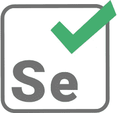
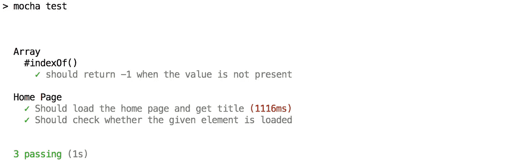

# 由 Selenium 支持的 React 应用程序。

> 原文：<https://medium.com/hackernoon/react-app-powered-with-selenium-2562dab0a7bb>

## 在本教程中，我们将使用 [create-react-app](https://github.com/facebook/create-react-app) 创建一个样本 React 应用程序，并使用 Selenium WebDriver 自动化它，涵盖各种测试用例。



Selenium Icon.

## 为什么是硒？

> Selenium WebDriver 提供了一个编程接口来创建和执行测试用例。它自动化了我们的开发，每个开发人员现在都必须为他们的工作编写单元测试用例，以便更好地管理他们的代码。

## 先决条件

1.  [Node.js & NPM](https://www.npmjs.com/package/download) (NPM 自带 Node.js，不需要单独安装)
2.  [Selenium WebDriver](https://www.npmjs.com/package/selenium-webdriver)
3.  [chrome driver](https://www.npmjs.com/package/chromedriver)&[Geckodriver](https://www.npmjs.com/package/geckodriver)
4.  [摩卡](https://www.npmjs.com/package/mocha)
5.  火狐和 Chrome 浏览器。

## 让我们编码

让我们直接进入开发阶段。

使用 create-react-app 创建一个名为“`react-selenium`”的项目。

```
$ npx create-react-app react-selenium
$ cd react-selenium
$ npm start
```

现在，您已经准备好了您的应用程序，正在端口 3000 上运行。您可以通过 [http://localhost:3000](http://localhost:3000/#/) 访问它

我们将在我们的应用程序中安装上述先决条件。

```
$ npm i selenium-webdriver chromedriver geckodriver --save
$ npm i mocha --save-dev
```

现在在你的根目录下，创建一个名为`test`的文件夹，并在其中创建一个名为`test.js`的文件。参考最后的[源代码](https://github.com/BalasubramaniM/react-selenium)作为参考。

在 test.js 中，添加以下代码。

```
/**
 * Dependency Modules
 */
var assert = require("assert").strict;
var webdriver = require("selenium-webdriver");
require("geckodriver");// Application Server
const serverUri = "[http://localhost:3000/#](http://localhost:3001/#)";
const appTitle = "React Selenium App";/**
 * Config for Chrome browser
 * [@type](http://twitter.com/type) {webdriver}
 */
var browser = new webdriver.Builder()
 .usingServer()
 .withCapabilities({ browserName: "chrome" })
 .build();/**
 * Config for Firefox browser (Comment Chrome config when you intent to test in Firefox)
 * [@type](http://twitter.com/type) {webdriver}
 */
/*
var browser = new webdriver.Builder()
 .usingServer()
 .withCapabilities({ browserName: "firefox" })
 .build();
 *//**
 * Function to get the title and resolve it it promise.
 * [@return](http://twitter.com/return) {[type]} [description]
 */
function logTitle() {
 return new Promise((resolve, reject) => {
  browser.getTitle().then(function(title) {
   resolve(title);
  });
 });
}/**
 * Sample test case
 * To check whether the given value is present in array.
 */
describe("Array", function() {
 describe("#indexOf()", function() {
  it("should return -1 when the value is not present", function() {
   assert.equal([1, 2, 3].indexOf(4), -1);
  });
 });
});describe("Home Page", function() {
 /**
  * Test case to load our application and check the title.
  */
 it("Should load the home page and get title", function() {
  return new Promise((resolve, reject) => {
   browser
    .get(serverUri)
    .then(logTitle)
    .then(title => {
     assert.strictEqual(title, appTitle);
     resolve();
    })
    .catch(err => reject(err));
  });
 });/**
  * Test case to check whether the given element is loaded.
  */
 it("Should check whether the given element is loaded", function() {
  return new Promise((resolve, reject) => {
   browser
    .findElement({ id: "sel-button" })
    .then(elem => resolve())
    .catch(err => reject(err));
  });
 });/**
  * End of test cases use.
  * Closing the browser and exit.
  */
 after(function() {
  // End of test use this.
  browser.quit();
 });
});
```

很久了吧？我会在里面一部分一部分的解释。

```
/**
 * Dependency Modules
 */
var assert = require("assert").strict;
var webdriver = require("selenium-webdriver");
require("geckodriver");
```

在顶部添加这几行，它们是自动化开发所需的依赖项。`assert`是默认的 Node.js 库，所以不需要安装它。`Selenium-WebDriver`是 selenium 运行的基本驱动程序，而`geckodriver`是在 chrome 之外的其他浏览器中运行我们的测试用例的基本驱动程序。

```
// Application Server
const serverUri = "[http://localhost:3000/#](http://localhost:3001/#)";
const appTitle = "React Selenium App";
```

我们将处理两个测试案例。

首先，我们将通过提供所需的 URI 来使用 Selenium 加载我们的应用程序，在应用程序加载后获取我们的应用程序标题，并使用给定的 app title 值检查它。

其次，我们将在应用程序中找到一个元素来检查给定的元素是否被加载，我们将在本文稍后添加它。

访问`public`文件夹中的`index.html`文件，将`title`值改为`React Selenium App`。

```
/**
 * Config for Chrome browser
 * [@type](http://twitter.com/type) {webdriver}
 */
var browser = new webdriver.Builder()
 .usingServer()
 .withCapabilities({ browserName: "chrome" })
 .build();/**
 * Config for Firefox browser (Comment Chrome config when you intent to test in Firefox)
 * [@type](http://twitter.com/type) {webdriver}
 */
/*
var browser = new webdriver.Builder()
 .usingServer()
 .withCapabilities({ browserName: "firefox" })
 .build();
 */
```

是时候通过提供适当的输入来配置 selenium 了，比如测试用例应该在哪个浏览器中加载，需要什么样的配置等等。

这里第一个浏览器配置值包含了 Chrome 浏览器的配置，我对 Firefox 浏览器的配置做了注释。当你准备在 Firefox 中测试时，你可以反过来做。

```
/**
 * Function to get the title and resolve it it promise.
 * [@return](http://twitter.com/return) {[type]} [description]
 */
function logTitle() {
 return new Promise((resolve, reject) => {
  browser.getTitle().then(function(title) {
   resolve(title);
  });
 });
}
```

示例函数使用 Selenium-WebDriver 内置的方法`getTitle()`获取浏览器的标题，并使用 Promise 解析它。

```
/**
 * Sample test case
 * To check whether the given value is present in array.
 */
describe("Array", function() {
 describe("#indexOf()", function() {
  it("should return -1 when the value is not present", function() {
   assert.equal([1, 2, 3].indexOf(4), -1);
  });
 });
});
```

只是一个示例测试用例，让您感觉更舒服。这里我们检查给定数组[1，2，3]中是否存在值 4。在这种情况下，它将返回-1，因为它不存在，这等于-1 (RHS)。所以测试用例通过了。LHS = RHS。

```
/**
  * Test case to load our application and check the title.
  */
 it("Should load the home page and get title", function() {
  return new Promise((resolve, reject) => {
   browser
    .get(serverUri)
    .then(logTitle)
    .then(title => {
     assert.strictEqual(title, appTitle);
     resolve();
    })
    .catch(err => reject(err));
  });
 });
```

在这个测试用例中，`it`中给出的字符串表示测试用例的名称。

我们之所以返回 promise 对象，是因为 Mocha 可以高效地处理 Promise 对象，并且可以更好地管理我们的测试用例。

之后，我们首先通过提供`serverUri`来打开我们的应用程序。之后，我们调用`logTitle`函数来获取应用程序的标题，并将标题值传递给下一个回调函数。

使用`assert.strictEqual`方法，我们正在比较 title(LHS)和 appTitle(RHS)。

最后，我们正在解决它。如果这些值不匹配，我们就拒绝它。

```
/**
  * Test case to check whether the given element is loaded.
  */
 it("Should check whether the given element is loaded", function() {
  return new Promise((resolve, reject) => {
   browser
    .findElement({ id: "sel-button" })
    .then(elem => resolve())
    .catch(err => reject(err));
  });
 });
```

对于第二个测试用例，让我们在 App.js 文件中添加一个按钮，并检查按钮是否被加载。

打开`App.js`文件，在`<p>`标签后添加以下代码。

```
<button id="sel-button">Click me!</button>
```

`browser.findElement`(内置 Selenium-WebDriver 方法)在我们的应用程序中使用给定的 id `sel-button`查找元素，当我们找到元素时，我们将解析它，当我们无法找到元素时，我们将拒绝它。

```
/**
  * End of test cases use.
  * Closing the browser and exit.
  */
 after(function() {
  // End of test use this.
  browser.quit();
 });
```

最后，在测试用例结束后，我们关闭浏览器和它的实例。

## 运行测试用例

现在，我们将运行这些测试用例。在 package.json 文件的脚本对象中添加以下行(命令)。

```
"s-test": "mocha test"
```

该跑了。从根目录中，运行以下命令，如下所示。

```
$ npm run s-test
```

现在你可以看到你的测试用例在你的浏览器中自动运行，并且在测试用例结束后关闭。



Mocha Test Cases Result.

您已经自动化了您的开发。

谢谢你。

最终的源代码可以在[这里](https://github.com/BalasubramaniM/react-selenium)找到。

参考

有关 Selenium WebDriver 的更多 API 方法，请访问，

[](https://www.softwaretestinghelp.com/selenium-webdriver-commands-selenium-tutorial-17/) [## 每个自动化测试人员必须知道的 25 个顶级 Selenium WebDriver 命令

### 在本硒教程系列中，我们将继续讨论各种常用的硒…

www.softwaretestinghelp.com](https://www.softwaretestinghelp.com/selenium-webdriver-commands-selenium-tutorial-17/)  [## selenium-web driver/lib/web driver。IWebDriver

### 编辑描述

seleniumhq.github.io](http://seleniumhq.github.io/selenium/docs/api/javascript/module/selenium-webdriver/lib/webdriver_exports_IWebDriver.html#findElement) [](/full-stack-web-development-from-scratch-to/use-es6-javascript-syntax-require-import-etc-in-your-front-end-project-5eefcef745c2) [## 使用 ES6 JavaScript 语法(require、import 等。)在您的前端项目中。

### 在本教程中，我们将在我们的应用程序中使用高级 JavaScript 语法来维护符合最新标准的代码…

medium.com](/full-stack-web-development-from-scratch-to/use-es6-javascript-syntax-require-import-etc-in-your-front-end-project-5eefcef745c2)