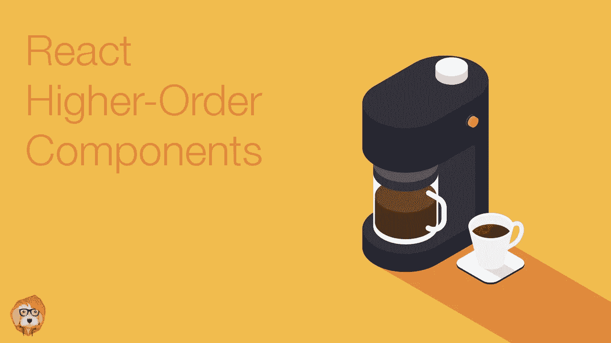

# 反应高阶成分

> 原文：<https://medium.com/hackernoon/react-higher-order-components-5a8e918106f4>



*本帖是我们* [*React 基础*](https://tylermcginnis.com/courses/react-fundamentals/) *课程的一部分。如果你喜欢这篇文章，就去看看吧。*

> 在我们开始之前，有两件重要的事情需要注意。首先，我们要讨论的只是一种模式。与其说它是 React，不如说它是组件架构。其次，这不是构建 React 应用程序所必需的知识。你可以跳过这篇文章，永远不知道我们将要谈论的内容，但仍然可以构建良好的 React 应用程序。然而，就像建造任何东西一样，你拥有的工具越多，结果就越好。如果你编写 React 应用程序，你的“工具箱”里没有这个东西会给你自己造成伤害。

在你听到`Don't Repeat Yourself`或`D.R.Y`(近乎狂热)的咒语之前，你无法深入研究软件开发。有时这可能有点过分，但在大多数情况下，这是一个有价值的目标。在这篇文章中，我们将看看在 React 代码库中实现 DRY 的最流行的模式，高阶组件。然而，在我们探索解决方案之前，我们必须首先充分了解问题。

假设我们负责重新创建一个类似 Stripe 的仪表板。正如大多数项目一样，直到最后，一切都很顺利。就在您认为即将完成时，您注意到仪表板上有一堆不同的工具提示，当鼠标悬停在某些元素上时，它们需要出现。


有几种方法可以解决这个问题。您决定采用的方法是检测各个组件的悬停状态，并根据该状态显示或不显示工具提示。您需要添加三个组件来实现悬停检测功能— `Info`、`TrendChart`和`DailyChart`。

先说`Info`。现在它只是一个简单的 SVG 图标。

```
class Info extends React.Component {
  render() {
    return (
      <svg
        className="Icon-svg Icon--hoverable-svg"
        height={this.props.height}
        viewBox="0 0 16 16" width="16">
          <path d="M9 8a1 1 0 0 0-1-1H5.5a1 1 0 1 0 0 2H7v4a1 1 0 0 0 2 0zM4 0h8a4 4 0 0 1 4 4v8a4 4 0 0 1-4 4H4a4 4 0 0 1-4-4V4a4 4 0 0 1 4-4zm4 5.5a1.5 1.5 0 1 0 0-3 1.5 1.5 0 0 0 0 3z" />
      </svg>
    )
  }
}
```

现在我们需要给它添加功能，这样它就可以检测到它是否被悬停。我们可以使用 React 附带的`onMouseOver`和`onMouseOut`鼠标事件。当组件悬停时，我们传递给`onMouseOver`的函数将被调用，当组件不再悬停时，我们传递给`onMouseOut`的函数将被调用。为了以 React 的方式做到这一点，我们将向组件添加一个`hovering`状态属性，这样当`hovering`状态改变时，我们可以重新呈现，显示或隐藏我们的工具提示。

```
class Info extends React.Component {
  state = { hovering: false }
  mouseOver = () => this.setState({ hovering: true })
  mouseOut = () => this.setState({ hovering: false })
  render() {
    return (
      <>
        {this.state.hovering === true
          ? <Tooltip id={this.props.id} />
          : null}
        <svg
          onMouseOver={this.mouseOver}
          onMouseOut={this.mouseOut}
          className="Icon-svg Icon--hoverable-svg"
          height={this.props.height}
          viewBox="0 0 16 16" width="16">
            <path d="M9 8a1 1 0 0 0-1-1H5.5a1 1 0 1 0 0 2H7v4a1 1 0 0 0 2 0zM4 0h8a4 4 0 0 1 4 4v8a4 4 0 0 1-4 4H4a4 4 0 0 1-4-4V4a4 4 0 0 1 4-4zm4 5.5a1.5 1.5 0 1 0 0-3 1.5 1.5 0 0 0 0 3z" />
        </svg>
      </>
    )
  }
}
```

看起来不错。现在我们需要向另外两个组件`TrendChart`和`DailyChart`添加相同的功能。如果没有坏，就不要修。我们对`Info`的悬停逻辑工作得很好，所以让我们再次使用相同的代码。

```
class TrendChart extends React.Component {
  state = { hovering: false }
  mouseOver = () => this.setState({ hovering: true })
  mouseOut = () => this.setState({ hovering: false })
  render() {
    return (
      <>
        {this.state.hovering === true
          ? <Tooltip id={this.props.id}/>
          : null}
        <Chart
          type='trend'
          onMouseOver={this.mouseOver}
          onMouseOut={this.mouseOut}
        />
      </>
    )
  }
}
```

你大概知道下一步。我们可以对最后的`DailyChart`组件做同样的事情。

```
class DailyChart extends React.Component {
  state = { hovering: false }
  mouseOver = () => this.setState({ hovering: true })
  mouseOut = () => this.setState({ hovering: false })
  render() {
    return (
      <>
        {this.state.hovering === true
          ? <Tooltip id={this.props.id}/>
          : null}
        <Chart
          type='daily'
          onMouseOver={this.mouseOver}
          onMouseOut={this.mouseOut}
        />
      </>
    )
  }
}
```

就这样，我们都完了。你可能以前写过这样的 React。不是世界末日(#shipit)，但也不是很“干”。如你所见，我们在每个组件中重复完全相同的悬停逻辑。

此时，**问题**应该很清楚了，**我们希望避免在新组件需要时复制我们的悬停逻辑**。那么有什么**解决方案**？在我们开始之前，让我们来谈谈一些编程概念，这些概念将使理解解决方案变得更加容易，`callbacks`和`higher-order functions`。

在 JavaScript 中，函数是“第一类对象”。这意味着，就像对象/数组/字符串可以赋给变量，作为参数传递给函数，或者从函数返回一样，其他函数也可以。

```
function add (x, y) {
  return x + y
}function addFive (x, addReference) {
  return addReference(x, 5)
}addFive(10, add) // 15
```

如果你不习惯，你的大脑可能会有点奇怪。我们将`add`函数作为参数传递给`addFive`函数，将其重命名为`addReference`，然后我们调用它。

当你这样做的时候，你作为参数传递的函数叫做**回调**函数，你传递回调函数的函数叫做**高阶函数**。

因为词汇很重要，所以这里是相同的代码，变量被重新命名以匹配它们所演示的概念。

```
function add (x,y) {
  return x + y
}function higherOrderFunction (x, callback) {
  return callback(x, 5)
}higherOrderFunction(10, add)
```

这种模式应该看起来很熟悉，到处都是。如果您曾经使用过任何 JavaScript 数组方法、jQuery 或类似 lodash 的库，那么您已经使用过高阶函数和回调。

```
[1,2,3].map((i) => i + 5)_.filter([1,2,3,4], (n) => n % 2 === 0 );$('#btn').on('click', () =>
  console.log('Callbacks are everywhere')
)
```

让我们回到我们的例子。如果不仅仅是创建一个`addFive`函数，我们还想要一个`addTen`函数、`addTwenty`函数等等，那会怎么样？使用我们当前的实现，每当我们需要一个新功能时，我们都必须复制大量的逻辑。

```
function add (x, y) {
  return x + y
}function addFive (x, addReference) {
  return addReference(x, 5)
}function addTen (x, addReference) {
  return addReference(x, 10)
}function addTwenty (x, addReference) {
  return addReference(x, 20)
}addFive(10, add) // 15
addTen(10, add) // 20
addTwenty(10, add) // 30
```

再说一次，这并不可怕，但是我们在重复很多相同的逻辑。这里的目标是能够根据我们的需要创建尽可能多的“加法器”函数(`addFive`、`addTen`、`addTwenty`等)，同时尽量减少代码重复。为了实现这一点，如果我们创建一个`makeAdder`函数会怎么样？这个函数可以接受一个数字和对最初的`add`函数的引用。因为这个函数的目标是创建一个新的加法器函数，所以我们可以让它返回一个全新的函数，接受要相加的数字。说了很多话。让我们看一些代码。

```
function add (x, y) {
  return x + y
}function makeAdder (x, addReference) {
  return function (y) {
    return addReference(x, y)
  }
}const addFive = makeAdder(5, add)
const addTen = makeAdder(10, add)
const addTwenty = makeAdder(20, add)addFive(10) // 15
addTen(10) // 20
addTwenty(10) // 30
```

酷毙了。现在，我们可以根据需要创建尽可能多的“加法器”功能，同时尽量减少我们必须编写的重复代码。

> 如果你在意的话，这种让一个多参数函数返回一个参数更少的新函数的概念被称为“部分应用”，这是一种函数式编程技术。JavaScript 的”。bind”方法就是一个常见的例子。

好吧，但是这和 React 有什么关系，以及我们之前看到的在新组件需要时复制悬停逻辑的问题？正如创建我们的`makeAdder`高阶函数允许我们最小化代码重复一样，制作一个类似的“高阶组件”也能以同样的方式帮助我们。然而，不是高阶函数返回调用回调的新函数，而是高阶组件可以返回呈现“回调”组件的新组件🤯。太多了。我们来分解一下。

(我们的)高阶函数

*   是一个函数
*   接受回调函数作为参数
*   返回一个新函数
*   它返回的函数可以调用传入的原始回调函数

```
function higherOrderFunction (callback) {
  return function () {
    return callback()
  }
}
```

(我们的)高阶分量

*   是一个组件
*   接受一个组件作为参数
*   返回一个新组件
*   它返回的组件可以呈现传入的原始组件

```
function higherOrderComponent (Component) {
  return class extends React.Component {
    render() {
      return <Component />
    }
  }
}
```

现在，我们已经对高阶器件的功能有了基本的了解，让我们开始构建自己的器件。如果你还记得，之前的问题是我们在所有需要该功能的组件之间复制了我们所有的悬停逻辑。

```
state = { hovering: false }
mouseOver = () => this.setState({ hovering: true })
mouseOut = () => this.setState({ hovering: false })
```

考虑到这一点，我们希望我们的高阶组件(我们称之为`withHover`)能够将悬停逻辑封装在其自身中，然后将`hovering`状态传递给它所呈现的组件。这将允许我们避免复制所有的悬停逻辑，而是将它放入一个单独的位置(`withHover`)。

最终，这是最终目标。每当我们想要一个知道它的`hovering`状态的组件时，我们可以将原始组件传递给我们的`withHover`高阶组件。

```
const InfoWithHover = withHover(Info)
const TrendChartWithHover = withHover(TrendChart)
const DailyChartWithHover = withHover(DailyChart)
```

然后，每当`withHover`返回的任何组件被渲染时，他们将渲染原始组件，传递给它一个`hovering`道具。

```
function Info ({ hovering, height }) {
  return (
    <>
      {hovering === true
        ? <Tooltip id={this.props.id} />
        : null}
      <svg
        className="Icon-svg Icon--hoverable-svg"
        height={height}
        viewBox="0 0 16 16" width="16">
          <path d="M9 8a1 1 0 0 0-1-1H5.5a1 1 0 1 0 0 2H7v4a1 1 0 0 0 2 0zM4 0h8a4 4 0 0 1 4 4v8a4 4 0 0 1-4 4H4a4 4 0 0 1-4-4V4a4 4 0 0 1 4-4zm4 5.5a1.5 1.5 0 1 0 0-3 1.5 1.5 0 0 0 0 3z" />
      </svg>
    </>
  )
}
```

现在我们需要做的最后一件事就是实际实施`withHover`。正如我们在上面看到的，它需要做三件事

*   接受一个“组件”参数。
*   返回新组件
*   呈现“组件”参数，传递给它一个“悬停”道具。

接受一个“组件”参数。

```
function withHover (Component) { }
```

返回新组件

```
```js
function withHover (Component) {
  return class WithHover extends React.Component { }
}
```

## 呈现“组件”参数，传递给它一个“悬停”道具。

现在问题变成了，我们如何得到`hovering`状态？我们已经有了之前构建的代码。我们只需要将它添加到新组件中，然后在呈现参数`Component`时将`hovering`状态作为道具传递。

```
function withHover(Component) {
  return class WithHover extends React.Component {
    state = { hovering: false }
    mouseOver = () => this.setState({ hovering: true })
    mouseOut = () => this.setState({ hovering: false })
    render() {
      return (
        <div 
          onMouseOver={this.mouseOver} onMouseOut={this.mouseOut}>
            <Component hovering={this.state.hovering} />
        </div>
      );
    }
  }
}
```

我喜欢这样想(以及在 React 文档中是如何提到的)是**一个组件将 props 转换成 UI，一个高阶组件将一个组件转换成另一个组件。**在我们的例子中，我们将我们的`Info`、`TrendChart`和`DailyChart`组件转换成新的组件，这些组件通过`hovering` prop 知道它们的悬停状态。

至此，我们已经讨论了高阶元件的所有基础知识。不过，还有几个更重要的项目需要讨论。

如果你回头看看我们的`withHover` HOC，它的一个弱点是它假设消费者可以接受一个名为`hovering`的道具。在大多数情况下，这可能是好的，但在某些用例中却不是这样。例如，如果组件已经有了一个名为`hovering`的道具该怎么办？我们会有一个命名冲突。我们可以做的一个改变是允许我们的`withHover` HOC 的消费者指定当悬停状态作为道具传递给他们的组件时，他们希望悬停状态的名称是什么。因为`withHover`只是一个函数，让我们把它改为接受第二个参数，它指定了我们将传递给组件的道具的名称。

```
function withHover(Component, propName = 'hovering') {
  return class WithHover extends React.Component {
    state = { hovering: false }
    mouseOver = () => this.setState({ hovering: true })
    mouseOut = () => this.setState({ hovering: false })
    render() {
      const props = {
        [propName]: this.state.hovering
      } return (
        <div 
          onMouseOver={this.mouseOver} onMouseOut={this.mouseOut}>
            <Component {...props} />
        </div>
      );
    }
  }
}
```

现在我们已经设置了默认的道具名为`hovering`(通过 ES6 的默认参数)，但是如果`withHover`的消费者想要改变它，他们可以通过传入新的道具名作为第二个参数。

```
function withHover(Component, propName = 'hovering') {
  return class WithHover extends React.Component {
    state = { hovering: false }
    mouseOver = () => this.setState({ hovering: true })
    mouseOut = () => this.setState({ hovering: false })
    render() {
      const props = {
        [propName]: this.state.hovering
      } return (
        <div 
          onMouseOver={this.mouseOver} onMouseOut={this.mouseOut}>
            <Component {...props} />
        </div>
      );
    }
  }
}function Info ({ showTooltip, height }) {
  return (
    <>
      {showTooltip === true
        ? <Tooltip id={this.props.id} />
        : null}
      <svg
        className="Icon-svg Icon--hoverable-svg"
        height={height}
        viewBox="0 0 16 16" width="16">
          <path d="M9 8a1 1 0 0 0-1-1H5.5a1 1 0 1 0 0 2H7v4a1 1 0 0 0 2 0zM4 0h8a4 4 0 0 1 4 4v8a4 4 0 0 1-4 4H4a4 4 0 0 1-4-4V4a4 4 0 0 1 4-4zm4 5.5a1.5 1.5 0 1 0 0-3 1.5 1.5 0 0 0 0 3z" />
      </svg>
    </>
  )
}const InfoWithHover = withHover(Info, 'showTooltip')
```

您可能已经注意到了我们的`withHover`实现的另一个问题。查看我们的`Info`组件，您会注意到它还应该接受一个`height`属性。按照目前我们设置的方式，`height`将是未定义的。原因是因为我们的`withHover`组件是呈现`Component`的组件。目前我们是如何设置的，除了我们创建的`hovering`道具之外，我们没有传递任何道具给`<Component />`。

```
const InfoWithHover = withHover(Info)...return <InfoWithHover height="16px" />
```

`height`属性被传递给`InfoWithHover`组件。但是那个组件到底是什么呢？这是我们从`withHover`返回的组件。

```
function withHover(Component, propName = 'hovering') {
  return class WithHover extends React.Component {
    state = { hovering: false }
    mouseOver = () => this.setState({ hovering: true })
    mouseOut = () => this.setState({ hovering: false })
    render() {
      console.log(this.props) // { height: "16px" } const props = {
        [propName]: this.state.hovering
      } return (
        <div 
           onMouseOver={this.mouseOver} onMouseOut={this.mouseOut}>
              <Component {...props} />
        </div>
      );
    }
  }
}
```

在`WithHover`组件`this.props.height`的内部是`16px`，但是从那里我们不做任何事情。我们需要确保将它传递给我们正在呈现的`Component`参数。

```
render() {
      const props = {
        [propName]: this.state.hovering,
        ...this.props,
      } return (
        <div 
          onMouseOver={this.mouseOver} onMouseOut={this.mouseOut}>
            <Component {...props} />
        </div>
      );
    }
```

至此，我们已经看到了使用高阶组件在各种组件之间重用组件逻辑而不重复代码的好处。但是，它有什么缺陷吗？是的，我们已经看到了。

使用 HOC 时，会发生[控制反转](https://en.wikipedia.org/wiki/Inversion_of_control)。想象一下，我们正在使用像 React 路由器的`withRouter` HOC 那样的第三方 HOC。根据他们的文档，“无论何时渲染，`withRouter`都会将`match`、`location`和`history`道具传递给被包装的组件。”

```
class Game extends React.Component {
  render() {
    const { 
      match, 
      location, 
      history 
    } = this.props // From React Router ...
  }
}export default withRouter(Game)
```

注意我们不是创建`Game`元素的人(即`<Game />`)。我们把我们的组件完全交给了 React Router，我们相信他们不仅会渲染它，还会传递给它正确的道具。我们之前在讨论与`hovering`的命名冲突时看到了这个问题。为了解决这个问题，我们决定让我们的`withHover` HOC 的消费者传入第二个参数来配置正确的名称。有了第三方`withRouter`特设，我们没有那个选项。如果我们的`Game`组件已经在使用`match`、`location`或`history`，我们就不走运了。我们要么必须在组件中修改这些名称，要么必须停止使用`withRouter` HOC。

**这篇文章最初发表于 tylermcginnis.com**[](https://tylermcginnis.com/react-higher-order-components/)****，是他们** [**反应基础**](https://tylermcginnis.com/courses/react-fundamentals/) **课程的一部分。****

**[**泰勒**](https://twitter.com/tylermcginnis)**