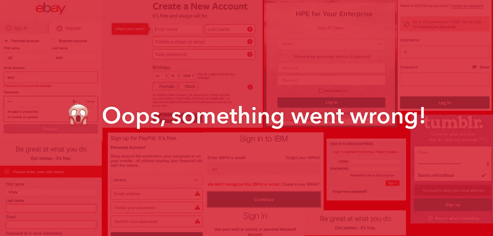

# React JS 和 React Native 在生产中优雅地处理异常

> 原文：<https://medium.com/hackernoon/react-js-and-react-native-handle-exceptions-gracefully-a12a2c3fc1cb>

在 ReactJs/ React Native 中处理异常是初学者经常忘记处理的事情。我也一样。在生产中，这会带来混乱。

在 React prod 中，页面会变成空白，导致不良 UX。

在 React Native 中，你的应用会意外崩溃。

React 对这个问题有一个很好的解决方案。这个方法将捕捉任何错误😤在它自己的组件和子组件中。

诀窍是在一个单独的组件中使用这个方法。在 componentDidCatch()方法中捕获所有错误。这个方法有两个参数。

第一个是错误，第二个是错误信息。

从 errorInfo 对象中，您可以跟踪错误来自哪个组件。

**ReactjS ERROR Handle**

您可以将此技术用于 react 和 react native。你可以向访问者展示漂亮的错误页面。

通过 __Dev__，您可以检查开发模式是否打开。然后相应地显示错误。

你可以把这个错误发送到服务器端，如果那里有任何崩溃日志的话。

React Native error handler

最后，您需要用 errorComponent 包装您的主根组件。

谢谢…祝你有愉快的一天…