# 对初学者反应自然

> 原文：<https://medium.com/hackernoon/react-native-for-beginners-fb3095968acf>

## 学习 React Native:简介、导航、数据存储和本机模块


React Native Logo

这是面向初学者的系列文章**React Native**的一部分，而本文是第一部分。假设你已经知道反应。

> 学习任何东西的最好方法就是去做！

作为一名技术爱好者，我总是试图寻找学习新工具和技术的机会。所以当我弟弟想要一个原生的 IOS 应用时，这是一个学习著名的 React Native 的绝佳机会。

在创建应用程序时，我学习了不同的组件，如导航、存储数据、调用 API 等。每一个都很重要，我会一一解释。人们可以使用这些组件创建任何应用程序。

# 我们要报道什么？

创建一个原生应用二维码扫描仪，扫描二维码，将其存储在本地存储中，并在最后将其美化。这将是一个很长的教程，所以给自己拿一杯咖啡，坐好。大概需要 1:30-2 个小时，但是…

> 输出将是你可以向你的同事展示并引以为豪的东西。

# 源代码

应用程序代码可在 [GitHub](https://github.com/drex44/QR-Scanner) 上获得。你可以根据应用程序的版本通过检查特定的分支来获得应用程序代码。例如，要获得 v0.3.0 应用程序代码，

```
git clone [https://github.com/drex44/QR-Scanner.git](https://github.com/drex44/QR-Scanner.git)
git checkout v0.3.0
```

该代码有三个分支，

*   主代码:QR 扫描仪 1.0.0 版代码
*   版本 0.3.0:QR 扫描仪版本 0 . 3 . 0 的代码
*   版本 0.4.0:QR 扫描仪版本 0 . 4 . 0 的代码

# 辅导的

我们将在增量模型中设计我们的应用程序。我们将在每次迭代中添加新的功能。我鼓励你复制代码，然后看看它，了解每一行的意义。如果你有任何疑问，请在下面评论。这需要时间，但我肯定会回答你所有的问题。

愿原力与你同在，让黑客行动开始吧！

## v0.1.0

目标:Hello World 应用程序，使用 UI 库，测试你的应用程序

我们可以使用两个著名的工具链来创建 react 本地应用程序。一个是世博会，另一个是[本土](https://facebook.github.io/react-native/docs/getting-started#creating-a-new-application-1)。

正如官方文件所说，

> Expo 是一个免费的开源工具链，围绕 React Native 构建，帮助您使用 JavaScript 和 React 构建原生 iOS 和 Android 项目。
> 
> Expo 提供了一个*共享的本地运行时*，所以你不用写本地代码，你可以专注于用 JavaScript 写你的 React 应用。

如果你想使用任何本机模块，如相机，定位服务等，那么你必须使用 npm 模块，其中将包含一些平台特定的本机代码，然后你必须链接它。你甚至可以通过编写原生代码来创建自己的原生模块，但这不会是纯粹的 javascript。

使用 expo toolchain 的主要好处是它们维护了本机模块，这样我们就可以专注于构建我们的应用程序。升级和维护应用程序也非常容易。但与此同时，与 react-native-cli 相比，您对应用程序的控制力更弱。

因此，当我们想要快速创建应用程序时，请使用 expo。一旦应用程序变大，就可以执行弹出(类似于 CRA 弹出)，它将被转换为 react-native 工具链。

现在让我们开始编码并创建我们的第一个应用程序。运行以下命令安装 expo-cli，然后使用它创建一个新项目。它会要求您选择一个模板，选择“空白”。

```
npm install -g expo-cli
expo init qr-scanner
```

打开您喜欢的 IDE 并编辑 App.js。这是您在应用程序中的主要入口点。我们不能在 React 本地应用中使用 HTML 元素。我们必须使用 React 本地组件。将以下代码粘贴到 App.js 中，

App.js

App.js

我们刚刚将文本组件中的文本更改为“Hello World！”。“视图”组件是 react 本机应用程序中的构造块。它的使用方式与 div 元素在 web 应用程序中的使用方式相同。现在是运行应用程序的时候了。Expo 有 [IOS/Android 客户端应用](https://expo.io/tools#client)。您将需要 expo 客户端来运行应用程序，或者如果您喜欢使用模拟器，那么您必须设置 android studio for android 和 xcode for IOS。使用世博客户端很快，我们可以在几分钟内开始，所以我们将使用世博客户端。将其下载到您的设备上，然后在项目根目录下运行下面的命令，

```
npm start
```

现在在移动设备上打开您的 expo 客户端，扫描二维码。确保您的计算机和移动设备在同一个网络上。如果没有，您可以在您的电脑和移动设备上创建并登录您的 expo 帐户，通过互联网测试应用程序。恭喜，您已经成功创建并运行了一个本机应用程序。

## 结果

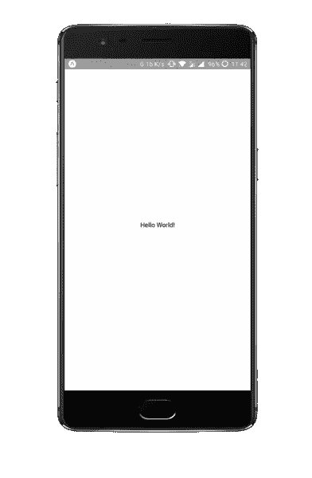

v0.1.0

你可以从[文档](https://facebook.github.io/react-native/docs/components-and-apis)中查看官方的 react 本地组件，也可以创建我们自己的 UI 组件。随着创建更好的组件的需求的增长，各种各样的开源包都提出了解决方案。一些著名的选项有[原生基础](https://nativebase.io)、[反应原生元素](https://shoutem.github.io/docs/ui-toolkit/introduction)、 [Shoutem-UI](https://shoutem.github.io/docs/ui-toolkit/introduction) 。我们将使用本地基地。

安装 Native Base， [react-native-easy-grid](https://github.com/GeekyAnts/react-native-easy-grid) (对于布局)和 vector-icons(对于图标)，

```
npm install native-base --save
npm install @expo/vector-icons --save
npm install react-native-easy-grid --save
npm installoryarn add native-base --save
yarn add @expo/vector-icons --save
yarn add react-native-easy-grid --save
yarn
```

现在用下面的代码修改 App.js，

App.js

App.js

## 结果

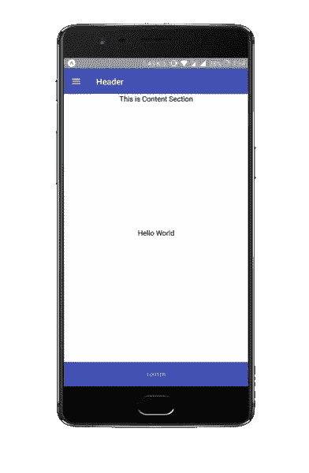

v0.1.1

欲了解更多信息，请查看[原生基础组件](https://docs.nativebase.io/Components.html#Components)。

用 componentWillMount()编写的代码是在组件呈现之前加载字体。这些字体由 Native Base 在内部使用，如果在呈现组件之前没有加载这些字体，将会引发运行时错误。

> 我们不会使用页脚和自定义页眉，所以我们将在下一步删除它们。我在这里使用了默认的例子来展示如何使用现有的 UI 库创建漂亮的应用程序。

## v0.2.0

目标:导航

正如我们可以使用 URL/routes 来构建 web 应用程序一样，我们必须在本地应用程序中使用不同的屏幕。我们基本上创建不同的屏幕，并根据一些用户输入和 App.js 中预定义的条件调用每个屏幕(记住，App.js 是我们应用程序中的单点入口)。我们可以创建自己的导航机制，并通过显示/隐藏 App.js 中的不同组件来处理不同的屏幕，但我们不想重新发明轮子。

我们将使用[反应导航](https://reactnavigation.org/)，这也是在[官方文件](https://facebook.github.io/react-native/docs/navigation)上建议的。所以还是装吧。

```
npm install --save react-navigation
```

在其中创建一个名为 components 的新文件夹和一个名为 Navigation.js 的新文件。在 Navigation.js 中复制下面的代码，

组件/Navigation.js

components/Navigation.js

代码非常简单。我们创建了三个名为 Scanner、History 和 Result 的屏幕。屏幕只不过是一个反应组件。这里，我们创建了三个组件，分别名为 ScannerScreen、HistoryScreen 和 ResultScreen。然后我们创建一个根栈，在这里我们定义屏幕的名称，并为它们分配 React 组件。也就是说，我们已经为 ScannerScreen 组件分配了扫描仪名称。然后，我们通过指定 initialRouteName 来指定要显示的初始屏幕。最后，我们通过将 RootStack 包装在 createAppContainer 中来导出它。

> 这是非常重要的一步，所以不要忘记在 createAppContainer 中包装你的根栈，否则你会得到一个错误。

当我们创建堆栈时，React navigation 会自动在屏幕的道具中设置“导航”对象。它用于在屏幕内执行各种导航。例如，在 ScannerScreen 中，我们使用它导航到其他屏幕，历史和结果。

最后，为了查看我们的路由器的运行情况，我们将把它导入 App.js 并使用它。这是更新后的样子，

App.js

App.js

恭喜你，现在你知道如何处理多个屏幕了。

## 结果

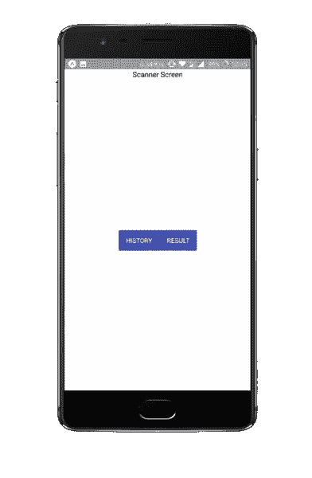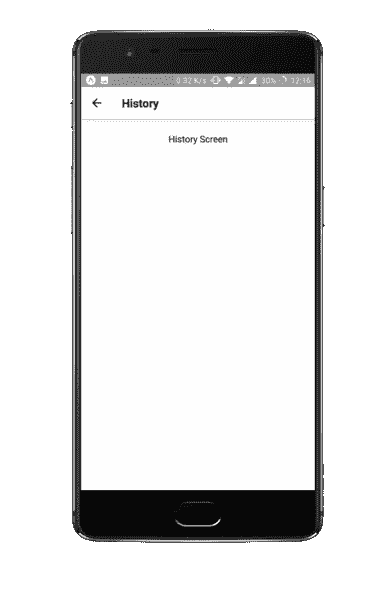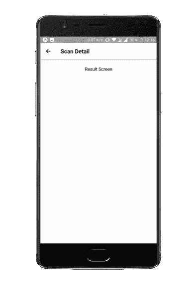

v0.2.0

如果你对导航栏很好奇，那么默认情况下，它是由 react navigation 添加的，它可以被全局控制，也可以在每个屏幕中被局部控制。这里，我们在每个组件中本地配置了标题栏。即在 ScannerScreen 中，我们已经完全移除了标题。在 HistoryScreen 和 ResultScreen 中，我们分配了标题。欲了解更多信息，请查看 react 导航官方文档上的[配置标题栏](https://reactnavigation.org/docs/en/headers.html)。

> 有趣的事实:考虑一个带有屏幕 A 和 b 的堆栈导航器。在导航到 A 之后，它的`*componentDidMount*`被调用。当推 B 时，它的`*componentDidMount*`也被调用，但是 A 仍然装载在堆栈上，因此它的`*componentWillUnmount*`没有被调用。当从 B 回到 A 时，B 的`*componentWillUnmount*`被调用，但是 A 的`*componentDidMount*`没有被调用，因为 A 一直保持挂载状态。为了克服这一点，我们必须使用 react navigation 提供的[生命周期事件](https://reactnavigation.org/docs/en/navigation-lifecycle.html#react-navigation-lifecycle-events)。

## v0.3.0

目标:如何在本地存储数据。

每个本机应用程序都需要存储用户状态、登录状态、应用程序配置等数据。我们可以使用 [SecureStore](https://docs.expo.io/versions/latest/sdk/securestore) 、 [AsyncStorage](https://docs.expo.io/versions/latest/react-native/asyncstorage) 、 [SQLite](https://docs.expo.io/versions/latest/sdk/sqlite) 和 [Realm](https://realm.io/docs/javascript/latest) 。这是最广泛和最容易使用的服务。

> 领域是非常著名的，使用广泛，但你必须执行博览会弹出来使用它，所以我们不会在这里讨论它。但是了解这些工具是很有用的，这样你将来可能会用到它们。

SecureStore 和 AsyncStorage 都是键值存储系统。它们之间唯一的区别是存储数据的方式。SecureStore 对数据进行加密，而 AsyncStorage 则以纯文本形式存储数据。

> 我们不会使用 SecureStore 或 AsyncStorage。我们将只在我们的应用程序中使用 SQLite，但我在这里提到它们是因为它们非常有用且易于使用。

## 安全商店

iOS:使用[钥匙串服务](https://developer.apple.com/documentation/security/keychain_services)作为`kSecClassGenericPassword`存储值。iOS 有一个额外的选项，可以设置值的`kSecAttrAccessible`属性，该属性控制何时可以获取值。

Android:值存储在`[SharedPreferences](https://developer.android.com/training/basics/data-storage/shared-preferences.html)`中，用 [Android 的密钥库系统](https://developer.android.com/training/articles/keystore.html)加密。

我们可以使用以下方法来处理数据。

*   `SecureStore.getItemAsync(key)`
*   `SecureStore.setItemAsync(key,value)`
*   `SecureStore.deleteItemAsync(key)`
*   有关更多信息，请查看[官方安全存储文档](https://docs.expo.io/versions/latest/sdk/securestore)。

## 异步存储

它有与 SecureStore 相似的 API。我们主要使用以下方法:

*   `AsyncStorage.getItem(key)`
*   `AsyncStorage.setItem(key, value)`
*   `AsyncStorage.removeItem(key)`

更多方法请查看[官方世博文件](https://docs.expo.io/versions/latest/react-native/asyncstorage.md#methods)。

## SQLite

当我们想要保存大量的结构化数据时，我们可以使用 SQLite。SQLite 是本地轻量级 SQL 数据库。

> 如上所述，SQLite 的替代方案:Realm 数据库是 SQLite 和核心数据的快速、易于使用的开源替代方案。

我们将从 SQLite 创建一个新的数据库对象，并在其上执行一些事务。

创建一个新文件“components/SQL.js”并将下面的代码粘贴到其中，

component/SQL.js

随着屏幕组件的增长，将它保留在 Navigation.js 中会很困难，所以让我们将导航和屏幕组件分开。创建一个名为 Screens 的新文件夹。创建三个文件 ScannerScreen.js、HistoryScreen.js 和 ResultScreen.js，这样 Navigation.js 现在看起来就像这样，

组件/Navigation.js

components/Navigation.js

每个屏幕使用以下代码。

Screens/ScannerScreen.js

Screens/ScannerScreen.js

Screens/HistoryScreen.js

Screens/HistoryScreen.js

Screens/ResultScreen.js

Screens/ResultScreen.js

最后，我们必须将 InitDatabase 方法调用到 App.js 中，

App.js

App.js

您可以使用输入字段在数据库中添加新行。键入一些内容，然后单击添加到数据库。要查看存储的结果，请查看历史屏幕。

## 结果

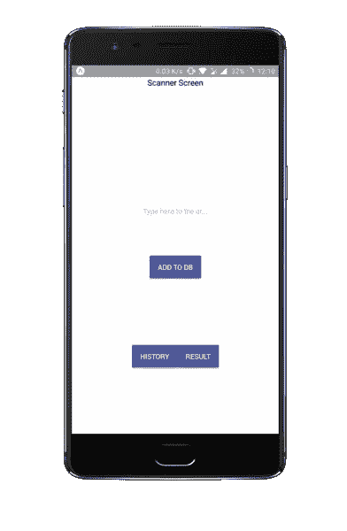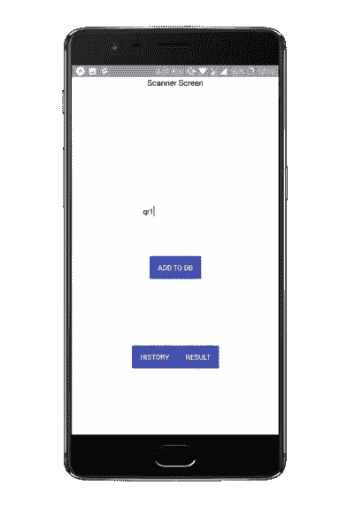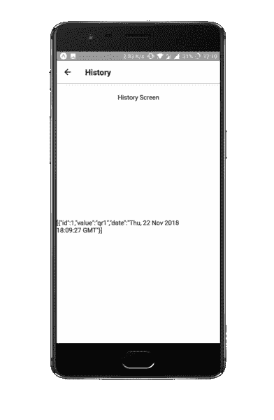

v0.3.0

## v0.4.0

目标:使用 expo 的相机/条形码扫描仪模块

当我们构建本机应用程序时，我们很可能会使用本机功能。在使用本机特性之前，我们需要请求使用它们的权限。我们可以通过使用 expo 中的权限组件来做到这一点。我们会请求允许拍照。我们将使用的另一个模块是 [BarCodeScanner](https://docs.expo.io/versions/latest/sdk/bar-code-scanner) 来扫描条形码。它只是[摄像头](https://docs.expo.io/versions/latest/sdk/camera)模块的一个包装(你也可以直接用[摄像头](https://docs.expo.io/versions/latest/sdk/camera)模块扫描条形码)。

打开 ScannerScreen.js 并粘贴以下代码。查看代码，注意我们正在检查 componentDidMount()方法中的权限。一旦获得许可，我们就全屏显示条形码扫描器。我们覆盖一个历史按钮来检查以前扫描的 QRs。

> 即使扫描二维码，它也不会停止相机，仍然会尝试扫描二维码。因此，当另一个屏幕将被聚焦时，相机仍将是活动的，它将继续扫描 QRs。为了克服这个问题，我们用来自 react-navigation 的 NavigationFocus 将组件包装在[中。它为我们提供了一种方法，即在 props 中检查扫描仪屏幕是否显示(聚焦)在实际设备上。我们使用这个属性有条件地呈现 BarCodeScanner 组件。](https://reactnavigation.org/docs/en/with-navigation-focus.html)

Screens/ScannerScreen.js

Screens/ScannerScreen.js

Screens/ResultScreen.js

在 ResultScreen 组件中，我们只是从导航参数中获取 qr，并将其显示在文本组件中。

Screens/ResultScreen.js

## **结果**

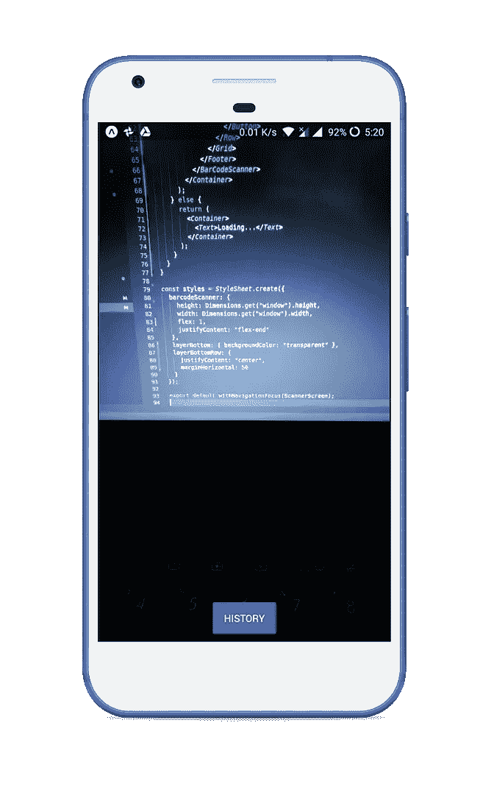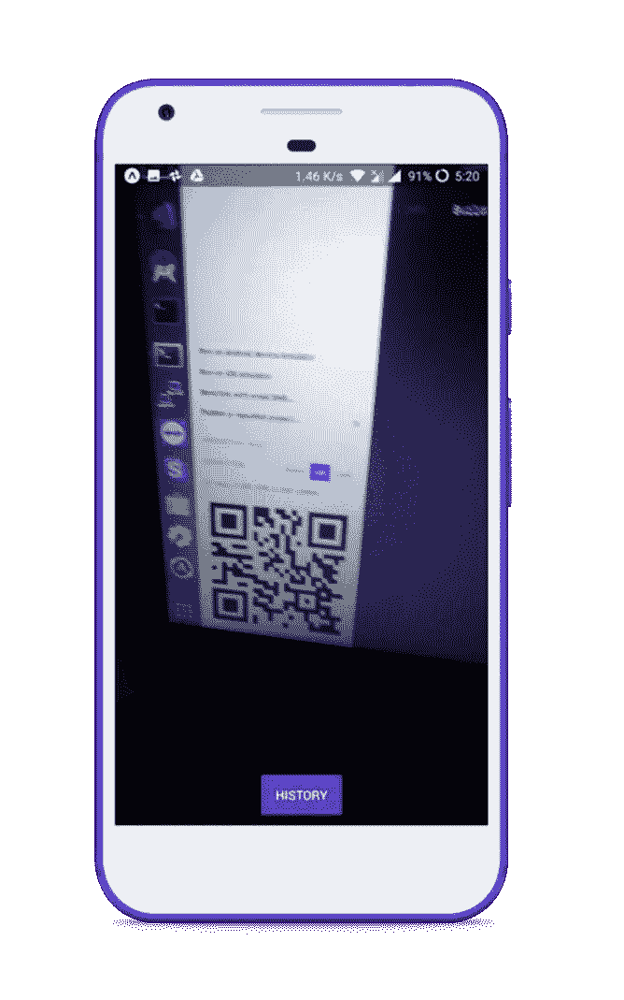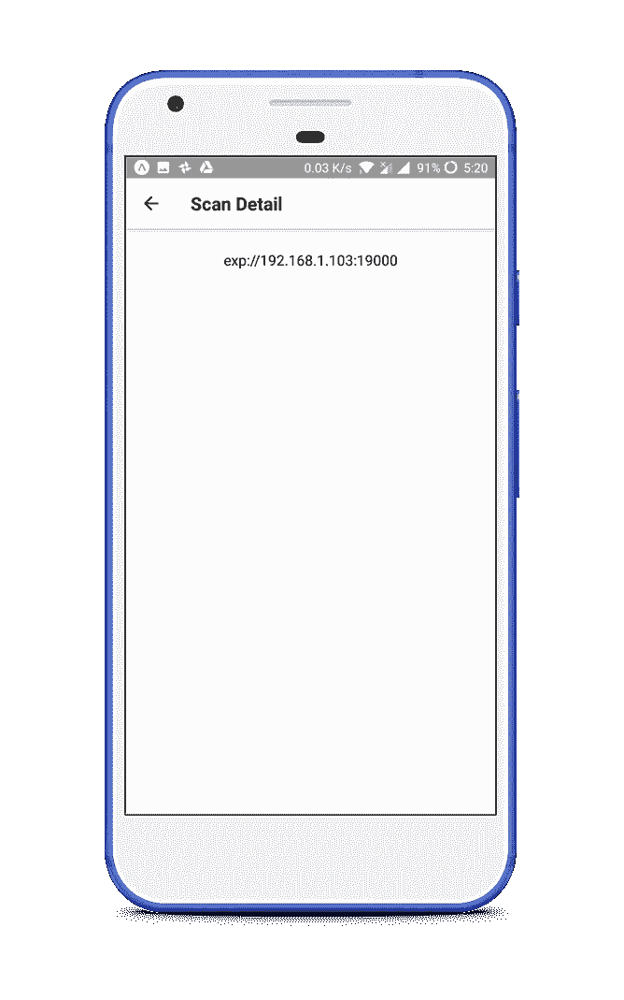

v0.4.0

现在，应用程序已经完成并且正在运行，但是 UI 不是很直观。所以我们来纠正一下，改进一下 UI。

## 1.0.0 版

目标:更好的用户界面

这段代码几乎是不言自明的。我只是使用样式属性和其他组件来使 UI 更好。我没有改变任何样板代码。所以我没有为代码写任何解释。但是，如果你有任何疑问，请在下面的评论中提出来，我会回答你的。

在组件内创建一个名为“commons.js”的新文件，并粘贴以下代码，

components/commons.js

components/commons.js

也更改以下屏幕中的代码。

HistoryScreen.js

Screens/HistoryScreen.js

结果屏幕. js

Screens/ResultScreen.js

Screens/ScannerScreen.js

Screens/ScannerScreen.js

## 结果

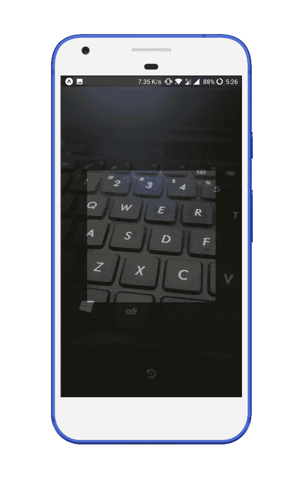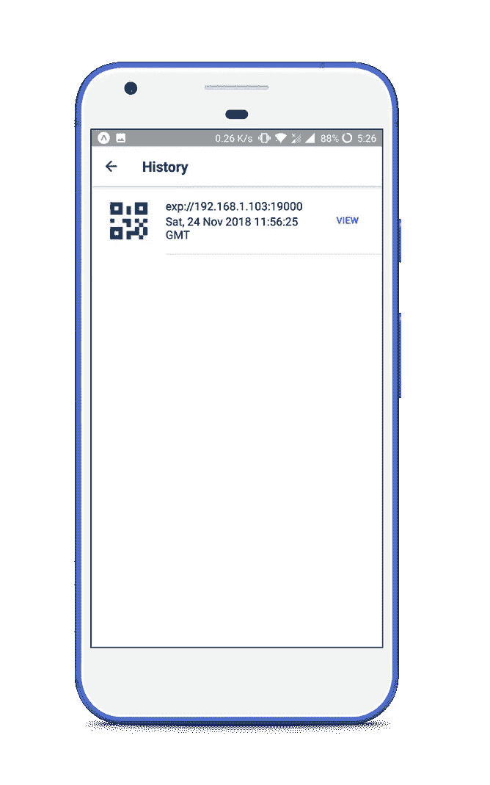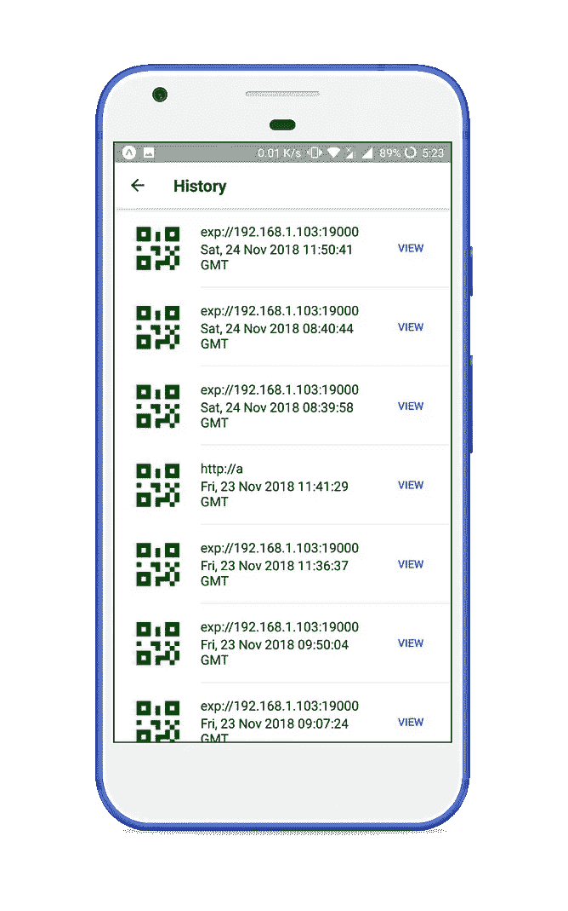

v1.0.0

# 源代码

应用程序代码可在 [GitHub](https://github.com/drex44/QR-Scanner) 上获得。

# 家庭作业

如果你忘记了你学过的东西，那将是浪费时间。这是一些家庭作业。慢慢来，自己完成。我没有在任何地方为这些任务提供任何代码。如果你面临任何困难，请发表意见，我会回答他们。

*   在 HistoryScreen 和 ResultScreen 中添加删除二维码的按钮。
*   在右上角添加一个按钮(点三横)打开设置屏幕。
*   二维码扫描成功时播放声音。在设置屏幕中给出选项来改变行为。
*   二维码扫描成功时震动手机。在设置屏幕中给出选项来改变行为。

提示:将声音和振动设置保存在异步存储器中。

如果你能想到其他方法来改进这个应用程序，然后在下面评论，我会把它添加到这个部分。

# 接下来

我试图在本文中涵盖许多主题，但它变得非常冗长，因此我无法涵盖 API 部分。因此，我将在 **React Native for 初学者 2.0** 文章中介绍如何执行用户认证并与服务器同步数据，在这篇文章中，我们将创建 **QR 扫描仪 v2.0.0** 。

# 结论

继续学习，愿原力与你同在。如果你需要任何主题的文章，请告诉我。我会尽力帮助你。如果你有任何问题或建议，请在下面的评论中留下。

附:如果你觉得这篇文章有帮助，鼓掌！👏👏👏这感觉很有收获，给了我继续写作的动力。

[](https://medium.freecodecamp.org/how-i-went-from-being-a-contributor-to-an-open-source-project-maintainer-acd8a6b316f5) [## 我是如何从一名贡献者变成开源项目维护者的

### 我是一个孤独的软件开发者。我上大学时，参加了 KDE 会议。这是我第一次遇到…

medium.freecodecamp.org](https://medium.freecodecamp.org/how-i-went-from-being-a-contributor-to-an-open-source-project-maintainer-acd8a6b316f5) [](/wineofbits/concepts-to-become-an-advanced-react-developer-684d90c086c2) [## 成为高级 React 开发人员的概念

### 使用这些技巧提高你的反应水平！

medium.com](/wineofbits/concepts-to-become-an-advanced-react-developer-684d90c086c2)