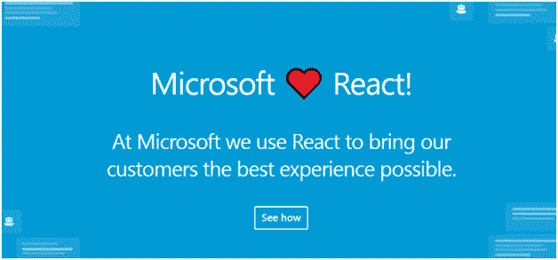

# 初创公司如何降低成本而不是偷工减料

> 原文：<https://medium.com/hackernoon/react-native-for-startups-cut-your-costs-not-corners-be5ba89d8301>

创办新企业总是一件让人神魂颠倒的事情，尤其是对于一家科技初创公司。我们不能这么说，因为每个公司看起来都像是遵循技术驱动的业务模式的技术公司。

> 每个公司都是科技公司，无论它提供什么产品或服务。接受这一事实的公司是塑造我们世界的公司。
> -福布斯技术委员会

我们多次观察到，科技初创公司会更快获得更广泛的关注，但不幸的是，它们未能保持这种关注。创意的可持续性是目前科技行业担心的痛点之一。我们正在观察科技创业公司的巨大增长，但与此同时，我们不能忽视迄今为止失败的创业公司的数量。

*尽管我们相信自己的想法是独一无二的，令人难以置信，但仅有一个想法还不足以生存。这就是当今世界的现实。除了这个想法，还需要适当的实施、营销、扩展计划和适应变化的能力。*

很明显，失败是不可避免的。缺乏强有力的想法、糟糕的实施策略和市场意识通常被认为是创业失败的主要原因。

谈到科技初创公司，你的想法是成功的第一关键因素，为初创公司选择[技术](https://hackernoon.com/only-10-of-startups-will-exist-by-the-year-2022-are-you-going-to-be-one-of-them-a68b775fba8a)排在第二位。

显然，有更多的影响因素，如预算，市场需求，团队，战略和有效的前进计划称之为成功。

大量的技术使得为创业公司决定合适的技术变得很复杂。事实上，选择合适的框架或技术是一个繁琐的过程。每天，我们都会接触到一个新的框架、工具或技术，它们提供的东西与众不同。

**规划你的应用需要面对一些严峻的挑战，比如:**

*   不断投资的需要
*   利用现代技术脱颖而出
*   卓越的用户体验是一个必备因素
*   吸引注意力的正确营销方法

从计划到营销和维护，创业公司不能忽视上述任何因素。

> “想法很容易。真正区分绵羊和山羊的是想法的执行。”
> ――苏·格拉夫顿

用户体验和先进技术的使用在任何创业应用开发中都扮演着越来越重要的角色。在不花费太多的情况下充分利用技术似乎是一个挑战。但是多亏了像 React Native 这样的现代框架，使得开发更容易、更快、更划算。

我们已经将 React Native 与其他框架进行了比较，如[React Native vs . Native script vs . Ionic](https://www.spec-india.com/blog/react-native-vs-nativescript-vs-ionic-app-development-comparison-is-here/)可以帮助更好地理解 React Native framework。

## 让我们直截了当。

# 初创企业的本土反应:成功的新公式

微软的 Skype 用的是 React Native。

有什么大不了的？

微软已经有了 Xamarin，这是一个跨平台的应用开发工具，可以编写原生的 Android、iOS 和 Windows 应用。但认识到 React Native 的能力，Skype 是世界上最大的 React Native 应用程序之一，拥有数百万用户。

Image Credit: [dev.skype.com](https://dev.skype.com/react)

# 为什么我们建议初创公司使用 React Native？

看看下面在开发环境中使用 React Native 的创业公司列表:

*   Delivery.com
*   砍
*   Discord 应用
*   超级饮食
*   Wix.com
*   陀螺仪
*   汤斯克

这个清单很长。从财富 500 强公司到创业公司，各种组织都在利用 React Native 从他们价值数十亿美元的想法中建立成功的公司。

**不仅初创公司，大型科技巨头也在使用 React Native 成为潮流引领者之一:**

*   脸谱网
*   照片墙
*   脸书广告经理
*   F8
*   拼趣
*   网络电话
*   脸书分析公司
*   沃尔玛
*   优步
*   特斯拉
*   装艺术的
*   百度移动
*   销售力量
*   流行
*   彭博

# 以下是创业公司需要考虑的几个场景:

## 如果预算是个绊脚石，“编写一次并在主要移动平台上运行”会有所帮助

没错，React Native 是支持 Android 和 iOS 平台的跨平台开发工具。对于任何初创公司来说，预算仍然是最受关注的因素。为不同的平台编写不同的代码库需要更高的预算，React Native 解决了这个问题。

更重要的是，这也有助于抓住那些将任何应用的用户界面/UX 视为重要因素的投资者的注意力。为了验证创业公司的想法，MVP(最小可行产品)的设计需要强调市场分析和用户的心态。React Native 利用现代技术帮助初创公司以令人难以置信的速度建立 MVP。

React Native for startup 应用程序开发支持关注初创公司的其他重要阶段，包括营销、战略制定和分析。它不会占用更多的开发时间和精力，因为您不需要为不同的平台分别构建代码。由于这个原因，React Native framework 受到了初创公司社区的青睐。

## 使用 React Native，用户体验不会成为问题

用户体验是任何创业公司成功的关键因素。

这一框架的主要吸引力在于能够交付真正的原生和卓越的用户体验。初创公司可以利用这一点，通过高质量的 UI 组件和类似本机的体验吸引用户群的注意力。

## 简单、可重复使用的本机组件加快了上市时间

在这个拥挤的市场中，大多数专业人士都在考虑推出自己的服务，承担和营销你的想法是一个艰苦的过程。初创公司不仅需要想出一个好主意，还需要通过一些推广策略快速实现它。

当您选择像 React Native 这样的现代框架时，更容易关注营销策略，而不是担心开发。它提供易于使用和可重用的组件，以最高的效率加速开发过程。

## 已经有原生平台的 app 了？切换到反应原生更容易

你已经在原生平台上开发你的应用了吗？是否要迁移到 React Native？这比你想象的要容易。它不需要重写您的应用程序，并使迁移更容易。

## 由于脸书框架的稳定性，将会带来更多惊人的特性

这又是一个值得关注的问题。

在科技行业，变化应用得非常快，它被视为对未来可持续性的关注。

选择一个随着时间的推移已经获得巨大可伸缩性的框架或工具是非常重要的。React Native 由脸书提供支持，在全球最强大的社区之一中占据主导地位。在接下来的时间里，我们期望这个社区有更多健壮的特性和强大概念的使用，这肯定会吸引全世界的开发者和组织。

你有什么想法？

你想用现代先进的技术来实现你的想法吗？React Native 可以减少成本和时间，这些成本和时间可以用于应用程序开发的另一部分，如营销、开发增强和扩展策略。由于其跨平台、快速和有效的开发方法，它适合创业公司的应用程序开发。

这篇文章最初发表在我们的博客[T3 这里 T5](https://www.spec-india.com/blog/react-native-for-startups-cut-your-costs-not-corners/)