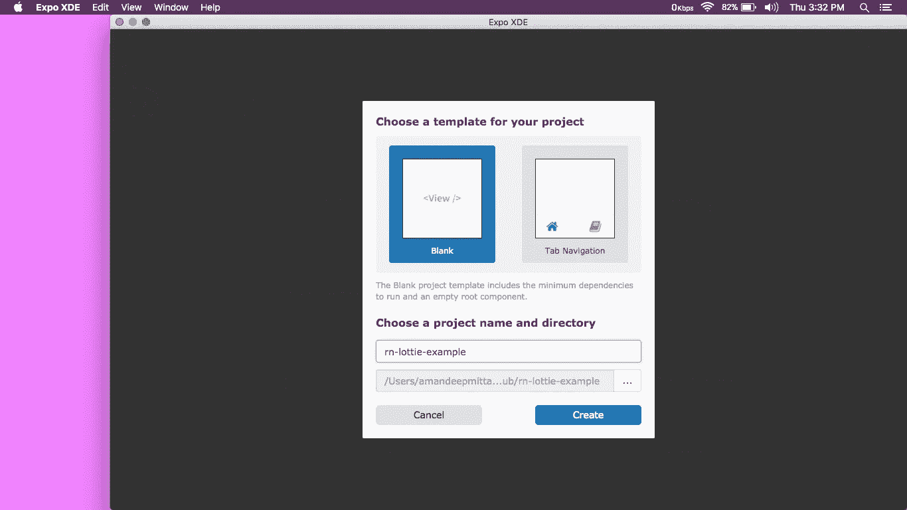
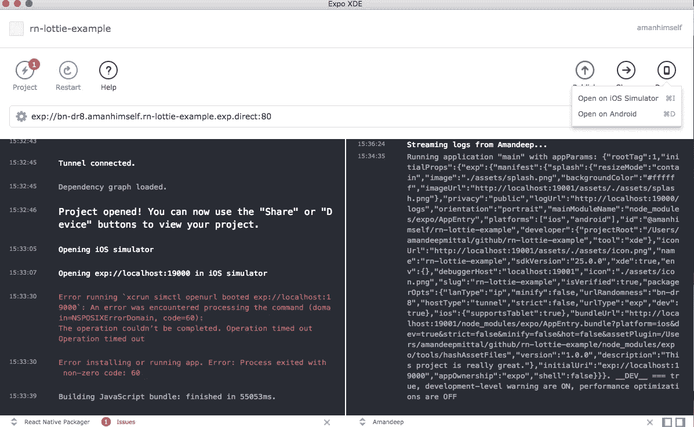
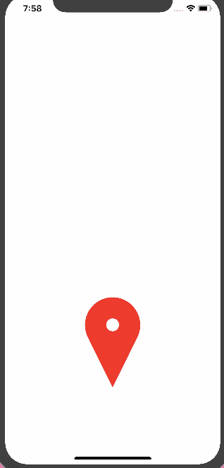

# 反应本土:洛蒂和博览会入门

> 原文：<https://medium.com/hackernoon/react-native-getting-started-with-lottie-and-expo-8b2105fbb496>

在本教程中，我们将使用[洛蒂](https://www.lottiefiles.com/)与反应原生。Lottie 是一个开源库，通过提供像静态图像一样易于使用的动画来呈现 Adobe 效果。这些动画很美。Lottie 是 AirBnB 开发的移动图书馆。使用 [Bodymovin](https://github.com/airbnb/lottie-web) 将这些动画导出为 JSON 文件，以在移动设备和 web 应用程序中进行本地渲染。

> *👍对于那些把时间花在 LottieFiles 上的设计师来说。*

# 要求

为了简洁和快速开始，我将使用 XDE 世博会。使用它创建一个新项目。我要打电话给`rn-lottie-example`,但是你可以随便打电话。

当 XDE 完成运行反应式软件包管理器并构建项目时，您可以进入右侧的`Device`下拉菜单，并根据您使用的操作系统点击您安装的模拟器。Windows 用户请确保您安装了 android studio 和必要的文件，MacOS 用户请安装 XCode 或更新 XCode。

您也可以通过在移动设备上使用 Expo 客户端运行应用程序来查看它。请注意，根据您的互联网连接，这可能会很慢，您的移动设备和开发机器必须在同一个 wifi 上。扫描`Share`版块二维码，你就可以出发了。一旦应用程序被渲染，你将受到默认屏幕的欢迎:

现在打开您最喜欢的文本编辑器/IDE，因为我们将在下一节开始编写代码。

# 入门指南

将 Lottie 作为一个依赖项安装在一个项目中可能有点棘手，但幸运的是，Expo 提供了对它的支持。我们不需要安装任何东西，因为我们用的是 Expo。我们在`App.js`中直接导入依赖关系:

世博会项目中的 Sine Lottie 处于 Alpha 模式，不要担心`DangerZone`这个词。

在我们的应用程序中包含一个名为`animation`的本地状态。我们称之为帮助播放和重启动画本身。我用[这个文件](https://www.lottiefiles.com/110-location)来制作我们来自[LottieFiles.com](https://gist.github.com/www.lottiefiles.com)的动画，所以你可以下载它。当然，你可以自由选择其他的。网站上列出的动画是开源的。

稍后，我们将使用`state.animation`直接从`Lottie`组件中获取动画文件。

# 定义动画

我们将定义两个自定义函数:`_playAnimation`和`_loadAnimationAsync`，它们执行动画并使用`fetch` API 从互联网加载动画。我们还将使用 core React 提供的`componentWillMount()`方法预装我们的动画。在这种生命周期方法中，当状态被设置时，它可以在初始渲染之前被调用。

通常，它用于准备第一次渲染或在渲染前更新状态。这就是我们使用它的原因。我们需要更新我们定义的状态。

在里面，`_loadAnimationAsync()`我们使用 JavaScript 的`fetch` API 从它的源头获取动画。这确实意味着动画来自互联网，所以如果你在你的移动设备上测试，确保你可以访问互联网。

我们的渲染函数看起来是这样的:

我们分别为整个容器和动画定义样式。为了加载动画，我们将把它的`backgroundColor`设置为`transparent`,以去除它默认的背景颜色。

您可以看到应用程序正在工作

本教程展示了如何使用 React Native 和 Expo 开始使用 Lottie 动画库。还有其他方法来定义动画，你可以想深入多少就深入多少。这篇文章是以一个初学者的角度写的。

作为洛蒂的替代品，你可以查看脸书的关键帧，它也使用 Adobe After Effects 来创建一个。

我们演示应用程序的完整代码:

# 你也可以在这个[**Github repo**](https://github.com/amandeepmittal/rn-lottie-example)**，**找到完整的代码，以防你只是想玩玩这个概念。

## 你可以在 [**推特**](https://twitter.com/amanhimself) 找到我🙏