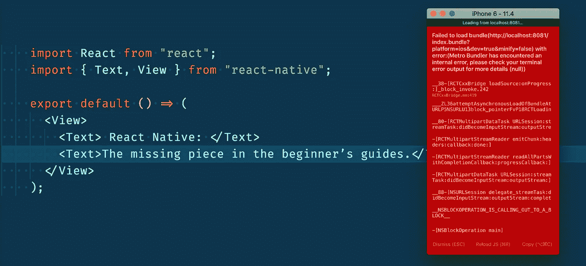
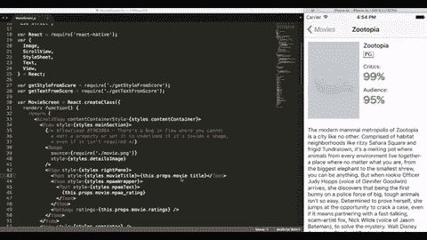
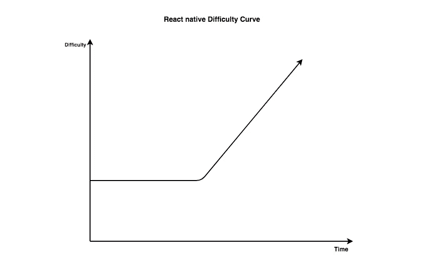

# 反应自然:初学者指南中缺失的部分。

> 原文：<https://medium.com/hackernoon/react-native-the-missing-piece-in-the-beginners-guides-e9bb8ebefc44>

React Native first error ever :)

> **本文原载于** [**Obytes 博客**](https://www.obytes.com/blog/) **。**

在过去的几个月里，我一直在与 [Barmej](https://www.barmej.com/) 的团队合作，使用 **React native** 开发一款移动应用。我想到要写这篇关于这个项目的有用文章，并分享我的观点、想法和对初学者通常会问的问题的一些回答。这篇文章是为每一个有 React web 背景的开发人员准备的。它基本上是关于如何开始用 React Native 构建应用程序。

在本文中，我不会谈论设置和基本的东西。相反，我将回答一些你在构建 React 原生应用时肯定会问的关键问题。

这篇文章被分成几部分。在每一部分中，您都可以找到与 React 本地开发相关的问题的答案。

> 我们开始吧！！

# 好了

如果你正在阅读这篇文章，你已经准备好了！但首先，让我解释一下我所说的“准备好”是什么意思。众所周知，大多数 React 本地开发人员也是 web 开发人员。超过 70%的 react-native 开发者一直从事 web 开发和 Reactjs 的工作。如果这是你的情况——很可能是——那么我很抱歉地告诉你，你将会错过你那令人惊叹的 Web 开发体验。因为在移动端的体验会不一样。

这并不意味着 Reactjs 的移动部分还没有准备好，但我认为这是因为 web 平台上每天都在发生令人惊讶的事情。然而，我向你保证，这种体验将比在本地语言(Android 和 swift)上开发有趣得多。

React Native HMR demo

React Native 官方文档中提到，React Native 使用热重装来更快地构建应用。不用重新编译，你可以立即重新加载你的应用。如果您来自 React web 开发领域，我相信您已经对它很熟悉了，并且它与您合作得很好。但是在手机 app 搭建中，如果不够小心，很可能会丢失热重装功能！尤其是当你的移动应用因为 HMR 不支持 React Native 上的功能组件而有所增长的时候。

这就是为什么你需要做好准备！

# React native 难度曲线(React Native 难吗？)

如果你熟悉网上的反应，那么你就在你应该在的地方！如果没有，我认为从 react-native 开始的最佳方式是构建一个简单的 React web 项目，这样您就可以学习一些基本的 Reactjs 和 Reactjs 生态系统的东西，而不会受到平台问题的影响，这些问题可能会阻碍您学习 React Native。

我想在这一部分强调的下一个重要观点是难度曲线，以及在 React Native 项目中何时会发现难度。

作为一名具有 Reactjs 背景的开发人员，我相信我们在 React Native 上很少遇到困难。让一些东西出现在屏幕上是很简单的，这并不具有挑战性，但是任何更复杂的事情，比如开始导航或者一些本地的挑战性的东西，你将开始使用一些第三方库。使用它们中的一些不会是你想要的最好的体验。

下图准确地解释了我的 React Native 体验。当我用一些基本的东西开始一个新项目时，它看起来就像“等等，什么这么简单”。然后，在使用了一些第三方库之后，项目进展缓慢，我面临许多与这些库升级相关的问题。这很正常，因为维护一个 React 原生开源项目不是一件简单的事情。你需要有很强的 JS、Java 和 Swift 背景。这些第三方库是由伟大的人开发的，他们可能将此作为一种爱好。他们没有得到报酬，所以质量并不总是处于最佳状态。(说起来，我要为 React 原生社区的伟大工作鸣谢！)

React Native Difficulty Curve

# 反应本地初始化与展示

要用 React Native 启动一个新项目，你需要 Android Studio 和 XCode。Android Studio 意味着一个 java 环境设置。XCode 意味着你只需要一台 MAC 笔记本电脑，是的！！当博览会来到 React 原生生态系统时，他们引入了一种新的方法来构建一个完整的移动应用程序，甚至不使用 Android Studio 或 Xcode。我相信他们在允许非 MAC-OS 用户开始开发 iOS 应用方面做得很好。不仅如此，expo 还提供了一些很棒的功能，如推送通知、资产管理器以及与测试人员毫无困难地共享应用程序。expo 的一个主要问题是它不支持本机模块。这个问题是我选择‘react-native init’而不是 Expo 的原因之一。而且说实话，我也不想给我的 app 多加一层。

这并不意味着“不要用世博！”Expo 对很多人来说非常有用，React Native 团队使用 expo SDK 实现了“react-native-create-app”。我认为最好的选择是创建您的第一个应用程序，然后迁移到' react-native init '方式。你可以在 Reactjs 社区 [GitHub repo](https://github.com/react-community/create-react-native-app/issues/516) 上的这个公开讨论问题中阅读更多关于这个主题的内容。

# iOS 或 Android(我需要学习 java/swift 的东西吗)

我强烈推荐有一些 java 和 swift 的经验。这会很有帮助，而且会让你对自己的工作有更多的控制。如果你有时间，我建议看一些介绍 Java 和 swift 应用架构和配置基础的教程。这种经历可能会改变你在应用程序开发中的一些批评情况。例如，为你的项目升级一些第三方库或者给本地模块添加一些特性，至少需要一些 Gradle 配置的经验。

与本节相关的最后一个建议是，我强烈建议首先开始 iOS 开发。这与 iOS 在 Android 平台上的稳定性有关。在 iOS 平台上开发比 Android 容易多了。

# 状态管理和 API

这是需要你 **Reactjs** 经验的部分，也许你正在使用 Redux 或 Mobx 来管理你的应用状态，你也可以使用它们。但是移动平台对 web 平台有一些特殊的要求。这意味着必须实现额外的功能，比如离线能力、缓存策略和一些乐观的更新。

在 Barmej 开发期间，我们选择了 redux & redux-observable & redux-persist 堆栈，并使用与 web 应用程序相同的 rest API，同时我们也尽可能多地尝试使用一些 web 应用程序代码。然后，过了一段时间，我们发现该应用程序没有达到我们希望的最佳性能。因为我们需要进行大量的 API 调用，缓存的规范化过程和离线支持。

成为这个冒险将 REST API 移植到 GraphQl API 的伟大团队的一员，让我的工作变得更加简单。使用一个 GraphQl 客户端，如 apollo-client，它几乎提供了我们需要的所有功能，有助于使应用程序构建更流畅，感觉更自然。

*在这一点上，我们相信 GraphQl 堆栈优于 redux 堆栈。我们正在移除 redux 堆栈依赖，并使用上下文 API 进行本地状态管理，使用 apollo-client 进行 API。*

# 结论

本文暂时告一段落。在应用程序开发过程中遇到挑战是正常的。我们使用 React Native 已经有一段时间了，我们对自己的选择深信不疑。

我将很快发布另一篇关于 React 原生开发的文章，敬请关注，别忘了关注我。

感谢阅读！如果你认为这篇文章对你有帮助，那么它肯定会对很多人有帮助，那么就继续分享吧，因为“分享是关爱”！

> **本文原载于** [**Obytes 博客**](https://www.obytes.com/blog/) **。**