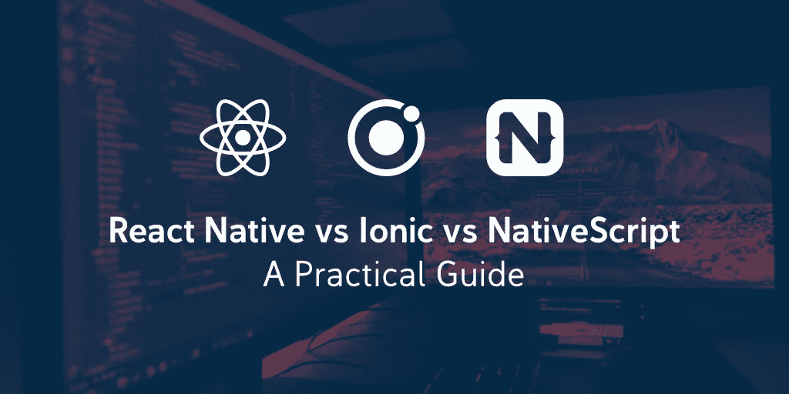

# react Native vs Ionic vs Native script:实用指南

> 原文：<https://medium.com/hackernoon/react-native-vs-ionic-vs-nativescript-a-practical-guide-8aaaf0a286a3>

在本文中，我们将看看三个最流行的框架，它们可以用来开发运行在 Android 和 iOS 上的移动应用: **React Native、Ionic 和 NativeScript** 。

具体来说，我们将根据以下标准比较这些框架:

*   **代码和开发工具** —它使用什么语言，UI 是如何创建的，开发应用程序使用什么工具。
*   **开发工作流程** —开发应用程序的流程是什么样子的。
*   **原生 API 和可扩展性** —哪些原生 API 可用，添加原生功能有多容易。
*   **性能** —每个框架的性能如何。

到本文结束时，您将会清楚地知道您的下一个移动应用程序项目将使用哪个框架。

# 框架概述

在我们继续之前，让我们先快速浏览一下这三个框架。

# 反应自然

[React Native](https://facebook.github.io/react-native/) 是由脸书创建的移动应用开发框架。它允许你用 React 和 JavaScript 创建本地移动应用。除了脸书，它也被彭博、特斯拉、优步、Wix 和 Discord 用于他们的应用程序。

# 离子的

[Ionic](https://ionicframework.com/) 是一个开发 PWA 和高性能混合移动应用的框架。它是由 Drifty Co .创建的，像 Sworkit、Untappd 和道琼斯市场观察这样的流行应用程序都是使用 Ionic 构建的。

# 原生脚本

[NativeScript](https://www.nativescript.org/) 是一个构建原生移动应用的框架。它是由进步创造的。一些使用 NativeScript 的应用包括 MyPUMA、Regelneef 和 UH Now。SAP 也将其用于他们的[移动开发套件](https://blogs.sap.com/2017/05/24/sap-enterprise-app-modeler/)。

说到代码， **Ionic 是最容易学的**，尤其是如果你是 web 开发出身的话。应用程序是使用 HTML、CSS 和 JavaScript 构建的，因此您构建 UI 和添加功能的方式与您在 web 中的方式非常相似。因为 Ionic 基本上是在 WebView 上运行的，所以你在网上使用的大多数 JavaScript 库应该也能工作。

Ionic 附带了 [UI 组件](https://ionicframework.com/docs/components/)，可以根据你的应用运行的平台来设计不同的风格。

Ionic 是与 Angular 紧密耦合的**，所以它是创建新项目时使用的默认 JavaScript 框架。不过，在撰写本文时，最新版本的 Ionic (Ionic 4)即将发布——它的主要特性之一是[框架不可知的](https://blog.ionicframework.com/announcing-ionic-4-beta/)。这意味着开发人员可以选择不使用任何框架，或者使用流行的框架，如 React 或 Vue。**

另一方面， **React Native 使用 React 的 JSX 语法**来构建应用的 UI。如果你不熟悉 React，它是一个用于构建用户界面的 JavaScript 库，也由脸书维护。React Native 附带了一系列 UI 组件，大多数都可以在 Android 和 iOS 上工作，但有些只能在一个平台上工作。

React Native 使用 [Flexbox](https://facebook.github.io/react-native/docs/flexbox) 来布局 UI。这与 web 版本的工作方式相同，但并非所有属性都受支持，默认值也有所不同。一般样式是使用 CSS 的子集实现的——但是使用 JavaScript 对象和属性来声明样式，而不是我们在 web 中使用的语法。这些属性被转换回它的 CSS 源(例如，`background-color`变成了`backgroundColor`，所以很容易理解。

React Native 使用 JavaScript 添加功能。**默认支持 ES6**，所以你在网上看到的大部分教程也都是用的。请注意，React Native 没有与 web 浏览器相同的 JavaScript 环境。这意味着**你习惯在网络环境中使用的大多数库将无法工作**，尤其是那些访问浏览器 DOM 的库。大多数 [npm 包](https://www.npmjs.com/)应该可以工作，因为 React Native 中的 JavaScript 环境与 Node 中的类似。

最后， **NativeScript 使用基于 XML 的语言**进行 UI 声明，使用 CSS 子集进行样式化，使用 JavaScript 进行功能化。NativeScript 的小部件是统一的，所以大多数小部件都适用于 iOS 和 Android。与 React Native 不同，NativeScript 的小部件带有默认样式，根据运行它的设备，可以是 Material Design 或 Cupertino。除了大量的[小部件](https://docs.nativescript.org/ui/components)之外，NativeScript 还带有专业级 UI 组件，如图表、图形和日历。

NativeScript 鼓励你**使用 TypeScript 和 Angular 来构建应用**，但是如果你正在构建更小的应用，你也可以使用普通的 JavaScript。

# 开发工作流程

每个框架的开发工作流程看起来都非常相似:

1.  使用命令行工具生成新项目。
2.  修改默认目录结构(可选)。
3.  使用提供的组件/部件构建 UI。
4.  添加布局和自定义样式。
5.  运行应用程序并在仿真器/模拟器上预览。
6.  添加功能。
7.  安装软件包。
8.  使用包装。
9.  调试/测试应用程序。
10.  提交对源代码管理的更改。

所有的框架都有一个**实时重新加载**的特性，当你对代码进行修改时，这使得预览应用程序看起来很容易。

这三者的区别集中在用于开发和调试应用程序的工具上。

谈到调试，React Native 允许你使用 [Chrome 开发者工具](https://docs.nativescript.org/tooling/debugging/chrome-devtools)来调试你的应用。但是，并不是所有您习惯用于 web 项目的特性都可用。例如，它没有元素检查器。有一个应用内视图检查器，但它只对非常简单的应用有用。这就是社区创建了像 [React 原生调试器](https://github.com/jhen0409/react-native-debugger)和 [Reactotron](https://github.com/infinitered/reactotron) 这样的工具的原因，它已经成为调试 React 原生应用的首选方式。

另一方面，NativeScript 应用程序可以使用 [Chrome 开发工具](https://docs.nativescript.org/tooling/debugging/chrome-devtools)或 [Visual Studio 代码 NativeScript 扩展](https://marketplace.visualstudio.com/items?itemName=Telerik.nativescript)进行调试。这项工作没有更好的工具，因为它们各有优缺点。Chrome Developer Tools 在 NativeScript 中的功能更加完整，因为除了 JavaScript 调试之外，它的元素、资源和网络检查器也非常有用。但是，如果您希望所有的调试、仿真器集成和版本控制都在文本编辑器中完成，那么请使用 Visual Studio 代码扩展。

最后，Ionic 本质上是一个前端框架，可以使用浏览器自带的开发工具进行调试，就像通常的网页一样。至于原生插件，可以用 Android Studio 或者 Xcode 调试。

# 本机 API 和可扩展性

如果您需要使用原生设备功能，如摄像头、地理定位、地图和蓝牙，Ionic 提供了 [Ionic Native](https://ionicframework.com/docs/native/) ，这是一个用于访问原生设备 API 的 Cordova 插件的类型脚本包装器。如果一个 [Cordova 插件](https://cordova.apache.org/plugins/)没有对应的 Ionic 原生包装器，你可以直接使用它或者自己写一个包装器。如果你想使用的本地特性没有可用的 Cordova 插件，唯一的选择就是自己开发插件。尽管这需要了解本地平台的硬件访问 API。

React Native 附带了一小部分硬件 API 来访问本机设备特性。这包括地理定位、相机胶卷、振动等。尽管这个集合很小，但社区带来了许多本机模块，通过 JavaScript API 访问各种设备硬件，从而弥补了这个不足。

在 React Native 中，您很少需要为想要访问的本机设备特性编写自己的实现。这主要是因为 React 本地社区非常庞大。**您想要访问的大部分原生功能都已经有了相应的第三方模块**。如果没有现有的模块或者它缺乏功能，React Native 还为您提供了工具来创建您自己的本机模块，用于 iOS 和 Android。同样，这需要大量关于本地语言以及如何在您想要支持的平台中访问硬件 API 的知识。

最后，NativeScript 允许您通过其插件访问硬件特性。你可以在[native script market place](https://market.nativescript.org/)中搜索可用的插件。NativeScript 插件也要经过一个[验证过程](https://github.com/NativeScript/marketplace-feedback/blob/master/docs/verified-plugins.md)以确保其可靠性。

NativeScript 的一个特殊特性是，它**允许您通过 JavaScript** 访问所有本机平台的本机 API。这意味着您不需要编写任何 Swift、Objective-C 或 Java 代码。但是，您仍然需要知道本地 API 在每个平台上是如何工作的。

# 表演

在这三者中，Ionic 的性能最差，而 NativeScript 和 React Native 的性能与它们的本地版本非常接近。

这并不是说不值得用 Ionic 开发应用。Ionic 的表现绝不差。用它创建的应用程序表现非常好，这是因为它们非常符合 Ionic 的使用情况。如果你在 [Ionic 的展示页面](https://showcase.ionicframework.com/apps/top)中查看应用程序，你可能会注意到这些事情:

*   他们有一个非常简单的用户界面；大部分看起来都差不多。
*   没有太多的动画和过渡需要在每个页面上执行。
*   它们不需要本机设备功能。

因为 Drifty Co .的优秀人员总是在研究如何提高 Ionic 的性能，所以当你的应用程序需要访问本机设备功能时，你通常只会注意到性能差异。

# 选择哪个框架？

归根结底，你选择哪个框架**很大程度上取决于你的用例。**

如果你想开发一个有很多动画和移动部件的游戏，你应该远离 Ionic，因为它的性能不会让你失望。无论 Drifty 公司对框架做了多少调整，当你在网络视图上运行应用程序时，性能损失都太大了。另一方面，如果你想开发带有大量动画的简单应用，并且你希望你的用户使用更新的设备，Ionic 应该是一个很好的选择，因为你现有的 web 开发技能可以直接转移。

如果**性能**对你来说很重要，你可能会在 React Native 和 NativeScript 之间纠结。在这种情况下，我个人会选择更受欢迎的选项，那就是 React Native。这是因为流行等同于巨大的社区支持，这反过来导致更多围绕生态系统的库、工具和服务被创建。这对开发人员非常有利，因为您很少需要自己编写库来访问不同的设备 API 和服务。

需要注意的是，React Native 仍然是一个不断发展的框架。如果您正在考虑使用更成熟的技术和付费支持，NativeScript 是一个不错的选择。NativeScript 背后的公司 Progress 已经开源了该框架，但他们通过提供[付费支持](https://www.nativescript.org/faq/does-nativescript-offer-enterprise-or-professional-paid-support)和围绕它创建付费服务和工具来从 NativeScript 中赚钱。

# 结论

如今，移动混合框架非常重要，因为它们允许开发人员比本地开发人员更快地部署移动应用。这主要是由于它们统一的发展形式。

开发人员只需学习一种语言，就可以为 Android 和 iOS 两大平台开发应用程序。这使得公司可以在更短的时间内推出一个最小可行产品。因此，他们能够首先打入市场，从而获得竞争优势。

在本文中，我们快速了解了 React Native、Ionic 和 NativeScript 所提供的功能。到目前为止，您应该知道根据您的项目需求从三个框架中选择哪一个。

是时候开始建造一些伟大的东西了！

*原载于*[*【blog.jscrambler.com】*](https://blog.jscrambler.com/react-native-vs-ionic-vs-nativescript-a-practical-guide/?utm_source=medium.com&utm_medium=referral)*由* [*沃恩安切塔*](https://blog.jscrambler.com/author/wern-ancheta) *。*