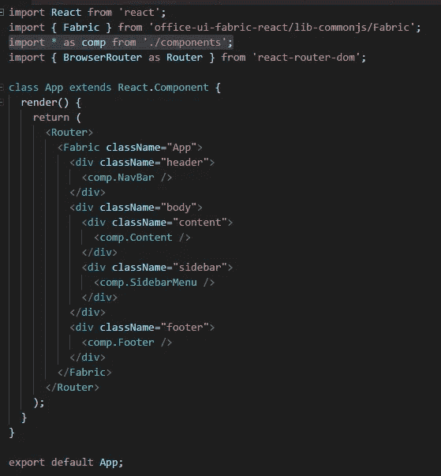

# 使用桶反应项目架构

> 原文：<https://medium.com/hackernoon/react-project-architecture-using-barrels-d086146eb0f6>


当构建一个大型应用程序时，您将不得不大量重构您的导入语句。桶会让它更容易。

桶是一种将几个模块的导出汇总到单个方便的模块中的方法。桶本身是一个模块文件，它重新导出其他模块的选定导出。*来源:*[*https://basarat . git books . io/typescript/docs/tips/barrel . html*](https://basarat.gitbooks.io/typescript/docs/tips/barrel.html)

Angular 2+相当广泛地使用桶，我试图弄清楚如何在 [react](https://hackernoon.com/tagged/react) 中使用它。我通过 create-react-app 开始了创建 react 应用程序的旅程。

**为什么要用桶？**

在有多个团队的企业开发中，如果你想改变你的项目结构，一旦每个分支合并在一起，这将是一个噩梦。想象多个团队都在不同的 sprints 上使用一些共享/核心[功能](https://hackernoon.com/tagged/functionality)。我看到的情况是，一个团队重构一些共享/核心代码，并在任何地方破坏导入。

在我的例子中，我有一个位于路径``./components/layout/Navbar’;`下的 NavBar 组件，在 React 组件的底部，您会看到:

```
export default NavBar;
```

在我将要注入这个 NavBar 组件的 App.js 中，我必须首先将它和我的其他布局组件一起导入:

```
import NavBar from './components/layout/NavBar.js';
import SidebarMenu from './components/layout/SidebarMenu.js';
import Content from './components/layout/Content.js';
import Footer from './components/layout/Footer.js';
```

桶装为我提供了一种将这四行代码简化为:

```
import { SidebarMenu, Footer, Content, NavBar } from './components';
```

您还可以更进一步，将从组件文件夹中导出的所有内容都命名为别名，然后全部导入。

```
import * as comp from './components';
```

在我的 App.js 组件中，我可以通过在它前面加上 comp 来引用任何组件。所以要引用我的导航条，我只用`<comp.NavBar />`



这一点的美妙之处在于，如果我从``./components/layout/Navbar’; to `./CoreModule/Shared/Layout/Navbar’;`改变导航条组件的位置

我不必重构我的 App.js 组件的导入。

**它是如何工作的？**

我选择的构建应用程序的方式是每个组件都有自己的文件夹。内容是组件 js 文件、组件 css 文件和为我们做桶装的 index.js 文件。


该组件文件夹中 index.js 的内容:
`export {default as NavBar} from "./NavBar";`

当我开始我的桶装旅行时，我错过了一个重要的词:T21 默认。在最底层的组件中，必须导出默认的类。

父文件夹只需要导出一级子文件夹。


请注意，您不再导出默认类。当您说`default as NavBar` 时，您正在重命名默认导出。


this is the next level above layout


top level module

对于实现此更改的提交，您可以看到:[https://github . com/CRH 225/react-firebase/commit/F3 CDA 6732 B3 aafe 0 b 2283 f 19 b 7 ea 89 e 82 cc 85 ed 6](https://github.com/crh225/react-firebase/commit/f3cda6732b3aafe0b2283f19b7ea89e82cc85ed6)

回购:[https://github.com/crh225/react-firebase](https://github.com/crh225/react-firebase)

Typescript 中关于桶的进一步阅读:[https://basarat . git books . io/Typescript/docs/tips/barrel . html](https://basarat.gitbooks.io/typescript/docs/tips/barrel.html)