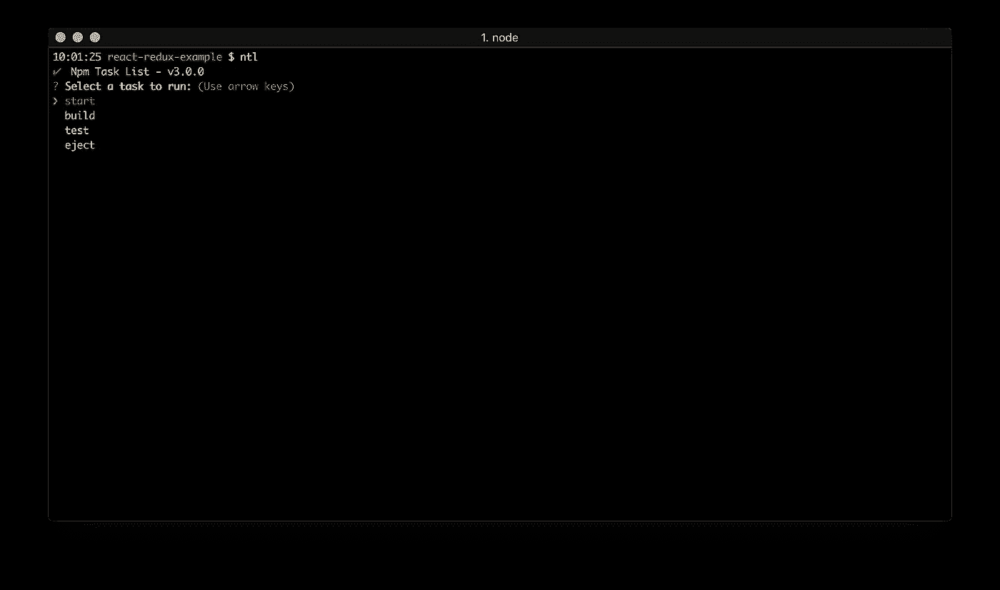
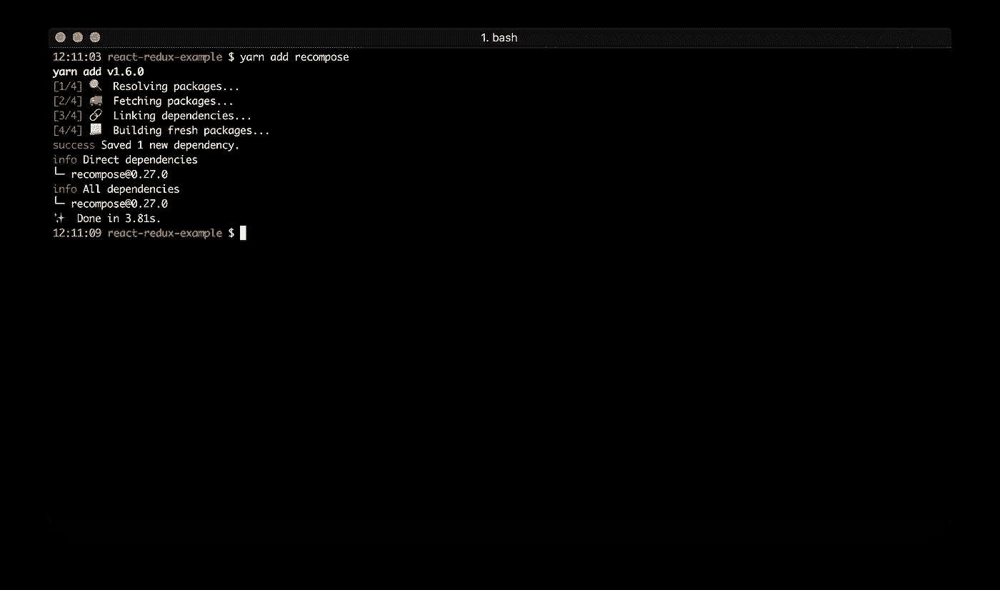

# React —为懒惰的开发人员提供 redux

> 原文：<https://medium.com/hackernoon/react-redux-for-lazy-developers-b551f16a456f>

每次使用 [**react**](https://reactjs.org/) app 中的 [**redux**](https://redux.js.org/) 时，我们都要花费大量的时间来制作[动作类型、](https://github.com/reduxjs/redux/blob/master/docs/basics/Actions.md)、[redux](https://github.com/reduxjs/redux/blob/master/docs/basics/Reducers.md)……事实上大多数动作都是为了使用 [redux store](https://github.com/reduxjs/redux/blob/master/docs/basics/Store.md) 而进行的 CRUD。


让我们想象有人为我们制造它…

要制作任何 react 应用程序，我们应该使用[**create-react-app**](https://github.com/facebook/create-react-app)创建一个空项目，或者用 [**babel**](https://babeljs.io/) 配置 [**webpack**](https://webpack.js.org/) 。

[](/@evheniybystrov/react-app-from-scratch-d694300d1631) [## 从头开始反应应用程序

### 这是教程的第一部分，我将展示如何从头开始创建 react 应用程序。

medium.com](/@evheniybystrov/react-app-from-scratch-d694300d1631) 

通常我使用 webpack 为自己的项目定制配置。但是这次我将使用 create-react-app。如果你没有(我希望你在你的电脑上安装了 [**node.js**](https://nodejs.org/) 和 [**npm**](https://www.npmjs.com/) )你可以运行下一个命令:

```
npm i -g create-react-app
```


它会把这个包作为全局包安装，这样你就可以在任何地方运行它。

让我们运行 create-react-app 为我们的项目创建一个新目录，并创建 react app:

```
create-react-app react-redux-example
```


小通知…

要使用任何 node.js 项目，您需要检查 [package.json 脚本部分](https://docs.npmjs.com/misc/scripts)。例如，你可以找到**开始**或**测试**命令。要运行它，您可以使用 **npm 运行启动/ npm 运行测试**命令或快捷方式(对于预定义命令) **npm 启动** / **npm 测试**。

另一种方法是用 [**纱**](https://yarnpkg.com/lang/en/) 。作为脸书 react 生态系统的一部分，别忘了安装它( **npm i -g yarn** )。对于纱线，您可以运行相同的命令:**纱线开始** / **纱线测试**。

同样，我们太懒了，所以我们只能安装另一个包— [**ntl**](https://www.npmjs.com/package/ntl) :

```
npm i -g ntl
```


之后就不需要去研究每个 package.json 了，只需要在 node.js 项目的一个目录下运行 **ntl** 命令就可以看到所有命令了。

回到我们的应用程序…

我们创建了一个新的 react 项目。让我们检查一下:

```
cd react-redux-example
```

要查看所有预定义的命令，请运行 ntl:

```
ntl
```



我们看到开始、构建、测试、弹出命令:

*   **启动** —启动我们的应用程序，
*   **构建** —构建静态文件(js，css…)以将其部署在服务器上，
*   **测试** —运行我们的应用程序的测试，
*   **弹出** —创建 webpack 配置(运行弹出命令后，您需要自己管理 webpack)。

现在我们可以运行我们的应用程序了。

运行 **ntl** 然后选择 **start** 命令并按回车键或通过运行**NPM start**(**yarn start**)命令手动完成(但不是我们的方式)。


正如我们所见，它在端口 3000 上工作。如果我们在浏览器中打开它( [http://localhost:3000/](http://localhost:3000/) )，我们会看到我们的应用程序:


正如我们从页面信息中看到的，要更新我们的应用程序，我们应该更改 **src/App.js** 文件。

接下来，我们应该研究我们的应用程序结构，并添加 redux。

要查看我们的应用程序的树形结构，请运行下一个命令(不带 node_modules):

```
tree -I "node_modules"
```


```
.
├── README.md
├── package.json
├── public
│   ├── favicon.ico
│   ├── index.html
│   └── manifest.json
├── src
│   ├── App.css
│   ├── App.js
│   ├── App.test.js
│   ├── index.css
│   ├── index.js
│   ├── logo.svg
│   └── registerServiceWorker.js
└── yarn.lock
```

所以我们准备创建一个表单示例。

我们的目标:

*   通过扩展 React 创建有状态组件。成分
*   看看什么是受控组件
*   了解什么是状态以及如何管理它
*   拆分我们的组件:获得无状态组件和智能容器
*   查看什么是特设的，并检查其他工具的工作状态(重组)

所以让我们创建一个新的目录 **src/form** 并用我们的表单创建 **index.js** 文件。

```
mkdir src/form
touch src/form/index.js
```

在真实的 app 中，你会使用 [**eslint**](https://eslint.org/) ，最好的配置是 [airbnb eslint config](https://github.com/airbnb/javascript/tree/master/packages/eslint-config-airbnb) 。对于所有的规则范围，你应该将代码分割成 **js/jsx** 文件。所有 JSX 代码你都应该保存在 ***里。jsx** 文件。查看项目结构后，您将知道每个文件的作用。

但是使用 **create-react-app** 作为我们的小型懒惰示例，我们可以在 ***中编写所有代码。js** 文件。

我们的简单形式将是这样的:

```
**import** React, { Component } **from** 'react';

**class** App **extends** Component {
    render() {
        **return** (
            <form>
                <h1>Our form example</h1>
                <div>
                    <textarea />
                </div>
                <div>
                    <input type="submit" value="Submit" />
                </div>
            </form>
        );
    }
}

**export default** App;
```


我们需要更新 **src/App.js** 来添加我们的表单:

```
**import** React, { Component } **from** 'react';
**import** logo **from** './logo.svg';
**import** './App.css';
***import Form from './form';*** 
**class** App **extends** Component {
  render() {
    **return** (
      <div className="App">
        <header className="App-header">
          
          <h1 className="App-title">Welcome to React</h1>
        </header>
        **<Form />**
      </div>
    );
  }
}

**export default** App;
```

并运行**开始**命令:


这里我们只有一个文本区域输入字段和提交按钮。

我们可以输入任何文本并点击提交。


但是我们怎样才能得到输入的文本呢？现在我们有了不受控制的 textarea 组件。要获取输入的文本，我们可以使用 [react ref 链接](https://reactjs.org/docs/refs-and-the-dom.html)，但这不是 react 方式。要像专业人士一样使用 react，我们需要使用 state。

让我们更新我们的组件，使其更加智能:

```
**import** React, { Component } **from** 'react';

**class** App **extends** Component {
    constructor(props) {
        **super**(props);
        **this**.state = {
            text: '',
        };
    }

    onTextChange = (event) => {
      **this**.setState({ text: event.target.value });
    };

    render() {
        **return** (
            <form>
                <h1>Our form example</h1>
                <div>
                    <textarea onChange={**this**.onTextChange}>
                        {**this**.state.text}
                    </textarea>
                </div>
                <div>
                    <input type="submit" value="Submit" />
                </div>
            </form>
        );
    }
}

**export default** App;
```

现在我们可以得到输入的值，但是提交按钮呢？我们应该处理输入的值:

```
**import** React, { Component } **from** 'react';

**class** App **extends** Component {
    constructor(props) {
        **super**(props);
        **this**.state = {
            text: '',
        };
    }

    onTextChange = (event) => {
      **this**.setState({ text: event.target.value });
    };

    onFormSubmit = (event) => {
        event.preventDefault();
        alert(**this**.state.text);
    };

    render() {
        **return** (
            <form onSubmit={**this**.onFormSubmit}>
                <h1>Our form example</h1>
                <div>
                    <textarea onChange={**this**.onTextChange}>
                        {**this**.state.text}
                    </textarea>
                </div>
                <div>
                    <input type="submit" value="Submit" />
                </div>
            </form>
        );
    }
}

**export default** App;
```

我添加了表单提交处理程序。如果我们输入一些测试文本并按 submit，我们会看到一个带有输入文本的警告:


在真正的应用程序中，你可以用 ajax 请求来代替 alert。

所以我们看到了什么是受控和不受控的组件——在我们的例子中是 textarea。我们看到什么是智能组件或容器。

在真实的生产应用程序中，如果你想成为一名专业人员，你需要将逻辑分解为单个责任组件。在我们的例子中，它将我们的大智能组件分割成无状态组件(或者某些文档中的愚蠢组件)和容器。

我们得到至少两个文件，每个文件都有自己的职责:无状态组件只是一个视图层，容器负责状态。

让我们创建**表单组件**、**表单容器**并将其集成到我们的表单中:

```
touch src/form/formComponent
touch src/form/formContainer
```

我们的准则是:

## 表单组件:

```
**import** React, { Component } **from** 'react';

**class** FormComponent **extends** Component {
    render() {
        **return** (
            <form onSubmit={**this**.props.onFormSubmit}>
                <h1>Our form example</h1>
                <div>
                    <textarea onChange={**this**.props.onTextChange}>
                        {**this**.props.text}
                    </textarea>
                </div>
                <div>
                    <input type="submit" value="Submit" />
                </div>
            </form>
        );
    }
}

**export default** FormComponent;
```

## 表单容器:

```
**import** React, { Component } **from** 'react';

**const** FormContainer = FormComponent => {
    **return class** App **extends** Component {
        constructor(props) {
            **super**(props);
            **this**.state = {
                text: '',
            };
        }

        onTextChange = (event) => {
            **this**.setState({ text: event.target.value });
        };

        onFormSubmit = (event) => {
            event.preventDefault();
            alert(**this**.state.text);
        };

        render() {
            **return** (
                <FormComponent
                    text={**this**.state.text}
                    onTextChange={**this**.onTextChange}
                    onFormSubmit={**this**.onFormSubmit}
                />
            );
        }
    }
};

**export default** FormContainer;
```

## 我们的形式:

```
**import** React, { Component } **from** 'react';
**import** FormContainer **from** './formContainer';
**import** FormComponent **from** './formComponent';

**const** Form = FormContainer(FormComponent);

**class** App **extends** Component {
    render() {
        **return** (
            <Form />
        );
    }
}

**export default** App;
```

这里我们看到一些有趣的案例:

*   我们只是拆分代码，对于无状态表单组件，我们将状态和处理程序作为属性。FormContainer 不呈现 jsx 代码。它只是将状态和处理程序放入表单组件。
*   FormContainer 不是 react 组件。这是高阶组件(HOC) —包装函数。我们将 component 作为一个参数放入函数，它返回 react component。

对于 react 开发来说，HOC 是一种有趣的模式。你可以用完全函数化的方式编写你的应用程序。

想象一下，您的 react 组件可以只是一个 JS 函数:

```
**props => jsx**
```

别忘了这个箭头功能。

让我们更新我们的表单组件并使其正常工作:

```
**import** React **from** 'react';

**const** FormComponent = props => (
    <form onSubmit={props.onFormSubmit}>
        <h1>Our form example</h1>
        <div>
            <textarea onChange={props.onTextChange}>
                {props.text}
            </textarea>
        </div>
        <div>
            <input type="submit" value="Submit" />
        </div>
    </form>
);

**export default** FormComponent;
```

这里我们有一个函数。它得到道具并返回 JSX 代码。代码更少，声明性更强。

但是我们的集装箱呢？应该还是一个班吧？使用 redux，它可以完全正常工作。Redux 是全局状态的存储。在某些情况下，您将使用本地状态并创建一个类。但是说到声明性代码，不要忘了我们太懒了，不想自己写所有的代码。我们的集装箱是特设的，有许多生产就绪的集装箱。

最有趣的库是 [**改编**](https://github.com/acdlite/recompose) 。打开[文档](https://github.com/acdlite/recompose/blob/master/docs/API.md)可以找到很多例子。

接下来，我想展示如何让我们的容器更实用。

但是首先我们应该安装它:

```
npm i -S recompose
```

或者

```
yarn add recompose
```



在我们换好容器之后。我们将使用`withStateHandlers()`

```
**import** { withStateHandlers } **from** 'recompose';

**const** FormContainer = withStateHandlers(
    ({ text = '' }) => ({ text }),
    {
        onTextChange: () => event => ({
            text: event.target.value,
        }),
        onFormSubmit: ({ text }) => (event) => {
            event.preventDefault();
            alert(text);
        },
    },
);

**export default** FormContainer;
```

同样，代码更少，声明性更强。在我们的例子中，它是功能性的。我们甚至不需要导入 react，因为它只是 JS 代码。

如果我们运行我们的应用程序，我们会看到相同的结果:


因此，我们只是使用 ready recompose HOC 来处理本地状态，而不是手动创建。

我们完成了这一部分的目标:我们看到了受控和非受控组件、无状态(功能性)和智能(有状态)组件——容器。我们创建了自己的 HOC，并找到了其他开发者创建的许多现成的 HOC，让我们的开发更快，让我们的懒惰生活更轻松:)

下一步是添加 redux…

要在我们的应用程序中添加 redux 作为任何其他依赖项，我们应该首先安装它。在我们的例子中，我们需要 redux 和 [react-redux](https://github.com/reduxjs/react-redux) 与 react 一起使用。

```
yarn add redux react-redux
```


还有一件事——redux-logger:

```
yarn add redux-logger
```

这对调试很有用。

让我们创建我们的商店:

```
touch src/store.js
```

使用下一个代码:

```
**import** { createStore, applyMiddleware } **from** 'redux';
**import** logger **from** 'redux-logger';

**import** reducers **from** './reducers';

**const** store = createStore(
    reducers,
    applyMiddleware(logger)
);

**export default** store;
```

和还原剂:

```
touch src/reducers.js
```

现在，它是空的，但是我们稍后将为表单组件添加 reducer:

```
**import** { combineReducers } **from** 'redux';

**export default** combineReducers({});
```

下一步是为应用程序创建提供程序— **src/index.js** :

```
**import** React **from** 'react';
**import** ReactDOM **from** 'react-dom';
**import** { Provider } **from** 'react-redux';
**import** './index.css';
**import** App **from** './App';
**import** store **from** './store';
**import** registerServiceWorker **from** './registerServiceWorker';

ReactDOM.render(
    **<Provider store={store}>
        <App />
    </Provider>,**
    document.getElementById('root')
);
registerServiceWorker();
```

它使应用程序中的所有容器组件都可以使用存储，而无需显式传递它。在渲染根组件时，只需使用一次。

现在我们需要创建**动作类型**、**动作创建者、**和**缩减者**。

但是在我们思考我们的行动之前:

*   我们需要改变文本
*   提交我们的表格。

## 动作类型:

```
touch src/form/types.js
```

使用下一个代码:

```
**export const** FORM_TEXT = '@@form/TEXT';
**export const** FORM_SUBMIT = '@@form/SUBMIT';
```

在真正的生产应用程序中，你可以创建许多类型/动作，每次你都会有一个命名问题。所以如果你不想有冲突问题，你需要给你的类型添加后缀。我使用@@moduleName/TYPE 符号。在我们的表单模块中，我使用了**@ @表单/类型**，例如:**@ @表单/文本**或**@ @表单/提交**。

## 动作创建者:

```
touch src/form/actions.js
```

带代码:

```
**import** { FORM_TEXT, FORM_SUBMIT } **from** './types';

**export const** textAction = text => ({
    type: FORM_TEXT,
    text,
});

**export const** submitAction = () => ({
    type: FORM_SUBMIT,
});
```

## 和减速器:

```
touch src/form/reducer.js
```

带代码:

```
**import** { FORM_TEXT } **from** './types';

**const** defaultState = {
    text: '',
};

**export default** (state = defaultState, action) => {
    **switch** (action.type) {
        **case** FORM_TEXT:
            **return** { ...state, ...action };
        **default**:
            **return** state;
    }
};
```

不要忘记将这个缩减器添加到全局缩减器中(在下一篇文章中，我将展示如何使用代码分割和缩减器注入)。

## src/reducers.js:

```
**import** { combineReducers } **from** 'redux';

**import** form **from** './form/reducer';

**export default** combineReducers({ form });
```

下一步是更改表单容器:

```
**import** { connect } **from** 'react-redux';
**import** { textAction, submitAction } **from** './actions';

**const** mapStateToProps = state => state.form;
**const** mapDispatchToProps = { textAction, submitAction };

**export default** connect(mapStateToProps, mapDispatchToProps);
```

[**Connect**](https://redux.js.org/basics/usage-with-react) 是一个特设的，创建来连接存储到组件。它获取参数(mapStateToProps 和 mapDispatchToProps)并返回 HOC。

*   **mapStateToProps** 是一个选择器，它从存储中过滤数据。
*   **mapDispatchToProps** 为操作创建调度程序。使用调度程序，您可以更改状态。

表单组件的一个小变化:

```
**import** React **from** 'react';

**const** FormComponent = props => (
    <form onSubmit={(event) => {
        event.preventDefault();
        props.submitAction();
        alert(props.text);
    }}>
        <h1>Our form example</h1>
        <div>
            <textarea
                onChange={event => props.textAction(event.target.value)}
                value={props.text}
            />
        </div>
        <div>
            <input type="submit" value="Submit" />
        </div>
    </form>
);

**export default** FormComponent;
```

代码没有前面的例子那么好，但是这里我们有一个全局状态，它仍然可以工作。

所以我们结束了。让我们启动应用程序，看看结果:


并提交:


同样的结果。

正如你所看到的，我们没有为表单提交动作设计 reducer。因为表单提交通常是通过发送 ajax 请求或产生其他副作用来完成的。而且是另一篇文章的有趣点( **redux thunk** ， **redux-saga** ， **redux-promise** ，**redux-observable**……)。

我们看到的所有控制台文本都要感谢 **redux-logger** 。

每次使用 redux，我们都需要反复做同样的事情:创建**动作类型**、**动作创建者**、**缩减者**，甚至**容器**。想象一下如果有人为我们制造它。

试试我的小项目: [**redux-lazy**](https://github.com/evheniy/redux-lazy) 。

安装它:

```
yarn add redux-lazy
```

接下来创建 **rl.js** 文件:

```
touch src/form/rl.js
```

使用下一个代码:

```
**import** RL **from** 'redux-lazy';

**const** rl = **new** RL('form');
rl.addAction('text', { text: '' });
rl.addAction('submit', {});

**const** result = rl.flush();

**export default** result;
```

现在我们可以从容器中删除 **types.js** 、 **actions.js** 、 **reducer.js** 和**。我们有盒子里的所有东西。**

更新 **src/index.js**

```
**import** React **from** 'react';

**import** FormComponent **from** './formComponent';
**import** rl **from** './rl';

**const** Form = rl.Container(FormComponent);

**const** App = () => <Form />;

**export default** App;
```

这里我们制作功能组件，并从 redux-lazy 获得容器。

**src/reducers.js**

```
**import** { combineReducers } **from** 'redux';

**import** rl **from** './form/rl';

**export default** combineReducers({ [rl.nameSpace]: rl.reducer });
```

这里我们从 redux-lazy 获得名称空间和 reducer。

和组件中的小更新:

```
**import** React **from** 'react';

**const** FormComponent = props => (
    <form onSubmit={(event) => {
        event.preventDefault();
        props.submitAction();
        alert(props.text);
    }}>
        <h1>Our form example</h1>
        <div>
            <textarea
                onChange={event => props.textAction(**{ text: event.target.value }**)}
                value={props.text}
            />
        </div>
        <div>
            <input type="submit" value="Submit" />
        </div>
    </form>
);

**export default** FormComponent;
```

和结果:


你可以从 redux-lazy 得到很多东西:

```
**const** {
    nameSpace,
    types,
    actions,
    defaultState,
    reducer,
    mapStateToProps,
    mapDispatchToProps,
    Container,
} = rl.flush();
```

所以重复一下:

1.  创建 redux-lazy 对象:**const RL = new RL(' form ')；**
2.  添加动作: **rl.addAction('text '，{ text:' ' })；**
3.  **同花顺**代码。

仅此而已。

我认为它对任何(不仅仅是懒惰的)react/redux 开发者都是有用的。

为了让它有可能在你的电脑上运行，我创建了一个 github 库 。

要在本地运行它，只需执行以下步骤:

```
git clone [https://github.com/evheniy/react-redux-example.git](https://github.com/evheniy/react-redux-example.git)
cd react-redux-example
yarn
ntl
```

[](/@evheniybystrov/react-redux-for-lazy-developers-part-2-d0c60123592f) [## React —为懒惰的开发人员提供 redux。第二部分

### 在本文中，我将继续讨论使用 redux-lazy 创建 react redux 应用程序。

medium.com](/@evheniybystrov/react-redux-for-lazy-developers-part-2-d0c60123592f) [](https://hackernoon.com/react-redux-for-lazy-developers-part-3-319b639a22c3) [## React —为懒惰的开发人员提供 redux。第三部分

### 这是关于创建 react redux 应用程序系列的最后一部分。

hackernoon.com](https://hackernoon.com/react-redux-for-lazy-developers-part-3-319b639a22c3) 

在本文中，我们发现了如何使用 **create-react-app** 轻松创建 react app，我们看到了什么是**无状态** / **有状态**组件，我们可以在其中存储我们的状态，以及如何以****功能方式**轻松使用 react。关于这方面的更多内容，你可以在我之前的文章中读到:**

**[](https://blog.cloudboost.io/react-functional-way-c533fceda2ce) [## 反应:功能方式

### 正如您可能知道的，使用 react 可以使用函数或类——使用无状态和有状态组件。在…

blog.cloudboost.io](https://blog.cloudboost.io/react-functional-way-c533fceda2ce)**