# React —为懒惰的开发人员提供 redux。第二部分

> 原文：<https://medium.com/hackernoon/react-redux-for-lazy-developers-part-2-d0c60123592f>

在本文中，我将继续讨论使用 redux-lazy 创建 react redux 应用程序。


根据我的经验，我发现我花了很多时间来复制/粘贴代码，以便使用存储。每次我都应该创建动作类型、动作创建者和缩减者。甚至容器在大多数情况下都是相同的。

这就是为什么我创建了一个新的库——redux-lazy。

我喜欢用函数式风格编写 react 应用程序——我创建函数组件作为纯函数: **props = > JSX** 。

它有助于测试所有代码，每个功能都有自己的单一责任，没有副作用，易于编写和支持代码。如你所知，大约 80%的时间我们支持现有的代码。因此，让代码更具声明性可以节省我们的时间和金钱。

但首先我想分享我以前文章的有用链接:

[](/@evheniybystrov/react-redux-for-lazy-developers-b551f16a456f) [## React —为懒惰的开发人员提供 redux

### 每次在 react 应用程序中使用 redux 时，我们都要花费大量时间来创建动作类型、动作创建者、减少者…大多数…

medium.com](/@evheniybystrov/react-redux-for-lazy-developers-b551f16a456f) 

和

[](https://blog.cloudboost.io/react-functional-way-c533fceda2ce) [## 反应:功能方式

### 正如您可能知道的，使用 react 可以使用函数或类——使用无状态和有状态组件。在…

blog.cloudboost.io](https://blog.cloudboost.io/react-functional-way-c533fceda2ce) 

当我使用 [**的重复效果**](https://redux-observable.js.org/) 作为副作用时，我将所有逻辑放入 [**史诗**](https://redux-observable.js.org/docs/basics/Epics.html) 。React 只是一个视图层。所有 redux 的东西我都只用作存储 epics 的数据和事件的 getter/setter。

如果你看看这些关系:

**组件(视图)< - >存储(数据库)< - >史诗(逻辑)**

您可以看到，视图层只是一个显示来自我们商店(redux)的数据的模板。我们应该在组件中看到商店中的每个变化。

商店工作不仅仅是看。我们在 epics 中捕捉每个存储动作，并对其进行处理，以生成不同的内容，如 ajax 请求、更改存储数据(获取响应和清除表单……)。

为了编写代码和测试，我花了大约 50%的时间在逻辑上，大约 20%在组件上，大约 30%在存储上。

每次获取/设置要存储的数据时，我们需要创建动作类型、动作创建者、减少者和容器，这要花费我们 30%的时间。

之后我试着节省了这段时间，创建了 [**redux-lazy**](https://www.npmjs.com/package/redux-lazy) 。

因此，接下来我将展示如何创建经典的 react redux 应用程序，添加测试以覆盖所有代码，并将 redux 内容(类型、动作、reducer……)切换到 redux-lazy。

但是首先，我想重复一遍:

*   React 只是一个视图层，
*   纯功能: **props = > jsx** ，
*   没有其他东西…

Redux 是我们的店。相同的:

*   纯功能(动作创建者，还原者)，
*   没有副作用，
*   没有逻辑，
*   只需获取/设置要存储的数据(CRUD)，
*   史诗中的所有逻辑。

我们需要安装[**node . js**](https://nodejs.org/uk/)[**NPM**](https://www.npmjs.com/)。之后安装 [**纱**](https://yarnpkg.com/lang/en/) 和 [**创建-反应-应用**](https://github.com/facebook/create-react-app) 就像在 [**上一篇**](/@evheniybystrov/react-redux-for-lazy-developers-b551f16a456f) 一样。并创建项目:

```
mkdir redux-app
cd redux-app
create-react-app .
```

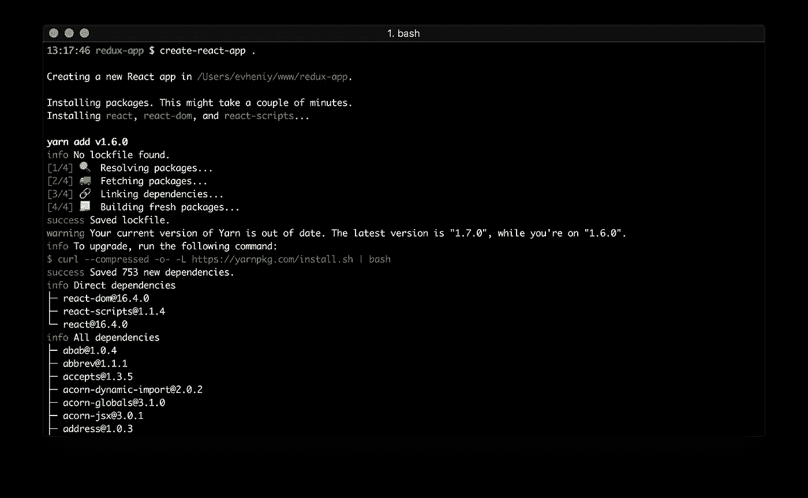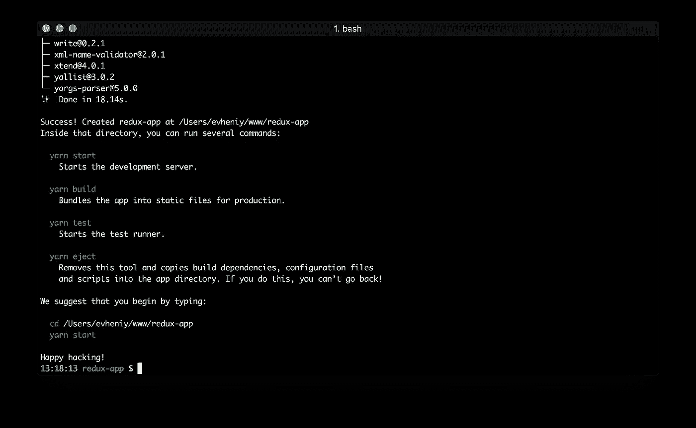

并运行它:

```
yarn start
```

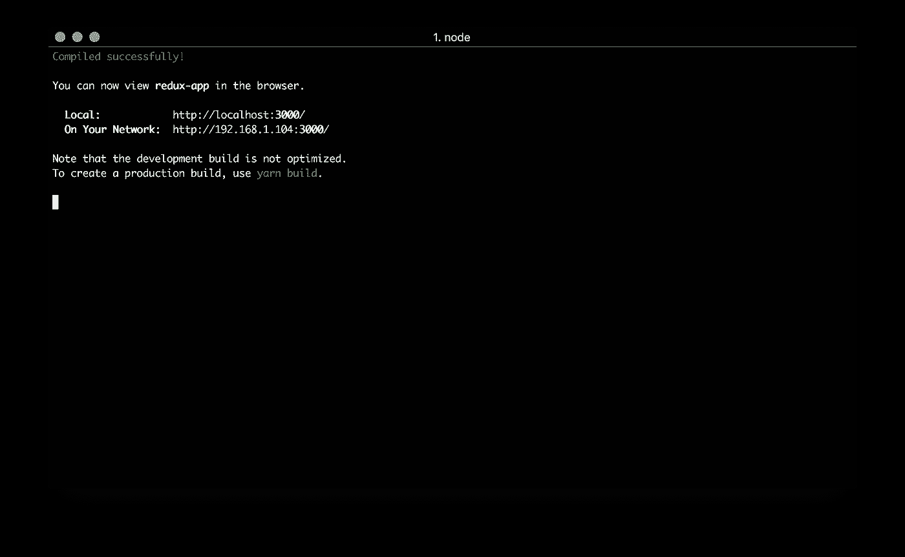

结果:

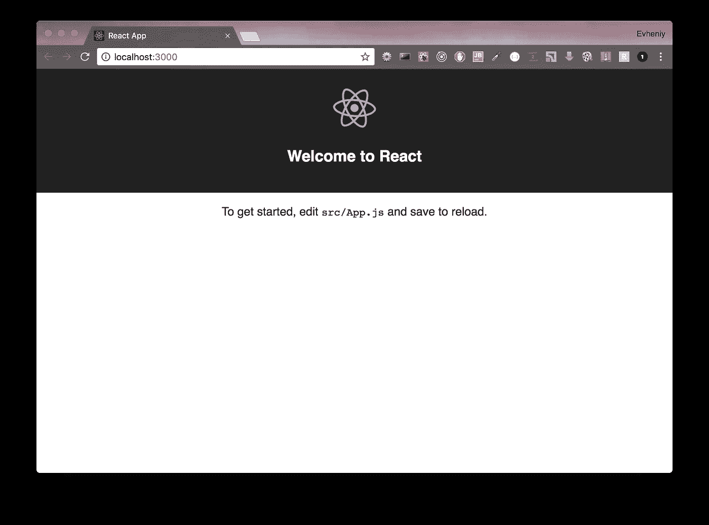

让我们安装 [**redux**](https://redux.js.org/) 和 [**react-redux**](https://github.com/reduxjs/react-redux) :

```
yarn add redux react-redux
```

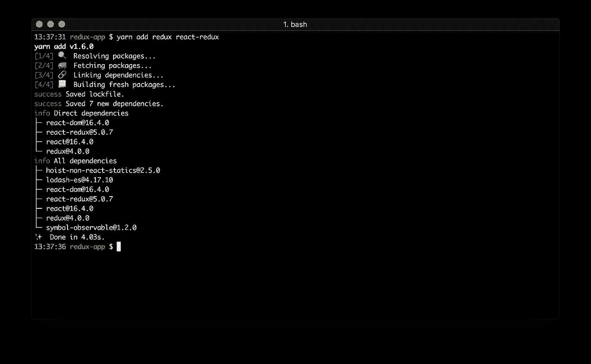

我喜欢创建单个责任模块，并在那里保存所有代码，如 react 组件、redux 和 epics 之类的东西。

但是首先关于我们的应用程序…

我们将使用[**JSONPlaceholder**](https://jsonplaceholder.typicode.com/)服务创建一个表单来提交帖子。接下来，我们将创建另一个模块来处理注释。

**第一步**:我们要创建目录，清空文件。

```
mkdir -p src/modules/post
mkdir src/modules/post/components
mkdir src/modules/post/containers
mkdir src/modules/post/types
mkdir src/modules/post/actions
mkdir src/modules/post/reducer
mkdir src/modules/post/epicstouch src/modules/post/index.js
touch src/modules/post/components/index.jsx
touch src/modules/post/containers/index.js
touch src/modules/post/types/index.js
touch src/modules/post/actions/index.js
touch src/modules/post/reducer/index.js
touch src/modules/post/epics/index.js
```

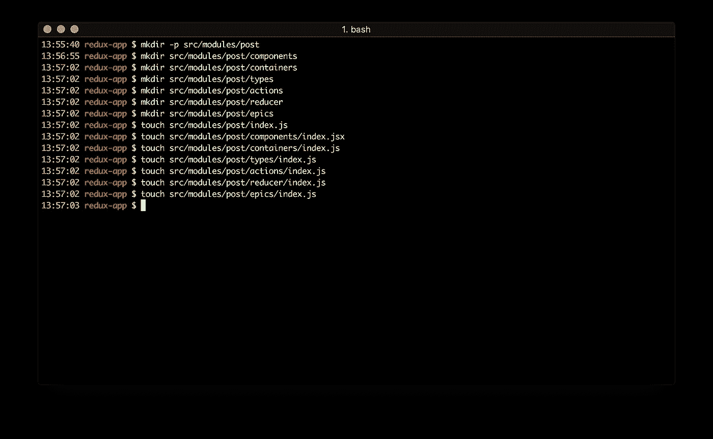

你能在 [**github**](https://github.com/evheniy/redux-app) 上找到的所有代码。

我们的树:

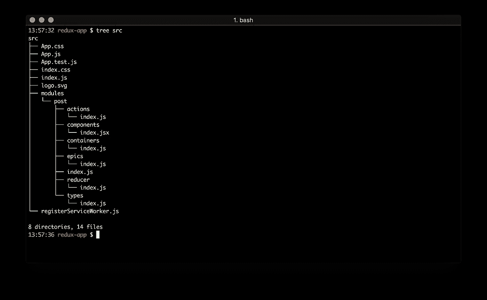

不要忘记安装 [**redux-logger**](https://github.com/evgenyrodionov/redux-logger) 。如果您需要检查当前状态，这很有用:

```
yarn add redux-logger
```

和 [**道具类型**](https://www.npmjs.com/package/prop-types)——它有助于验证 react 组件属性:

```
yarn add prop-types
```

**下一步**:我们需要创建 store 和 reducers。

减速器:

```
touch src/reducers.js
```

带代码:

```
**import** { combineReducers } **from** 'redux';

**import** post **from** './modules/post/reducer';

**export default** combineReducers({ post });
```

并存储:

```
touch src/store.js
```

带代码:

```
**import** { createStore, applyMiddleware } **from** 'redux';
**import** logger **from** 'redux-logger';

**import** reducers **from** './reducers';

**const** store = createStore(
    reducers,
    applyMiddleware(logger)
);

**export default** store;
```

并更新 **src/index.js** :

```
**import** React **from** 'react';
**import** ReactDOM **from** 'react-dom';
**import { Provider } from 'react-redux';**
**import** './index.css';
**import** App **from** './App';
**import store from './store';**
**import** registerServiceWorker **from** './registerServiceWorker';

ReactDOM.render(
    **<Provider store={store}>
        <App />
    </Provider>,**
    document.getElementById('root')
);
registerServiceWorker();
```

## 发布模块代码:

要发送一个帖子，我们需要有可能改变标题，主体和提交形式。对于每个点，我们需要有行动类型和行动创建者:

## 动作类型(src/modules/post/types/index . js):

```
**export const** POST_TITLE = '@@post/TITLE';
**export const** POST_BODY = '@@post/BODY';
**export const** POST_SUBMIT = '@@post/SUBMIT';
```

为了避免冲突，我喜欢给类型加上前缀，比如 **@@post** /TITLE。

## 动作创建者(src/modules/post/actions/index . js):

```
**import** {
    POST_TITLE,
    POST_BODY,
    POST_SUBMIT,
} **from** '../types';

**export const** titleAction = title => ({
    type: POST_TITLE,
    title,
});

**export const** bodyAction = body => ({
    type: POST_BODY,
    body,
});

**export const** submitAction = () => ({
    type: POST_SUBMIT,
});
```

## reducer(src/modules/post/reducer/index . js):

```
**import** { POST_TITLE, POST_BODY } **from** '../types';

**const** defaultState = {
    title: '',
    body: '',
};

**export default** (state = defaultState, action) => {
    **switch** (action.type) {
        **case** POST_TITLE:
        **case** POST_BODY:
            **return** { ...state, ...action };
        **default**:
            **return** state;
    }
};
```

这里我改变了标题和正文的状态。要提交表单，我不需要对 store 进行任何操作(更改)。

## 容器(src/modules/post/containers/index . js):

```
**import** { connect } **from** 'react-redux';
**import** * **as** actions **from** '../actions';

**const** mapStateToProps = state => state.post;
**const** mapDispatchToProps = { ...actions };

**export default** connect(mapStateToProps, mapDispatchToProps);
```

我们有一个简单的容器。因为我们只处理 post 数据，所以它只处理 post 的部分存储和所有动作创建者。

在下一篇文章中，我将展示如何组合来自商店不同部分的数据，并用 [**重新选择**](https://github.com/reduxjs/reselect) 来记忆。

## 组件(src/modules/post/components/index . jsx):

```
**import** React **from** 'react';
**import** PropTypes **from** 'prop-types';

**const** PostComponent = props => (
    <form onSubmit={(event) => {
        event.preventDefault();
        props.submitAction();
    }}>
        <h1>Our form example</h1>
        <div>
            <input
                type="text"
                onChange={event => props.titleAction(event.target.value)}
                value={props.title}
            />
        </div>
        <div>
            <textarea
                onChange={event => props.bodyAction(event.target.value)}
                value={props.body}
            />
        </div>
        <div>
            <input type="submit" value="Submit" />
        </div>
    </form>
);

PostComponent.propTypes = {
    title: PropTypes.string.isRequired,
    body: PropTypes.string.isRequired,
    titleAction: PropTypes.func.isRequired,
    bodyAction: PropTypes.func.isRequired,
    submitAction: PropTypes.func.isRequired,
};

**export default** PostComponent;
```

我们的组件是一个纯函数，它获取属性并返回 JSX 代码。

这里您可以看到正确类型验证。所有属性都是必需的，因为我们每次都从 reducer 存储 post 数据。

## 以及我们的 post 模块入口点(src/modules/post/index.js):

```
**import** PostComponent **from** './components';
**import** PostContainer **from** './containers';

**export default** PostContainer(PostComponent);
```

最后一件事——我们需要更新 **src/App.jsx** 来呈现我们的 post 模块:

```
**import** React, { Component } **from** 'react';
**import** logo **from** './logo.svg';
**import** './App.css';
**import Post from './modules/post';**

**class** App **extends** Component {
  render() {
    **return** (
      <div className="App">
        <header className="App-header">
          
          <h1 className="App-title">Welcome to React</h1>
        </header>
        **<Post />**
      </div>
    );
  }
}

**export default** App;
```

和结果:

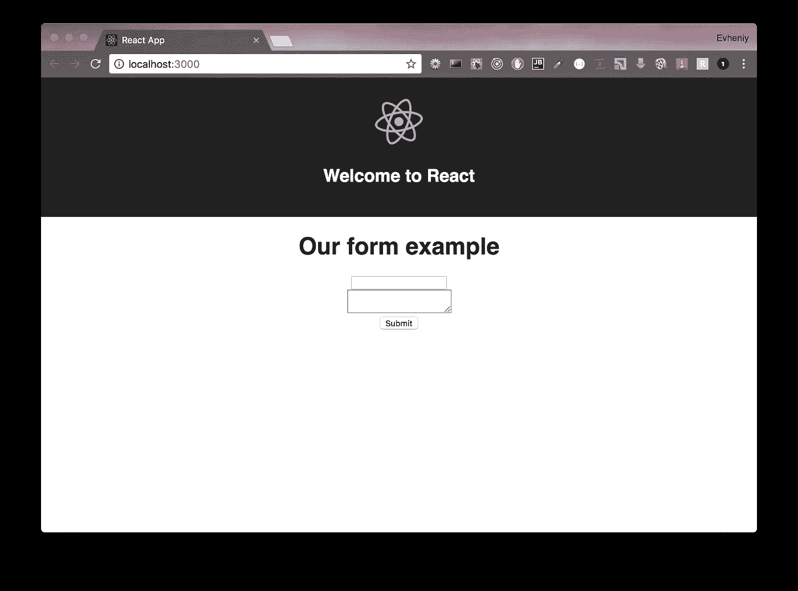

不完美，但是这篇文章不是关于 UI/UX 的。

让我们检查一下我们的行动…

## 标题更改:

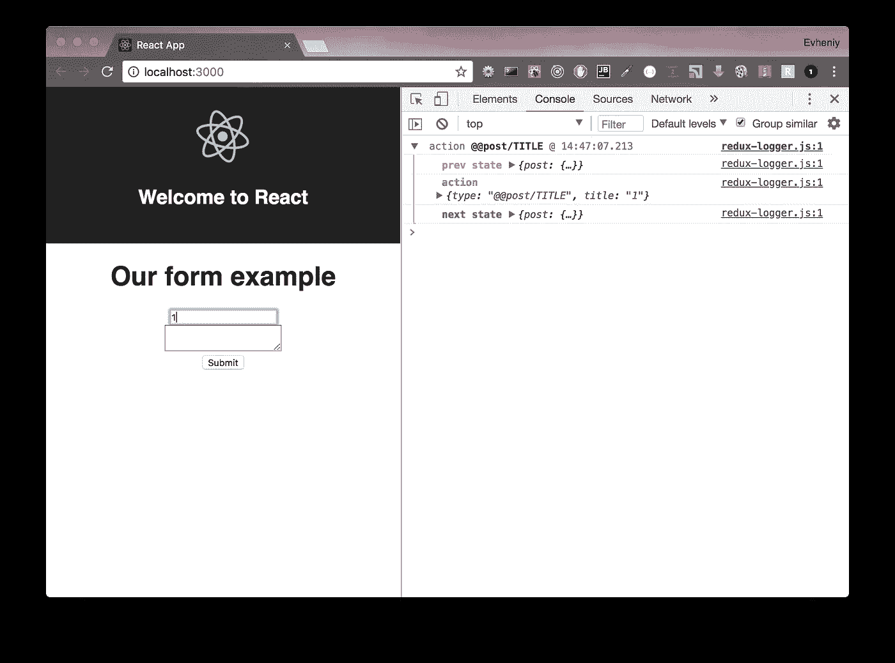

## 身体变化:

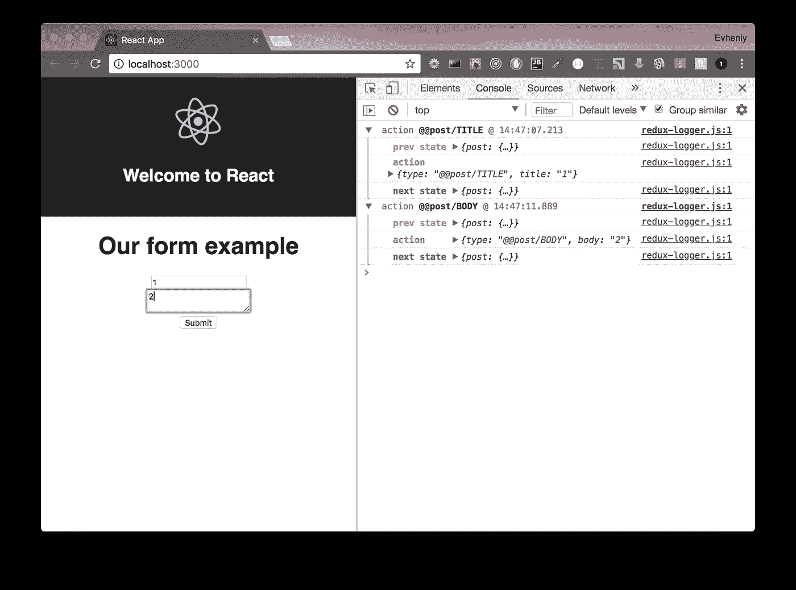

## 并提交:

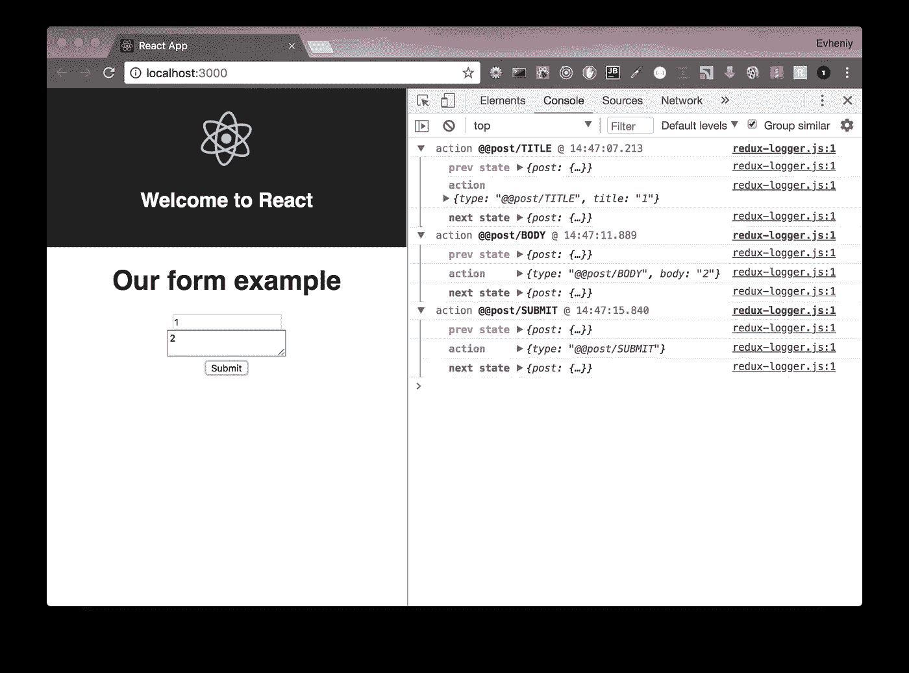

目前就这些。我们刚刚创建了一个简单的 react-redux 应用程序。下一步是测试。

我喜欢使用单一责任包，为开发(yeps，wpb，redux-lazy)和测试创建自己的框架。我将使用下一个包:

*   [**mocha**](https://mochajs.org/) —运行在 Node.js 上和浏览器中的功能丰富的 JavaScript 测试框架，让异步测试变得简单有趣。
*   [**柴**](http://www.chaijs.com/) —一个用于 [**节点**](http://nodejs.org) 和浏览器的 BDD / TDD 断言库，可以愉快地与任何 javascript 测试框架配对。
*   [**sinon**](http://sinonjs.org/)—JavaScript 的独立测试间谍、存根和模拟。适用于任何单元测试框架。
*   [**enzyme**](http://airbnb.io/enzyme/)—React 的 JavaScript 测试实用程序，它使断言、操作和遍历 React 组件的输出变得更加容易。
*   [**NYC**](https://istanbul.js.org/)—JavaScript 测试覆盖工具。

```
yarn add mocha chai sinon enzyme nyc enzyme-adapter-react-16 -D
```

一件小事。要制作生产就绪的应用程序，你不应该忘记代码质量和安全性。对于这个东西，我使用了 [**eslint**](https://eslint.org/) 和 [**airbnb config**](https://www.npmjs.com/package/eslint-config-airbnb) 和 [**nsp**](https://github.com/nodesecurity/nsp) —节点安全平台命令行工具:

```
yarn add eslint eslint-config-airbnb eslint-plugin-import eslint-plugin-jsx-a11y eslint-plugin-react nsp jsdom redux-mock-store babel-register -D
```

Jsdom 是许多 web 标准的纯 JavaScript 实现，特别是 WHATWG DOM 和 HTML 标准，用于 Node.js。

[**Redux-mock-store**](https://github.com/arnaudbenard/redux-mock-store)—一个模拟商店，用于测试您的 Redux 异步动作创建器和中间件。

为了运行所有命令，我使用了[**npm-run-all**](https://www.npmjs.com/package/npm-run-all)——一个 CLI 工具来并行或顺序运行多个 NPM 脚本:

```
yarn add npm-run-all
```

和更新 package.json 脚本部分:

```
"scripts": {
  "start": "react-scripts start",
  "build": "react-scripts build",
  "eject": "react-scripts eject",
  **"test": "npm-run-all test:*",
  "test:security": "nsp check",
  "test:lint": "eslint . --ext .js,.jsx"**
},
```

和一些配置(只需在项目根目录下创建这些文件):

## 。埃斯林提尼奥勒

```
build
coveragesrc/registerServiceWorker.js
```

## 。eslintrc

```
{
  "parser": "babel-eslint",
  "extends": "airbnb",
  "env": {
    "browser": **true**,
    "node": **true**,
    "mocha": **true** }
}
```

让我们运行它:

```
yarn test
```

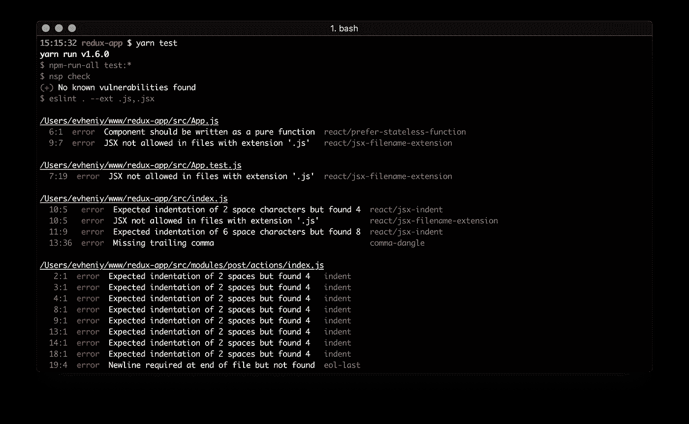

我们看到了很多来自 eslint 的错误和警告。这有助于所有团队保持相同的代码风格。修复后:

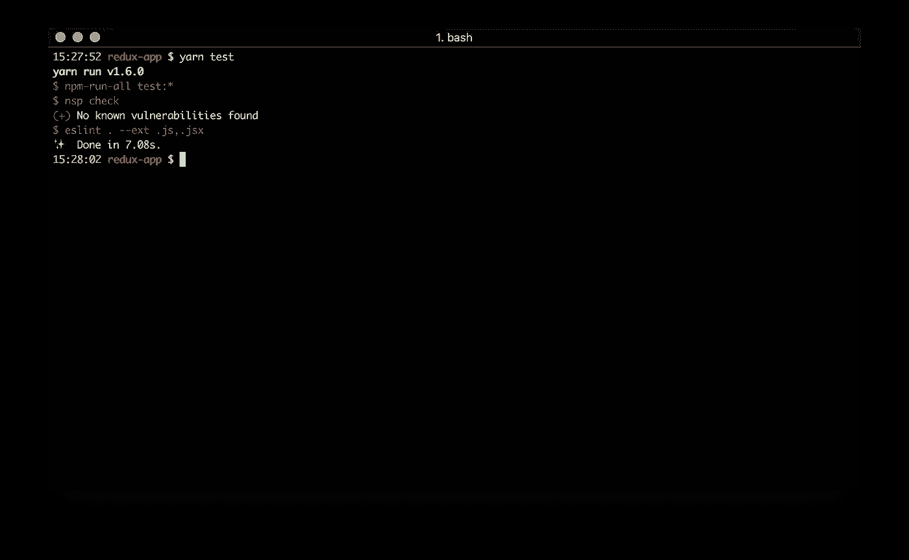

你可以在 [**github 资源库**](https://github.com/evheniy/redux-app) 中找到所有改动。

别忘了关于 [**axios**](https://github.com/axios/axios) :

```
yarn add axios
```

我喜欢这个客户端，因为我可以在客户端和后端使用它。它可以通过超时取消请求。你甚至可以用它作为 [**graphQL**](https://graphql.org/learn/) 客户端。

## 下一步是测试…

首先，我们需要创建使用 jsdom 的助手:

tests/helper.js :

```
require('babel-register')({
  presets: [
    'react',
    'env',
  ],
  plugins: [
    'transform-object-rest-spread',
  ],
});**const** { configure } = require('enzyme');
**const** Adapter = require('enzyme-adapter-react-16');

**const** axios = require('axios');
**const** httpAdapter = require('axios/lib/adapters/http');

axios.defaults.host = 'http://localhost:3000';
axios.defaults.adapter = httpAdapter;

configure({ adapter: **new** Adapter() });

**const** { JSDOM } = require('jsdom');

**const** exposedProperties = ['window', 'navigator', 'document'];

**const** { window } = **new** JSDOM('', { url: 'http://localhost' });
global.document = window.document;
global.window = window;
Object.keys(document.defaultView).forEach((property) => {
  **if** (**typeof** global[property] === 'undefined') {
    exposedProperties.push(property);
    global[property] = document.defaultView[property];
  }
});

global.navigator = {
  userAgent: 'node.js',
};

global.localStorage = {
  setItem() {},
};

global.documentRef = document;
```

我添加了 babel-register 来为旧的 ES5 编译一个新的 ES 标准(impors，object spread…)。之后，我配置了酶适配器和 axios 客户端。以及最重要的部分— jsdom 配置。

## 。nycrc

```
{
  "extension": [".js",".jsx"],
  "require": ["./tests/helper.js"],
  "exclude": [
    "node_modules",
    "build",
    "coverage",
    "tests",
    "src/registerServiceWorker.js"
  ],
  "check-coverage": true,
  "per-file": false,
  "statements": 80,
  "branches": 80,
  "functions": 80,
  "lines": 80,
  "reporter": [
    "lcov",
    "text",
    "text-summary",
    "html"
  ],
  "all": true
}
```

这是纽约市的配置。我们用它来获取代码覆盖率信息。

正如您在 config 中看到的——我们需要测试 js/jsx 文件，添加我们的助手并从测试中排除一些目录和文件。其他参数有助于覆盖率报告。

要运行它，在 **package.json** 中添加一行:

```
"scripts": {
  "start": "react-scripts start",
  "build": "react-scripts build",
  "eject": "react-scripts eject",
  "test": "npm-run-all test:*",
  "test:security": "nsp check",
  "test:lint": "eslint . --ext .js,.jsx",
  **"test:coverage": "nyc mocha --timeout 5000 tests/**/*.{js,jsx}"**
},
```

这里我们用 mocha 运行 nyc，我们设置测试超时和测试文件的路径。

如果您只想运行摩卡而不想运行 nyc:

```
mocha --timeout 5000 --require tests/helper.js tests/**/*.{js,jsx}
```

现在我们可以运行测试了:

```
yarn test
```

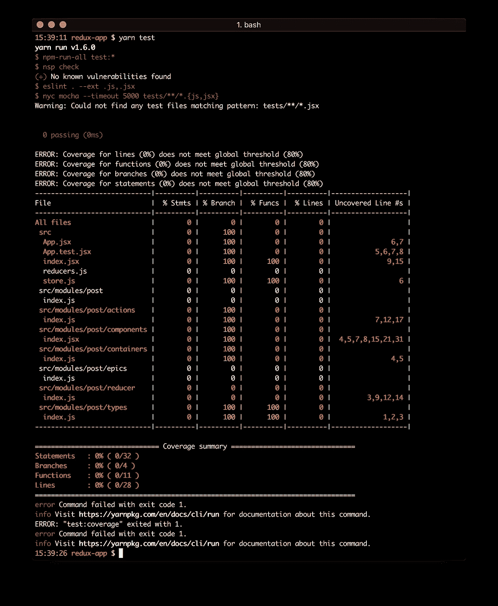

我们没有通过，因为我们没有任何测试。

让我们创建它…

## 动作类型(**测试/模块/发布/类型/索引. js** ):

```
**import** { expect } **from** 'chai';
**import** * **as** types **from** '../../../../src/modules/post/types';

describe('Testing post module types', () => {
  it('should test POST_TITLE', () => {
    expect(types.POST_TITLE).to.be.equal('@@post/TITLE');
  });

  it('should test POST_BODY', () => {
    expect(types.POST_BODY).to.be.equal('@@post/BODY');
  });

  it('should test POST_SUBMIT', () => {
    expect(types.POST_SUBMIT).to.be.equal('@@post/SUBMIT');
  });
});
```

每次测试我都需要从**柴**包中导入**期望**工具。这有助于用 BDD 风格做决定。每次测试应从**开始，描述**部分，并包括**到**部分。

## 动作创建者(**测试/模块/发布/动作/索引. js** ):

```
**import** { expect } **from** 'chai';
**import** * **as** actions **from** '../../../../src/modules/post/actions';
**import** * **as** types **from** '../../../../src/modules/post/types';

describe('Testing post module actions', () => {
  it('should test titleAction', () => {
    **const** title = 'title';

    **const** action = actions.titleAction(title);

    expect(action).to.be.a('object');

    expect(action.type).to.be.equal(types.POST_TITLE);
    expect(action.title).to.be.equal(title);
  });

  it('should test bodyAction', () => {
    **const** body = 'body';

    **const** action = actions.bodyAction(body);

    expect(action).to.be.a('object');

    expect(action.type).to.be.equal(types.POST_BODY);
    expect(action.body).to.be.equal(body);
  });

  it('should test submitAction', () => {
    **const** action = actions.submitAction();

    expect(action).to.be.a('object');

    expect(action.type).to.be.equal(types.POST_SUBMIT);
  });
});
```

如你所见，我们使用纯函数。没有副作用。使用相同的参数总是得到相同的结果。易于测试—只需运行它并检查结果。

动作创建者总是返回至少有一个属性的对象——动作类型。这是与商店合作的必要参数，我们应该每次都测试它。

## 容器(测试/模块/发布/容器/索引. jsx):

```
**import** React **from** 'react';
**import** { mount } **from** 'enzyme';
**import** { expect } **from** 'chai';
**import** { spy } **from** 'sinon';
**import** configureMockStore **from** 'redux-mock-store';
**import** { Provider } **from** 'react-redux';

**import** PostContainer **from** '../../../../src/modules/post/containers';

describe('Testing post module containers', () => {
  it('should test containers with login', () => {
    **const** Component = spy(() => **null**);
    **const** Container = PostContainer(Component);

    **const** title = 'title';
    **const** body = 'body';

    **const** mockStore = configureMockStore([]);
    **const** store = mockStore({
      post: {
        title,
        body,
      },
    });

    **const** wrapper = mount(<Provider store={store}><Container /></Provider>);

    expect(wrapper.find(Component)).to.have.length(1);

    **const** props = wrapper.find(Component).props();

    expect(props.title).to.be.equal(title);
    expect(props.body).to.be.equal(body);
    expect(props.titleAction).to.be.a('function');
    expect(props.bodyAction).to.be.a('function');
    expect(props.submitAction).to.be.a('function');
  });
});
```

在这个测试中，我们使用 **mount** ，因为我们需要使用存储。由于 redux 是单例的，要运行每个测试，我们应该清除它。Redux-mock-store 对此有所帮助。

接下来，我们创建商店，安装容器并检查组件道具。我们不需要真组件，用 sinon **spy** 就行了。

## 组件(**测试/模块/post/containers/index.jsx** ):

```
**import** React **from** 'react';
**import** { shallow } **from** 'enzyme';
**import** { expect } **from** 'chai';
**import** { spy } **from** 'sinon';

**import** PostComponent **from** '../../../../src/modules/post/components';

describe('Testing post module PostComponent', () => {
  **const** title = 'title';
  **const** body = 'body';
  **const** titleAction = () => 1;
  **const** bodyAction = () => 1;
  **const** submitAction = () => 1;

  **const** props = {
    title,
    body,
    titleAction,
    bodyAction,
    submitAction,
  };

  it('should test PostComponent', () => {
    **const** wrapper = shallow(<PostComponent {...props} />);

    expect(wrapper.find('form')).to.have.length(1);

    expect(wrapper.find('h1')).to.have.length(1);
    expect(wrapper.find('h1').props().children).to.be.equal('Our form example');

    expect(wrapper.find('div')).to.have.length(3);

    expect(wrapper.find('input')).to.have.length(2);

    **const** titleProps = wrapper.find('input').first().props();
    expect(titleProps.type).to.be.equal('text');
    expect(titleProps.value).to.be.equal(title);
    expect(titleProps.onChange).to.be.a('function');

    expect(wrapper.find('textarea')).to.have.length(1);

    **const** bodyProps = wrapper.find('textarea').props();
    expect(bodyProps.value).to.be.equal(body);
    expect(bodyProps.onChange).to.be.a('function');

    **const** submitProps = wrapper.find('input').last().props();
    expect(submitProps.type).to.be.equal('submit');
    expect(submitProps.value).to.be.equal('Submit');
  });

  it('should test PostComponent titleAction', () => {
    **const** onChange = spy();

    **const** wrapper = shallow(<PostComponent {...props} **titleAction**={onChange} />);

    expect(wrapper.find('input')).to.have.length(2);

    **const** titleProps = wrapper.find('input').first().props();
    expect(titleProps.type).to.be.equal('text');
    expect(titleProps.value).to.be.equal(title);
    expect(titleProps.onChange).to.be.a('function');

    wrapper.find('input').first().simulate('change', { target: { value: 'test' } });
    expect(onChange.withArgs('test').calledOnce).to.be.equal(**true**);
  });

  it('should test PostComponent bodyAction', () => {
    **const** onChange = spy();

    **const** wrapper = shallow(<PostComponent {...props} **bodyAction**={onChange} />);

    expect(wrapper.find('textarea')).to.have.length(1);

    **const** bodyProps = wrapper.find('textarea').props();
    expect(bodyProps.value).to.be.equal(body);
    expect(bodyProps.onChange).to.be.a('function');

    wrapper.find('textarea').simulate('change', { target: { value: 'test' } });
    expect(onChange.withArgs('test').calledOnce).to.be.equal(**true**);
  });

  it('should test PostComponent submitAction', () => {
    **const** onChange = spy();
    **const** preventDefault = spy();

    **const** wrapper = shallow(<PostComponent {...props} **submitAction**={onChange} />);

    expect(wrapper.find('form')).to.have.length(1);

    wrapper.find('form').simulate('submit', { preventDefault });
    expect(onChange.calledOnce).to.be.equal(**true**);
    expect(preventDefault.calledOnce).to.be.equal(**true**);
  });
});
```

为了测试每个组件(如果它是作为一个纯函数创建的)，我们只需要制作 **shallow** 渲染和测试道具。有时候我们需要模拟 DOM 动作，比如**点击**或者**提交**。

## 入口点(测试/模块/发布/索引. jsx):

```
**import** React **from** 'react';
**import** { mount } **from** 'enzyme';
**import** { expect } **from** 'chai';
**import** { spy } **from** 'sinon';
**import** configureMockStore **from** 'redux-mock-store';
**import** { Provider } **from** 'react-redux';

**import** PostModule **from** '../../../src/modules/post';
**import** PostComponent **from** '../../../src/modules/post/components';

describe('Testing post module', () => {
  it('should test post module', () => {
    **const** title = 'title';
    **const** body = 'body';

    **const** mockStore = configureMockStore([]);
    **const** store = mockStore({
      post: {
        title,
        body,
      },
    });

    **const** wrapper = mount(<Provider store={store}><PostModule /></Provider>);

    expect(wrapper.find(PostComponent)).to.have.length(1);

    **const** props = wrapper.find(PostComponent).props();

    expect(props.title).to.be.equal(title);
    expect(props.body).to.be.equal(body);
    expect(props.titleAction).to.be.a('function');
    expect(props.bodyAction).to.be.a('function');
    expect(props.submitAction).to.be.a('function');
  });
});
```

同容器试验一样。

如果我们禁用对除我们的模块之外的所有其他代码的检查:

## 。nycrc

```
{
  "extension": [".js",".jsx"],
  "require": ["./tests/helper.js"],
  "exclude": [
    "node_modules",
    "build",
    "coverage",
    "tests",
    "src/registerServiceWorker.js",
    **"src/*.*"**
  ],
  "check-coverage": true,
  "per-file": false,
  "statements": 80,
  "branches": 80,
  "functions": 80,
  "lines": 80,
  "reporter": [
    "lcov",
    "text",
    "text-summary",
    "html"
  ],
  "all": true
}
```

我们有完整的代码覆盖:

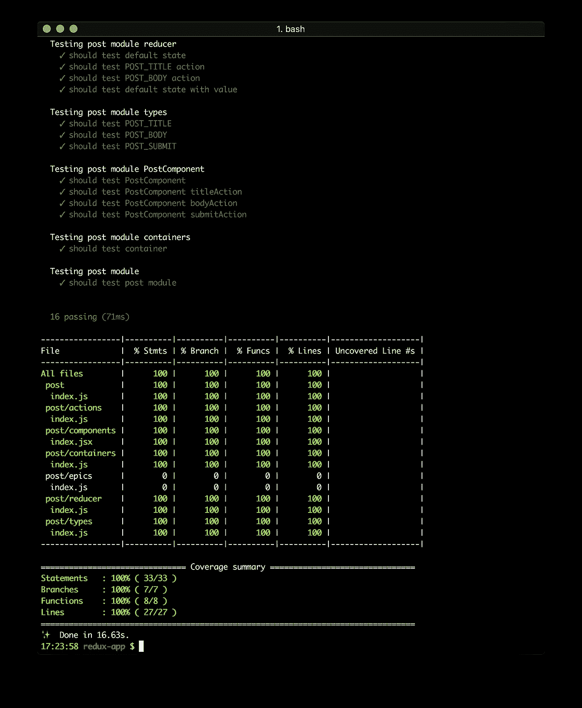

因此，正如你所看到的，我们花了很多时间来创建和测试 redux 的东西。为了节省时间，我创建了 redux-lazy。我在 [**上一部**](/@evheniybystrov/react-redux-for-lazy-developers-b551f16a456f) 中描述过。现在我要删除所有 redux 代码，用 7 行代码代替。

```
yarn add redux-lazy
```

并添加到我们的模块(**src/modules/post/rl/index . js**):

```
**import** RL **from** 'redux-lazy';

**const** rl = **new** RL('post');
rl.addAction('title', { title: '' });
rl.addAction('body', { body: '' });
rl.addAction('submit');

**const** result = rl.flush();

**export default** result;
```

让我们更新我们的行动和减速器:

## 动作创建者:

```
**import** rl **from** '../rl';

**const {
  POST_TITLE,
  POST_BODY,
  POST_SUBMIT,
} = rl.types;**

**export const** titleAction = title => ({
  type: POST_TITLE,
  title,
});

**export const** bodyAction = body => ({
  type: POST_BODY,
  body,
});

**export const** submitAction = () => ({
  type: POST_SUBMIT,
});
```

## 减速器:

```
**import** rl **from** '../rl';

**const {
  POST_TITLE,
  POST_BODY,
} = rl.types;**

**const** defaultState = {
  title: '',
  body: '',
};

**export default** (state = defaultState, action) => {
  **switch** (action.type) {
    **case** POST_TITLE:
    **case** POST_BODY:
      **return** { ...state, ...action };
    **default**:
      **return** state;
  }
};
```

## 类型测试:

```
**import** { expect } **from** 'chai';
**import** rl **from** '../../../../src/modules/post/rl';

**const** { types } = rl;

describe('Testing post module types', () => {
  it('should test POST_TITLE', () => {
    expect(types.POST_TITLE).to.be.equal('@@post/TITLE');
  });

  it('should test POST_BODY', () => {
    expect(types.POST_BODY).to.be.equal('@@post/BODY');
  });

  it('should test POST_SUBMIT', () => {
    expect(types.POST_SUBMIT).to.be.equal('@@post/SUBMIT');
  });
});
```

测试之后，我们看到了相同的结果。让我们删除类型文件并再次运行测试。没关系。

因此，我们至少可以将手动创建类型和冗余创建类型结合起来。

**下一步**:动作创建者。

## 减速器:

```
**import** { connect } **from** 'react-redux';
**import** rl **from** '../rl';

**const { actions } = rl;**

**const** mapStateToProps = state => state.post;
**const** mapDispatchToProps = { ...actions };

**export default** connect(mapStateToProps, mapDispatchToProps);
```

## 和测试:

```
**import** { expect } **from** 'chai';
**import** rl **from** '../../../../src/modules/post/rl';

**const { types, actions } = rl;**

describe('Testing post module actions', () => {
  it('should test titleAction', () => {
    **const** title = 'title';

    **const** action = actions.titleAction(**{ title }**);

    expect(action).to.be.a('object');

    expect(action.type).to.be.equal(types.POST_TITLE);
    expect(**action.payload.title**).to.be.equal(title);
  });

  it('should test bodyAction', () => {
    **const** body = 'body';

    **const** action = actions.bodyAction(**{ body }**);

    expect(action).to.be.a('object');

    expect(action.type).to.be.equal(types.POST_BODY);
    expect(**action.payload.body**).to.be.equal(body);
  });

  it('should test submitAction', () => {
    **const** action = actions.submitAction();

    expect(action).to.be.a('object');

    expect(action.type).to.be.equal(types.POST_SUBMIT);
  });
});
```

**下一步**:减速器( **src/reducers.js** )

```
**import** { combineReducers } **from** 'redux';

**import** rl **from** './modules/post/rl';

**const** { nameSpace: postNameSpace, reducer: postReducer } = rl;

**export default** combineReducers({ [postNameSpace]: postReducer });
```

我们可以删除它。

**最后一步**是容器。如果它如此简单(只是来自模块的状态的一部分和来自模块的所有动作)，我们也可以从 redux-lazy 中得到它。

我们最后的切入点:

```
**import** PostComponent **from** './components';
**import** rl **from** './rl';

**const** { Container: PostContainer } = rl;

**export default** PostContainer(PostComponent);
```

如果我们运行我们的应用程序，我们会看到相同的结果:

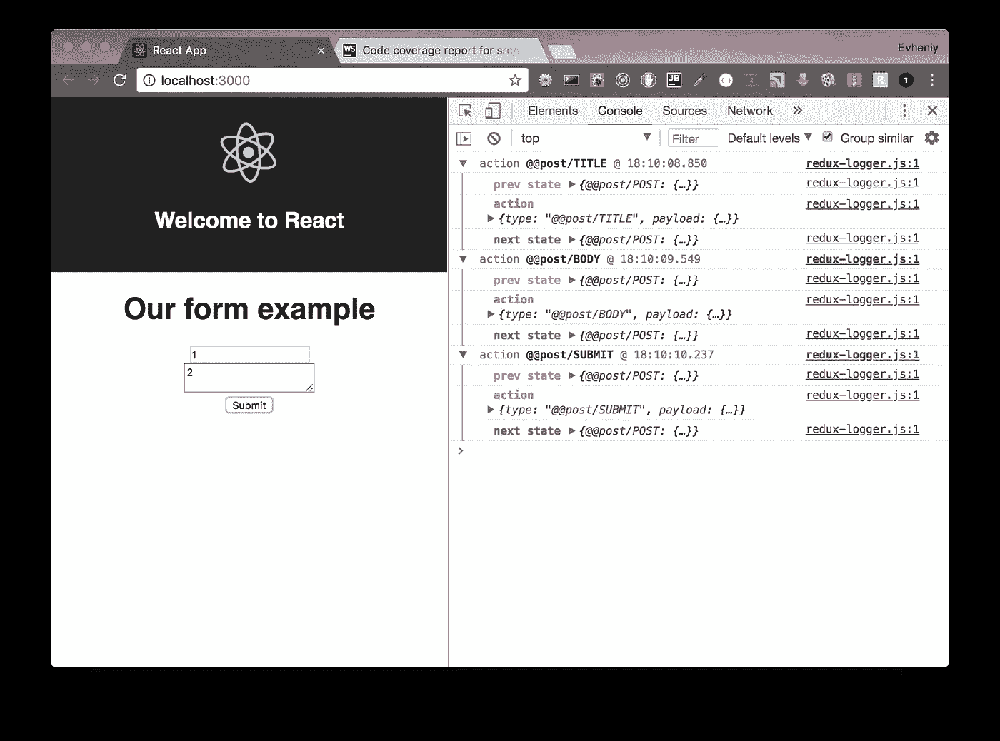

如果我们进行测试:

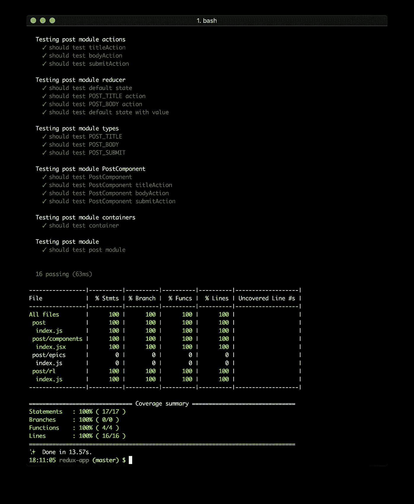

我们可以看到相同的测试，相同的功能，但代码更少。让我们看看树:

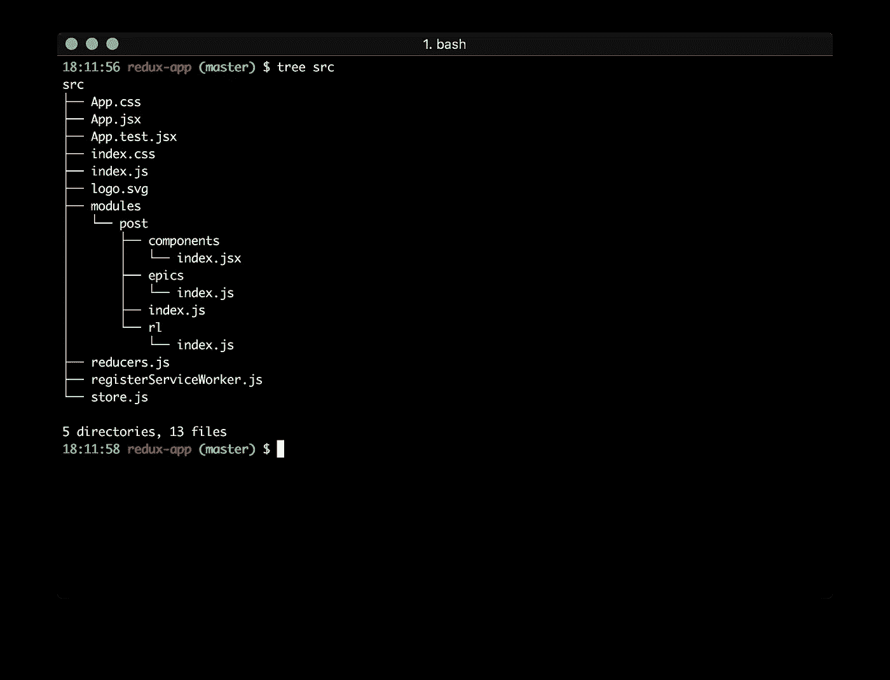

您可以在浏览器中打开覆盖率报告。只要打开 **coverage/index.html**

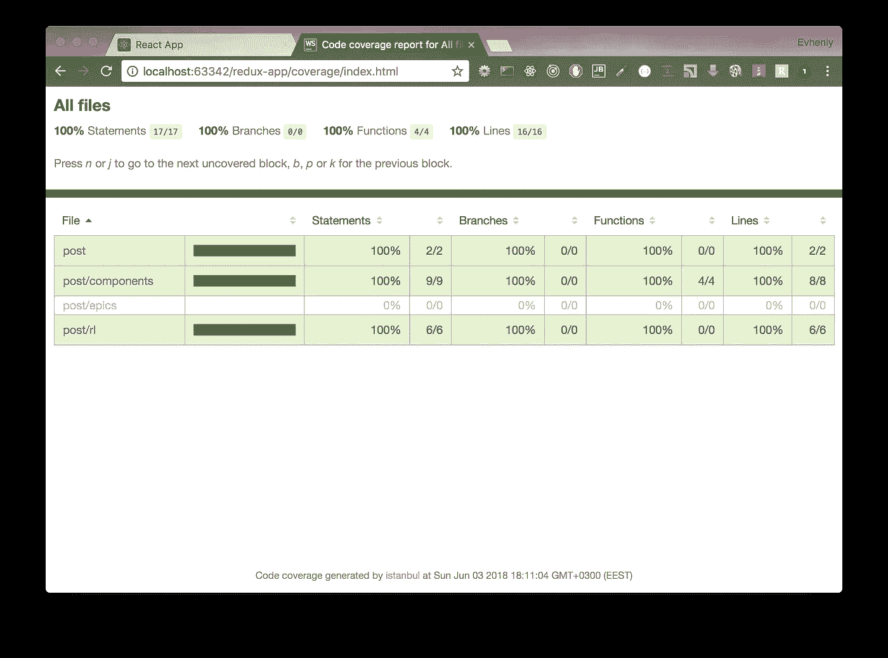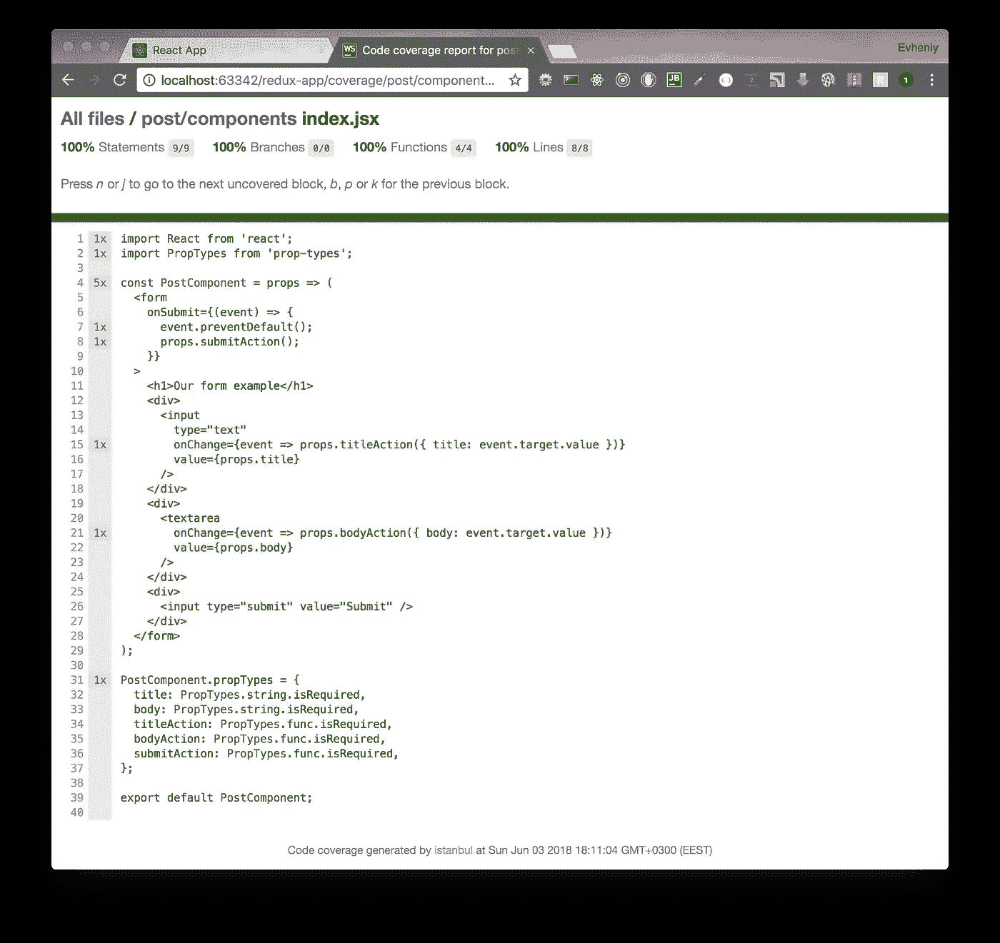

这篇文章比我计划的要大。所以我可以在下一部分给出更多的例子。

但是本文的主要目标是展示使用 redux-lazy 使用 redux 有多快和多容易。我们制作了许多代码行来获取/设置要存储的数据。

在第一份代码覆盖率报告中，我们有 27 行代码。现在我们有 16 个。同样的功能，我们减少了 59%的代码。

再一次...一些开发人员在 reducer 中加入了很多逻辑(保存前更改数据 br)。但是很难支撑。所有代码都应该像纯函数一样简单:

**道具= > JSX**

有什么容易的？

保持你的组件和存储的纯净，把所有的逻辑转移到特殊的工具上，比如 redux-observable 和 redux-lazy。

[](https://hackernoon.com/react-redux-for-lazy-developers-part-3-319b639a22c3) [## React —为懒惰的开发人员提供 redux。第三部分

### 这是关于创建 react redux 应用程序系列的最后一部分。

hackernoon.com](https://hackernoon.com/react-redux-for-lazy-developers-part-3-319b639a22c3)