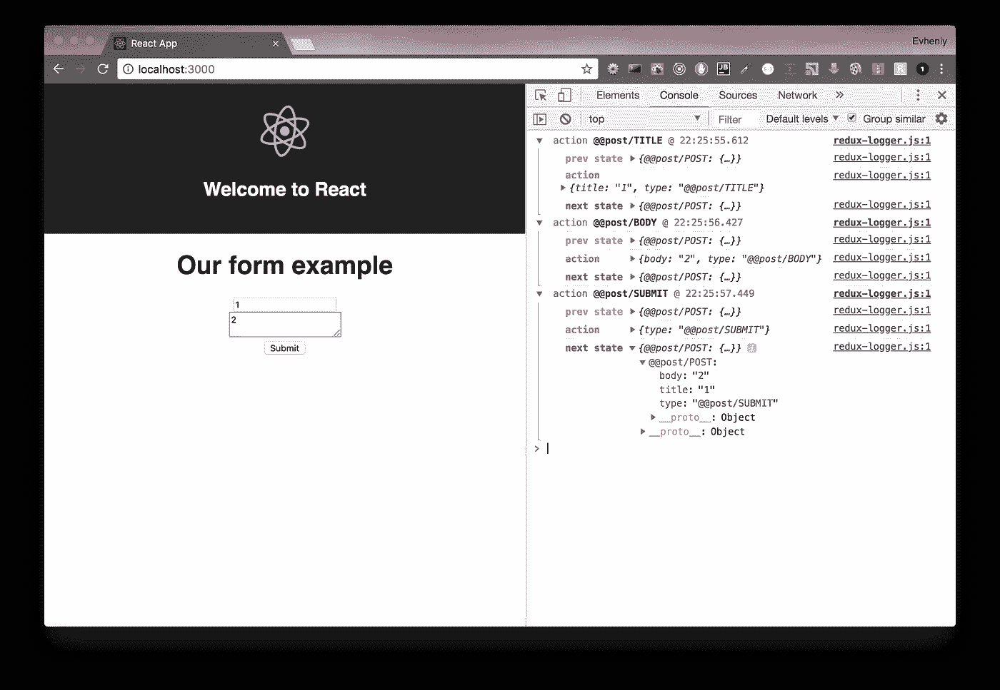
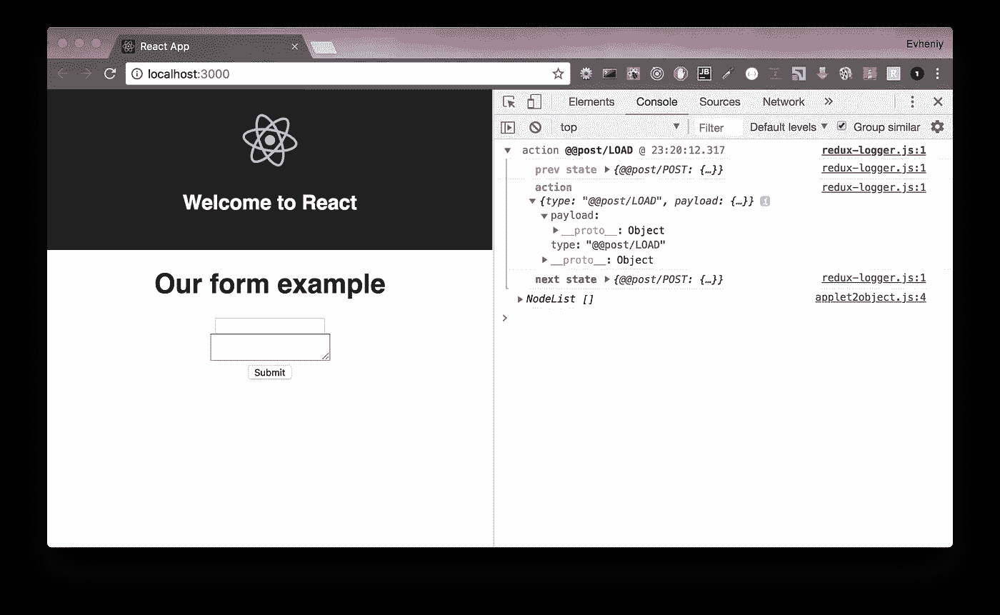
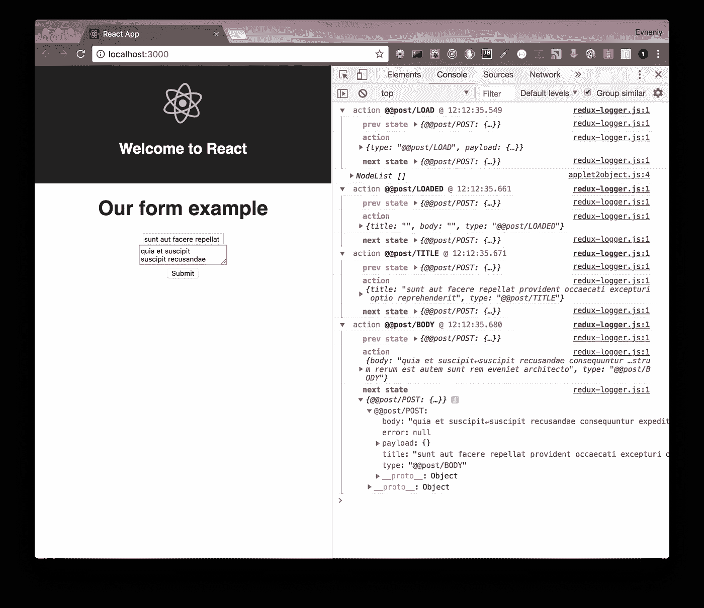
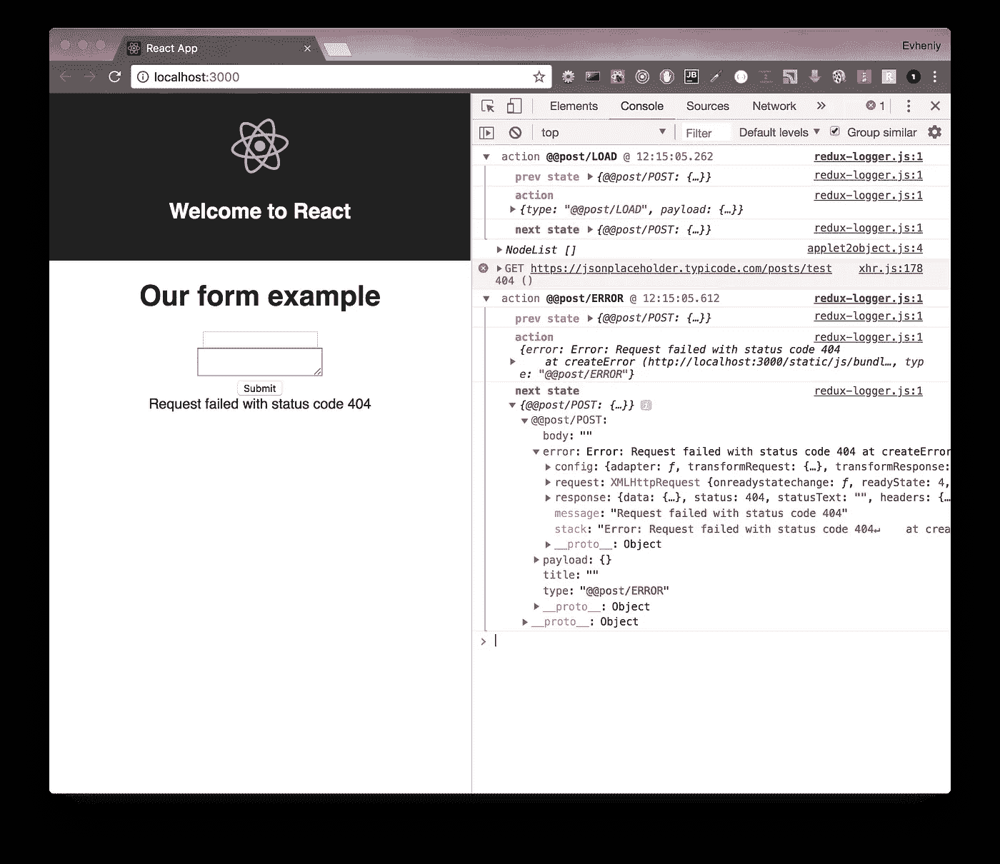

# React —为懒惰的开发人员提供 redux。第三部分

> 原文：<https://medium.com/hackernoon/react-redux-for-lazy-developers-part-3-319b639a22c3>

这是关于创建 react redux 应用程序系列的最后一部分。


在前两部分中，我描述了如何创建经典的 react redux 应用程序，然后我对应用程序 post 模块进行了全面的测试，并用 7 行代码 [**redux Lazy**](https://github.com/evheniy/redux-lazy) 替换了所有的 redux 内容(动作类型、动作创建者、缩减者和容器)，这是一个为使 Redux 开发更具声明性而创建的库。

在本文中，我将展示如何使用 [**redux-observable**](https://redux-observable.js.org/) 、 [**recompose**](https://github.com/acdlite/recompose) 和 [**reselect**](https://github.com/reduxjs/reselect) 在 react redux 应用程序中添加逻辑。

链接到以前的部分:

[](https://hackernoon.com/react-redux-for-lazy-developers-b551f16a456f) [## React —为懒惰的开发人员提供 redux

### 每次在 react 应用程序中使用 redux 时，我们都要花费大量时间来创建动作类型、动作创建者、减少者…大多数…

hackernoon.com](https://hackernoon.com/react-redux-for-lazy-developers-b551f16a456f) 

和

[](/@evheniybystrov/react-redux-for-lazy-developers-part-2-d0c60123592f) [## React —为懒惰的开发人员提供 redux。第二部分

### 在本文中，我将继续讨论使用 redux-lazy 创建 react redux 应用程序。

medium.com](/@evheniybystrov/react-redux-for-lazy-developers-part-2-d0c60123592f) 

我将使用第二部分的代码。可以在 [**github**](https://github.com/evheniy/redux-app) 上找到。

我更新了[**redux-lazy**](https://github.com/evheniy/redux-lazy)**:**[**options docs**](https://github.com/evheniy/redux-lazy/blob/master/docs/options.md)，new [**tests**](https://github.com/evheniy/redux-lazy/tree/master/tests) …

在小的重构之后，你可以得到和使用 redux 一样的结果(甚至更好——见表单 **onSubmit** ):

## rl . js(src/模块/post/rl/index.js)

之前:

```
**import** RL **from** 'redux-lazy';

**const** rl = **new** RL('post');
rl.addAction('title', { title: '' });
rl.addAction('body', { body: '' });
rl.addAction('submit');

**const** result = rl.flush();

**export default** result;
```

现在:

```
**import** RL **from** 'redux-lazy';

**const** rl = **new** RL('post');
rl.addAction(
  'title',
  { title: '' },
  **{ isFormElement: true, asParams: 'title' },**
);
rl.addAction(
  'body',
  { body: '' },
  **{ isFormElement: true, asParams: 'body' },**
);
rl.addAction(
  'submit',
  {},
  **{ isForm: true },**
);

**const** result = rl.flush();

**export default** result;
```

## 组件(src/modules/post/components/index . jsx)

之前:

```
**import** React **from** 'react';
**import** PropTypes **from** 'prop-types';

**const** PostComponent = props => (
  <form
    **onSubmit={(event) => {
      event.preventDefault();
      props.submitAction();
    }}**
  >
    <h1>Our form example</h1>
    <div>
      <input
        type="text"
        **onChange={event => props.titleAction({ title: event.target.value })}**
        value={props.title}
      />
    </div>
    <div>
      <textarea
        **onChange={event => props.bodyAction({ body: event.target.value })}**
        value={props.body}
      />
    </div>
    <div>
      <input type="submit" value="Submit" />
    </div>
  </form>
);

PostComponent.propTypes = {
  title: PropTypes.string.isRequired,
  body: PropTypes.string.isRequired,
  titleAction: PropTypes.func.isRequired,
  bodyAction: PropTypes.func.isRequired,
  submitAction: PropTypes.func.isRequired,
};

**export default** PostComponent;
```

现在:

```
**import** React **from** 'react';
**import** PropTypes **from** 'prop-types';

**const** PostComponent = props => (
  **<form onSubmit={props.submitAction}>**
    <h1>Our form example</h1>
    <div>
      <input
        type="text"
        **onChange={props.titleAction}**
        value={props.title}
      />
    </div>
    <div>
      <textarea
        **onChange={props.bodyAction}**
        value={props.body}
      />
    </div>
    <div>
      <input type="submit" value="Submit" />
    </div>
  </form>
);

PostComponent.propTypes = {
  title: PropTypes.string.isRequired,
  body: PropTypes.string.isRequired,
  titleAction: PropTypes.func.isRequired,
  bodyAction: PropTypes.func.isRequired,
  submitAction: PropTypes.func.isRequired,
};

**export default** PostComponent;
```

无**有效载荷**动作:



再一次...

Store 是一个*数据库*。设置器是*动作* *创建器*和*减速器*，获取器是*选择器*用于[连接**mapStateToProps**和](https://github.com/reduxjs/react-redux/blob/master/docs/api.md#connectmapstatetoprops-mapdispatchtoprops-mergeprops-options)。所有逻辑应该在其他地方。**归约器或动作内部没有逻辑。**这可能就像存储过程一样——有很多逻辑，却没有好的测试方法。

正如我之前说过的，我喜欢以函数的方式使用 React。我使用像纯函数一样的组件。

很容易描述为一个 JS 箭头函数:**道具= > JSX** 。

当您需要添加本地状态或 react 组件生命周期时，您可以使用 [**重组**](https://github.com/acdlite/recompose)——一个用于功能组件和高阶组件的 react 实用程序带。

我用一些例子写了另一篇文章:

[](https://blog.cloudboost.io/react-functional-way-c533fceda2ce) [## 反应:功能方式

### 正如您可能知道的，使用 react 可以使用函数或类——使用无状态和有状态组件。在…

blog.cloudboost.io](https://blog.cloudboost.io/react-functional-way-c533fceda2ce) 

我们将使用 recompose[**life cycle**](https://github.com/acdlite/recompose/blob/master/docs/API.md#lifecycle)来获取组件渲染时的 post 数据。

首先，我们需要安装它:

```
yarn add recompose
```

然后我们应该为我们的组件——高阶组件(HOC)创建包装器。让我们创建**src/modules/post/containers/life cycle . js**:

```
**import** { lifecycle } **from** 'recompose';

**export default** lifecycle({
  componentDidMount() {
    **this**.props.loadAction();
  },
});
```

并更新我们的 Redux Lazy 模型(**src/modules/post/rl/index . js**):

```
**import** RL **from** 'redux-lazy';

**const** rl = **new** RL('post');

rl.addAction('title', { title: '' }, { isFormElement: **true**, asParams: 'title' });
rl.addAction('body', { body: '' }, { isFormElement: **true**, asParams: 'body' });
rl.addAction('submit', {}, { isForm: **true** });
rl.addAction('load');
rl.addAction('loaded', { title: '', body: '' }, { asParams: ['title', 'body'] });
rl.addAction('error', { error: **null** }, { asParams: 'error' });

**const** result = rl.flush();

**const** {
  nameSpace,
  actions: {
    bodyAction,
    errorAction,
    loadAction,
    loadedAction,
    submitAction,
    titleAction,
  },
  types: {
    POST_BODY,
    POST_ERROR,
    POST_LOAD,
    POST_LOADED,
    POST_SUBMIT,
    POST_TITLE,
  },
} = result;

**export default** result;

**export** {
  nameSpace,
  bodyAction,
  errorAction,
  loadAction,
  loadedAction,
  submitAction,
  titleAction,
  POST_BODY,
  POST_ERROR,
  POST_LOAD,
  POST_LOADED,
  POST_SUBMIT,
  POST_TITLE,
};
```

我添加了**加载动作**来开始加载 post 数据，**加载动作** —显示我们没有错误，**错误动作** —如果我们有问题，将错误保存在存储中，然后我们可以在页面上显示它。

我导出**名称空间**、**类型**和**动作**以避免每次当我需要在其他地方(如 epics 或 tests)导入时变得不可思议。

我们需要在模块入口点(**src/modules/Post/index . js**)包装我们的 Post 组件:

```
**import** PostComponent **from** './components';
**import** rl **from** './rl';
**import** lifecycleContainer **from** './containers/lifecycle';

**const** { Container: PostContainer } = rl;

**export default** PostContainer(**lifecycleContainer**(PostComponent));
```

检查一下:



我们可以在开始时看到我们的负载动作。

我们的下一步是制作 ajax 请求并管理副作用。

有很多工具可以使用 redux 来处理异步操作。由于 redux 是完全功能，它没有副作用。你应该使用其他工具来管理它，如 [**redux-thunk**](https://github.com/reduxjs/redux-thunk) 、 [**redux-promise**](https://www.npmjs.com/package/redux-promise) 、 [**redux-saga**](https://github.com/redux-saga/redux-saga) 或[**redux-observable**](https://redux-observable.js.org/)。

关于 redux-thunk 和 redux-promise 你可以在文章中读到:

[](/magnetis-backstage/redux-side-effects-and-me-89c104a4b149) [## 减少副作用和我

### 思维，传奇，效果和循环。一些冗余副作用中间件之我见。

medium.com](/magnetis-backstage/redux-side-effects-and-me-89c104a4b149) 

我不用这些工具，因为它是为做一些小动作而设计的。例如，为 app 发出一个 ajax 请求...但是如果你正在开发一个很棒的应用，你需要管理很多东西，比如 ajax 请求，同时做很多动作…

所以我看只有两种方式:还原-传奇和还原-可观察。

我选择 redux observable 是因为它是 FRP 的实现——使用 [**Rx.js**](https://rxjs-dev.firebaseapp.com/) 的函数式反应式编程。它更具声明性——代码更少，意义更大。

你可以阅读更多关于 redux-observable 的内容:

[](https://redux-observable.js.org/) [## 介绍冗余-可观察

### 编辑描述

redux-observable.js.org](https://redux-observable.js.org/) 

观看精彩的视频演示:

如果您想阅读一些文章来比较这两种工具:

[](https://hackmd.io/s/H1xLHUQ8e) [## Redux-Saga v . s . Redux-Observable-HackMD

### Redux-Saga v . s . Redux-Observable = = = # # # Redux-Saga v . s . Redux-Observable 1。金属模型 2。侧面

hackmd.io](https://hackmd.io/s/H1xLHUQ8e) 

和

[](https://shift.infinite.red/redux-observable-epics-vs-redux-sagas-8e53610c0eda) [## 冗余可观察史诗 vs 冗余传奇

### 我为什么要在乎？

红色](https://shift.infinite.red/redux-observable-epics-vs-redux-sagas-8e53610c0eda) 

我完全推荐阅读第一个链接。

可重复观察的主要模式是史诗。每次当你分派动作时，redux 使用 reducers、中间件和订阅的工具。

每次调度动作时，redux-observable 都会运行作为动作类型的处理程序创建的 epics。

在我们开始创建第一部 epic 之前，我们需要安装它:

```
yarn add redux-observable@0.19.0 rxjs@5
```

当我们很少等待 redux-observable 发布时，我们应该使用 Rx.js 版本 5。

要使用 redux-observable ( [**见文档**](https://redux-observable.js.org/docs/basics/SettingUpTheMiddleware.html) )我们需要创建根 epic，我们可以从我们的模块导入 epic，并将其作为中间件添加到我们的商店。

## src/epics.js

```
**import** { combineEpics } **from** 'redux-observable';

**import** postEpics **from** './modules/post/epics';

**const** rootEpic = combineEpics(postEpics);

**export default** rootEpic;
```

## src/store.js

```
**import** { createStore, applyMiddleware } **from** 'redux';
**import { createEpicMiddleware } from 'redux-observable';**
**import** logger **from** 'redux-logger';

**import** reducers **from** './reducers';
**import rootEpic from './epics';** 
**const epicMiddleware = createEpicMiddleware(rootEpic);**

**const** store = createStore(
  reducers,
  applyMiddleware(logger, **epicMiddleware**),
);

**export default** store;
```

我将在下一篇文章中展示如何使用代码分割和动态导入缩减器和史诗，这要感谢我的新库— [**wpb**](https://github.com/evheniy/wpb) 。

记住，我们使用 https://jsonplaceholder.typicode.com/的[服务来获取帖子数据。这只是一个例子。](https://jsonplaceholder.typicode.com/)

我们的后期模块 epic:

## src/modules/post/epics/index . js

```
**import** { combineEpics } **from** 'redux-observable';

**import** loadEpic **from** './load';

**export default** combineEpics(loadEpic);
```

如果我们有不止一部史诗，我们需要把它结合起来。

对于这个例子，我将只显示 load epic，但是您可以添加 submit epic 来更新服务器上的故事。

## src/modules/post/epics/load.js

```
**import** 'rxjs';
**import** { Observable } **from** 'rxjs/Observable';

**import** axios **from** 'axios';

**import** {
  POST_LOAD,
  loadedAction,
  titleAction,
  bodyAction,
  errorAction,
} **from** '../rl';

**const** loadEpic = action$ => action$
  .ofType(POST_LOAD)
  .switchMap(() => {
    **const** request = axios
      .get('https://jsonplaceholder.typicode.com/posts/1')
      .then(({ data }) => data);

    **return** Observable
      .fromPromise(request)
      .switchMap(({ title, body }) => Observable
        .of(loadedAction())
        .concat(Observable.of(titleAction(title)))
        .concat(Observable.of(bodyAction(body))));
  })
  .catch(error => Observable.of(errorAction(error)));

**export default** loadEpic;
```

第一次可能会比较复杂。

在这里，我导入了 **POST_LOAD** 动作类型来运行 epic(我们有来自 recompose**life cycle container**的带有此动作的事件)和动作:**loaded**——以显示我们有一个良好的响应或**error**——如果我们有问题。 **Title** 和 **body** 我们用来设置数据到我们商店的动作。

使用**observable . from Promise()**我们可以从 axios 创建的 promise 创建流。

然后我们可以创建一个新的流—**(loaded action())**。

和从响应中设置标题和正文的 concat 流。

如果我们有一个错误，我们需要捕捉它，并返回一个新的错误数据流(每次我们需要返回流)。

我们可以检查结果:



现在我们组件的小更新:

```
**import** React **from** 'react';
**import** PropTypes **from** 'prop-types';

**const** PostComponent = props => (
  <form onSubmit={props.submitAction}>
    <h1>Our form example</h1>
    <div>
      <input
        type="text"
        onChange={props.titleAction}
        value={props.title}
      />
    </div>
    <div>
      <textarea
        onChange={props.bodyAction}
        value={props.body}
      />
    </div>
    <div>
      <input type="submit" value="Submit" />
    </div>
    **{props.error && (
      <div>
        {props.error.message}
      </div>
    )}**
  </form>
);

PostComponent.propTypes = {
  title: PropTypes.string.isRequired,
  body: PropTypes.string.isRequired,
  **error: PropTypes.objectOf(PropTypes.any),**
  titleAction: PropTypes.func.isRequired,
  bodyAction: PropTypes.func.isRequired,
  submitAction: PropTypes.func.isRequired,
};

**PostComponent.defaultProps = {
  error: null,
};**

**export default** PostComponent;
```

我在表单中添加了错误消息。

为了模拟错误，我将把 url 改为[https://jsonplaceholder.typicode.com/posts/test](https://jsonplaceholder.typicode.com/posts/test)并检查结果:



现在，我们可以在页面上显示错误，以查看错误 url 的 404 页面未找到错误。

和测试:

```
**import** nock **from** 'nock';
**import** { expect } **from** 'chai';
**import** { ActionsObservable } **from** 'redux-observable';

**import** {
  loadAction,
  loadedAction,
  titleAction,
  bodyAction,
  POST_ERROR,
} **from** '../../../../src/modules/post/rl';

**import** epics **from** '../../../../src/modules/post/epics';

describe('Testing post module loadEpic', () => {
  it('should test loadEpic without error', (done) => {
    **const** title = 'title';
    **const** body = 'body';

    nock('https://jsonplaceholder.typicode.com')
      .get('/posts/1')
      .reply(200, { title, body });

    **const** action$ = ActionsObservable.*of*(loadAction());

    **const** expectedOutputActions = [
      loadedAction(),
      titleAction(title),
      bodyAction(body),
    ];

    epics(action$)
      .toArray()
      .subscribe((actualOutputActions) => {
        expect(actualOutputActions).to.be.eql(expectedOutputActions);
        done();
      });
  });

  it('should test loadEpic with error', (done) => {
    **const** message = 'Request failed with status code 404';

    nock('https://jsonplaceholder.typicode.com')
      .get('/posts/1')
      .reply(404);

    **const** action$ = ActionsObservable.*of*(loadAction());

    epics(action$)
      .toArray()
      .subscribe((actualOutputActions) => {
        expect(actualOutputActions).to.have.length(1);

        expect(actualOutputActions[0].type).to.be.equal(POST_ERROR);
        expect(actualOutputActions[0].error.message).to.be.equal(message);
        done();
      });
  });
});
```

我使用 [**nock**](https://www.npmjs.com/package/nock) 来模拟 HTTP 请求。

要测试 epic，您只需要使用 ActionsObservable 创建一个流。然后把它作为第一个参数放入 epic(第二个是 store)并订阅输出。

您不仅可以将 epics 用于 ajax 请求。您可以切换新动作:

```
action$ => actions$.ofType(REQUEST1).mapTo(request2Action)
```

带商店:

```
(action$, store) => actions$
  .ofType(REQUEST1)
  .switchMap((action) => {
    const state = store.getState(); console.log(action, state); return Observable.of(newAction());
  });
```

我可以就此打住。但是我想说几句关于性能的话。

我最近的更新( **isForm** 和 **isFormElement** options)帮助我使用 Redux Lazy actions 作为 react 组件中的链接。避免无用渲染的好东西。

但是我们不应该忘记 react-redux connect HOC。为了从存储中获取数据，我们需要使用选择器。当我们使用 Redux 惰性容器时，我们不应该考虑这个问题，因为它太简单了，它使用对象链接来存储数据:

```
**import** { connect } **from** 'react-redux';
**import** post, { nameSpace } **from** '../rl';

**const** mapStateToProps = state => state[nameSpace];
**const** mapDispatchToProps = { ...post.actions };

**export default** connect(mapStateToProps, mapDispatchToProps);
```

但是，如果我需要在将数据放入组件或从其他模块获取数据之前更改数据，每次我都会获得一个新的对象，React 会一次又一次地重新呈现它，即使数据始终是相同的。

[**重新选择**](https://github.com/reduxjs/reselect)—Redux 的选择器库，帮助我们解决这个问题。

让我们安装它，我将展示如何使用。

```
yarn add reselect
```

我们复杂的容器:

```
**import** { connect } **from** 'react-redux';
**import** { createSelector } **from** 'reselect';

**import** post, { nameSpace } **from** '../rl';

**const** postSelector = state => ({
  title: state[nameSpace].title,
  body: state[nameSpace].body,
  titleLength: state[nameSpace].title.length,
  bodyLength: state[nameSpace].body.length,
});

**const** mapStateToProps = createSelector(
  postSelector,
  newPost => newPost,
);
**const** mapDispatchToProps = { ...post.actions };

**export default** connect(mapStateToProps, mapDispatchToProps);
```

我添加了**标题长度**和**正文长度**作为属性，只是为了举例。在真正的应用程序中，你可以从商店中获得部分或一些部分，并将其合并。无论如何，如果没有重新选择，您每次都会创建一个新对象，即使数据相同，react 也会重新渲染组件。

重新选择检查新对象内部的数据，并在每次链接时从内存返回相同的对象。React 将看到相同的链接，不会重新渲染组件。

这是关于 Redux Lazy 系列的最后一部分。请在评论中提出你的问题，别忘了在 [**github**](https://github.com/evheniy/redux-lazy) 上发表。