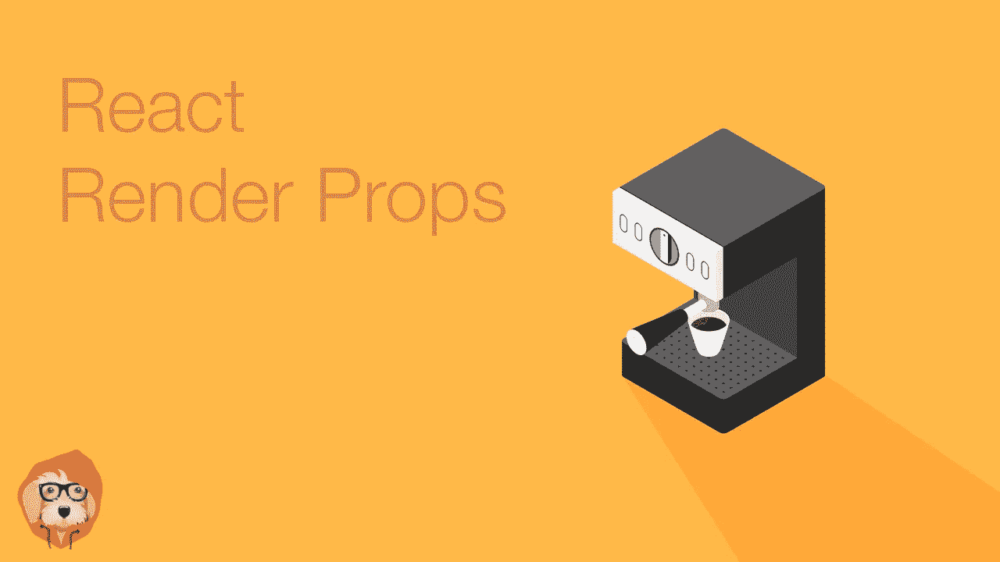

# 反应渲染道具

> 原文：<https://medium.com/hackernoon/react-render-props-4809fe8ca966>

> 这篇文章是我们[反应基础](https://tylermcginnis.com/courses/react-fundamentals/)课程的一部分。如果你喜欢这篇文章，就去看看吧。



> *如果你想读一篇类似的文章，但却是关于高阶元件的，请查阅* [*反应高阶元件*](https://tylermcginnis.com/react-higher-order-components)

> 在我们开始之前，有两件重要的事情需要注意。首先，我们要讨论的只是一种模式。与其说它是 React，不如说它是组件架构。其次，这不是构建 React 应用程序所必需的知识。你可以跳过这篇文章，永远不知道我们将要谈论的内容，但仍然可以构建良好的 React 应用程序。然而，就像建造任何东西一样，你拥有的工具越多，结果就越好。如果你编写 React 应用程序，你的“工具箱”里没有这个东西会给你自己造成伤害。在你听到`Don't Repeat Yourself`或`D.R.Y`(近乎狂热的)咒语之前，你无法深入研究软件开发。有时这可能有点过分，但在大多数情况下，这是一个有价值的目标。在这篇文章中，我们将看看在 React 代码库中实现 DRY 的最流行的模式，高阶组件。然而，在我们探索解决方案之前，我们必须首先充分了解问题。

假设我们负责重新创建一个类似 Stripe 的仪表板。正如大多数项目一样，直到最后，一切都很顺利。就在您认为即将完成时，您注意到仪表板上有一堆不同的工具提示，当鼠标悬停在某些元素上时，它们需要出现。

有几种方法可以解决这个问题。您决定采用的方法是检测各个组件的悬停状态，并根据该状态显示或不显示工具提示。您需要添加三个组件来实现悬停检测功能— `Info`、`TrendChart`和`DailyChart`。

先说`Info`。现在它只是一个简单的 SVG 图标。

```
class Info extends React.Component {
  render() {
    return (
      <svg
        className="Icon-svg Icon--hoverable-svg"
        height={this.props.height}
        viewBox="0 0 16 16" width="16">
          <path d="M9 8a1 1 0 0 0-1-1H5.5a1 1 0 1 0 0 2H7v4a1 1 0 0 0 2 0zM4 0h8a4 4 0 0 1 4 4v8a4 4 0 0 1-4 4H4a4 4 0 0 1-4-4V4a4 4 0 0 1 4-4zm4 5.5a1.5 1.5 0 1 0 0-3 1.5 1.5 0 0 0 0 3z" />
      </svg>
    )
  }
}
```

现在我们需要给它添加功能，这样它就可以检测到它是否被悬停。我们可以使用 React 附带的`onMouseOver`和`onMouseOut`鼠标事件。我们传递给`onMouseOver`的函数将在组件悬停时被调用，传递给`onMouseOut`的函数将在组件不再悬停时被调用。为了用 React 的方式做到这一点，我们将向组件添加一个`hovering`状态属性，这样当`hovering`状态改变时，我们可以重新呈现，显示或隐藏我们的工具提示。

```
class Info extends React.Component {
  state = { hovering: false }
  mouseOver = () => this.setState({ hovering: true })
  mouseOut = () => this.setState({ hovering: false })
  render() {
    return (
      <>
        {this.state.hovering === true
          ? <Tooltip id={this.props.id} />
          : null}
        <svg
          onMouseOver={this.mouseOver}
          onMouseOut={this.mouseOut}
          className="Icon-svg Icon--hoverable-svg"
          height={this.props.height}
          viewBox="0 0 16 16" width="16">
            <path d="M9 8a1 1 0 0 0-1-1H5.5a1 1 0 1 0 0 2H7v4a1 1 0 0 0 2 0zM4 0h8a4 4 0 0 1 4 4v8a4 4 0 0 1-4 4H4a4 4 0 0 1-4-4V4a4 4 0 0 1 4-4zm4 5.5a1.5 1.5 0 1 0 0-3 1.5 1.5 0 0 0 0 3z" />
        </svg>
      </>
    )
  }
}
```

看起来不错。现在我们需要向另外两个组件`TrendChart`和`DailyChart`添加相同的功能。如果没有坏，就不要修。我们的`Info`悬停逻辑工作得很好，所以让我们再次使用相同的代码。

```
class TrendChart extends React.Component {
  state = { hovering: false }
  mouseOver = () => this.setState({ hovering: true })
  mouseOut = () => this.setState({ hovering: false })
  render() {
    return (
      <>
        {this.state.hovering === true
          ? <Tooltip id={this.props.id}/>
          : null}
        <Chart
          type='trend'
          onMouseOver={this.mouseOver}
          onMouseOut={this.mouseOut}
        />
      </>
    )
  }
}
```

你大概知道下一步。我们可以对最后的`DailyChart`组件做同样的事情。

```
class DailyChart extends React.Component {
  state = { hovering: false }
  mouseOver = () => this.setState({ hovering: true })
  mouseOut = () => this.setState({ hovering: false })
  render() {
    return (
      <>
        {this.state.hovering === true
          ? <Tooltip id={this.props.id}/>
          : null}
        <Chart
          type='daily'
          onMouseOver={this.mouseOver}
          onMouseOut={this.mouseOut}
        />
      </>
    )
  }
}
```

就这样，我们都完了。你可能以前写过这样的 React。不是世界末日(#shipit)，但也不是很“干”。如你所见，我们在每个组件中重复完全相同的悬停逻辑。

此时，**问题**应该很清楚了，**我们希望避免在新组件需要时复制我们的悬停逻辑**。那么什么是**解决方案**？在此之前，我们需要了解一下 React 的两个基本方面。它们是不呈现 UI 和传递函数的组件。

没有 UI 组件

在大多数情况下，无论何时构建 React 组件，最终目标都是在屏幕上显示一些 UI。

然而，情况并不总是如此。让组件充当“包装”组件是完全合理的。他们负责处理一些逻辑，但不是呈现他们自己的 UI，而是呈现另一个传递数据的组件。

```
class Users extends React.Component {
  state = {
    users: null
  }
  componentDidMount() {
    getUsers()
      .then((users) => {
        this.setState({ users })
      })
  }
  render() {
    <Grid data={this.state.users} />
  }
}
```

在上面的例子中，`Users`负责获取用户，然后将他们传递给`Grid`组件。它没有自己的 UI，而是使用来自`Grid`组件的 UI。

传递函数作为道具

众所周知，props 是 React 的组件 API 的一部分，它允许您将数据传递到组件中。

```
<User id='tylermcginnis' />
```

然后在`User`组件内部，`props`对象会有一个引用字符串`tylermcginnis`的`id`属性。

```
function User (props) {
  const id = props.id // tylermcginnis
}
```

如果我们传递一个函数，而不是一个字符串作为道具呢？

```
<User id={() => 'tylermcginnis'} />
```

现在，`props`对象仍然有一个`id`属性，只是现在它不是一个字符串，而是引用了一个函数。所以为了获得 id，我们需要调用函数。

```
function User (props) {
  const id = props.id() // tylermcginnis
}
```

如果我们想给函数 prop 传递一些数据呢？这只是一个函数，所以我们可以像平常一样，给它传递一个参数。

```
function User (props) {
  const id = props.id(true) // tylermcginnis
}<User id={(isAuthed) => isAuthed === true ? 'tylermcginnis' : null} />
```

好的……但是这两者和我们之前看到的问题有什么关系呢？每当一个新的组件需要时，我们就复制我们的悬停逻辑。我们可以结合这两个简单的概念来解决我们的问题。

首先，我们想创建一个负责管理悬停状态的“包装”组件。我们自然会称它为`Hover`，它将包含我们之前复制的所有悬停逻辑。

```
class Hover extends React.Component {
  state = { hovering: false }
  mouseOver = () => this.setState({ hovering: true })
  mouseOut = () => this.setState({ hovering: false })
  render() {
    return (
      <div onMouseOver={this.mouseOver} onMouseOut={this.mouseOut}> </div>
    )
  }
}
```

接下来的问题就变成了`Hover`应该渲染什么？这就是功能特性知识发挥作用地方。让`Hover`得到一个叫做`render`的道具。这个`render`道具将是一个函数，我们可以将`hovering`状态传递给它，它将返回一些 UI。

```
<Hover render={(hovering) =>
  <div>
    Is hovering? {hovering === true ? 'Yes' : 'No'}
  <div>
} />
```

现在我们需要做的最后一个改变是在我们的`Hover`组件中。我们需要做的就是调用`this.props.render`并传递它`this.state.hover`。

```
class Hover extends React.Component {
  state = { hovering: false }
  mouseOver = () => this.setState({ hovering: true })
  mouseOut = () => this.setState({ hovering: false })
  render() {
    return (
      <div onMouseOver={this.mouseOver} onMouseOut={this.mouseOut}>
        {this.props.render(this.state.hovering)}
      </div>
    )
  }
}
```

你能看看那个吗？现在我们有了我们的`Hover`组件，任何时候我们需要一个组件知道它的悬停状态，我们只需将它包装在一个`Hover` s `render` prop 中。

最后，让我们回到原来的代码，看看我们如何不再需要复制所有的悬停逻辑，因为我们有了`Hover`组件。

这是我们以前有的。

```
class Info extends React.Component {
  state = { hovering: false }
  mouseOver = () => this.setState({ hovering: true })
  mouseOut = () => this.setState({ hovering: false })
  render() {
    return (
      <>
        {this.state.hovering === true
          ? <Tooltip id={this.props.id} />
          : null}
        <svg
          onMouseOver={this.mouseOver}
          onMouseOut={this.mouseOut}
          className="Icon-svg Icon--hoverable-svg"
          height={this.props.height}
          viewBox="0 0 16 16" width="16">
            <path d="M9 8a1 1 0 0 0-1-1H5.5a1 1 0 1 0 0 2H7v4a1 1 0 0 0 2 0zM4 0h8a4 4 0 0 1 4 4v8a4 4 0 0 1-4 4H4a4 4 0 0 1-4-4V4a4 4 0 0 1 4-4zm4 5.5a1.5 1.5 0 1 0 0-3 1.5 1.5 0 0 0 0 3z" />
        </svg>
      </>
    )
  }
}class TrendChart extends React.Component {
  state = { hovering: false }
  mouseOver = () => this.setState({ hovering: true })
  mouseOut = () => this.setState({ hovering: false })
  render() {
    return (
      <>
        {this.state.hovering === true
          ? <Tooltip id={this.props.id}/>
          : null}
        <Chart
          type='trend'
          onMouseOver={this.mouseOver}
          onMouseOut={this.mouseOut}
        />
      </>
    )
  }
}class DailyChart extends React.Component {
  state = { hovering: false }
  mouseOver = () => this.setState({ hovering: true })
  mouseOut = () => this.setState({ hovering: false })
  render() {
    return (
      <>
        {this.state.hovering === true
          ? <Tooltip id={this.props.id}/>
          : null}
        <Chart
          type='daily'
          onMouseOver={this.mouseOver}
          onMouseOut={this.mouseOut}
        />
      </>
    )
  }
}function App () {
  return (
    <>
      <Info />
      <TrendChart />
      <DailyChart />
    </>
  )
}
```

现在有了我们的`Hover`组件，而不是每个组件都必须复制悬停逻辑，我们可以将每个组件包装在我们传递给`Hover`的`render`道具中，然后将`hovering`参数作为道具传递下去。

```
function Info (props) {
  return (
    <>
      {props.hovering === true
        ? <Tooltip id={this.props.id} />
        : null}
      <svg
        onMouseOver={this.mouseOver}
        onMouseOut={this.mouseOut}
        className="Icon-svg Icon--hoverable-svg"
        height={this.props.height}
        viewBox="0 0 16 16" width="16">
          <path d="M9 8a1 1 0 0 0-1-1H5.5a1 1 0 1 0 0 2H7v4a1 1 0 0 0 2 0zM4 0h8a4 4 0 0 1 4 4v8a4 4 0 0 1-4 4H4a4 4 0 0 1-4-4V4a4 4 0 0 1 4-4zm4 5.5a1.5 1.5 0 1 0 0-3 1.5 1.5 0 0 0 0 3z" />
      </svg>
    </>
  )
}function TrendChart (props) {
  return (
    <>
      {props.hovering === true
        ? <Tooltip id={this.props.id}/>
        : null}
      <Chart
        type='trend'
        onMouseOver={this.mouseOver}
        onMouseOut={this.mouseOut}
      />
    </>
  )
}function DailyChart (props) {
  return (
    <>
      {props.hovering === true
        ? <Tooltip id={this.props.id}/>
        : null}
      <Chart
        type='daily'
        onMouseOver={this.mouseOver}
        onMouseOut={this.mouseOut}
      />
    </>
  )
}function App () {
  return (
    <>
      <Hover render={(hovering) =>
        <Info hovering={hovering}>
      }> <Hover render={(hovering) =>
        <TrendChart hovering={hovering}>
      }> <Hover render={(hovering) =>
        <DailyChart hovering={hovering}>
      }>
    </>
  )
}
```

你现在可能已经猜到了，这种模式叫做`Render Props`。在 React 文档中总结道，“术语渲染属性指的是一种使用属性在 React 组件之间共享代码的技术，该属性的值是一个函数”。

利用渲染道具模式的另一种方法是使用 React 的`children`道具。如果你以前从未使用过`props.children`,它就像任何其他的道具一样，接受而不是你显式地把它传递给组件，React 自动为你做，它引用组件主体中的任何东西。

```
function User (props) {
  return (
    <div>
      {props.children}
    </div>
  )
}<User>
  This is props.children
</User>
```

在上面的例子中，要呈现给用户界面的是一个包含单词`This is props.children`的`div`。

如果`props.children`不是一个字符串，而是一个函数，会怎么样？正如我们前面看到的，我们需要调用它来获取值。

```
function User (props) {
  return (
    <div>
      {props.children()}
    </div>
  )
}<User>
  {() => This is props.children}
</User>
```

利用我们新形成的`props.children`知识，让我们更新之前的例子。现在不要用`Hover`来代替`render`道具，让我们一起去掉它，用`props.children`来代替。

```
function App () {
  return (
    <>
      <Hover>
        {(hovering) => <Info hovering={hovering}>}
      </Hover> <Hover>
        {(hovering) => <TrendChart hovering={hovering}>}
      </Hover> <Hover>
        {(hovering) => <DailyChart hovering={hovering}>}
      </Hover>
    </>
  )
}
```

看起来不错。现在我们需要更新`Hover`，所以它不调用`this.props.render`，而是调用`this.props.children`。

```
class Hover extends React.Component {
  state = { hovering: false }
  mouseOver = () => this.setState({ hovering: true })
  mouseOut = () => this.setState({ hovering: false })
  render() {
    return (
      <div onMouseOver={this.mouseOver} onMouseOut={this.mouseOut}>
        {this.props.children(this.state.hovering)}
      </div>
    )
  }
}
```

很好。这样更好吗？不完全是，只是不一样。我更喜欢它，但客观上没有比它更好的了。

如果你读了我们关于[高阶元件](https://tylermcginnis.com/react-higher-order-components)的帖子，你就会熟悉 hoc 是如何有一些陷阱的。最大的问题是控制反转和命名冲突。因为您必须将组件传递给更高级的组件，所以您无法控制它的呈现方式。我们看了一个 React 路由器的`withRouter` HOC 的例子。无论何时渲染，`withRouter`都会将`match`、`location`和`history`道具传递给被包装的组件。

```
class Game extends React.Component {
  render() {
    const { match, location, history } = this.props // From React Router ...
  }
}export default withRouter(Game)
```

如果我们的游戏组件已经收到了`match`、`location`或`history`作为道具，我们将会有一个命名冲突，这将是一个很难追踪的 bug。

渲染道具也有同样的问题吗？没有。我们不是交出组件，而是交出一个功能。然后，当这个函数被调用时，我们需要的数据就会传递给它。没有控制反转和命名冲突，因为我们可以决定如何渲染组件。

```
<Hover>
  {(hovering) => {
    // We can do whatever we want here.
    // We decide how and when to render the component
    return <Info anyNameWeWant={hovering} />
  }}
</Hover>
```

现在最大的问题是，你应该使用渲染道具还是高阶组件？这取决于你。你现在知道如何使用它们，这意味着你有足够的信息为自己做出明智的决定。

***这原本是发表在***[](https://tylermcginnis.com/react-render-props/)****作为他们*** [***反应基础***](https://tylermcginnis.com/courses/react-fundamentals/) ***课程的一部分。****

***在推特上关注** [**泰勒**](https://twitter.com/tylermcginnis)*