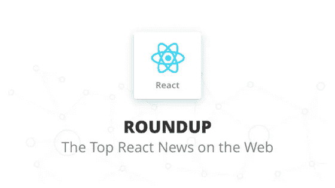
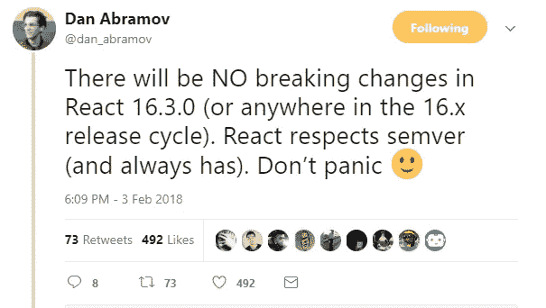
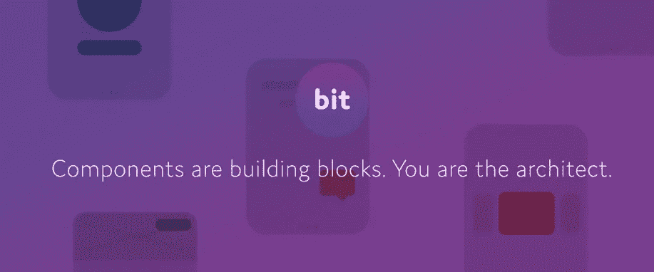
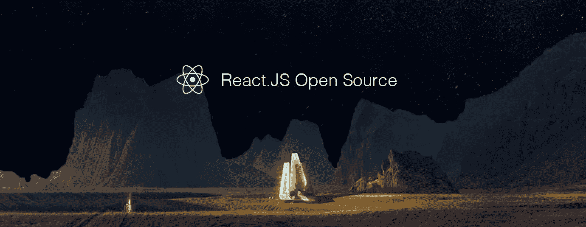
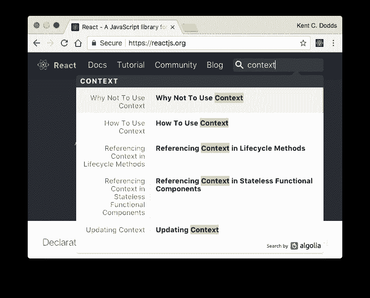
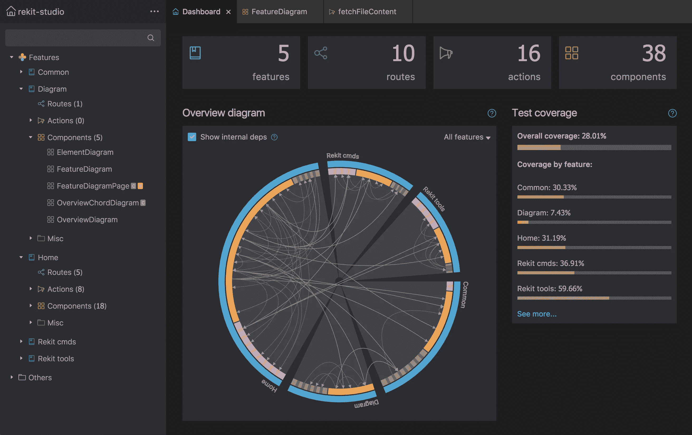
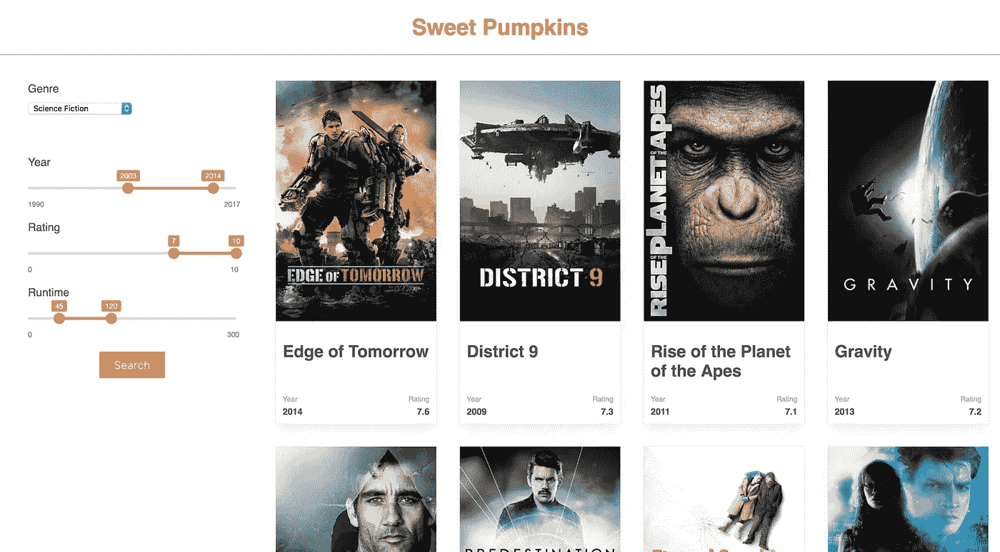
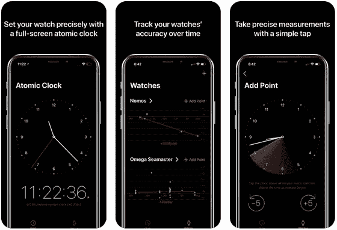
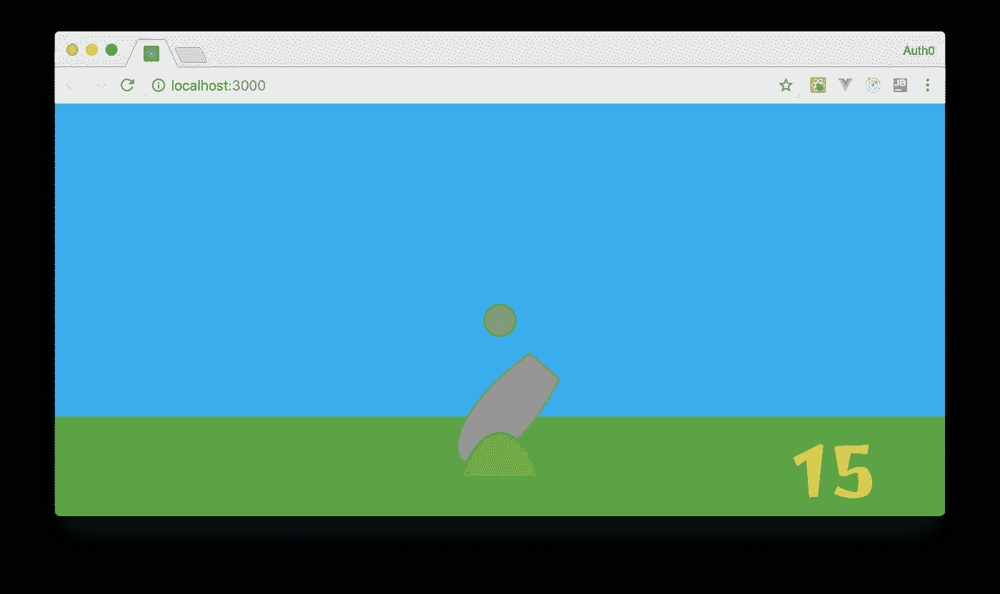

# React 综述:二月十大文章

> 原文：<https://medium.com/hackernoon/react-roundup-top-10-articles-in-february-a98914008556>

React 在应用程序&数据类别中被命名为我们的[2017](https://stackshare.io/posts/top-developer-tools-2017)顶级开发人员工具，并且在 2018 年这种热度还在继续增长。在 StackShare，我们密切关注[业内最热门工具的动向](https://stackshare.io/news)，React 世界似乎每天都在发生一些令人兴奋的新事情！

以下是 StackShare 团队使用来自 [StackShare News](https://stackshare.io/news) 的数据手工整理的 2 月 React 网上排名前 10 的文章。

想跟上吗？只需将 React 添加到[您定制的新闻源](https://stackshare.io/news)中，您就能像我们一样掌控一切。

# # 1:[React 16.3 的新特性(. 0-alpha)](/@baphemot/whats-new-in-react-16-3-d2c9b7b6193b)

bartoszszczecński 的 Medium 帖子概述了 React 最新 alpha 版本中所有“最大、最有趣的变化”,获得了近 8k 的掌声。

[查看 Reddit 讨论](https://www.reddit.com/r/reactjs/comments/7v8onq/whats_new_in_react_163_alpha/) | [查看更多 React 新闻](https://stackshare.io/news/react)

# # 2:[2018 年的一些很棒的 React 组件、库和工具](https://www.reactcomponent.io/)

“一个有用和受欢迎的 React.js UI 组件、工具和库的精选集合，用于在 2018 年构建您的下一个令人惊叹的应用程序。”

[查看 Reddit 讨论](https://reddit.com/r/reactjs/comments/7v6qb7/some_great_react_components_libraries_and_tools/) | [查看更多 React 新闻](https://stackshare.io/news/react)

# # 3:[2 月 ReactJS 十大开源项目(Mybridge)](/@Mybridge/react-js-top-10-open-source-projects-v-feb-2018-655463e4d1a8)

Mybridge AI 的这个新月度系列根据各种因素对 GitHub 上的顶级开源 React 项目进行了排名。其中一些项目非常酷，我们不得不将它们添加到 StackShare 数据库中(查看 [Docusaurus](https://stackshare.io/docusaurus) 和 [React Easy State](https://stackshare.io/react-easy-state) )。

[查看 Reddit 讨论](https://reddit.com/r/reactjs/comments/7yvye1/top_10_reactjs_open_source_projects_of_february/) | [查看更多 React 新闻](https://stackshare.io/news/react)

# #4: [React 的新上下文 API](https://dev.to/kentcdodds/reacts--new-context-api-dpi)

Ken C. Dodds 写了这篇关于 React 中新的上下文 API 的文章，以及为什么你不应该(必须)害怕使用它。

[查看 Reddit 讨论](https://www.reddit.com/r/reactjs/comments/7vpiqh/reacts_new_context_api/) | [查看更多 React 新闻](https://stackshare.io/news/react)

# #5: [使用 React 构建渐进式网络应用](https://itnext.io/build-a-progressive-web-app-using-react-d9784251e07e)

Aman Mittal 的指南将带您一步一步地使用 React 构建一个简单的 PWA。

[查看 Reddit 讨论](https://reddit.com/r/reactjs/comments/7vom6o/build_a_progressive_web_app_pwa_using_react/) | [查看更多 React 新闻](https://stackshare.io/news/react)

# #6: [介绍 Rekit Studio:React 和 Redux 开发的真正 IDE](/@nate_wang/introducing-rekit-studio-a-real-ide-for-react-and-redux-development-baf0c99cb542)

Nate Wang 宣布了 Rekit Studio 的稳定发布，“React、Redux 和 React 路由器开发的完整 IDE。”是的，当然是 StackShare 上的[！如果您已经使用过它，现在就将它添加到您的堆栈中！](https://stackshare.io/rekit)

[查看 Reddit 讨论](https://reddit.com/r/reactjs/comments/7w2vn1/introducing_rekit_studio_a_real_ide_for_react_and/) | [查看更多 React 新闻](https://stackshare.io/news/react)

# #7: [免费课程——通过构建一个应用程序来学习 React，帮助您找到观看的最佳电影](https://sweetpumpkins.codecamps.com/)

如果你还没有上 React train，对于我们这些边做边学的人来说，这是一个很好的项目。用 CodeCamp 的免费教程搭建一个简单的 app。

[查看 Reddit 讨论](https://reddit.com/r/reactjs/comments/7yo3z9/free_course_learn_react_by_building_an_app_to/) | [查看 React 新闻](https://stackshare.io/news?tools=react)

# #8: [我如何用 CoreML、PyTorch 和 React Native 在 iOS 上发布神经网络](https://attardi.org/pytorch-and-coreml)

来自 Stefano J. Attardi:“这是一个关于我如何训练一个简单的神经网络来解决一个真正的 iOS 应用程序中定义明确但新颖的挑战的故事。”

[查看黑客新闻讨论](https://news.ycombinator.com/item?id=16364826) | [查看 React 新闻](https://stackshare.io/news?tools=react)

# #9: [你应该知道的反应模式](/@joomiguelcunha/react-patterns-you-should-know-da86568372fa)

朱奥·米格尔·库尼亚提醒我们:“React 只是 JavaScript！”这篇文章讨论了一些常见的问题，并举例说明了如何使用模式来解决这些问题。

[查看 Reddit 讨论](https://reddit.com/r/reactjs/comments/7vvip8/react_patterns_you_should_know/) | [查看 React 新闻](https://stackshare.io/news?tools=react)

# #10: [用 React、Redux 和 SVG 开发游戏—第二部分](https://auth0.com/blog/developing-games-with-react-redux-and-svg-part-2/)

Auth0 的这篇博客文章是一个系列的第二篇，它将带你了解如何开发一款名为《外星人，回家吧！

[查看 Reddit 讨论](https://reddit.com/r/reactjs/comments/7yd0y0/developing_games_with_react_redux_and_svg_part_2/) | [查看 React 新闻](https://stackshare.io/news?tools=react)

# React 本月最佳推文

# 更多！

每天在 [StackShare News](https://stackshare.io/news?tools=react) 获取所有 React 新闻。

StackShare News 是了解您最喜欢的开发工具每天最新动态的最佳地方。这是你定制的 newsfeed *，这样你就可以跟上你使用和喜爱的所有工具(没有你不喜欢的)。来看看吧，在这里建立你自己的！*

*最初发表于*[*stack share . io*](https://stackshare.io/posts/react-roundup-1)*。*