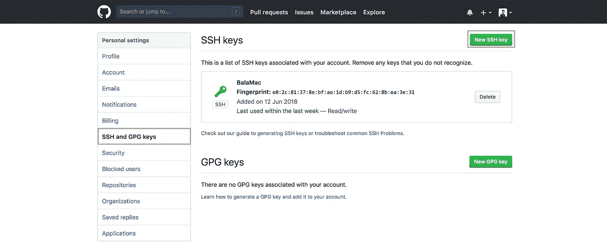
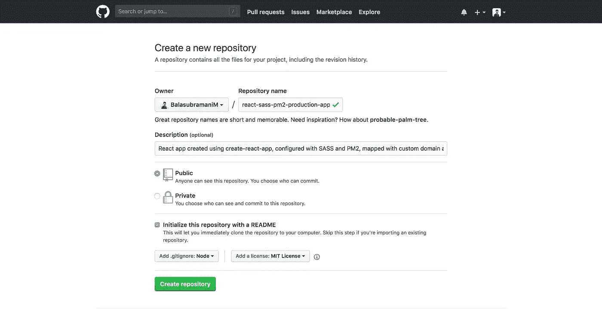
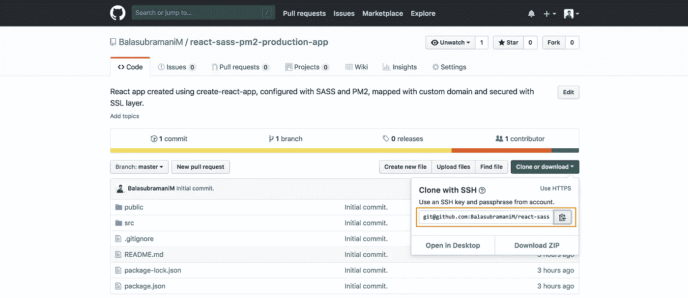
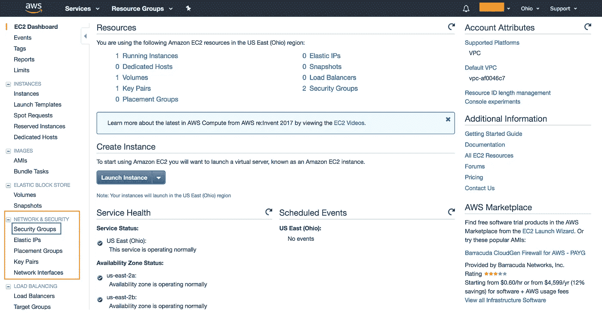
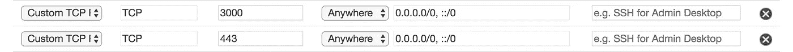
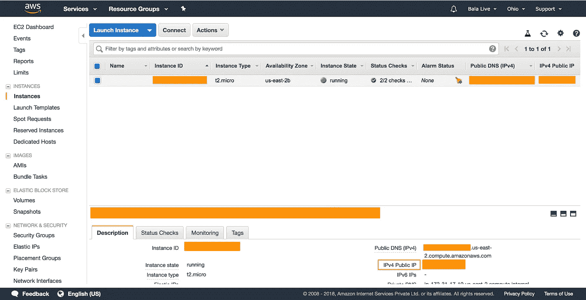
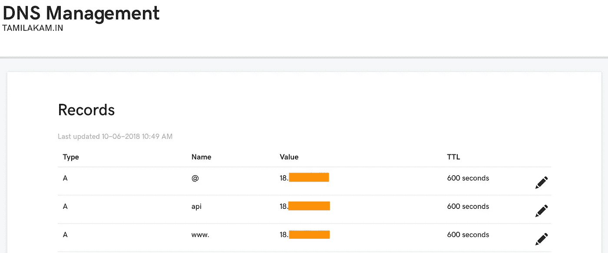
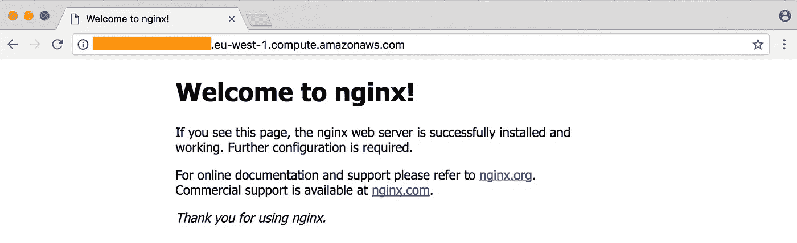

# react-SASS-PM2-EC2-Production-App 使用自定义域进行映射，并使用 SSL 层进行保护。

> 原文：<https://medium.com/hackernoon/react-sass-pm2-ec2-production-app-mapped-with-a-custom-domain-and-secured-with-ssl-layer-c678e752a4ab>

## 在本教程中，我们将使用 [create-react-app](https://github.com/facebook/create-react-app) 创建一个示例 react 应用程序，在其中配置 SASS 并将其上传到 GitHub，在 EC2 中部署应用程序，配置 DNS 和 Nginx，最后我们将映射我们的自定义域并为其添加 SSL 层。

更清楚地说，这是我们现在要学习的议程。

1.  创建 React 应用
2.  配置 SASS
3.  在 GitHub 上传我们的代码
4.  在 EC2 实例中配置 SSH 访问
5.  PM2 构型
6.  EC2 配置
7.  DNS 配置—(域强制)
8.  Nginx 配置
9.  部署应用程序
10.  使用“让我们加密”添加 SSL 证书


## 创建 React 应用

让我们使用 [create-react-app](https://github.com/facebook/create-react-app) 创建一个基本的 react 应用程序

```
$ npx create-react-app react-sass-pm2-production-app
$ cd react-sass-pm2-production-app
$ npm start
```

现在，您将被自动重定向到 [http://localhost:3000/](http://localhost:3000/) ，在这里您将看到您的 react 应用程序在几秒钟内构建完成。

## 配置 SASS

在`src`文件夹中创建一个名为`styles`的文件夹，并在其中创建一个名为`style.sass`的文件。

SASS 文件应该被正确地转换成 CSS。只有完全符合要求的 SASS 文件才能被转换。所以我将安装一个名为[SASS 美化](https://github.com/badsyntax/SassBeautify)的包，它将使用一个特殊的命令来美化我们的 SASS 文件。

如果你正在使用 Sublime 文本编辑器，请击掌。我将一步一步地指导你安装和配置它。

其他人——请原谅我。这些只是可选的，你甚至可以手动编写代码。但是，我建议您在编辑器中配置相同的包，以使您的代码更加完美。

打开你的 sublime，按下`Cmd+Shift+P`，输入`Install Package`，按下回车键，打开安装包菜单。现在输入 sass 美化并按回车键安装软件包。

这个插件使用`sass-convert`，所以你需要安装 sass。阅读 [sass 下载页面](http://sass-lang.com/download.html)查看安装选项。

就是这样。您已经配置了您的美化包。我们来加点代码，美化一下。

在此之前，让我们指定命令运行萨斯美化打算和保存。这个插件没有设置任何默认的键绑定，因此你需要自己指定。

在您的键映射文件(首选项>>键绑定-用户)中，添加一个下面的自定义键绑定并保存它。

```
[
    {
        "keys": ["alt+w"],
        "command": "sass_beautify"
    }
]
```

现在，将下面的代码粘贴到您的`style.sass`文件中，并按下`alt+w`键，以自动保存文件。

```
$font-stack:    Helvetica**,** sans-serif
$primary-color: #333

body
  **font**: 100% $font-stack
  **color**: $primary-color
```

您可以看到文件的目的和保存。

如果您无意中看到以下错误，

`**There was an error beautifying your Sass:/System/Library/Frameworks/Ruby.framework/Versions/2.3/usr/lib/ruby/2.3.0/universal-darwin17/rbconfig.rb:214:**`

这意味着有一些行打算使用`tab`键。让我们通过使用`Cmd+A`选项选择 sass 文件中的所有内容，点击空格(在 Sublime 中右下角可用)并选择`Convert Indentation to Spaces`，将其转换为空格。

现在你可以成功地美化你的代码了。

让我们进一步配置，在保存时自动将我们的 SASS 文件转换成 CSS 文件。

打开一个新的终端，在你的根目录下，给出下面的命令并按下`enter`键。

```
$ sudo sass --watch src/styles/:public/stylesheets/
```

现在你可以看到你的 sass，如果你在等待修改，一旦你按下`alt+w`你就可以把你的 Sass 文件保存并转换成 CSS 文件。

现在打开`public`文件夹中的`index.html`文件，添加下面的链接标签来引用你转换后的 css 文件。

```
<link rel="stylesheet" type="text/css" href="%PUBLIC_URL%/stylesheets/style.css">
```

您已经成功配置了 SASS。

## 在 GitHub 上传我们的代码

在初始设置过程中，需要遵循几个步骤。因此，让我们从创建一个 SSH 密钥开始，从您的本地机器认证您的 GitHub 帐户。

总共有两种类型的认证，称为`SSH`和`HTTPS`。

这是一个一次性过程，我们不想使用`HTTPS`选项进行身份验证，因为每当我们从您的机器拉取、推送或提交时，我们都需要提供我们的凭据。

SSH 认证机制如下。

1.  生成新的 SSH 密钥。
2.  将您的 ssh 密钥添加到 SSH 代理中
3.  将 SSH 密钥添加到您的 GitHub 帐户

**步骤 1:生成新的 SSH 密钥。**

打开终端并导航到默认的`ssh`文件夹位置。

```
$ cd ~/.ssh/ #To navigate to your default SSH key location.
```

粘贴以下文本，替换为您的 GitHub 电子邮件地址。

```
$ ssh-keygen -t rsa -b 4096 -C "*your_email@example.com*"
```

这将创建一个新的 ssh 密钥，使用提供的电子邮件作为标签。

当提示您“输入保存密钥的文件”时，请按 Enter 键。这接受默认的文件位置。

```
Enter a file in which to save the key (/Users/*you*/.ssh/id_rsa): *[Press enter]*
```

在提示符下，按 enter 键两次，不输入任何密码。就这样，您已经成功地创建了名为`id_rsa`的 SSH 密钥。

**步骤 2:将您的 SSH 密钥添加到 ssh-agent**

在后台启动 ssh-agent。

```
$ eval "$(ssh-agent -s)"
```

将您的 ssh 私有密钥添加到 SSH 代理中。

```
$ ssh-add -K ~/.ssh/id_rsa
```

**第三步:给你的 GitHub 账户添加一个新的 SSH 密钥**

将 SSH 密钥复制到剪贴板。

```
$ pbcopy < ~/.ssh/id_rsa.pub
# Copies the contents of the id_rsa.pub file to your clipboard
```

如果没有 pbcopy，可以使用任何编辑器打开该文件并复制其全部内容。我使用 sublime，如果你想在 sublime 编辑器中打开上面的文件，发出下面的命令。

```
$ subl ~/.ssh/id_rsa.pub 
# Either issue this or above command. Don't execute both.
```

复制文本。

现在，让我们转到我们的 GitHub 帐户并粘贴密钥。导航到您的 GitHub 帐户设置并点击`SSH and GPG keys`。(参考图片)。



Note the Highlighted text.

单击左上角的 New SSH key 按钮，添加您的 SSH 密钥。

根据你的意愿给出标题，将复制的文本粘贴到关键部分并添加关键。

就是这样。现在，您已经通过身份验证，可以从您的终端执行 GitHub 帐户中的操作。让我们推送我们的代码，稍后在 EC2 中部署它。

让我们在 GitHub 中为我们的应用程序创建一个存储库。

在您的 GitHub 帐户中创建存储库，或点击此 [URL](https://github.com/new) 导航至 repo 创建页面。看起来像下面。



GitHub repo creation page.

给出你的库名、描述、repo 访问，你就可以避免`README`。`gitignore`选项，因为当你使用 [create-react-app](https://github.com/facebook/create-react-app) 创建应用程序时，你的项目中已经有了这些选项。

是时候将这个存储库与我们的本地项目联系起来了。转到您的回购页面，通过单击右侧的框复制突出显示的框中的文本(参考下图)。



Copy the highlighted text.

现在转到您的本地 repo 目录，逐一执行下面的命令来初始化、提交和推送您的代码到 GitHub。

```
$ git init
$ git remote add origin <copied_url>
$ git add -A
$ git commit -m "Initial Commit."
$ git push origin master
```

您的代码现在位于您的远程存储库中。在 GitHub 检查您的代码。

## 在 EC2 实例中配置 SSH 访问

当我们使用 PM2 部署我们的应用程序时，在您的远程实例中重复上面的一些步骤，以允许您的服务器使用 SSH 访问从您的 GitHub repo 中提取代码。

在执行以下步骤之前，您需要连接到您的远程实例。如果您不知道此连接，请在继续之前参考此[链接](/full-stack-web-development-from-scratch-to/make-your-amazon-ec2-instance-up-and-running-ab80120eb23)。

在远程终端中发出以下命令。

```
$ cd ~/.ssh/ #To navigate to your default SSH key location.
$ ssh-keygen -t rsa -b 4096 -C "*your_email@example.com*"
```

当提示您“输入保存密钥的文件”时，请按 Enter 键。这接受默认的文件位置。

```
Enter a file in which to save the key (/Users/*you*/.ssh/id_rsa): *[Press enter]*
```

在提示符下，按 enter 键两次，不输入任何密码。就这样，您已经成功地创建了名为`id_rsa`的 SSH 密钥。

```
$ eval "$(ssh-agent -s)"
$ ssh-add -K ~/.ssh/id_rsa
$ pbcopy < ~/.ssh/id_rsa.pub # (or - cat ~/.ssh/id_rsa.pub) and copy
```

进入你的 GitHub 账户设置，像上面一样添加 SSH 密钥。

## PM2 构型

让我们在本地存储库中配置 PM2，它将实际完成我们的部署工作。

> 基本上，PM2 是专门为 Node.js 设计的，而不是为客户端应用设计的。但是在这里，我们将在 PM2 的帮助下自动化我们的部署，因此，我们将使用它从 GitHub 中提取代码，并在我们的远程服务器(EC2 实例)上运行。

**注意:该应用程序不会在 PM2 进程中运行。**

如果您知道 Amazon EC2 实例，并且知道如何配置和使用它，那么您不需要做任何事情。

但是，如果您不知道，您可以浏览下面的链接并设置您的远程实例 ready，这是托管 Node.js 服务器所必需的。

[](/full-stack-web-development-from-scratch-to/make-your-amazon-ec2-instance-up-and-running-ab80120eb23) [## 启动并运行您的 Amazon EC2 实例。

### 在这一部分，我们将创建一个 Amazon 帐户 EC2 实例，并通过 SSH 连接到该实例。

medium.com](/full-stack-web-development-from-scratch-to/make-your-amazon-ec2-instance-up-and-running-ab80120eb23) 

**注意:您需要一个服务器(EC2 实例)来部署您的生产就绪 React 应用程序。**

发出以下命令，在根目录下安装 PM2。

```
$ sudo npm i pm2 --save-dev
```

在根目录中，创建一个名为 ecosystem.config.js 的文件，并将以下内容添加到其中。

```
module.exports = {
  apps: [
    {
      name: "react-sass-pm2-production-app",
      env: {
        PORT: 3000,
        NODE_ENV: "production"
      }
    }
  ],
  deploy: {
    production: {
      user: "ubuntu",
      host: "ec2-xx-xxx-xxx-xx.us-east-2.compute.amazonaws.com",
      key: "~/.ssh/AWS-EC2-INSTANCE-LIVE.pem",
      ref: "origin/master",
      repo: "[git@github.com](mailto:git@github.com):BalasubramaniM/react-sass-pm2-production-app.git",
      path: "/home/ubuntu/react-app",
      "post-deploy":
        "npm install && npm run build && sudo cp -r build/* /var/www/react-sass-pm2-production-app.in/"
    }
  }
};
```

这里，在`apps`中，我们给出了我们的应用程序名称、端口和节点环境。在`deploy`部分，我们将配置命名为生产，并给出用户、主机、密钥、引用、回购、路径和部署后命令。

记得用您的 Amazon 实例主机、PEM 密钥位置替换您的主机，并更新您的回购链接(您之前已经复制了该链接，即突出显示的文本)。希望你记得)。

请注意部署后命令。稍后，在我们的远程实例中配置 Nginx 之后，我们将了解这些命令。

PM2 已成功配置。

## EC2 配置

正如您在 PM2 配置中看到的，我们给定了一个端口号 3000，因此我们需要允许 EC2 上的这个端口在这个端口上运行我们的应用程序。

在你的亚马逊控制台页面点击`NETWORK & SECURITY`下的`Security Groups`。



Click Security Groups.

右键单击实例的安全组，然后单击`Edit inbound rules`。

点击`Add Rule`。添加如下配置，如下图所示，并点击`Save`。



Security group config rule.

**注意:在这里将您的端口添加为 3000，React 应用程序正在其中运行，并添加端口 443 用于 SSL 访问。**

## DNS 配置

**必选:**在自定义域中运行我们的 react app 会更牛逼(例如: [https://tamilakam.in](https://tamilakam.in) )。因此，您可以获得一个@ [GoDaddy](https://in.godaddy.com/) 或通过任何其他域名注册商，域名是必需的，以完成剩余的步骤。

从现在开始，我将使用我的网站 [tamilakam.in](https://www.tamilakam.in/) 作为下面的参考，以获得您的理解。请将`tamilakam.in`替换为您的域名。

在您的互联网域名注册服务商 DNS 设置中提供您的 Amazon EC2 `IPv4 Public IP`地址。

从 Amazon 控制台获取 IPv4 公共 IP 地址。这就像`18.xxx.xxx.15`



在您的 DNS 提供商设置页面中添加两个具有如下值的 **A 类型**记录。更多信息请参考下图。

首先是记录。

```
Type: A
Name: www. // Sub domain so we can access it like [www.tamilakam.in](https://tamilakam.in/)
Value: 18.xxx.xxx.15 // IPv4 Public IP
TTL: 600 seconds
```

第二张唱片。

```
Type: A
Name: @ // To access our site with [tamilakam.in](https://tamilakam.in/)
Value: 18.xxx.xxx.15 // IPv4 Public IP
TTL: 600 seconds
```



DNS Management page — Add Records.

在这里，我添加了三个 A 型记录。我将在下面解释这些。

1.  第一条记录是当用户键入域名 name.com 时加载页面。泰米尔语。(必需)。
2.  第二条记录是加载 Node.js API 服务器。你可以参考这个[链接](/full-stack-web-development-from-scratch-to/deploy-your-node-js-app-in-production-and-use-bitbucket-to-automate-your-deployment-50b07b18914c)和这个[链接](/full-stack-web-development-from-scratch-to/how-to-run-multiple-apps-on-a-single-ec2-instance-with-nginx-and-map-your-custom-domain-2640630ce1e7)，我在那里托管了我的 Node.js 应用程序，并在中使用名为 [api.tamilakam .的子域加载它。(可选)。](https://api.tamilakam.in/)
3.  第三条记录是当用户在中键入 [www.tamilakam .时加载页面。(必需)。](https://tamilakam.in/)

我们已经成功配置了 DNS。等待 5 分钟，让更改得到反映，因为您已将 TTL 值设置为 600 秒。

## Nginx 配置

让我们首先从终端使用下面的命令连接到我们的远程实例。(在所需位置替换您的 EC2 URL)

```
$ ssh -i ~/.ssh/AWS-EC2-INSTANCE-LIVE.pem ubuntu@ec2-xx-xxx-xx-xx.us-east-2.compute.amazonaws.com
```

安装 Nginx 并在您的远程服务器上进行配置。

Ubuntu 自带包管理器， ***apt-get*** 。使用 ***apt-get*** ，我们可以在一个命令中安装 ***nginx*** 。

```
$ sudo apt-get install nginx
```

***apt-get*** 安装后会自动运行 nginx，因此您现在应该可以在端口`80`上运行它，通过在浏览器中输入您的公共 DNS URL 进行检查。



Nginx welcome page.

如果这不起作用，您可能需要手动启动它。

```
$ sudo /etc/init.d/nginx start
```

现在让我们配置 Nginx 来运行 Node.js 服务器。

如何设置 ***nginx*** 配置？配置以任何名称存储在`sites-available`中的纯文本文件中。将它们链接到`sites-enabled`文件夹会导致它们在 ***nginx*** 启动时被读取和使用。所有的配置通过 ***nginx*** 组合在一起。

您可以使用 cat 查看这个配置。

```
$ cat /etc/nginx/sites-available/default
```

让我们首先从`sites-enabled`中移除默认配置，我们将把它留在`sites-available`中以供参考。

```
$ sudo rm /etc/nginx/sites-enabled/default
```

让我们用域名在`sites-available`中创建一个配置文件。

```
$ sudo nano /etc/nginx/sites-available/tamilakam.in
```

并将以下内容添加到其中，按下`Ctrl+x`，键入`yes`并回车保存。

```
server {
  listen 80;
  server_name tamilakam.in [www.tamilakam.in](http://www.tamilakam.in);
  location / {
   root /var/www/tamilakam.in;
   index index.html;
   try_files $uri /index.html;
  }
}
```

链接`sites-enabled`中的配置文件(这将使文件看起来像是在`sites-enabled`中复制的)。

```
$ sudo ln -s /etc/nginx/sites-available/tamilakam.in /etc/nginx/sites-enabled/tamilakam.in
```

如果不熟悉符号链接，请在此阅读更多相关内容。

在上面的代码块中，我们监听默认端口 80，并以两种格式提供了我们的服务器名。我们还提供了 location，当使用根和默认索引文件选项点击服务器名称时，将提供这个位置。

正如您所看到的`root`选项，我们将其命名为`/var/www/tamilakam.in`。这个位置充当我们的应用程序的源。因此，让我们在该位置添加我们的 React app minified(生产)版本代码。

导航到那个位置并创建一个名为`tamilakam.in`的文件。

```
$ cd /var/www
$ sudo nano tamilakam.in
```

现在让我们回到 PM2 配置文件中的部署后命令。在那里，您给出了如下命令。

```
"post-deploy":
        "npm install && npm run build && sudo cp -r build/* /var/www/tamilakam.in/"
```

让我告诉你它是做什么的。从 GitHub 下载您的代码后，它会执行`npm install first`，然后运行`npm run build`进行生产优化构建，最后将这个优化构建复制到我们刚才创建的位置`/var/www/tamilakam.in`。

重启 ***nginx*** 使新配置生效。

```
$ sudo service nginx restart
```

你完了。让我们从本地终端运行几个命令，这样我们就可以在几秒钟内将 React 应用程序部署到生产环境中。

要检查您提供的配置是否正确，请发出以下命令。

```
$ sudo nginx -t
```

如果您遇到任何错误，您需要在您的服务器块上工作(您已经在`sites-available`文件夹中创建了服务器块)。请在评论中告诉我，以便我们尝试解决它。

## 部署应用程序

从本地机器上的应用程序根目录中，发出下面的命令，在远程服务器上设置我们的应用程序。

```
$ sudo pm2 deploy ecosystem.config.js production setup
```

这将在 EC2 实例中配置我们的应用程序。

最后，发出下面的命令，在远程服务器上使用 PM2 托管并运行您的应用程序。

```
$ sudo pm2 deploy ecosystem.config.js production
```

万岁！！！您的 React 应用程序现在位于生产服务器中，可以使用了。

访问 [https://tamilakam.in](https://api.tamilakam.in) 检查你的申请。

## 使用“让我们加密”添加 SSL 证书

是时候使用安全套接字层来保护我们的站点了。

Let's Encrypt 是一个证书颁发机构(CA ),它提供了一种获取和安装免费的 [TLS/SSL 证书](https://www.digitalocean.com/community/tutorials/openssl-essentials-working-with-ssl-certificates-private-keys-and-csrs)的简单方法，从而在 web 服务器上启用加密的 HTTPS。

在这里，您将使用 Certbot 为 Ubuntu 16.04 上的 Nginx 获取一个免费的 SSL 证书，并将您的证书设置为自动续订。

连接到您的远程实例，并在 EC2 终端中键入以下命令。

首先，添加存储库。

```
$ sudo add-apt-repository ppa:certbot/certbot
```

你需要按`ENTER`来接受。然后，更新包列表以获取新存储库的包信息。

```
$ sudo apt-get update
```

最后用`apt-get`安装 Certbot 的 Nginx 包。

```
$ sudo apt-get install python-certbot-nginx
```

Certbot 现在可以使用了，但是为了让它为 Nginx 配置 SSL，我们需要验证 Nginx 的一些配置。

重启 Nginx 以使效果生效。

```
$ sudo systemctl reload nginx
```

Certbot 现在可以找到正确的`server`块并更新它。

接下来，我们将更新防火墙以允许 HTTPS 流量。发出这组命令，并参考参考部分中的[链接](https://www.digitalocean.com/community/tutorials/how-to-set-up-let-s-encrypt-with-nginx-server-blocks-on-ubuntu-16-04)以获取有关命令的更多信息。

```
$ sudo ufw status
$ sudo ufw allow 'Nginx Full'
$ sudo ufw delete allow 'Nginx HTTP'
```

我们现在准备运行 Certbot 并获取我们的证书。

获取 SSL 证书。(别忘了更换你的域名)

```
$ sudo certbot — nginx -d example.com -d [www.example.com](http://www.example.com)
```

如果这是您第一次运行`certbot`，系统会提示您输入电子邮件地址并同意服务条款。完成后，`certbot`将与 Let's Encrypt 服务器通信，然后运行一个挑战来验证您是否控制了您正在申请证书的域。

如果成功，`certbot`将询问您希望如何配置您的 HTTPS 设置。

```
OutputPlease choose whether or not to redirect HTTP traffic to HTTPS, removing HTTP access.
-------------------------------------------------------------------------------
1: No redirect - Make no further changes to the webserver configuration.
2: Redirect - Make all requests redirect to secure HTTPS access. Choose this for
new sites, or if you're confident your site works on HTTPS. You can undo this
change by editing your web server's configuration.
-------------------------------------------------------------------------------
Select the appropriate number [1-2] then [enter] (press 'c' to cancel):
```

选择选项 2(默认——将您的所有请求重定向到安全的 HTTPS 访问),然后点击`ENTER`。配置将被更新，Nginx 将重新加载以获取新的设置。`certbot`将以一条消息结束，告诉您该过程已成功完成，并且您的证书存储在何处:

```
OutputIMPORTANT NOTES:
 - Congratulations! Your certificate and chain have been saved at
   /etc/letsencrypt/live/example.com/fullchain.pem. Your cert will
   expire on 2017-10-23\. To obtain a new or tweaked version of this
   certificate in the future, simply run certbot again with the
   "certonly" option. To non-interactively renew *all* of your
   certificates, run "certbot renew"
 - Your account credentials have been saved in your Certbot
   configuration directory at /etc/letsencrypt. You should make a
   secure backup of this folder now. This configuration directory will
   also contain certificates and private keys obtained by Certbot so
   making regular backups of this folder is ideal.
 - If you like Certbot, please consider supporting our work by:

   Donating to ISRG / Let's Encrypt:   https://letsencrypt.org/donate
   Donating to EFF:                    https://eff.org/donate-le
```

您的证书已被下载、安装和加载。

重启 Nginx。

```
$ sudo systemctl reload nginx
```

现在，试着用`https://`重新加载你的网站，注意你浏览器的安全指示器。它应该表明该网站是适当的安全，通常有一个绿色的锁图标。如果你用 [SSL 实验室服务器测试](https://www.ssllabs.com/ssltest/)来测试你的服务器，它会得到 A 级。

最后，让我们测试一下续订流程。

为了测试更新过程，您可以使用`certbot`进行一次试运行:

```
$ sudo certbot renew — dry-run
```

如果您没有看到错误，那么您就一切就绪了。必要时，Certbot 将更新您的证书并重新加载 Nginx 以获取更改。如果自动续订过程失败，Let's Encrypt 会向您指定的电子邮件地址发送一封邮件，在您的证书即将过期时发出警告。

如果您对使用 Certbot 有进一步的疑问，[他们的文档](https://certbot.eff.org/docs/)是一个很好的起点。

我们已经保护了我们的 React 应用程序。

如果你对以上步骤有任何疑问，欢迎在评论区提出来，我会尽快回复。

因为它很大，你可能会在建立你的项目时遇到任何问题。请检查我的其他教程，以便你可以找到任何解决你的问题的方法。

谢谢你。

最终应用可在[这里](https://github.com/BalasubramaniM/react-sass-pm2-production-app)找到。

## 参考资料:

[](/full-stack-web-development-from-scratch-to/how-to-run-multiple-apps-on-a-single-ec2-instance-with-nginx-and-map-your-custom-domain-2640630ce1e7) [## 如何用 Nginx 在单个 EC2 实例上运行多个 app，并映射自己的自定义域？

### 在本教程中，我们将在 EC2 实例中托管一个单独的 React 和 Node.js 应用程序，并映射我们的自定义域。

medium.com](/full-stack-web-development-from-scratch-to/how-to-run-multiple-apps-on-a-single-ec2-instance-with-nginx-and-map-your-custom-domain-2640630ce1e7) [](/full-stack-web-development-from-scratch-to/m-e-r-n-stack-application-using-passport-for-authentication-920b1140a134) [## 米（meter 的缩写））使用 Passport 进行身份验证的 E.R.N 堆栈应用程序。

### 在本教程中，我们将在 React 应用程序中集成用于注册或登录目的的 Google sign-in

medium.com](/full-stack-web-development-from-scratch-to/m-e-r-n-stack-application-using-passport-for-authentication-920b1140a134) [](https://www.digitalocean.com/community/tutorials/how-to-set-up-let-s-encrypt-with-nginx-server-blocks-on-ubuntu-16-04) [## 如何在 Ubuntu 16.04 | DigitalOcean 上设置 Let's Encrypt with Nginx 服务器块

### 在本教程中，您将使用 Certbot 为 Ubuntu 16.04 上的 Nginx 获取一个免费的 SSL 证书，并设置您的…

www.digitalocean.com](https://www.digitalocean.com/community/tutorials/how-to-set-up-let-s-encrypt-with-nginx-server-blocks-on-ubuntu-16-04)