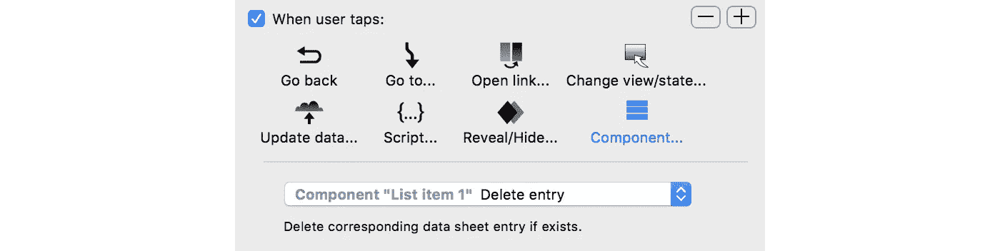

# React Studio 1.4:利用地图部分、登录、“CRUD”数据等处理大型项目

> 原文：<https://medium.com/hackernoon/react-studio-1-4-tackling-large-projects-with-map-sections-logins-crud-data-and-more-ca2d50dfed49>


欢迎，编程和 UX 之间未知荒地的旅伴！希望你的旅程不会受到龙和巨型变异项目经理的攻击。来，喝杯热茶，坐在壁炉旁，给我们讲讲你的故事。

我们 Neonto 一直在努力改进 React Studio，热切希望它能成为您在这些危险的冒险之地旅行的新伙伴。

对于这个 1.4 版本，我们一直在收集用户的反馈，并专注于现实世界项目的改进。有重要的新组织工具，建模标准组件(如登录)的新方法，为后端处理数据和查询参数的新工具，更多的插件 API，以便您可以使生成的 React 项目完全按照您的需要工作……以及大量的修复和小改进。

要安装，只需启动 React Studio，更新应该会自动提供。或者，你可以从[reactstudio.com](https://reactstudio.com)下载应用程序。

还有一个新的示例项目(在 File > *New From Template* )以一种简单的方式展示了这些新的组织特性。如果你有兴趣成为 React Studio 未来的一部分，在这篇文章的最后，我们有一个惊喜。我们走吧！


## 项目地图部分

到目前为止，当 React Studio 项目超过一两个屏幕时，组织它可能是一个挑战。在一个有十几个屏幕及其相关组件的大型项目中，项目地图可能会延伸得很大，以至于很难找到周围的路。

新的地图部分功能解决了这个问题。节很像文件夹:您可以将屏幕及其相关组件移动到节中，以便将它们放在一起。在项目地图的顶层，该部分显示为一个大块，并带有其内容的预览(见上面的截图)。您还可以为每个部分添加注释，以便更好地跟踪每个部分包含的内容。

要创建地图部分，请选择项目地图中的任何块，并在项目地图右下角出现的命令菜单中选择“从所选内容创建地图部分”。

要编辑地图部分的内容，请双击它。要将块从一个部分移回顶层，或移到另一个部分，请选择它们并使用右下角的命令菜单。您也可以从一个部分“解包”所有块，方法是选择该部分并使用检查器中的命令。

Sections 也将是一个有用的工具，可以根据您的喜好组织 React Studio 的代码输出。在不久的将来，我们将添加一个功能，让您决定如何在生成的代码中表示各个部分——例如，您可以将每个部分的内容写入一个单独的源代码文件夹，并将顶级组件放入一个名为“shared”的文件夹中。

## 新示例项目:“FauxAir 签到”

我们添加了一个新的项目模板，展示如何在实践中使用地图部分。这是一个用于机场登机控制台的应用程序，为一家名为 FauxAir 的假冒航空公司制作。你可以在这里看到演示应用:[https://neonto.cloud/u/checkindemo](https://neonto.cloud/u/checkindemo)

*(注意，这个演示不能在手机上运行。这是一个平板电脑大小的登机控制台。通过一些额外的努力，我们当然可以让它也适用于手机，但对于一个具有“护照扫描仪”等功能的应用程序来说，这真的没有意义……)*

要探索这个项目，请在“文件”菜单>“从模板新建”中查找。

## 便笺条

FauxAir 检入示例项目展示了项目地图的另一个新特性。你现在可以在地图上添加黄色的小“便笺”了。例如，它们对于跟踪组件的预期用途非常有用。

要创建便笺条，请从右边的组件框中拖动到项目地图上。

## 登录门

看一眼组件框，你会看到另一个新的组件，即*登录入口*模块。这是一种特殊的屏幕，为实现登录提供附加功能。

为什么要为此添加新的屏幕类型？这是因为所有的登录在功能上都非常相似。理想情况下，应用程序中只有一种登录方式，如果有效凭证已经可用(例如，使用浏览器 cookie)，用户甚至不应看到登录屏幕。类似地，应该只有一个“注销”功能的实现。当有一个组件显式地提供可视化部分时，React Studio 更容易生成正确的代码来处理所有这些逻辑。

当您将登录门添加到项目中时，您会在检查器中看到一组设置:


登录门有两种模式，“简单密码”和“Web 服务”。这里的想法是，您可以从使用简单密码模式的登录原型开始，然后无缝地切换到使用 web 服务插件的实际实现。

对于任何一种模式，您都可以在应用程序中指定两个路径。“解锁时”让您选择登录成功时显示的屏幕，而“解锁失败时”当然让您为其他情况提供一个屏幕。

对于简单密码模式，您可以在检查器中输入密码。您还需要做两件事来使登录工作:

*   在屏幕中放置一个文本栏，并在 Login Gate 的检查器中选择它作为“密码栏”。
*   在屏幕上放置一个按钮。在交互点击中，使其触发其包含组件中的“解锁门”，如下所示:


仅此而已！现在您有了一个检查密码的最低功能登录。

需要注意的是，你不应该对生产应用程序使用“简单密码”模式。密码以明文形式写入 web 应用程序的 JavaScript 代码中，因此很容易被破解:有人只需读取浏览器中加载的源代码就可以找到密码。(浏览器中加载的 JS 代码被“缩小”,这使得它更难阅读，但这并不能提供足够的保护，因为密码仍然是公开的。)

因此，如果您需要一个真正的安全登录，您可能已经有了一个实现它的后端系统。此时，您可以为 React Studio 实现一个 web 服务插件，该插件通过调用您的后端 API 来实现登录检查。插件实现实际上非常简单。React Studio 插件只是带有“钩子”的 JavaScript 程序，它允许你在特定的上下文中编写任何你需要的代码。在这种情况下，您的插件需要实现“编写登录代码”挂钩，它将被调用来编写所有必要的登录代码。您的代码可以做它喜欢的任何事情— HTTP 请求、状态更新—只要它通过调用 React Studio 提供的“成功”或“失败”回调中的一个来完成。在下面的“*插件 API 改进”*一节中有更多关于插件的信息。

## 数据表中的更新和删除(也称为完整的“CRUD”)

React Studio 中的数据表就像迷你数据库，很容易创建、修改并使用插件链接到真正的后端。以前他们缺少一些方法，这些方法可以让一个插件为一个典型的应用程序做所有必要的动作。

现在，您可以为所有基本的数据库操作创建 UI 交互:创建、读取、更新、删除(“CRUD”)。让我们快速看一下这些是如何工作的:

*   **“创建”**是指在数据表中增加一行。您可以使用*更新数据*交互来完成此操作。可以从组件内的元素或数据槽中收集行的值。“更新数据”用户界面允许您为每一列选择此选项:


*   **“读取”**在访问数据表时自动发生。当数据表连接到 web 服务插件时，该插件还可以定期进行“实时”更新，以实时获取最新数据。
    如果您的数据表使用依赖于数据槽的动态查询参数，并且该数据槽的值发生变化，也会发生读取。请参见下面的*“数据表查询设置”*部分，了解更多说明。
*   **“Update”**的工作方式和 Create 一样:你只是做一个更新数据的交互。React Studio 如何确定应该是创建还是更新？如果有一个*活动数据表行上下文*，该动作将是一个更新。在实践中，当一个组件在一个列表中使用，或者一个屏幕作为一个“细节视图”(属性来自一个列表项)时，就会发生这种情况。如果没有数据表行上下文，交互将改为添加一行。
    这确实令人困惑，因为你需要了解交互的背景才能理解它实际上做了什么。我们将对 React Studio 的这一部分进行返工，使其更容易理解和控制。
*   **“删除”**类似于更新，因为它需要一个活动的数据表行上下文。如果有，您可以使用包含组件上的删除操作来删除该数据表行:



如果您的数据表没有链接到插件，这些操作将只对浏览器内存中的临时数据起作用。您可以添加、修改、删除行，但是这些更改不会在任何地方注册。一旦浏览器窗口关闭，数据就消失了。

为了获得持久性，您需要使用一个 web 服务插件。我们提供了一些基线:*通用 JSON* 可以用于任何提供普通“REST 风格”web API 的服务器，而 *Google Sheets* 可以用于 Google Docs 中的电子表格应用。

后者实际上是为不需要完整数据库的应用程序创建简单后端的一种非常方便的方式。例如，如果你的动态列表中有一堆条目需要没有技术技能的人来更新，Google Sheets 插件通常是一个很好的选择——设置和更新非常简单。类似地，如果您需要收集数据并将响应存储在电子表格中以便于访问，Sheets 插件非常适合。一个示例用例可能是部署到有限受众的反馈/采访应用程序:当你知道最多只有几百名受访者时，就不值得构建一个真正的后端来收集这些数据。

## 数据表的查询设置

这一新特性在前面的数据表“读取”操作中已有简要介绍。查询提供了一种使数据表依赖于一个或多个数据槽的内容的方法。这听起来相当抽象和复杂，所以让我们看一个实际的例子。

假设您的 web 应用程序已本地化为多种语言。得益于 React Studio 内置的本地化支持，您可以轻松地为 UI 中的文本创建各种语言版本。但是来自外部来源的内容呢？

假设你的应用程序是一个城市指南。有一个从第三方提供的 web API 加载的推荐餐馆列表。这个 API 提供了多种语言的内容，但是要加载正确的内容，您需要以某种方式将选择的语言传递给 API。数据表查询有助于解决问题！

当前语言存储在名为“ds_activeLang”的数据槽中。(这是 React Studio 中的默认设置。)要将其传递给加载数据表内容的 web 服务插件，您需要在该数据表的“查询”字段中输入以下内容:

```
language=$slot(‘ds_activeLang’)
```

React Studio 将在运行时将该值传递给插件，并解析查询表达式，以便最终结果为: *language=en* (假设当前语言为英语)。然后，插件可以将这个值作为数据请求的一部分发送出去。对于典型的 API，查询包含在 URL 中，尽管这实际上取决于插件——它可以以它认为合适的任何方式使用查询值。React Studio 对插件可以在生成的项目中做什么没有什么限制。

## 数据链接改进

现在有更多的内容类型可以链接到属性。例如，上面提到的 FauxAir 登记示例项目([链接到演示](https://neonto.cloud/u/checkindemo))有一个按钮，该按钮根据数据槽的值启用:


有一个合同文本，用户必须接受才能继续。当用户点击“我同意”复选框时，数据槽*“ds _ user accepted contract”*的值被设置为 true，并且该按钮被激活。这是一个非常典型的情况，您需要用户先执行一个动作，然后她才能执行另一个动作。

## 使用元件状态的列表/网格

通常，您希望使用数据表来为列表或网格提供内容。然而，还有另一个常见的用例，列表/网格不需要动态内容，为网格的每个“单元格”创建不同版本的内容会更容易。

List/Grid 元素中的一个新设置允许您这样做。它被称为*“从嵌套组件的状态中获取项目值”*。这个名字很拗口，但它的功能很简单。


假设你的应用程序有六个不同的部分，一个主菜单让用户导航到这些部分。你希望主菜单是一个有响应的图标网格——有点像手机的主屏幕。制作一个数据表来为六个不变的图标提供内容感觉有点矫枉过正。相反，您现在可以创建一个具有六种状态的组件。(组件的大小应该与一个图标相匹配，然后每个图标将作为一个单独的状态。)

在主菜单屏幕中，添加一个列表/网格元素，将六态组件设置为其列表项组件，并切换“项组件的状态”设置。现在，您将拥有一个由六个项目组成的网格，可以作为一个组件中的状态轻松编辑。

## 插件 API 改进

插件接口在这个版本中有很多更新。下面是新插件挂钩和方法的概述。

如果你需要帮助编写插件，我们很乐意帮助你！只需写信给*hello@neonto.com*或联系 React Studio Slack 频道(通过帮助菜单可以在应用程序的欢迎屏幕中找到加入的说明)。

*   Web 服务插件/处理登录。
    新增钩子函数:
    *writeractwebcodeforlog in，writeractwebcodeforstoredlogincheck，writeractwebcodeforgout*
*   Web 服务插件/处理数据表添加/更新/删除操作。
    新增 hook 函数:
    *writeractwebcodefordatasheetinit，writeractwebcodefordatasheetwriteoverrides* (具体示例参见“通用 JSON”插件)
*   应用服务插件/将自定义数据写入生成的项目的主 HTML 文件。
    新增钩子函数:
    *getReactWebHtmlHeadElements*
*   所有插件/编写自定义资产到生成的项目的“公共”文件夹。
    将 *exporter* 对象上的新方法传递给 hook 函数:
    *exporter . writecustomasset()*

## CSS 修复

生成正确的 CSS 是一个真正的问题。我们已经修复了一些与居中、比例定位等相关的错误。

如果您发现任何显示不正确的地方，请在 hello@neonto.com*告诉我们*

## 杂项修复

这个版本再次包含了许多对导出器错误和 UI 不便的小修复。我们调整了项目地图，修复了列元素的权重值不能正确保存的问题，解决了许多错误的实例，例如元素名称中的错误字符可能导致生成无效代码，修复了文本元素中的换行符不能正确显示的问题，等等。

## 结束惊喜…

感谢您一路阅读！如果你对 React Studio 感兴趣，我们现在有一个真正独特的机会。React Studio 的开发公司 Neonto 本周将通过发行股票筹集少量资金。它主要针对现有的股东，但我们也非常希望有一些 React Studio 用户参与进来。

那么，你愿意成为 React Studio 的所有者吗？现在机会来了。该公司位于芬兰，所以你不需要成为一个合格的投资者(但是你需要提供一张你的政府颁发的个人身份证明的照片来注册成为一个股东)。最低投资额为 390 欧元，约合 480 美元。要求**在 2018 年 3 月 1 日星期四**之前做出有约束力的承诺。详情请联系 hello@neonto.com
。