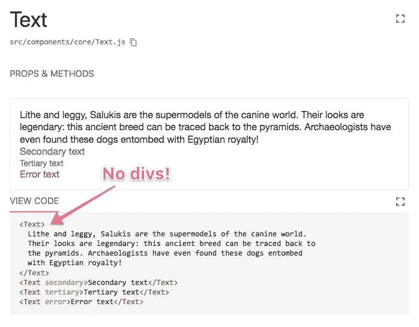

# react Styleguidist 7:hello web pack 4，goodbye Node.js 4 等等

> 原文：<https://medium.com/hackernoon/react-styleguidist-7-0-0-hello-webpack-4-goodbye-node-js-4-257a9c6a6e72>


Photo by [Artem Sapegin](https://unsplash.com/photos/Ke4Ut8IDkuQ?utm_source=unsplash&utm_medium=referral&utm_content=creditCopyText) on [Unsplash](https://unsplash.com/@sapegin?utm_source=unsplash&utm_medium=referral&utm_content=creditCopyText)

👋 [**支持 Styleguidist**](https://opencollective.com/styleguidist) **开集体**👋

我很高兴地宣布一个新的主要版本 [React Styleguidist](https://react-styleguidist.js.org/) 。

## Webpack 4 支持

Webpack 3 也仍然受支持。

## Node.js 6 是支持的最低版本

Styleguidist 不再适用于 Node.js 4。

## 示例包含在 React 中。碎片

您不再需要在一个 div 中包装多个 JSX 标签。

```
// 6.x
<div>
  <Button primary>Primary button</Button>
  <Button secondary>Secondary button</Button>
</div>

// 7.x
<Button primary>Primary button</Button>
<Button secondary>Secondary button</Button>
```



片段 JSX 语法也有效:

```
// 7.x
<>
  <Button primary>Primary button</Button>
  <Button secondary>Secondary button</Button>
</>
```

## 模板选项的新格式

我们现在使用的是 [mini-html-webpack-plugin](https://github.com/styleguidist/mini-html-webpack-plugin) 和[@ vxna/mini-html-web pack-template](https://github.com/vxna/mini-html-webpack-template)而不是 [html-webpack-plugin](https://github.com/jantimon/html-webpack-plugin) 。这将使得添加 favicon 或 Google Fonts 的工作变得更加容易。

如果您使用自定义 HTML 模板，您需要更新您的样式指南配置。而不是:

```
// 6.x
module.exports = {
  template: './styleguie/template.html'
}
```

你需要使用这样的东西:

```
// 7.x
module.exports = {
  template: {
    favicon: 'https://assets-cdn.github.com/favicon.ico'
  }
}
```

或者像这样:

```
// 7.x
module.exports = {
  template: {
    head: {
      links: [
        {
          rel: 'stylesheet',
          href: 'https://fonts.googleapis.com/css?family=Roboto'
        }
      ]
    }
  },
  theme: {
    fontFamily: {
      base: '"Roboto", sans-serif'
    }
  }
}
```

还有一些更改，请参见[完整的更改日志](https://github.com/styleguidist/react-styleguidist/releases/tag/v7.0.0)。

❤️非常感谢安德烈·奥科涅奇尼科夫、尼古拉·布尔洛夫、鲁本·莫亚和其他人对 release️的帮助！❤️