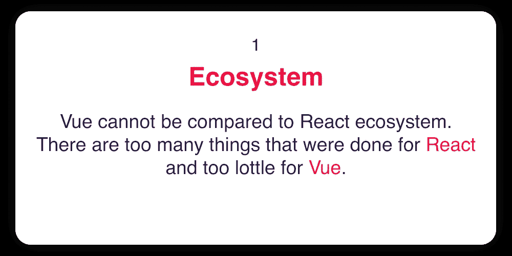
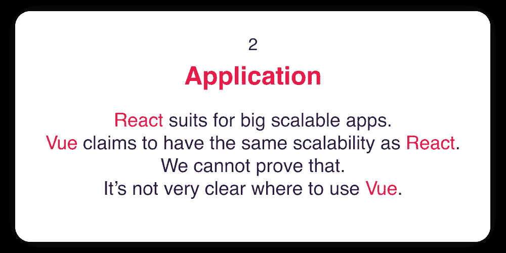
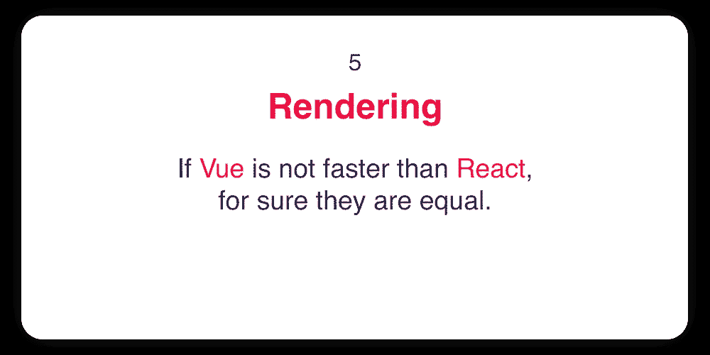
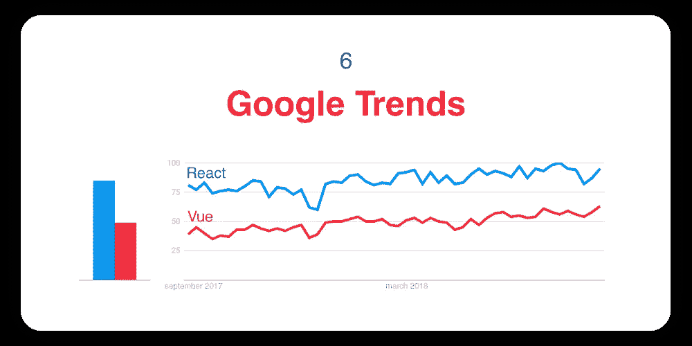

# React VS Vue

> 原文：<https://medium.com/hackernoon/react-vs-vue-650c912315bb>

两年多来，我们一直在开发移动应用。在此期间，我们获得了宝贵的经验，我们想与你分享。我们已经比较了 [React 和 Angular](https://dashbouquet.com/blog/frontend-development/angular-vs-react) ，所以今天我们来看看 React 和 Vue。我们的技术总监/团队领导等将介绍和解释工作中的差异。这是六张卡。

# 总结

我们建议 React 从事大型和小型应用程序开发。

[作者:德米特里·布德科](https://www.linkedin.com/in/dmitrybudko/%5C)