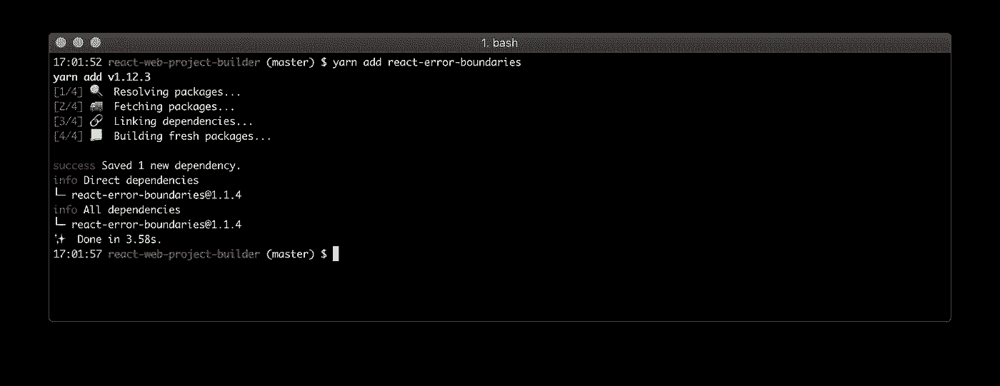
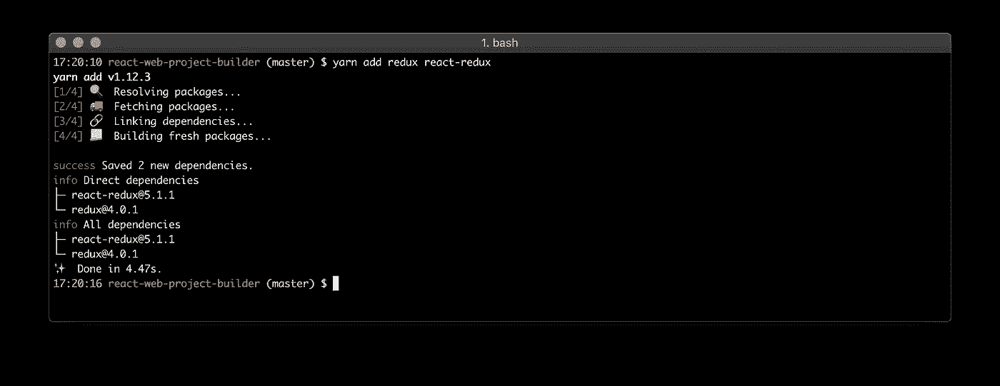

# React Web 项目构建

> 原文：<https://medium.com/hackernoon/react-web-project-building-5e9cc4ff54da>

## 在这篇文章中，我将向你展示如何用一个新的 React 特性创建 React web 项目内核:React 悬念和 React 懒惰。


谁想看所有代码现在我创建了一个 [**github 库**](https://github.com/evheniy/react-web-project-builder) 。

那么，我们开始吧。

我们的第一步将是创建目录:

```
mkdir react-web-project-builder
cd react-web-project-builder
```

希望你已经 [**安装了 node.js**](https://nodejs.org/en/download/) 。我们将使用最新的 LTS 版本(现在是 **10.13.0** )。我一般用 **nvm** (节点版本管理器)。要查看当前版本，只需运行下一个命令:

```
nvm ls-remote --lts=Dubnium
```


接下来要安装 [**纱**](https://yarnpkg.com/lang/en/) 和 [**创建-反应-app**](https://github.com/facebook/create-react-app) :

```
npm i -g yarn create-react-app
```


现在，我们准备创建我们的 react 应用程序:

```
create-react-app .
```


可以查看我们的 **package.json** 文件:

```
cat package.json
```


甚至启动我们的应用程序:

```
yarn start
```

运行此命令后，您可以在控制台中看到 url:


通常是 [http://localhost:3000/。](http://localhost:3000/.)让我们打开它:


现在我们将创建我们的应用程序内核。

但在此之前，我们应该检查我们的应用程序结构:


我删除了 **App.test.js** ，因为现在我们不需要它(关于测试，我将创建文章的一个新部分)。

让我们创建 **app** 和 **page** 目录:

```
mkdir src/app src/page
```

并将 **src/App.js** 和 **src/App.css** 移动到 **src/page** 目录:

```
mv src/App.js src/page/index.js
mv src/App.css src/page/index.css
```

别忘了更新 **src/page/index.js** (链接到 **logo** 和 **css** 文件):


在 **src/app** 目录下创建 **index.js** :

```
touch src/app/index.js
```

并更新 **src/index.js** 文件:

```
*import* React *from* 'react';
*import* ReactDOM *from* 'react-dom';
*import* './index.css';
***import* AppKernel *from* './app';
*import* Page *from* './page';**
*import* * *as* serviceWorker *from* './serviceWorker';

***const* App = AppKernel(Page);**

ReactDOM.render(<App />, document.getElementById('root'));

*// If you want your app to work offline and load faster, you can change
// unregister() to register() below. Note this comes with some pitfalls.
// Learn more about service workers: http://bit.ly/CRA-PWA* serviceWorker.unregister();
```


我们刚刚创建了 AppKernel。而且不仅仅是分量——是 HOC ( [**高阶分量**](https://reactjs.org/docs/higher-order-components.html) )。

高阶组件来自函数式编程。和高阶函数差不多:得到一个 React 分量，返回一个 React 分量。

关于 React 和函数式编程，你可以在我的文章中读到:

[](https://blog.cloudboost.io/react-functional-way-c533fceda2ce) [## 反应:功能方式

### 正如您可能知道的，使用 react 可以使用函数或类——使用无状态和有状态组件。在…

blog.cloudboost.io](https://blog.cloudboost.io/react-functional-way-c533fceda2ce) 

所以，让我们创建我们的第一个 HOC—**app kernel**(**src/app/index . js**):

```
*import* React *from* 'react';

***const* AppKernel = Component => () => <Component />;**

*export default* AppKernel;
```


这里 **AppKernel** 是一个函数。它只有一个参数:**组件**。

它返回函数——反应组件。该函数不做任何其他事情。它甚至没有道具。

为了检查它的工作情况，我们可以再次运行我们的应用程序:

```
*yarn start*
```

如果您正确完成了所有步骤，您将不会看到任何错误:


现在，我们准备向 AppKernel 添加功能。

# `StrictMode`

[**严格模式**](https://reactjs.org/docs/strict-mode.html) 是一个突出应用中潜在问题的工具。像 [**片段**](https://reactjs.org/docs/fragments.html) ， **StrictMode** 不呈现任何可见 UI。它会为其子代激活额外的检查和警告。

以及重构后的 **src/app/index.js** 文件:

```
*import* React, **{ StrictMode }** *from* 'react';

*const* AppKernel = (Component) => {
    *return* () => (
        **<StrictMode>**
            <Component />
        **</StrictMode>**
    );
};

*export default* AppKernel;
```


# 误差边界

在过去，组件内部的 JavaScript 错误用来破坏 React 的内部状态，并导致它在下一次呈现时发出[**隐晦的**](https://github.com/facebook/react/issues/6895)**错误** 。这些错误总是由应用程序代码中的早期错误引起的，但是 React 没有提供在组件中妥善处理它们的方法，并且无法从中恢复。

你可以阅读如何创建你自己的 [**ErrorBoundary 组件**](https://reactjs.org/docs/error-boundaries.html) ，但是我在一个[**react-error-boundaries**](https://www.npmjs.com/package/react-error-boundaries)包中找到了一个很好的实现。

要安装它，请运行:

```
*yarn add* react-error-boundaries
```



```
*import* React, { StrictMode } *from* 'react';
***import* {
    ErrorBoundary,
    FallbackView,
} *from* 'react-error-boundaries';**

*const* AppKernel = (Component) => {
    *return* () => (
        <StrictMode>
            **<ErrorBoundary *FallbackComponent*={FallbackView}>**
                <Component />
            **</ErrorBoundary>**
        </StrictMode>
    );
};

*export default* AppKernel;
```


同样，我们可以运行应用程序，看看它能不能工作。

为了检查我们的错误处理程序是否工作，我们可以出错，例如在 **src/page/index.js** 中:

```
*import* React, { Component } *from* 'react';
*import* logo *from* '../logo.svg';
*import* './index.css';

*class* App *extends* Component {
  render() { ***throw new* Error('testing');**
    *return* (
      <div *className*="App">
        <header *className*="App-header">
          
          <p>
            Edit <code>src/App.js</code> and save to reload.
          </p>
          <a
            *className*="App-link"
            *href*="https://reactjs.org"
            *target*="_blank"
            *rel*="noopener noreferrer"
          >
            Learn React
          </a>
        </header>
      </div>
    );
  }
}

*export default* App;
```


我们的错误是:


不要忘记恢复此更改。

# Redux

我们如何跳过使用 redux？我在我所有的 react 应用程序中都使用它。

我甚至创建了一个不错的 redux 库— [**Redux Lazy**](https://www.npmjs.com/package/redux-lazy) **。它有助于创建 redux 动作类型、动作创建者、缩减者，甚至以更声明性的方式连接容器(它为您完成所有这些工作)。**

[](https://hackernoon.com/react-redux-for-lazy-developers-b551f16a456f) [## React —为懒惰的开发人员提供 redux

### 每次在 react 应用程序中使用 redux 时，我们都要花费大量时间来创建动作类型、动作创建者、减少者…大多数…

hackernoon.com](https://hackernoon.com/react-redux-for-lazy-developers-b551f16a456f) 

在文章的下一部分，我将展示如何从我们的简单页面组件中创建一个具有自己逻辑的智能组件。

要使用 redux，我们需要安装它(我们可以安装 react-redux —我们将在将来使用它):

```
*yarn add redux react-redux*
```



让我们创建我们的 redux 商店。我们会把它保存在 **src/store/index.js** 中:

```
*import* { createStore } from 'redux';

*const* store = createStore(() => {});

*export default* store;
```


目前它什么也没做。但是在本文的下一部分，我将展示如何配置它，添加日志记录器，通过注入新的 reducers 进行代码拆分。

还有我们的 **AppKernel** :

```
*import* React, { StrictMode } *from* 'react';
*import* { 
  ErrorBoundary, 
  FallbackView,
} *from* 'react-error-boundaries';
***import* { Provider } *from* 'react-redux';

*import* store *from* '../store';**

*const* AppKernel = (Component) => {
    *return* () => (
        <StrictMode>
            <ErrorBoundary *FallbackComponent*={FallbackView}>
                **<Provider *store*={store}>**
                    <Component />
                **</Provider>**
            </ErrorBoundary>
        </StrictMode>
    );
};

*export default* AppKernel;
```

同样，我们可以运行我们的应用程序，看到它运行良好。

# 反应路由器

我们可以添加 [**React 路由器**](https://github.com/ReactTraining/react-router) 。

```
*yarn add* react-router react-router-dom
```


可以阅读 [**快速入门文档**](https://reacttraining.com/react-router/web/guides/quick-start) 如何使用。

让我们将它添加到我们的 **AppKernel** 中:

```
*import* React, { StrictMode } *from* 'react';
*import* { 
  ErrorBoundary, 
  FallbackView,
} *from* 'react-error-boundaries';
*import* { Provider } *from* 'react-redux';
***import* { BrowserRouter *as* Router } *from '*react-router-dom';**

*import* store *from* '../store';

*const* AppKernel = (Component) => {
    *return* () => (
        <StrictMode>
            <ErrorBoundary *FallbackComponent*={FallbackView}>
                <Provider *store*={store}>
                    **<Router>**
                        <Component />
                    **</Router>**
                </Provider>
            </ErrorBoundary>
        </StrictMode>
    );
};

*export default* AppKernel;
```

重启我们的应用。有用！

在文章的下一部分，我将展示如何用 [**历史**](https://www.npmjs.com/package/history) 创建路由器。

# 焦虑

关于 **React 悬疑**可以在 React 文档中了解更多: [**代码拆分**](https://reactjs.org/docs/code-splitting.html#suspense) 。

它与 [**反应迟钝**](https://reactjs.org/docs/code-splitting.html#reactlazy) 配合使用。

让我们将**反应悬念**添加到我们的 **AppKernel** 中:

```
*import* React, { StrictMode, **Suspense** } *from* 'react';
*import* { 
  ErrorBoundary, 
  FallbackView,
} *from* 'react-error-boundaries';
*import* { Provider } *from* 'react-redux';
*import* { BrowserRouter *as* Router } *from* 'react-router-dom';

*import* store *from* '../store';

*const* AppKernel = (Component) => {
    *return* () => (
        <StrictMode>
            <ErrorBoundary *FallbackComponent*={FallbackView}>
                <Provider *store*={store}>
                    <Router>
                        **<Suspense *fallback*={<div>Loading...</div>}>**
                            <Component />
                        **</Suspense>**
                    </Router>
                </Provider>
            </ErrorBoundary>
        </StrictMode>
    );
};

*export default* AppKernel;
```


你可以创建漂亮的**加载组件**，并把它作为**回退**属性放到**悬念包装器**中。

我们已经完成了 AppKernel。

我们创造了一个伟大的特设。在应用程序的下一部分，我将展示如何将这个大的 HOC 分成小的 HOC，并在自己的 React 项目中重用所有部分或一些有用的部分。

但是在我们结束之前，我将展示如何使用 **React Lazy** 和**代码分割**。

简单的解决方案是包装我们的**页面组件**，并在我们启动应用程序时加载它。

让我们更新一下我们的 **index.js** :

```
*import* React, **{ lazy }** *from* 'react';
*import* ReactDOM *from* 'react-dom';
*import* './index.css';
*import* AppKernel *from* './app';
*import* * *as* serviceWorker *from* './serviceWorker';

***const* Page = lazy(() => *import*('./page'));**

*const* App = AppKernel(Page);

ReactDOM.render(<App />, document.getElementById('root'));

*// If you want your app to work offline and load faster, you can change
// unregister() to register() below. Note this comes with some pitfalls.
// Learn more about service workers: http://bit.ly/CRA-PWA* serviceWorker.unregister();
```


当我们重新加载页面时，我们可以看到相同的结果。这才是重点。

工作原理是一样的。但是现在我们把我们的应用分成小块。如果我们在浏览器(我用 Chrome)的开发工具中检查网络选项卡，我们可以看到它们:


我们可以看到 **1.chunk.js** 和 **2.chunk.js** 。

为了查看**加载组件**，我们可以**禁用缓存**并设置**慢速连接**:


最后一件事。我想检查一下我们的 **package.json** :

```
{
  "name": "react-web-project-builder",
  "version": "0.1.0",
  "private": *true*,
  "dependencies": {
    "react": "^16.6.3",
    "react-dom": "^16.6.3",
    **"react-error-boundaries": "^1.1.4",
    "react-redux": "^5.1.1",
    "react-router": "^4.3.1",
    "react-router-dom": "^4.3.1",**
    "react-scripts": "2.1.1",
    **"redux": "^4.0.1"**
  },
  "scripts": {
    "start": "react-scripts start",
    "build": "react-scripts build",
    "test": "react-scripts test",
    "eject": "react-scripts eject"
  },
  "eslintConfig": {
    "extends": "react-app"
  },
  "browserslist": [
    ">0.2%",
    "not dead",
    "not ie <= 11",
    "not op_mini all"
  ]
}
```

我们可以看到新的依赖关系。

目前就这些。

[](/@evheniybystrov/react-web-project-building-part-2-hocs-4416f4721168) [## React Web 项目构建。第 2 部分— HOCs

### 在前一部分中，我们创建了 AppKernel HOC(高阶组件),为您的应用程序添加一些有用的功能。

medium.com](/@evheniybystrov/react-web-project-building-part-2-hocs-4416f4721168) 

Github 链接:

[](https://github.com/evheniy/react-web-project-builder) [## evheniy/react-web-project-builder

### https://medium . com/@ evheniybystrov/react-we b-project-building-5e 9 cc 4 ff 54 da-evheniy/react-we b-project-builder

github.com](https://github.com/evheniy/react-web-project-builder) 

减少懒惰链接:

[](https://www.npmjs.com/package/redux-lazy) [## redux-懒惰

### redux-懒惰

redux-lazywww.npmjs.com](https://www.npmjs.com/package/redux-lazy) [](https://hackernoon.com/react-redux-for-lazy-developers-b551f16a456f) [## React —为懒惰的开发人员提供 redux

### 每次在 react 应用程序中使用 redux 时，我们都要花费大量时间来创建动作类型、动作创建者、减少者…大多数…

hackernoon.com](https://hackernoon.com/react-redux-for-lazy-developers-b551f16a456f) [](https://hackernoon.com/react-redux-for-lazy-developers-part-2-d0c60123592f) [## React —为懒惰的开发人员提供 redux。第二部分

### 在本文中，我将继续讨论使用 redux-lazy 创建 react redux 应用程序。

hackernoon.com](https://hackernoon.com/react-redux-for-lazy-developers-part-2-d0c60123592f) [](https://hackernoon.com/react-redux-for-lazy-developers-part-3-319b639a22c3) [## React —为懒惰的开发人员提供 redux。第三部分

### 这是关于创建 react redux 应用程序系列的最后一部分。

hackernoon.com](https://hackernoon.com/react-redux-for-lazy-developers-part-3-319b639a22c3) [](https://hackernoon.com/react-redux-development-on-steroids-95dfed7e7a85) [## 反应/减少类固醇的发展

### 在本文中，我将展示使用 Redux Lazy 开发 React / Redux 应用程序有多快。

hackernoon.com](https://hackernoon.com/react-redux-development-on-steroids-95dfed7e7a85)