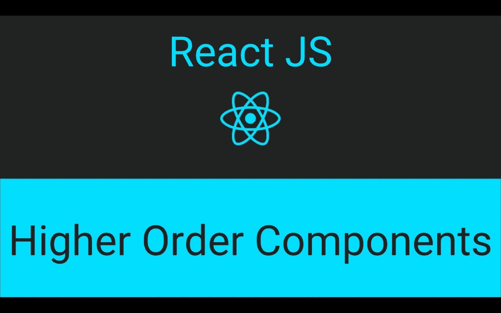
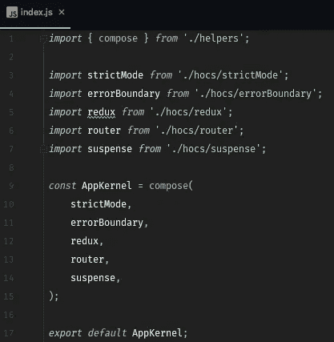
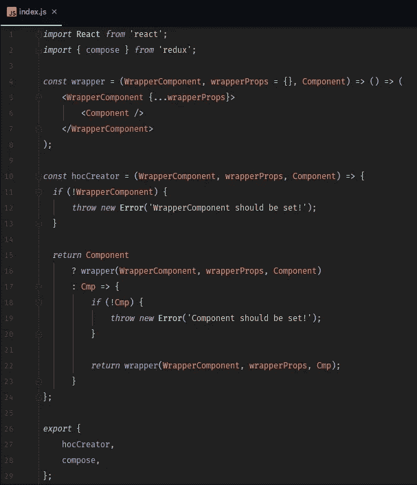
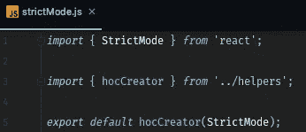
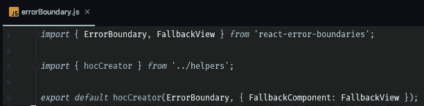
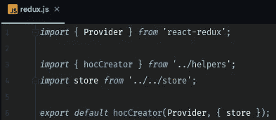
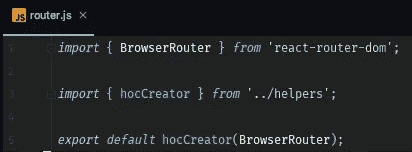
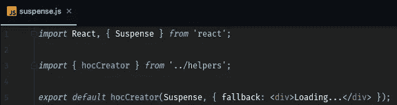
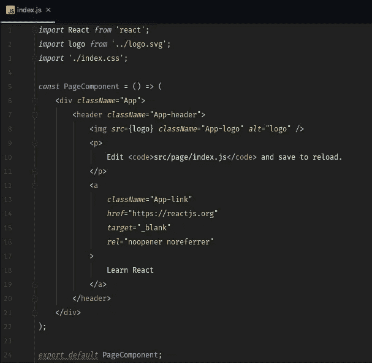

# React Web 项目构建。第 2 部分— HOCs

> 原文：<https://medium.com/hackernoon/react-web-project-building-part-2-hocs-4416f4721168>

在上一部分中，我们创建了 **AppKernel** **HOC** (高阶组件)来为你的应用添加一些有用的特性。

在这一部分中，我们将继续学习 HOCs 和函数式编程。我们将把我们的大 HOC 分成一些小的部分，你可以重用它们来构建你自己的应用程序。

[](https://hackernoon.com/react-web-project-building-5e9cc4ff54da) [## React Web 项目构建

### 在这篇文章中，我将向你展示如何用一个新的 React 特性创建 React web 项目内核:React 悬念和…

hackernoon.com](https://hackernoon.com/react-web-project-building-5e9cc4ff54da) 

但是在开始之前，我们需要记住一些函数式编程的基础知识。

**HOC** (高阶分量)是**高阶函数**的一种。这是一个以组件作为参数的函数，它返回一个新的组件。

在这一部分，我们将使用功能组合和某种咖喱。

让我们记住上一部分的 **AppKernel** :

```
*import* React, { StrictMode, Suspense } *from* 'react';
*import* { 
  ErrorBoundary, 
  FallbackView,
} *from* 'react-error-boundaries';
*import* { Provider } *from* 'react-redux';
*import* { BrowserRouter *as* Router } *from* 'react-router-dom';

*import* store *from* '../store';

*const* AppKernel = (Component) => {
    *return* () => (
        **<StrictMode>
            <ErrorBoundary *FallbackComponent*={FallbackView}>
                <Provider *store*={store}>
                    <Router>
                        <Suspense *fallback*={<div>Loading...</div>}>
                            <Component />
                        </Suspense>
                    </Router>
                </Provider>
            </ErrorBoundary>
        </StrictMode>**
    );
};

*export default* AppKernel;
```

想象一下我们的目标:

```
*import* { compose } *from* './helpers';

*import* strictMode *from* './hocs/strictMode';
*import* errorBoundary *from* './hocs/errorBoundary';
*import* redux *from* './hocs/redux';
*import* router *from* './hocs/router';
*import* suspense *from* './hocs/suspense';

*const* AppKernel = **compose(
    strictMode,
    errorBoundary,
    redux,
    router,
    suspense,
)**;

*export default* AppKernel;
```



它看起来更具声明性——功能相同但代码更少。和其他好处——您可以在 HOC 中组合任何部分，并在任何其他 React 应用程序中重用它。

现在谁想看全部代码，我创建了一个 [**github 库**](https://github.com/evheniy/react-web-project-builder) 。

所以，让我们从头开始。

首先，我们需要创建 compose 函数。为此，我在我们的 **src/app** 目录中创建了一个助手。我没有创建自己的合成功能，因为我们使用 redux，它有自己的合成功能，它对我们来说非常完美。

```
*import* { compose } *from* 'redux';
```

主要的想法是为每一层制作小的 hoc。为此，我创建了一个**包装器**:

```
*const* wrapper = (WrapperComponent, wrapperProps = {}, Component) => () => (
    <WrapperComponent {...wrapperProps}>
        <Component />
    </WrapperComponent>
);
```

它将**包装组件**如**严格模式**或**悬念**并包装**组件**。如果我们需要，我们可以添加任何属性，例如，如果我们需要通过**Redux****Provider**中的 **store** :

```
<Provider *store*={store}>
```

但是要在构图中使用它，我们需要实现这个功能:

```
*const* hocCreator = (WrapperComponent, wrapperProps, Component) => {
  *if* (!WrapperComponent) {
      *throw new* Error('WrapperComponent should be set!');
  }

  *return* Component
      ? wrapper(WrapperComponent, wrapperProps, Component)
      : Cmp => {
          *if* (!Cmp) {
              *throw new* Error('Component should be set!');
          }

          *return* wrapper(WrapperComponent, wrapperProps, Cmp);
      }
};
```

它使用带有一些检查的包装函数:如果我们没有放入**组件**，它将返回另一个函数。

以及我们助手的所有代码:

```
*import* React *from* 'react';
*import* { compose } *from* 'redux';

*const* wrapper = (WrapperComponent, wrapperProps = {}, Component) => () => (
    <WrapperComponent {...wrapperProps}>
        <Component />
    </WrapperComponent>
);

*const* hocCreator = (WrapperComponent, wrapperProps, Component) => {
  *if* (!WrapperComponent) {
      *throw new* Error('WrapperComponent should be set!');
  }

  *return* Component
      ? wrapper(WrapperComponent, wrapperProps, Component)
      : Cmp => {
          *if* (!Cmp) {
              *throw new* Error('Component should be set!');
          }

          *return* wrapper(WrapperComponent, wrapperProps, Cmp);
      }
};

*export* {
    hocCreator,
    compose,
};
```



现在，我们准备为每一层创建一个特设。

# 严格模式

**src/app/hocs/strict mode . js**:

```
*import* { StrictMode } *from* 'react';

*import* { hocCreator } *from* '../helpers';

*export default* hocCreator(StrictMode);
```



太容易了。我们使用我们的 **hocCreator** 助手函数从 **React StrictMode** 组件创建一个 HOC。

如果我们想象它是如何工作的，我们会得到这样的结果:

```
() => (
  <StrictMode>
    <Component />
  </StrictMode>
)
```

# 误差边界

**src/app/hocs/error boundary . js**:

```
*import* { ErrorBoundary, FallbackView } *from* 'react-error-boundaries';

*import* { hocCreator } *from* '../helpers';

*export default* hocCreator(ErrorBoundary, { FallbackComponent: FallbackView });
```



在这里我们可以看到我如何使用 **ErrorBoundary** 组件的属性。

它是这样工作的:

```
() => (
  <ErrorBoundary FallbackComponent={FallbackView}>
    <Component />
  </ErrorBoundary>
)
```

# Redux

**src/app/hocs/redux.js** :

```
*import* { Provider } *from* 'react-redux';

*import* { hocCreator } *from* '../helpers';
*import* store *from* '../../store';

*export default* hocCreator(Provider, { store });
```



# 路由器

**src/app/hocs/router.js** :

```
*import* { BrowserRouter } *from* 'react-router-dom';

*import* { hocCreator } *from* '../helpers';

*export default* hocCreator(BrowserRouter);
```



# 焦虑

**src/app/hocs/悬念. js** :

```
*import* React, { Suspense } *from* 'react';

*import* { hocCreator } *from* '../helpers';

*export default* hocCreator(Suspense, { fallback: <div>Loading...</div> });
```



还有小额奖金。我更新了我们的页面组件，只使用纯组件。纯组件使用与纯函数相同的思想——没有副作用。

这是一个带参数的函数，它返回 JSX:

**道具= > JSX**

**src/page/index.js:**

```
*import* React *from* 'react';
*import* logo *from* '../logo.svg';
*import* './index.css';

*const* PageComponent = () => (
    <div *className*="App">
        <header *className*="App-header">
            
            <p>
                Edit <code>src/page/index.js</code> and save to reload.
            </p>
            <a
                *className*="App-link"
                *href*="https://reactjs.org"
                *target*="_blank"
                *rel*="noopener noreferrer"
            >
                Learn React
            </a>
        </header>
    </div>
);

*export default* PageComponent;
```



仅此而已。

现在，您可以使用 **hocCreator** helper 轻松创建任何 HOC，并创建自己的 **AppKernel** ，为您的应用程序提供任何有用的功能。

[](https://github.com/evheniy/react-web-project-builder) [## evheniy/react-web-project-builder

### https://hacker noon . com/react-we b-project-building-5e 9 cc 4 ff 54 da-evheniy/react-we b-project-builder

github.com](https://github.com/evheniy/react-web-project-builder) [](https://blog.cloudboost.io/react-functional-way-c533fceda2ce) [## 反应:功能方式

### 正如您可能知道的，使用 react 可以使用函数或类——使用无状态和有状态组件。在…

blog.cloudboost.io](https://blog.cloudboost.io/react-functional-way-c533fceda2ce)