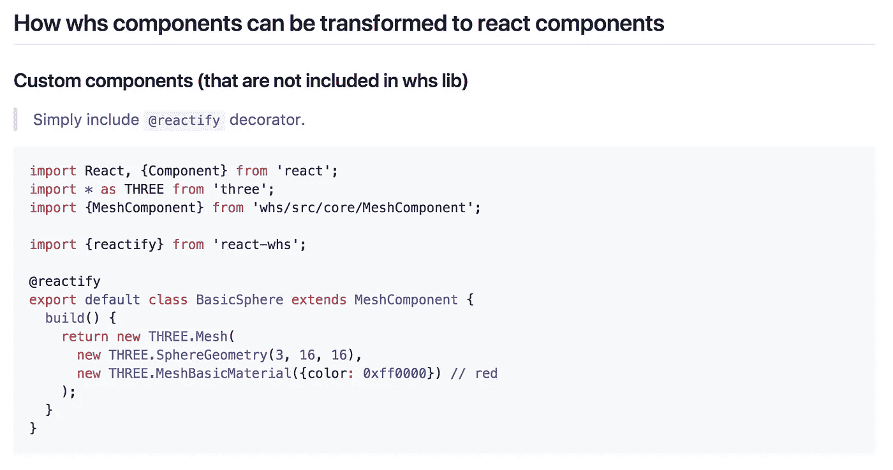

# React + WebGL。使用 React 创建 3D 应用程序的不同方式。

> 原文：<https://medium.com/hackernoon/react-webgl-different-ways-of-creating-3d-apps-with-react-3af844f61257>

## 最初发表于[泽奥利安](https://www.zeolearn.com/magazine/react-webgl-different-ways-of-creating-3d-apps-with-react)

[http://www.larsberg.net/#triboids](http://www.larsberg.net/#triboids) by Lars Berg

在这篇文章中，我将描述一些用于用 React 创建 3D 在线游戏和网站的库/框架。这篇文章不是关于每种方法的缺点，它解释了可能对完成你的目标有用的可能性和特性。

## 何时使用 React with WebGL 以及如何使用？

React 最常见和最受欢迎的功能是“组件”——我的建议是在 3D 中使用这种模式，你可以在本文的[中阅读更多关于 3D 组件的内容。](https://hackernoon.com/component-system-in-interactive-3d-of-web-18348eecf270?gi=b526939de8ef)

**TL；博士**:将 react 用于小型 3D 网络应用程序(没有后期处理，没有太多的交互性)，这不是一个严格的规则，但当制作 3D 游戏时，将所有 3D 内容放在 React 组件中会导致你进一步开发的瓶颈，并限制你的可能性。

# 框架、库、工具

因此，让我们通过编写一个基本的 3D 应用程序来比较所有这些规则:

*   对层次使用反应
*   添加**轨道控制**(或者是模拟的)
*   动画(渲染图像应在每一帧上更新)

## [反应-三](https://github.com/Izzimach/react-three)

**浏览器限制。你可能会同意，这可能是你可以使用的最简单的工具组合， ***并且可能是使它工作的最简单的方法？呃…*** 嗯，我试着做了一个小的 *codepen 例子*，令人惊讶的是， [react-three](https://github.com/Izzimach/react-three) 没有提供我可以在浏览器中使用的 react 绑定库的 UMD 版本，相反，他们只有一个 Commonjs2 版本，当你在 codepen 上使用它时，它不能工作(当然，因为它还是一个模块，而不是一个库)。如果你使用的是 webpack 或 browserify 这样的工具——这对你来说应该不是问题，而且当提到 React 时，这也是你应该做的，但我不能用这种方式编写代码。所以我编写了自己的 hacky `react-three.js`来让一切正常工作。**

同样的事情也发生在我和`ReactVR`以及`Aframe-react`身上。有问题吗？对我来说——是的，但可能对你来说不是，因为我的任务是在 CodePen 上显示所有代码，你可能会“以正确的方式”使用它。

react-three bindings

在`react-three`中，你做事情的方式和在 **Three.js** 中一样，但是使用了 react-binding，除了有时候你可能会看到与 Three.js 中的组件并不真正相关的道具，比如`<Scene />`组件的`orbitControls`道具。(OrbitControls 与相机一起工作，而不是与场景本身一起工作)。我希望在未来的版本中看到对其他类型控件的支持。

**文档:**[https://github . com/izzi mach/react-three/blob/master/readme . MD](https://github.com/Izzimach/react-three/blob/master/README.md)

**演示:**[https://github.com/Izzimach/r3test/](https://github.com/Izzimach/r3test/)

## [反应堆](https://github.com/WhitestormJS/react-whs)

这是我发明的工具:)它是为一个 [WhitestormJS 框架](https://github.com/WhitestormJS/whs.js)开发的，该框架基于 [Three.js](https://threejs.org/) 库，让你在 3D (WebGL)世界中使用可重用组件&模块。

> WhitestormJS 实现了一个具有组件系统和插件支持的核心，用于快速开发具有物理特性的 3D 场景。
> 
> 使用 whitestorm 自动化您的 web 应用程序既快速又舒适。这个引擎有自定义 Physi.js 库实现的物理支持，比其他的要快很多。框架提供了扩展的组件控制和高帧速率，因为它使用 WebWorkers 技术进行多线程处理。

react-whs bindings

如果您以前使用过 **whs** ，那么使用`react-whs`相当容易，因为您不需要猜测特定组件存在哪些道具，因为它会自动将 params {}对象转换为 react 的道具。只需比较两者:

whs.js

react-whs

我想展示的另一个好特性是，WHS 组件可以简单地转换成 React 组件:

您可以传递一个回调(`refComponent`或`refApp`)来获取 React 外部的 whs 实例的引用

**文档:**[https://github . com/WhitestormJS/react-whs/blob/master/readme . MD](https://github.com/WhitestormJS/react-whs/blob/master/README.md)

**演示:**https://codepen.io/sasha240100/pen/dNqKMd?editors=1010

## [反应堆](https://facebook.github.io/react-vr/)

> **React VR** 让你只用 JavaScript 就能构建 VR 应用。它使用与 React 相同的设计，让您从声明性组件中构建丰富的 VR 世界和 UI。
> 
> 来自 [ReactVR 网站](https://facebook.github.io/react-vr/index.html)

ReactVR 是脸书 React 团队做的一个很好很有前景的项目。和大多数 3D 框架一样，它基于 **Three.js** 。

在写这篇文章的时候，只有一些几何图形可用(球体、盒子、圆柱体)——对于任何其他形状，你需要使用`<Model />`组件并导入 *obj/mtl。*

材料也是如此，你可以在`MeshBasicMaterial`(不依赖光的，`lit = false`)和`MeshPhongMaterial`(依赖光的，`lit = true`)之间做出选择。—如果要使用自定义材质，需要在`materialParameters`对象内提供`vertexShader` & `fragmentShader`属性。

他们决定在 3D 中拥有[类似 css 的坐标系。Three.js“位置”被命名为“平移”,这意味着使用平移向量将对象从其轴心移动。你有了`rotateX, rotateY and rotateZ`而不是`rotation`或`quaternion`。这些非常类似于](https://facebook.github.io/react-vr/docs/3dcoordinates-and-transforms.html) [css 转换](https://developer.mozilla.org/en-US/docs/Web/CSS/transform)。

## [Aframe-react](https://github.com/ngokevin/aframe-react)

A-frame 是 Mozilla WebVR 团队做的一个很酷的 Three.js 框架。

> A-Frame 可以从一个普通的 HTML 文件开发出来，而不需要安装任何东西。尝试 A-Frame 的一个很好的方法是在 Glitch 上重新混合 starter 示例，Glitch 是一个在线代码编辑器，可以立即免费托管和部署。或者，创建一个`.html`文件，并在`<head>`中包含一个 A 帧

aframe-react

在 **aframe-react** 中，你得到`Scene`和`Entity`(任何不是场景的东西，实体= 3D 物体)react 组件。下面是如何将任何 a-frame 自定义 html 标签转换为 React 组件:假设您有`<a-sky color="#000000"></a-sky>`，那么`a-sky`就是您的**原语**道具，您将属性转换为道具。

**文档:**[https://aframe.io/docs/0.7.0/introduction/](https://aframe.io/docs/0.7.0/introduction/)

# 结论

WebGL 发展很快，React 中已经有很多覆盖 webgl 的大项目(在我们的例子中——three . js)。

这些是 three.js 功能的包装器，它只允许您访问常用选项(*而不是高级功能*)，这是因为您永远不会在 React 中使用 WebGL 来构建高级的东西(复杂的 3D 游戏或创意网站)。

React+WebGL 作为创建内容的方式对于处理基本功能的简单直观的 3D web 应用程序来说是很好的，例如 3D 模型查看或像 [this](https://aframe.io/examples/showcase/shopping/) 这样的简单 VR 体验。

值得一提的是这个 WebGL-React 项目:

*   [**GL-React**](https://github.com/gre/gl-react-v2)**—React 在描述性 VDOM 范式中对图像和内容实现复杂效果的绑定。**
*   **[**react-unity-web GL**](https://github.com/jeffreylanters/react-unity-webgl)**—**将您的 Unity 应用程序嵌入 react 应用程序中，编写具有双向 Unity 和 react 通信的交互界面。******

> ******最近我为 Skillshare 制作了一个[“WebGL 世界介绍”](https://skl.sh/2shhq00) **课程，**你可能会在那里找到一些有趣的 web GL 秘密！点击这里。******