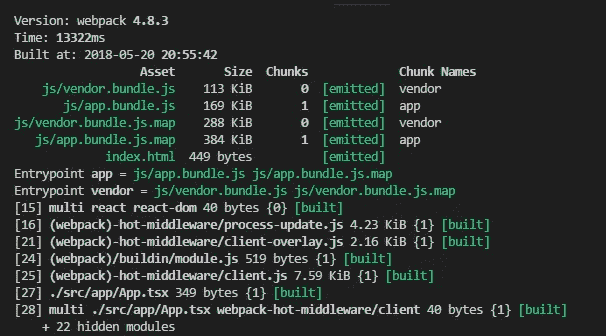
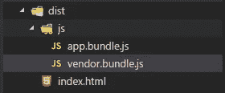
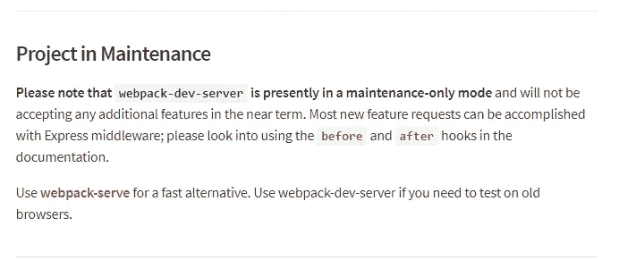
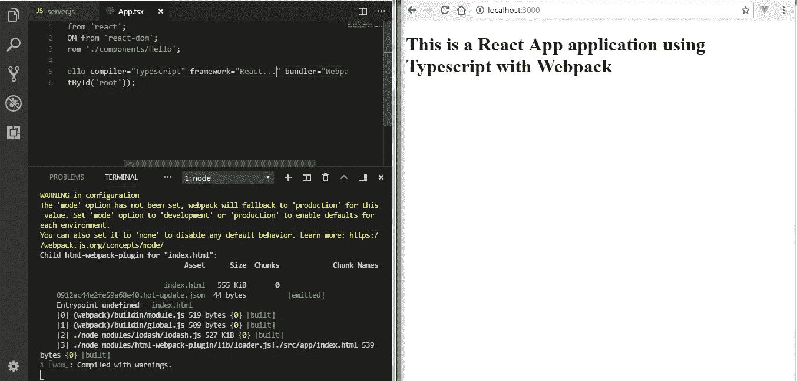
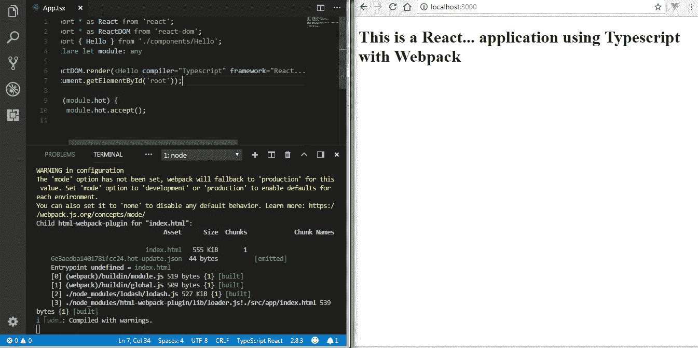

# 用 Typescript 和 Webpack 作出反应

> 原文：<https://medium.com/hackernoon/react-with-typescript-and-webpack-654f93f34db6>


The feeling, when you react, script and pack.

# 我为什么要写这个

在撰写本文时， [*React*](https://reactjs.org/) 的受欢迎程度已经达到顶峰，而 [*Typescript*](http://www.typescriptlang.org/) 的受欢迎程度正在上升，可以肯定地说 [*Webpack*](https://webpack.js.org/) 是应用程序最受欢迎的现代模块捆绑器。然而，在用 *Typescript* 和 *Webpack* 进行 *React* 的项目中，仍然缺乏一个很好的例子。话虽如此，如果你想使用[*create-react-app*](https://www.npmjs.com/package/create-react-app)CLI 或任何其他 react 初学者工具包，那里有很好的资源。但是，如果您想控制应用程序的配置，这种方法非常少。

使用像 create-react-app 这样的 cli 的缺点是，您必须像 create-react-app 一样依赖以下工具

*   **网络包**
*   **巴别塔**
*   **带自动预修正器的 post CSS**
*   **笑话**
*   **流量(可选)**

如果你非常不喜欢以上任何一个，你将很难接受它。 *create-react-app* 兑现了它的承诺‘*无构建配置’*，因为你根本无法配置这个工具。它提供了一种弹出工具的方法，如果您想进一步扩展配置，可以放开 create-react-app，但我为什么要这样做呢？如果我一开始就处理配置，不是会容易得多吗？此外，一旦你退出，你的项目的依赖项将会增加，其中一半你可能甚至不需要。说了这么多，如果你正在寻找一个初学者或一个中小型项目，它可能是让你的项目开始的最好的 react 工具包。

如果您想建立一个包含以下内容的项目，您可能会发现本文很有帮助:

*   **React** —主要前端框架
*   **Typescript** —编译成 javascript 的主要语言
*   **Webpack** —应用捆绑器。
*   **Express** —将托管 react 应用程序的服务器
*   **Hot Module Reload**——当服务器运行到浏览器时，它将服务并加载您所做的所有代码更改，而无需您停止并再次运行您的应用程序。

# 让反应、脚本和包装开始吧！

在我们开始之前，在你的驱动器中创建一个空的文件夹来重新开始。如果您使用的是 windows 机器，请在命令行终端键入以下三个命令。

```
mkdir react-ts-webpack
cd react-ts-webpack
code .
```

最后一个命令将最近创建的空文件夹作为一个项目在 Visual Studio 代码中打开，这是一个相当流行的编辑器，您很可能拥有它。如果没有，请在您最喜欢的编辑器中打开它。

因此，按照流行的传统，当您创建一个新项目时，通过在终端中键入下面一行来初始化我们项目中的 npm。

```
npm init -y
```

现在，我们将创建一些设置项目所需的文件和文件夹。因此，在您的文件夹的根目录下创建以下文件/文件夹。

*   创建文件***webpack . config . js***:*这是针对 web pack 配置的*
*   创建文件***ts config . JSON***:*这是用于类型脚本配置*
*   创建文件***server . js:****这是您的服务器启动应用程序*
*   创建文件夹 ***src。***
*   在 ***src 内创建文件夹 ***app*** 。***
*   创建一个文件***【index.html】*****app***和文件夹 ***组件******
*   *创建文件 ***App.tsx*** 内 ***app*** 和 ***Hello.tsx*** 内 ***组件****

*因此，应用程序的文件夹结构如下所示*

```
*|-src
  |-app
    |-components
      |-Hello.tsx
    |-App.tsx
    |-index.html
|-package.json
|-package-lock.json
|-server.js
|-tsconfig.json
|-webpack.config.js*
```

# *开始下载吧！*

*现在，我们将下载我们的生产和开发依赖项。*

## *下载生产依赖项*

```
*npm i react react-dom express typescript --save*
```

## *下载开发依赖项*

```
*npm i @types/react @types/react-dom webpack webpack-cli ts-loader webpack-dev-middleware webpack-hot-middleware html-webpack-plugin source-map-loader -D*
```

*恭喜你！我们几乎已经完成了一半，却没有编写任何代码。*

# ***我们来码！***

*这是你刚刚创建的文件的内容。您可以从这里将它们粘贴到您的相关项目上(要点链接嵌入在文件的标题中)或键入。*

*   *[*index.html*](https://gist.github.com/saurabhpati/a8edad483034ef978f0d05943fae3ebe)*:**

*[index.html](https://gist.github.com/saurabhpati/5599dcb6e8f8c1752625d41ddca24055)*

*   *[*ts config . JSON*](https://gist.github.com/saurabhpati/4f681572f5c03683eca7a804c8b80c78)*:**

*tsconfig.json*

*   *[*web pack . config . js*](https://gist.github.com/saurabhpati/5599dcb6e8f8c1752625d41ddca24055):*

*webpack.config.js*

# *让我们稍微反应一下！*

*让我们编写一个典型的 react 组件，毕竟这是您在完成设置后将要并且应该关注的代码。*

*因此，您可以按照自己的意愿编写或粘贴代码。*

***hello . tsx:***

```
*import * as React from 'react';interface IProps {
   compiler: string,
   framework: string,
   bundler: string
}export class Hello extends React.Component<IProps, {}> {
   render() { return <h1>This is a {this.props.framework} application using    {this.props.compiler} with {this.props.bundler}</h1>
   }
}*
```

****App.tsx* :***

```
*import * as React from 'react';
import * as ReactDOM from 'react-dom';
import { Hello } from './components/Hello';ReactDOM.render(<Hello compiler="Typescript" framework="React" bundler="Webpack" />,document.getElementById('root'));*
```

# *我们去打包吧！*

*如果您不熟悉 webpack，下面提供了关于选项的简介。如果你已经知道这些东西，请随意跳过它。*

*   ****entry***:web pack 的工作方式是你给它提供一个 entry，它就开始构建你的应用程序，查看你的 entry 导入的内容并相应地创建一个依赖图，你给这个对象提供的属性越多，它将要创建的 bundles 数量就越多，所以通过查看 *entry* 和 *output* config，你可以猜测它将会创建 *app.bundles.js* 和 *vendor.bundles 之所以要有单独的包，是因为 react 和 react-dom 代码不太可能被更改，所以将它们作为单独的包(称为 vendor)对于您的浏览器来说是有意义的，这样可以缓存它们以提高性能。app 属性中的 webpack-hot-middleware/client 用于支持实时重新加载 app 代码。**
*   ****输出* :** 当 Webpack 必须将捆绑代码从您的应用程序发送到磁盘时，它会查看此配置。 *path* 是要写入代码的输出目录， *filename* 顾名思义就是要给输出代码的文件名。*
*   ****dev tool:***web pack 查看这个配置来添加某些开发工具。这里添加了源代码映射，以便在浏览器中对代码进行源代码映射，从而可以在开发时简化调试。*
*   ****resolve***:web pack 在这里决定是否考虑捆绑这个文件，所以在我们的应用程序中，它考虑捆绑扩展名为“ *js* ”、“ *jsx* ”、“ *json* ”、“ *ts* ”、“ *tsx* ”的文件。*
*   ****模块:*** 该配置使 webpack 能够在应用请求时，在加载器的帮助下加载特定文件。在我们的应用程序中，我们使用 ts-loader 和 source-map-loader。source-map-loader 已经在上面介绍过了。因此，如果没有 *ts-loader* ，webpack 将无法理解 *App.tsx* 文件中的这一导入，因为 *Hello* 组件是一个您的编辑器可以理解的‘*tsx*文件，但当导入实际发生时，webpack 无法理解。*

```
*import { Hello } from './components/Hello';*
```

*   *插件:Webpack 不能做所有的事情，我们期望它做所有的事情是错误的。因此，它通过提供插件来克服它的限制，让它扩展到超出它的能力，如 *html-webpack-plugin* 从我们的*src*文件夹中的*index.html*文件创建一个模板文件提供给浏览器，而 *HotModuleReplacement* 插件使我们的代码能够热重装，从而消除了每次对应用程序进行更改时停止服务器并再次运行它的需要。*

# *我们来建吧！*

*现在，您实际上可以手动构建您的应用程序了。在稍后运行我们的服务器之前，我们将自动开始构建。但是现在，如果您想看看到目前为止所做的工作，只需在 package.json 文件中添加一个“build”脚本，然后执行 webpack 命令。*

***package . JSON:***

```
*...
scripts: {
...
**"build": "./node_modules/.bin/webpack",**
...
}
...*
```

*如果您进入终端并运行这个命令，您可以在 dist 文件夹中查看您的捆绑应用程序。*

**在你的终端上运行这个:**

```
*npm run build*
```

**终端输出:**

**

*npm run build*

**

*bundled code*

# *来表达一下吧！*

*如果您不想使用 express 为您的 react 应用程序运行服务器，您可以使用[*web pack-dev-server*](https://www.npmjs.com/package/webpack-dev-server)来处理它，并且您不必自己编写服务器，但是如果您希望拥有自定义服务器的灵活性，以便您编写中间件、处理路由以及修改请求和响应，那么建议您编写自己的服务器。在撰写本文时， *webpack-dev-server* 还没有计划新的特性，并且处于仅维护模式。*

**

*[https://www.npmjs.com/package/webpack-dev-server](https://www.npmjs.com/package/webpack-dev-server)*

****server.js:****

```
*const path = require('path'),
   express = require('express'),
   webpack = require('webpack'),
   webpackConfig = require('./webpack.config.js'),
   app = express(),
   port = process.env.PORT || 3000;app.listen(port, () => { console.log(`App is listening on port ${port}`) });app.get('/', (req, res) => {
   res.sendFile(path.resolve(__dirname, 'dist', 'index.html'));
});let compiler = webpack(webpackConfig);
app.use(require('webpack-dev-middleware')(compiler, {
   noInfo: true, publicPath: webpackConfig.output.publicPath, stats:    { colors: true }
}));
app.use(require('webpack-hot-middleware')(compiler));
app.use(express.static(path.resolve(__dirname, 'dist')));*
```

*现在您可以转到 package.json 并添加启动脚本*

```
***"start": "npm run build && node server.js"***
```

# *让我们重新装弹！*

*一旦您通过在终端中运行' *npm start* '来运行服务器，webpack-dev-middleware 和 webpack-hot-middleware 应该负责热模块替换，但事实并非如此。*

*您可能会注意到，在您做出更改后，webpack 会适时地编译并发出更改后的代码，但它只有在您刷新浏览器时才会生效。这不是我们的初衷。在重新构建更改的组件后，浏览器应该已经刷新。*

**

*HMR in action*

*为了解决这个问题，我们需要稍微修改一下我们的' *App.tsx'**

```
*import * as React from 'react';
import * as ReactDOM from 'react-dom';
import { Hello } from './components/Hello';
**declare let module: any**ReactDOM.render(<Hello compiler="Typescript" framework="React..." bundler="Webpack" />,
document.getElementById('root'));**if (module.hot) {
   module.hot.accept();
}***
```

*因此，基本上我们说我们的应用程序接受 webpack 所做的热重装更改。需要声明部分，因为默认情况下'*模块*'对象上不存在' hot '属性，我们需要请求 typescript 允许它。*

*一旦您在此更改后重新启动服务器，它将按预期工作。*

**

*HMR Fixed*

*如果您想查看完整的锅炉板创建。您可以从该存储库克隆/下载*

*[](https://github.com/saurabhpati/react-ts-webpack-boilerplate) [## saurabhpati/react-ts-web pack-boilerplate

### 这是 react 应用程序需要的终极轻量级样板文件，使用…

github.com](https://github.com/saurabhpati/react-ts-webpack-boilerplate)* 

*我会尝试添加代码分割来进一步提高构建过程的效率，并且很乐意收到关于这篇文章的任何反馈。*