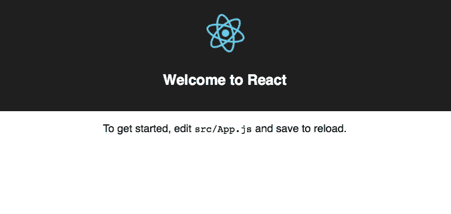
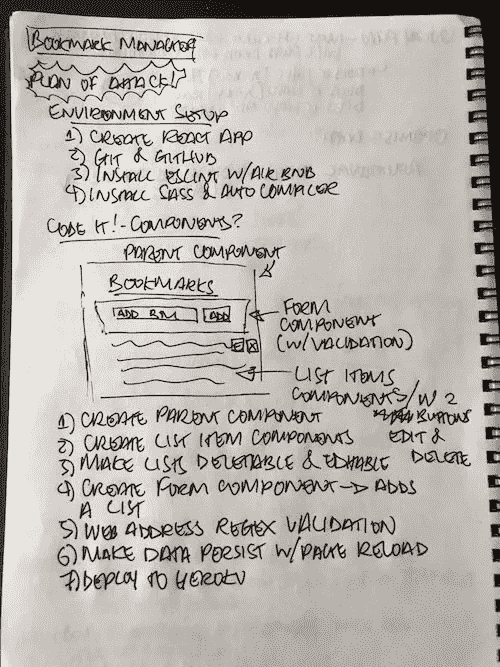
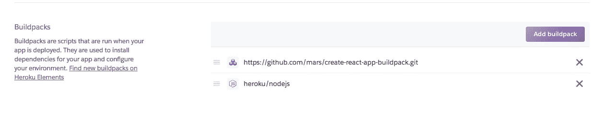
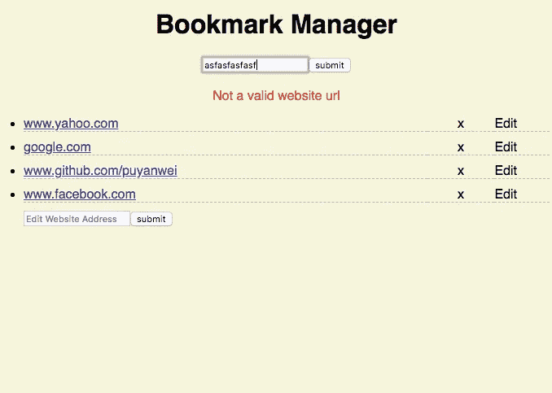

# Reacting to React.js

> 原文：<https://medium.com/hackernoon/reacting-to-react-js-10ff1d50a36c>

差不多一个月前，Vue.js 社区还很兴奋，Vue.js 获得的明星比 T2 还多。github 上的 js。好莱坞明星那样的明星？真的，没有 lol，但可能是比喻…或哲学？

Github stars 是开发人员有效地将该页面加入书签的一种方式，以便他们可以在以后引用它。这是什么意思？Vue 的受欢迎程度已经超过了 React，这是一种象征性的前端接力棒移交，如果你愿意的话。


As of 16th July!

所以大家都在用 Vue.js，它比 React 更受欢迎？嗯，不，星级并不意味着使用，但我们可以看看 npm 下载，这是用来安装这些，并看到 Vue 仍然远远落后；


stats via [http://www.npmtrends.com/react-vs-vue](http://www.npmtrends.com/react-vs-vue)

随着技术不断被使用，企业必须决定是否值得花费时间和金钱来升级到更新的技术。趋势可能是所有的炒作，但需要有一个相当大的理由需要切换到一个更好的[技术](https://hackernoon.com/tagged/technology)，而不是继续使用他们目前的技术。

这意味着所有使用 React 的企业可能会看到使用 Vue 的优势，但它不值得改变，继续使用他们已经拥有的就足够了。

我认为通过更详细地检查 React 来扩展我的技能集是个好主意，看看它有什么不同。这是我发现的…用非常简单的术语解释。

# 设置-创建 React 应用程序

刚开始学习 React 时，最令人沮丧的事情之一是使用过时的教程。开发人员最大的技能之一是能够通过在线寻找解决方案来解决问题。但是了解这些解决方案的年龄也很重要。有相当多的教程，但是它们已经过时了，会让你在意识到之前掉进兔子洞。

脸书的回购是最好的开始方式。它的最小配置、完全模板化的入门套件可让您立即上手。我完全赞成简单和省事，所以这很棒。

```
npx create-react-app [project name]
cd [project name]
npm install
npm start
```

四个简单的终端命令让你开始！

一旦 npm 启动，本地主机服务器就会启动，您会在浏览器上看到 React 的示例页面…



You’ll see a spinning radioactive React logo in your localhost browser…

# 经典结构

说双关语。ES6 在 React 中很普遍，所以在开始之前请确保您已经记下了这些内容，否则会非常混乱！

像 Vue 一样，我们使用组件。组件是我们热爱 React 和 Vue 的全部原因。我们正在把我们的网站分成可重复使用的组件。我们正在重构我们的[前端](https://hackernoon.com/front-end-refactored-components-with-vue-907a08a3630?source=user_profile---------2-------------------&gi=7b7459545941)(不要脸的塞到我的另一篇帖子)！

我决定做一个简单的书签管理器，用户可以将这些链接保存到页面上。还记得我们不得不那样做的那些日子吗？没有吗？糟糕，我觉得自己老了… O_o ' '

好吧，让我们制定一个计划。就像纸和笔…你也记得那些东西吗？



Don’t ask me why I write in ALL CAPS

```
import React, { Component } from 'react';
import './App.css';
import BookmarkForm from './components/BookmarkForm';class App extends Component {
    render() {
        return (
            <div className="App">
                <h1>Bookmarks</h1>
                <BookmarkForm />
            </div>
        );
    }
}export default App;
```

所有组件大致遵循这种结构。顶部是导入，一个包含所有内容的组件类，然后是导出。

在组件类中，你几乎总是会有一个渲染函数，它是被解析到页面的东西。渲染函数总是返回 JSX 代码，其中将包含你想渲染的一切。

在这个渲染函数中，我们有 divs，一个 h1 标签，和另一个组件'<bookmarkform>'。</bookmarkform>

您还可以使用其他内置函数，它们与 render 函数处于同一级别，但仍在 component 类中。您也可以拥有自己想要使用的自定义函数。

最棒的是，这些函数被限制在这个类组件的范围内，这意味着它们只能在这个组件内被访问，除非你不希望它这样做。

学习 React 最常见的问题可能是……JSX 到底是什么？？

# JSX——一切都是 Javascript

由于需求，ES6 有争议地将类引入了 Javascript。但实际上，它只不过是语法上的糖。这意味着它看起来和行为就像其他语言中的类，但它实际上并没有做任何不同。

JSX 也是如此。它的行为和外观都像 HTML，但实际上是 Javascript 被翻译成 HTML 的样子。

```
let newDiv = document.createElement('div');newDiv.className = "hello";
```

与相同

```
<div class="hello"></div>
```

用最简单的术语来说，JSX 将应用 Javascript，但看起来仍然像 HTML。

但是在 JSX，class 是一个保留的关键字，所以我们在 React 中使用' className ',以免与实际的 HTML 混淆，所以对于 JSX，我们应该这样写；

```
<div className="hello"></div>
```

由于 JSX 是 Javascript，我们希望它有时使用 Javascript，所以我们需要一些语法来帮助它识别我们想要这样做。

```
<div className="hello" onClick={this.clicked}></div>
```

这里，onClick 属性运行单击 div 时在该组件中创建的函数 clicked。正如你所看到的，Javascript 对此是显而易见的。

# 传递信息

在这个令人敬畏的组件世界中，我们想要做的事情之一是能够传递信息，以便我们的组件可以灵活。

所以让我们创建一些状态(数据)来保存我们的网站列表。在类中，我们添加构造函数来初始化我们的状态。超级()我稍后会解释…

```
class App extends Component { 
    constructor(props) {  
        super(props);  
            this.state = {   websites: []  }; 
    } 
    render() { *//JSX rendering stuff...*
```

我们将状态存储在一个散列中。现在调用 this.state.websites 将输出空数组。Props 允许在传递给其他组件时访问这些信息。

```
render() {
    let websites = this.state.websites;
    websites = websites.map((website) => {
        return (
            <WebsiteChoice
                website={website}
            >
                {website}
            </WebsiteChoice>
        );
    });*//... more JSX stuff*
```

在 render 函数中，我们将变量“websites”分配给状态中的数组。然后我们用 map 遍历数组，对于数组中的每个元素(一个网站),我们返回组件 WebsiteChoice，并将网站的名称作为属性传入，作为 WebsiteChoice 接收的自定义属性。

这听起来有点疯狂！简单地说，这意味着我们将网站的名称传递给 WebsiteChoice 组件，以便我们可以对它做一些事情，并让 WebsiteChoice 组件而不是父组件来处理它。

所以在 WebsiteChoice 组件中；

```
class WebsiteChoice extends React.Component {
    render() {
        return (
            <li>
                <div className="website-choice-container">
                    <span className="website-choice">
                        <a href={`[http://${this.props.website}`](http://${this.props.website}`)}>
                            {this.props.website}
                        </a>
                    </span>
                </div>
            </li>
        );
    }
}
```

在这里，我们通过调用“this.props.website”来传递网站的名称，并将其设置为 href，然后将其呈现到页面，从而允许该组件负责与每个单独的网站相关的任何事情。

# 省去你这点头痛

Javascript 有趣的部分之一是使用关键字`this`。这是指某个物体内部的事物。这个[博客](http://davidshariff.com/blog/javascript-this-keyword/)解释的超级好。

因此，当我们通过 props 传递这些信息时，我们也可以传递函数，这些函数可以位于父组件中，但在子组件中被调用。

然而，由于我们正在传递对象，关键字 this 可能指向错误的对象。所以知道这里的 ES6 箭头函数非常有用，因为它们允许 this 关键字不引用所创建的函数对象。

所以不要

```
function doSomething() {
    // some code
}
```

使用

```
doSomething = () => {
    // some code
}
```

以避免范围问题。这允许子组件能够从它自己的组件中调用传递下来的`this.props.doSomething`。

如果你记得上面我们有那个奇怪的“超级”关键字，里面有道具。

```
class App extends Component { 
    constructor(props) {  
        super(props);  
            this.state = {   websites: []  }; 
    } 
    render() {*//JSX rendering stuff...*
```

在反应过来，用道具召唤`super`的时候。React 将通过`this.props`使`props`跨组件可用。这允许我们在数据在父组件上时调用`this.props.websites`。

# 部署到 Heroku

代码还有很多，但是这篇文章开始有点太长了。当我高兴的时候，我想看看把我的代码上传到 Heroku 并让它工作是多么容易。我很想知道需要多少配置，尤其是在使用`create-react-app`设置我的模板之后。

我上传到 Heroku，就像我建立一个新的 github 库一样，并遵循他们的[指令](https://devcenter.heroku.com/articles/git)。

上传后，我很快意识到您需要添加一个节点构建包，它可以有效地进行在线 npm 安装来安装所有的依赖项。这是在 heroku 网站上你的应用程序/设置下。



npm install on Heroku!

一旦完成，瞧！它起来了！超级简单，我真的认为`create-react-app`是一个很棒的模板，可以帮助开发者开箱即用。请随意查看[这里](https://react-bookmark-manager.herokuapp.com/)和 github 回购是[这里](https://github.com/puyanwei/React-Bookmark-Manager)。



Ugly, but functional working prototype!

# 最后的想法

我认为 React.js 是一个很好的框架，一旦你了解了 JSX 语法，它的潜力是巨大的。

然而，我确实认为乍一看很难进入，它的可读性比不上 Vue.js，而且它也有一些例外情况规则，你基本上只需要记住，比如使用`className`而不是`class`，这似乎是他们刚刚保留的设计中的远见。

文档是可以的，但是有很多旧的答案，并且总是实现旧的做事方式是有危险的。也就是说，这个社区非常庞大，而且有脸书的“支持”，在可预见的未来，它肯定会继续存在。

我认为能够使用 ES6 对于 react 来说几乎是必须的，考虑到使用传统的非箭头函数会带来的作用域问题，处理到处放置绑定来控制你的 this！

对我来说，如果 Vue 不存在，我可能会是一个满意的 React 开发人员，但对我来说，很难用一种更简单的方式来编写代码…

From the youtube channel DevTips!

我想以一个非常酷的系列视频来结束我的演讲，它讲述了从开始到结束，从概念到工作原型，开发一个项目的过程。我真的很喜欢他们计划的方式，包括他们在整个过程中遇到的所有障碍。这可以很好地洞察开发人员在创建产品时经历了什么。