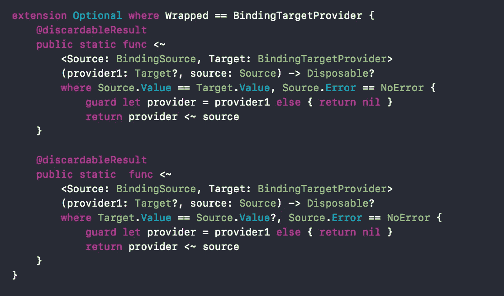

# 反应 Swift 扩展

> 原文：<https://medium.com/hackernoon/reactiveswift-extension-36f7fb1ef10a>

## 增加了对带有 FRP 的绑定操作符(

I have experimented with different app architecture pattern recently and decided to work with [MVVM](https://hackernoon.com/tagged/mvvm) 的更多支持，并为此使用了[ReactiveCocoa](https://hackernoon.com/tagged/reactivecocoa)/ReactiveSwift。

像往常一样，我需要一些帮助器方法，并想在 reactive 中添加一些缺少的方法供我使用，并决定将它们添加到扩展中。

本文假设您对 ReactiveCocoa/ReactiveSwift 有经验，如果您没有，我建议您先去了解基本概念。

让我们来看看这个扩展及其提供的帮助。

## **1。自定义绑定:**

我们可能使用了以下被动方式来更新 UIView 上的一些属性。

```
let showView = MutableProperty(false)self.view.reactive.isHidden <~ self.viewModel.showView
```

这只是在“BindingTargetProvider”和“BindingSource”之间生成绑定。这里的“showView”是一个简单的可变属性。

此代码的作用是根据 showView mutableProperty 的更改更新视图的“isHidden”属性。

到目前为止，这只是显示了这个绑定的默认行为。

通过查看`Reactive`结构定义，我们可以看到它是一个代理，用于托管`Base`的反应性扩展，这意味着我们需要扩展它来添加更多的反应性绑定。

```
/// A proxy which hosts reactive extensions of `Base`.public struct Reactive<Base> {/// The `Base` instance the extensions would be invoked with.public let base: Base}
```

现在我们想要的是添加一些不可用的绑定:
首先我们将添加生成绑定的方法。


Add Method in Reactive Extension to make custom bindings.

让我们通过一个例子来看看如何根据某些可变属性在 UIView 上使用*loaderToggling*。

当 Base: UIView 作为加载器切换只在 UIView 实例上完成时，我们将扩展 Reactive。

如您所见，此函数生成绑定，该绑定将基于来自 mutableProperty 的 showLoader 属性来切换 loader。


Custom binding created for UIView show loader

设置绑定后，这可以用作任何其他绑定

```
self.disposable += self.view.reactive.showLoader <~ self.viewModel.buyNowAction.isExecutingself.disposable += self.view.reactive.showLoader <~ self.viewModel.showLoader.producer
```

下面你可以看到另一个在自定义类`FloatingLabelTextField`上添加反应属性的例子


## **2。** `**<~**` **绑定中允许可选:**

我们都使用过这个操作符`<~`,如上所述，这是为了绑定“BindingTargetProvider”和“BindingSource”。如果你仔细阅读这个定义，你会发现它允许`Source.Value` 是可选的，但不是 BindingTargetProvider 值。

让我们看看这意味着什么。

```
self.containerView.reactive.isHidden <~ self.viewModel.showView
```

在上面的语句中，视图不能是可选的。如果您碰巧有可选的视图，您将得到以下错误:


但是你可能会问，我们倾向于把视图“强行打开”,因为它总是被超级视图保留。


首先，可以在 superview 保留的 UIView 之外的其他类上使用上述操作符。

在我的例子中，我正在处理一个有多个目标的项目，它有多个故事板，但是有相同的控制器类，这要求我把 IBOutlet 设置为可选的。


让我们为可选的目标支持添加这个操作符:



```
self.containerView?.reactive.isHidden <~? self.viewModel.showView
```

现在这将工作，我们将能够使用如上所示的可选视图。

> 我们将很快在 ReactiveSwift 中提出这个问题，这样就有可能在`ReactiveSwift`的未来版本中内置这个问题，而不需要使用扩展，但在此之前..请随意将它包含在您的代码中。

以上要点可在[这里](https://gist.github.com/Ankit-Aggarwal/ac0086e051d7513e0764eb2d63629397)找到。为了便于携带，它都在一个文件中。
想怎么用就怎么用。

**你也可以看看我的其他文章:**

*   **swifty webtc:**[https://medium.com/@aren.ankit/swiftywebrtc-789936b0e39b](/@aren.ankit/swiftywebrtc-789936b0e39b)
*   **ui view+Extension:**[https://medium . com/@ aren . ankit/ui view-Extension-C1 D3 bfe 33 ECF](/@aren.ankit/uiview-extension-c1d3bfe33ecf)
*   **ReactiveSwift 扩展要点:**[https://medium . com/@ aren . ankit/reactive-swift-code snippet-FCC 03232 de 78](/@aren.ankit/reactive-swift-codesnippet-fcc03232de78)
*   **实时更改/渲染:**[https://medium . com/@ aren . ankit/changing-object-state-at-runtime-e 5593 f 97603d](/@aren.ankit/changing-object-state-at-runtime-e5593f97603d)
*   [https://medium . com/@ aren . ankit/selectively-update-object-from-an-optional-new-value-91f 7 ef 59973d](/@aren.ankit/selectively-update-object-from-an-optional-new-value-91f7ef59973d)

## 感谢您的阅读！

如果你有任何问题，或者有任何事情要分享，欢迎在评论区发表评论。