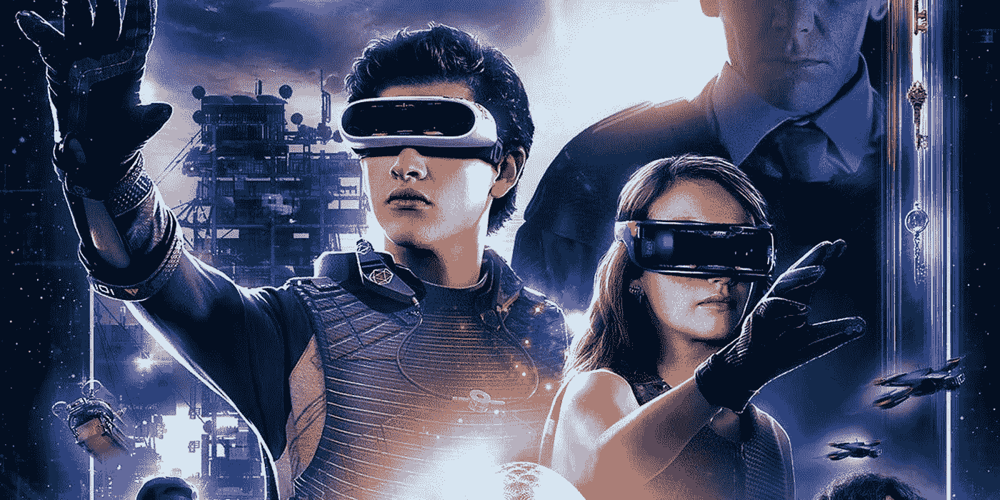
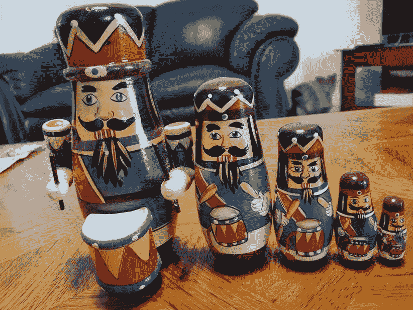
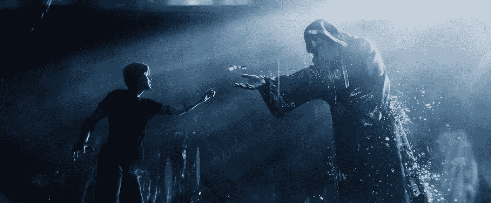
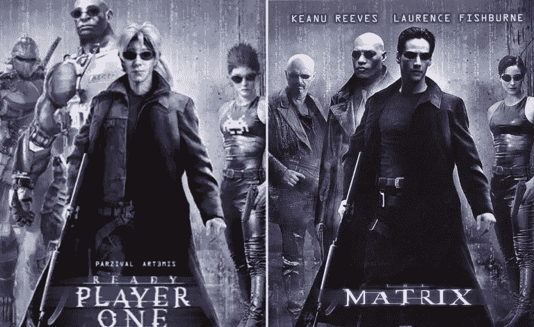

# 就绪玩家一和模拟假设:我们是虚拟世界中的化身吗？

> 原文：<https://medium.com/hackernoon/ready-player-one-and-the-simulation-hypothesis-virtual-worlds-avatars-cgi-b5e1b5b3dd0f>

好吧，所以我这个周末看了《预备玩家一号》。我不久前读过这本书，你可以想象我很兴奋*能看到这部电影。*

毕竟，我是看着斯皮尔伯格在 70 年代末和 80 年代初的电影长大的，我小时候玩过 Atari 2600 游戏，这些启发我自己制作视频游戏，并最终成为许多 VR/AR 公司的投资者。

以下是我的看法:斯皮尔伯格和他的公司通过《T4》的《头号玩家》完成了一件意义深远的事情，这并不是一部演技好的“好”电影。

甚至不是这个故事是否有意义。我会尽量避免剧透，以防你没看过(对于一部故事几乎是次要的电影来说，这并不难做到！).

我也不打算武断地说为什么这本书的改变是好是坏(老实说，这些改变不是很大，大多数可能是不必要的，但即使是我也不得不承认它们*并不坏*，我又有什么资格质疑斯皮尔伯格先生在这方面的选择呢？)

In Ready Player One, The Virtual World and the “Real” World Are Intertwined

观看这部电影让我更多地思考 *VR/AR、像素、特效/CGI 以及虚拟和“真实”世界的本质，*而不是这本书以其闻名的 80 年代怀旧。那些读过我最近文章的人([模拟假说:为什么人工智能、量子物理学和东方神秘主义者同意我们在一个巨大的电子游戏中)](https://hackernoon.com/the-great-simulation-why-quantum-physics-artificial-intelligence-and-eastern-mystics-all-agree-b6c185213a18)不会对我最近在脑海中出现模拟感到惊讶。

## ***世界中的世界…***

事实是，观看《第一集》是一种奇怪的、自我参照的、几乎是超现实的体验。

这就像一个梦中的梦——你知道当你在梦中醒来，意识到你上班或上学迟到了，你起床，然后你意识到你在第二个梦里！电影中有一个场景(书里没有)发生了这种事，现实和游戏中的 T21 几乎没有什么区别。

当我在当地电影院看这部电影时，让我们来盘点一下现实中的各种层面:

*   我和一群其他电影观众坐在一个“3d”世界的影院里，观看 2D 的电影。
*   我用的是 3d 眼镜，所以 2D 的屏幕看起来像一个真实的有深度的 3d 世界。这适用于电影中的“现实世界”(*俄亥俄州哥伦布*)和“虚拟世界”(*绿洲*)。老实说，这些天我通常跳过 3d 版本的电影，但这一部是值得的。,
*   在电影中，动作在非常压抑的“物理世界”和绿洲内部的“虚拟世界”之间切换，前者遵循现实生活中的韦德·沃茨，后者是韦德的化身帕齐瓦尔和他的浪漫爱好者的化身阿尔特弥斯以及各种朋友的化身，漫游不同的星球和不可思议的(虚拟)3d 景观。
*   在虚拟世界中，为了找到哈利迪设置的任务的线索，虚拟化身将观看来自“现实世界”的真实视频——演员扮演绿洲创造者哈利迪和他的商业伙伴奥格登。

The worlds within worlds within worlds ….

这就是让它变得超现实的原因——当他们在虚拟世界、真实世界和电影中展示“真实世界”的场景时，我是在所谓的“真实世界”中以 3d 形式观看的。这就产生了一种类似嵌套的俄罗斯娃娃的效果，只是我不知道自己在哪一层，上面还有多少层。

## ***头像、像素和虚拟世界***

让我们来谈谈*化身*，这个术语是由兰迪·法默和奇普·晨星首先提出来描述第一部《MMORPG，栖息地》中的角色的，这是他们在 20 世纪 80 年代在乔治·卢卡斯的视频游戏公司(卢卡斯艺术)开发的。顺便说一句，几年前我遇到兰迪和奇普时，他们还在一起工作，我投资了他们的一家初创公司——但那完全是另一回事了！

在*绿洲*，这是世界上最成功的公司在*准备玩家一*中，你的化身可以看起来像任何东西。展示的化身无处不在，从巫师(绿洲创造者哈利迪的化身)到动漫般的半现实版自己(帕齐瓦尔和阿尔特弥斯)，再到钢铁巨人和高达这样的巨型机器人。角色们也有很酷的武器，飞船和人造物品，从德罗宁到粒子武器，甚至是机械哥斯拉！

Avatars could take on any form you wished in the Oasis

这并不是说你分不清虚拟世界中的化身和现实世界中的角色/演员之间的区别。头像被绘制成我们可能在视频游戏中看到的像素化角色，这让我想到了*渲染*以及我们在世界上的人和物的数字表示方面取得了多大的进步。

在视频游戏的早期，角色由非现实的位图图标代表，如*吃豆人*或*太空入侵者中的外星人。随着渲染技术的进步，你开始看到更复杂的表现形式，比如《魔兽世界》中的角色，以及《第二人生》等虚拟世界中的化身，在虚拟世界中，人们可以建造房屋，建立虚拟关系等等。你甚至可以说 *Oasis* 几乎是类固醇上的第二次生命(SL 就在 Kline 2011 年发表 RPO 之前流行)。*

《绿洲》中的角色比大多数游戏中的更真实，反应也更灵敏。最有可能的是，演员们使用了动作捕捉服，所以他们的一举一动都反映在他们的虚拟形象中。巧合的是，这几乎就是电影中的角色驾驶他们的虚拟形象所做的事情！

现在，我们都知道在物理位置放置看起来“真实”的 CGI 元素是可能的。事实上，斯皮尔伯格的*侏罗纪公园*是 20 世纪 90 年代第一批使用 CGI 将虚拟角色(如果你可以将霸王龙视为一个角色)放入物理世界的大预算电影之一，安迪·席克斯·咕噜在 2000 年代的*指环王*电影中获得了好评如潮。

虽然在 Ready Play One 中人类化身*的毛发随风飘动(CGI 最困难的方面之一)，但他们大多通过靠近但不太近来避开“恐怖谷”。这就是我们在观看“看起来几乎像真人，但又不完全像真人的人形物体”时产生的“奇怪而熟悉的怪异或厌恶感”。*

嗯，我们不能指望电子游戏中的头像完全真实，对吧？毕竟它们只是屏幕上的像素，不是吗？

当我坐在电影院思考像素时，我意识到即使是人类——我在屏幕上看到的演员——也只是像素！如今，大多数影院使用数字发行，而不是实体电影。这意味着整部电影是一组像素，逐帧压缩，然后发送到影院，供数字投影仪播放。

演员看起来比头像更真实，因为他们比头像有更多的像素吗？

不尽然，因为影片中帧的分辨率始终是一致的。这并不像《哥伦布》和《4K》中的场景和《绿洲》中的场景是 1080 p——事实上大多数数字投影仪使用 2K。

如果屏幕上的角色和演员都是基于像素的，投影到我的每只眼睛上略有不同(使用 real3D 眼镜)——那么在 *Ready Player One* 中屏幕上的“虚拟”和“真实”角色之间的真正区别是什么？

## ***现在模拟假设更真实了吗？***

这又让我们回到了模拟假说——我们都生活在某种电子游戏中的想法。

Ready Player One and the Simulation Hypothesis

当克莱恩在 2000 年代末写他的小说时，虚拟现实真的不是什么大事。当前的虚拟现实“第二波”真正起飞是在 2014 年，当时脸书收购了 Oculus，每个人都相信虚拟现实是下一个最好的东西。

尽管我们的触觉套装和附件没有电影中的复杂，但虚拟现实已经走过了漫长的道路，正如一位电影评论者指出的那样，即使是韦德使用的全向跑步机，也是真实的。

虽然还没有人创造出一个绿洲，但是你可以看到一条从今天的渲染技术到更真实的模拟的清晰道路。

就在我使用 3d 眼镜观看这部“电影”时，演员们戴着 3d VR 眼镜来控制渲染的像素化世界中的化身，我开始怀疑这个嵌套的俄罗斯娃娃场景在我们的世界之外是否有比我意识到的更多的层次。

事实上，我们在一个像素化的、看似 3d 的世界中，仅仅是因为图像被传送到我们的“眼睛”并呈现为那样吗？*《黑客帝国》*当然是展现这一场景的最著名的电影——甚至还有一张基于*《黑客帝国》的*预备玩家一号*的预告海报(见上图)。*

牛津大学的哲学家尼克·博斯特伦在 2003 年发表了一篇名为《你生活在模拟中吗?》的论文，使得模拟假说的观点在学术界流行开来。

他的基本论点是，如果你把它归结为一句话，要么人类(或任何物种)将达到拥有像我们的世界一样进行模拟的技术的地步，要么不会。

博斯特罗姆称之为后人类文明，创造了他所谓的*祖先* *模拟。*我喜欢把它看作一个“模拟点”——在这个点上，我们的计算机技术变得足够复杂，可以创建一个看起来和感觉起来都很真实的完全真实的 3d 模拟。

根据博斯特罗姆的说法，达到这个“模拟点”有三种可能性:

1.我们从来没有做到这一点，因此祖先模拟是不可能的。

2.我们做到了这一点，但祖先模拟被禁止或不允许。

3.我们做到了这一点，我们创造了*许多*真实的祖先模拟。

如果#3 是真的，一个物种达到了它的技术允许真实的祖先模拟的程度，那么这个物种可能会创造许多这样的模拟。因此，“模拟世界”的数量将大大超过“真实世界”，而这些世界中的“存在”(无论是真实的还是模拟的)的数量将超过“真实的物理存在”。

即使(尤其是如果)有多个种族到达不同星球上的模拟点，也是如此。

这是一个简单的概率，它告诉我们，由于模拟世界中的生物比“物理真实世界”中的多得多，我们在模拟中成为模拟生物的几率非常高。

嗯，看《玩家一号》让我想到，我们离创造完全真实的 3d 世界和模拟可能已经不远了。埃隆·马斯克和其他人认为，我们的技术到达那里只是时间问题——无论是 10 年、100 年(甚至 1000 年)。

博斯特罗姆的论点是，如果我们将到达那里，我们现在可能已经在那里了(通过被*在*一个祖先模拟中)。

这对现在地球上的 70 亿人意味着什么？我们是生活在模拟中吗？一个绿洲类型的世界？如果是，谁在模拟之外？超智能机器还是外星人或者灵魂通过轮回扮演角色？

这部电影的名字是基于旧的街机游戏，它会说“准备好的玩家一”或“准备好的玩家二”，作为你的提示，轮到你玩游戏了。

模拟假设意味着一个更复杂的大型多人游戏，如 Oasis，有数百万甚至数十亿玩家，所有人都需要准备好同时进行游戏。

看完这部电影，我在想:Ready Player 70 亿。