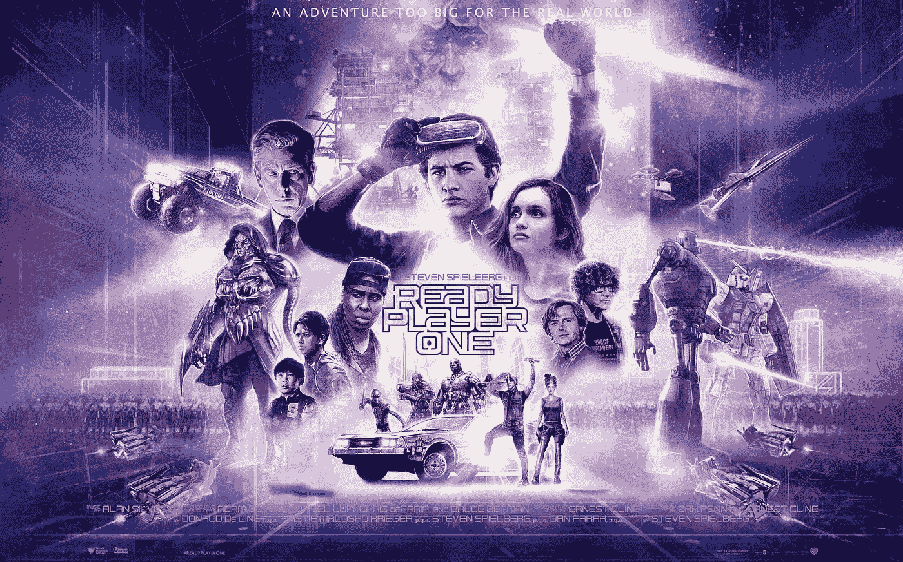

# 准备玩家一:前传

> 原文：<https://medium.com/hackernoon/ready-player-one-the-prequel-a2f30667fc8d>

## 区块链如何加速绿洲

Image courtesy of readyplayeronemovie.com

强制性免责声明:我不是财务顾问，在没有与合格的专业人士交谈之前，不应采纳任何建议。此外，不要投资超过你愿意失去的，先做自己的研究。

[Ready Player One](https://www.youtube.com/watch?v=cSp1dM2Vj48) 不仅仅是一本伟大的书和一部充满流行文化参考的高度娱乐化的电影，它是对 x 世代和千禧一代的展望，如果游戏成为世界头号经济收益来源的话。

故事发生在 2045 年，假设世界经济依赖于游戏，特别是绿洲中的游戏，这是一个虚拟现实系统，玩家醒着的大部分时间都通过他们创造的化身生活。在那里，他们参加数百种不同的游戏和挑战，赚取的硬币转化为更好的游戏奖励和现实生活中的财富。

虽然 2045 年离现在只有 27 年，但似乎很难想象社会会朝着基于电子游戏的世界经济发展。目前，游戏是通过个人和中央控制台完成的。视频游戏公司控制着他们技术的权利，并经常获得游戏的独家权利(例如，新的蜘蛛侠游戏是 Playstation 4 的独家)。尽管有这种趋势，较大的游戏公司开始允许玩家跨平台互动:

这是朝着正确方向迈出的一步，但在我们真正迈向 OASIS 风格的系统之前，有一个主要障碍必须跨越，那就是一旦游戏完成，任何给定视频游戏中的工作时间都变得一文不值。游戏物品如武器和盔甲，游戏中的货币如宝石或硬币，所有这些都被锁在视频游戏的书架上积灰。

为了真正拥有一个正常运行的绿洲，玩家需要能够将游戏中的物品转移到其他游戏中，甚至能够“兑现”到现实世界的经济系统中。听起来超级未来派，不是吗？实际上比你想象的要近一点。

[Neon District](https://medium.com/u/9c59515ce072?source=post_page-----a2f30667fc8d--------------------------------) 和 [SpacePirate Games](https://medium.com/u/f543d5f4dd72?source=post_page-----a2f30667fc8d--------------------------------) 是两款后起之秀，它们理解跨平台游戏的价值，认为这是游戏行业发展的一种方式。通过使用区块链技术和“ [NFTs”或“不可替换的代币](https://en.wikipedia.org/wiki/Non-fungible_token)”，这两款游戏计划允许玩家在任一游戏之间来回使用相同的头像、物品和游戏内货币(关于这一点的更多详细信息，[请查看 SpacePirate Games 的文章](/age-of-rust-game/why-were-part-of-the-blockchain-game-multiverse-f06207f5f90f)，关于 Neon District 游戏的详细概述，[请查看他们的文章](/blockadegames/neon-district-a-tech-noir-adventure-on-the-ethereum-blockchain-d25c3b1226c7))。

区块链/NFTs 的思路不仅仅是理论。[在最近的一条推文中](https://twitter.com/ecomi_/status/1038009298196938752)，Neon District 的 [YT](https://medium.com/u/7590d0ca7b2?source=post_page-----a2f30667fc8d--------------------------------) 强调了 Ecomi 的一项新技术，该技术使用 AR 和信用卡风格的数字钱包来存储和显示基于 NFTs 的游戏项目:

有了这种技术，绿洲可能不会像我们想象的那么遥远。截至 2016 年，游戏行业是一个持续繁荣的[910 亿美元的市场](https://venturebeat.com/2016/12/21/worldwide-game-industry-hits-91-billion-in-revenues-in-2016-with-mobile-the-clear-leader/)。一些研究人员表示，到 2017 年底，这一数字可能会达到 1089 亿美元，这意味着游戏产业将正式超过美国电影业。

这种增长并没有被亚马逊这样的零售巨头所忽视，他们以近 10 亿美元的价格收购了全球最大的游戏直播平台(更多类似的统计数据，[点击这里查看我关于游戏的文章](/@cryptoginger/how-crypto-will-upset-the-91-billion-gaming-industry-e661e1b61ae))。随着该行业的持续繁荣，要创造一个绿洲所需要的只是更多的游戏和游戏公司，如[霓虹区](https://medium.com/u/9c59515ce072?source=post_page-----a2f30667fc8d--------------------------------)和[太空海盗游戏](https://medium.com/u/f543d5f4dd72?source=post_page-----a2f30667fc8d--------------------------------)允许互操作性。

加密货币和区块链的这种规模的合作也不是什么新鲜事了——Refereum 已经与 Unity 和 Twitch 合作，Ecomi 还雇佣了 Alfred R. Kahn，他是将《口袋妖怪》更名为广受欢迎的《口袋妖怪》的幕后推手

那么这一切对你来说意味着什么呢？你为什么要关心这些发展？我有几个原因:

*   作为一名游戏玩家，你应该关心区块链和 NFT 的进步，因为这给了你从游戏中获得真正收入的机会——一种传统上被视为浪费时间的消遣
*   作为一个开发者，它给了你作为一个艺术家更多的可信度。[代码和游戏为现在成为艺术提供了一个极好的论据](https://twitter.com/coin_artist/status/1037340706971508736)
*   作为游戏公司，你有先发优势。很少有人致力于这种进步，早起的鸟儿有虫吃
*   作为投资者，你有机会支持一个全新的全球经济。游戏将强行占领世界，在不久的将来，公司将更关心数字资产而不是实体资产。你将如何参与？

为了保持了解，我建议在媒体和推特上关注[霓虹区](https://medium.com/u/9c59515ce072?source=post_page-----a2f30667fc8d--------------------------------)、[太空海盗游戏](https://medium.com/u/f543d5f4dd72?source=post_page-----a2f30667fc8d--------------------------------)和 [YT](https://medium.com/u/7590d0ca7b2?source=post_page-----a2f30667fc8d--------------------------------) 。如果你想一瞥这些游戏背后的天才，请前往 [neondistrict.io](https://neondistrict.io) 并与他们的人工智能“COG”聊天——这个人工智能直到最近还掌握着密码难题的钥匙[。最后，如果你想对游戏中的所有这些新进展感到兴奋，请查看下面的霓虹灯区预告片。对于 NFTs、区块链和视频游戏的未来，只有美好的事情在等待着我们！](/blockadegames/cog1347-1-ai-puzzle-prize-pool-recap-8ba3940a4c06)

如果你还没有投资比特币，而你想加入这场运动，最简单的方法就是从比特币基地开始。 ***当您****[***使用此链接***](https://www.coinbase.com/join/589a032d2c1f1600ed8731e2)*——这是我的推荐链接——并立即开始！**

**如果你想开始使用加密货币交易所而不是比特币基地，* [***币安是一个很好的起点。在这里报名***](https://www.binance.com/?ref=10273605) *！**