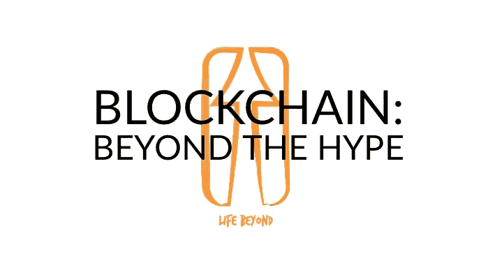
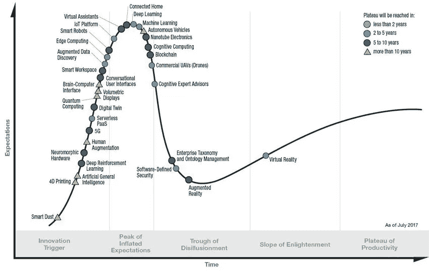
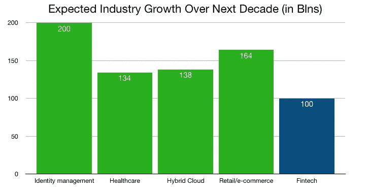

# 区块链颠覆的真实例子以及接下来会发生什么

> 原文：<https://medium.com/hackernoon/real-life-examples-of-blockchain-disruption-and-what-to-expect-next-6b1675a88f33>

## 10 年来:

## 公共资源的创造和平台垄断的取代

自从 Satoshi 发表他的论文，将世界变成我们今天看到的密码热潮以来，已经过去 10 年了。在区块链大受欢迎、备受争议和大肆宣传了十年之后，我们看到了哪些现实世界的影响？当这项技术被更广泛地采用，变得更加经得起考验，并从技术炒作周期的“幻灭低谷”中爬出来时，未来会发生什么？

对过去和即将发生的中断以及来自[区块链](https://hackernoon.com/tagged/blockchain)技术的影响进行提升和分析。这是一个建立信任、剔除中间人、支持平民的故事。

## 到目前为止，我们所看到的现实生活的影响和变化

加密社区的人们最常夸耀的是在未来某个不确定的时间点广泛采用区块链技术的潜在和假设的优点和好处。批评者指出，在当今的现实世界中，缺乏有记录的、有意义的变化。

让我们看看到目前为止到底发生了什么变化，除了一些人几乎一夜之间成为百万富翁，其他人失去了他们的房子，一些法拉利有了新主人。

尽管区块链计划已经在你能想象到的几乎所有领域部署并与之相关联——从金融和安全到娱乐、媒体甚至色情——但迄今为止，我们在四个领域看到了最具影响力的变化。除了金融和股票市场，我们还将讨论银行业、土地所有权、供应链管理和医疗记录。

**银行业与金融科技** 让我们把显而易见的事情说清楚。由于区块链科技的发展，金融业显然是第一个面临被彻底颠覆危险的行业。很可能从逻辑上受到比特币和其他基于区块链的数字货币的成功的惊吓，全球大型私人银行已经部署了自己的区块链集成。或者开始押注于自己的加密货币，通常是在财团中。

一些人认为这是一个美丽的发展，另一些人则认为这是强大而不可靠的巨头维持其权力和地位的一种尝试。与此同时，世界各地的中央银行也开始闻到玫瑰的香味，不止一家已经在这种氛围下开始了他们的实验。

**举个例子:Ripple partnerships**
[Ripple](https://ripple.com/)——全球支付的企业区块链解决方案——已经获得了一些重要的金融合作。2017 年 11 月中旬，它宣布与美国运通和桑坦德银行达成协议，美国运通的美国客户可以通过美国运通的 FX 国际支付网络向英国桑坦德银行账户发送非卡支付，并最终通过 Ripple 的区块链进行处理。

最近，今年 1 月，Ripple 和汇款服务 MoneyGram International 合作开展了一个跨境支付项目，旨在使用 Ripple 的 XRP 硬币。

但这还不止于此:甚至两家央行也已经开始试水。Ripple 与沙特阿拉伯货币管理局(沙特阿拉伯王国的中央银行)合作，测试该地区国内银行通过区块链进行的即时跨境支付。2017 年，Ripple 成功完成了与英格兰银行的概念验证。

**瑞典的土地所有权** 在大多数国家，土地所有权仍然是一件低技术含量的事情，交易容易被伪造和假冒。这一过程通常涉及繁重的文书工作，为错误或伪造留下了空间。

为了减少违规和造假行为，增加透明度，瑞典开始与区块链一起尝试进行土地注册。该国于 2016 年 6 月开始实验，迄今已成功完成几个阶段的实验。预计瑞典将于 2019 年建立区块链土地登记系统。

**印度和爱沙尼亚的土地所有权**
这一发展并不仅限于瑞典:为了提高透明度和减少财产纠纷，印度东南部安得拉邦政府已经使用区块链技术成功记录了超过 [100，000 份](https://www.forbes.com/sites/outofasia/2018/03/05/this-indian-city-is-embracing-blockchain-technology-heres-why/#4e2edc0e8f56)土地记录。爱沙尼亚也在进行类似的区块链土地注册。

**供应链管理:马士基、IBM 和沃尔玛**
从一开始，物流、零售和电子零售行业的供应链管理(SCM)就像是被区块链科技颠覆的主要候选对象。海运涉及多方:从制造商、出口商、消费者到不同国家的海关部门、商店和最终客户。

货物和包裹的跟踪对相关方至关重要。区块链将允许各方密切管理分销系统，货运跟踪中使用的数字签名将难以标注不准确或篡改记录。然而，对于供应链管理的中断，问题在于为不一定属于任何一个合作伙伴的分类账创建商业案例。

谁能从投资区块链供应链管理解决方案中获得正的投资回报？

与此同时，世界上最大的航运公司马士基已经采用了 IBM T4 公司的区块链技术来跟踪海运集装箱。沃尔玛使用相同的技术来跟踪 110 万件商品从制造商到货架的旅程。

**爱沙尼亚的医疗记录&美国疾病预防控制中心的医疗记录**
如果你想以安全、可信和可控的方式存储、访问和共享任何东西，那就是医疗记录。最近，网络安全公司 Guardtime 基于区块链技术创建了一个无钥匙进入系统。它首先在爱沙尼亚被采用。

Guardtime 的发明创造了一个网络安全浪潮，现在被用来保护爱沙尼亚的所有医疗记录。这被证明是区块链对健康的最初用途之一——而且很可能远非最后用途。

在美国，也有创业板的例子。为了通过使用区块链解决方案让患者控制他们的医疗记录和基因组数据，Gem 与美国疾病控制和预防中心合作，尝试使用区块链监控传染病。

## 更多区块链创新的例子

我在这里并没有给你一个详尽的列表，我只是想展示到目前为止已经看到了最真实的世界效应的四个部分。如果你想知道更多区块链颠覆的例子，看看伯纳德·马尔的汇编:

 [## 30+区块链技术在实践中的真实例子

### 当许多人想到区块链科技时，首先想到的是比特币。但是在过去的几年里…

www.forbes.com](https://www.forbes.com/sites/bernardmarr/2018/05/14/30-real-examples-of-blockchain-technology-in-practice/#4571d18a740d) 

## 预计很快会中断

我们很快会看到什么样的破坏？首先，我们必须承认，在经历了大肆宣传、繁荣和相对萧条之后，由于区块链的实施和采用，我们很快就可以看到越来越多的信号，表明宏观层面正在发生真正有意义的变化和积极的价值。

在 Gartner 去年的炒作周期中，区块链被描绘成一头栽进幻灭的低谷:

Gartner hype cycle, 2017

这基本上表明炒作已经结束，现在我们可能开始看到区块链技术可以为世界带来的真正价值。然后作为一个大概的说明，他们会带来什么样的财务价值。

但是，在哪些领域，我们可以最先看到这种积极影响和财务价值？

## 身份管理、医疗保健、混合云和电子商务/物流

到 2030 年，区块链预计将成为一个 [2 万亿](https://www.oaoa.com/news/business/article_9289e8d2-561e-56fa-bfdd-af72c797863a.html)的市场(高于去年的 25 亿美元)。全球和整个市场对安全性、分散化、效率和个性化的日益重视有助于推动这一机遇。

除了金融科技之外，正如我们在上面看到的，许多初创公司正在开发应用程序，以在医疗保健和供应链管理中利用区块链技术。在保险、广告、自动驾驶汽车和交通、物联网、清洁能源、内容创作和分发等领域，也有大量区块链的例子。

约翰·利卡塔使用来自 [Statista](https://www.statista.com/statistics/502378/value-of-fintech-investments-globally/) 的数据来展示在哪些行业中我们可以从区块链应用中看到最大的财务增长:

点击此处阅读约翰的更多内容:

 [## 对华尔街来说，金融科技之外还有巨大的机会

### 未来十年的预期行业增长可能会带来更大的区块链商业价值

medium.com](/mimir-blockchain/for-wall-street-theres-big-opportunity-beyond-fintech-97808f217435) 

## 数据利润的重新分配

在我个人看来，正如我之前在我的广泛分析“[成为区块链蝙蝠侠:致富和拯救世界](/life-beyond/blockchain-batman-getting-rich-and-saving-the-world-by-understanding-the-essence-of-money-crypto-2a301baf61af)”中所说的那样，区块链技术为人类组织他们的世界提供了两种经常被忽视的基本和新的能力:一种支持我们对货币的信念的新方法，以及一种使集中和私有的信息分发平台变得多余的方法。

这两种功能的共同点如下:

区块链是一种组织信任的新方式:远离中央机构，走向全球点对点系统。

由于我们生活在一个高度数字化的世界，数据可以被视为新的黄金(灰尘，不一定是金条)，并且考虑到区块链技术是为数字环境构建的，因此有理由认为，社会在中短期内将看到的主要价值是对收集、分析和分发数据和信息的利润进行重新分配。

在两个领域，我们可能会看到一些重要的价值增长，包括财务和内在价值，这两个领域是区块链的身份管理和社交媒体平台。

**blok chain for Identity management** 您每天、每周或每月使用多少个用户名和密码组合？有多少私人公司和公共机构收集、存储、使用和出售您的个人数据？如果这一切都可以逆转会怎样？

正如 ZFort group 在这里所写的[，在《创业:](/swlh/trust-no-one-blockchain-for-identity-management-75c1fc018c1b)

*“简而言之，使用区块链作为身份管理解决方案，用户可以控制自己的数据。通过控制和跟踪他们的信息是如何分发的，公民能够挑选和选择他们选择向谁提供他们的信息。”*

在我看来，区块链身份管理的一个很好的例子是公民。来自 cryptomorrow:

[*"Civic*](https://www.civic.com/) *，一个[…]数字身份管理平台的工作原理是收集各种用户识别信息，并根据用户所在或来自的国家，通过政府机构或第三方身份验证服务传递这些信息。*

*然后，系统收集一个加密散列并将其存储在区块链中，同时从服务器中删除其他个人数据。*

*用户可以利用哈希信息进行身份验证，以便使用其他服务。[……]一旦存储了散列数据，即使黑客或入侵者也无法获取数据，除非有办法解密数据。”*

点击此处查看更多示例:

 [## 基于区块链的身份管理的 10 个项目

### 在数据驱动的世界中，数据和信息的安全性、隐私性和可用性是关注的核心。你是否…

www.cryptomorrow.com](https://www.cryptomorrow.com/2018/01/17/10-projects-in-blockchain-based-identity-management/) 

**社交媒体的区块链** 很多人都在写[区块链技术如何影响注意力经济](/life-beyond/blockchain-batman-getting-rich-and-saving-the-world-by-understanding-the-essence-of-money-crypto-2a301baf61af)，包括我自己。正如《哈佛商业评论》在此[报道的](https://hbr.org/2017/03/what-blockchain-means-for-the-sharing-economy)，我们可能正在见证“非物质化”的世界经济正在分散化。

但如果注意力的货币化主要是通过社交媒体平台完成的；我们是否正在目睹社交媒体这一支柱开始瓦解，成为我们日常现代生活的祸害？在这里，请留意 Synereo 和 Steemit:

 [## Synereo vs Steemit

### 扰乱社交媒体和注意力经济

medium.com](/life-beyond/synereo-vs-steemit-a5631c071ea3) 

## 公地的兴起

从本质上来说，我们可以期待在未来看到的是:区块链主要提供了一个机会，以集体拥有的、分散的解决方案来创建公共资源和取代平台垄断，正如 Alex Tabarrok 在这里提出的以及 Vitalik Buterin 在许多场合所说的那样。

最终，在几十年后，我们将回顾过去，并能够看到许多过去为私人所有但面向公众使用的服务，将由分散的组织管理，我们现在称之为“commons”。

再见了集中化的谷歌、Facebooks、AirBnBs 和 Ubers，还有我们所知的国家、州和市政的土地登记、身份和医疗记录服务。可能的话，也将告别集权统治和政治决策。甚至可能导致集中的金融和货币决策。

向公众问好。

我非常重视并感谢您的关注。这也是我努力带来价值的原因。我主要写的是在 [*之外的*](https://medium.com/life-beyond) *的生活。*

***你可以在***[***www . Life Beyond . one***](https://lifebeyond.one/)***购买我最新的书《触摸屏之外的生活》。***