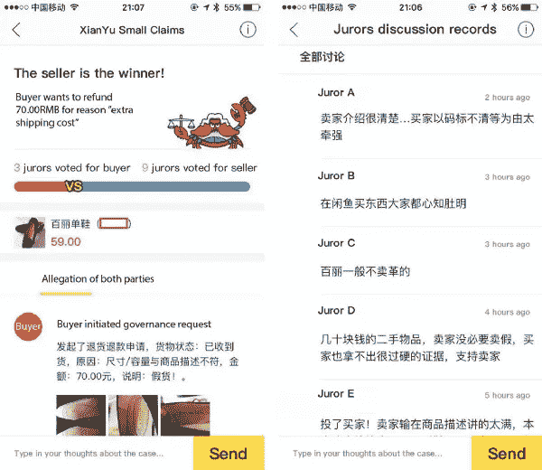
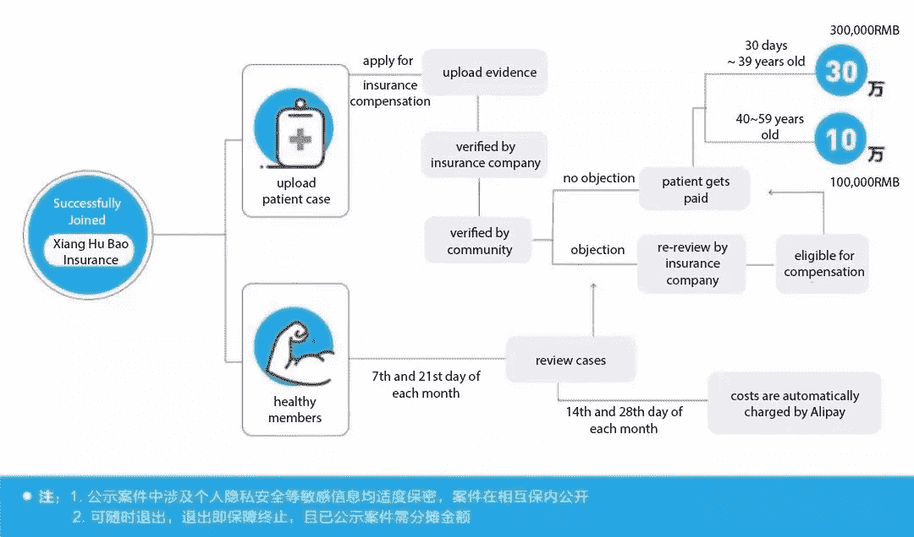
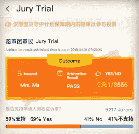
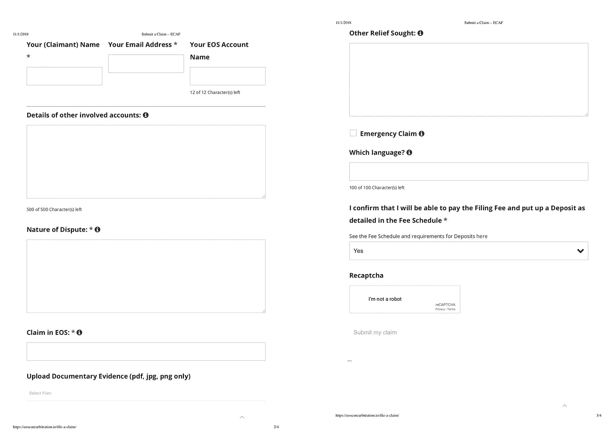

# 传统和区块链行业中的真实治理用例

> 原文：<https://medium.com/hackernoon/real-life-governance-use-cases-in-traditional-and-blockchain-industries-b39924bd9448>

[区块链](https://hackernoon.com/tagged/blockchain)治理是一个关键问题，因为[技术](https://hackernoon.com/tagged/technology)在各行各业得到了更广泛的应用。以太坊 DAO 事件发生后，它引起了人们的密切关注，当时一名令牌持有者利用一个漏洞将网络总价值的三分之一转移到了自己的账户中。(这个漏洞后来通过“分叉”算法得到了修复，但这个问题仍然是一个悬而未决的问题。)最近，日本 Coincheck 交易所价值超过 5 亿美元的数字货币被盗，这主要是因为治理结构薄弱，而治理结构薄弱又是因为缺乏及时采取行动的标准化。

治理是关于谁制定规则，谁执行规则。这不仅仅是关于对区块链的控制；它确定了处理技术问题、用户争议和其他违规行为的解决机制。

因为区块链技术是从传统行业和现有项目中自然发展而来的，所以我们期待传统项目使用的现实治理解决方案来指导我们为区块链生态系统开发类似的解决方案。

在本文中，我们回顾了传统行业和区块链项目中的几个真实的治理用例。对于更多的区块链治理用例，我们邀请您查看我们之前的[文章](/oathprotocol/the-future-with-oath-200d81d6c770)。

# **传统治理解决方案**

> **案例一:仙寓小额索赔法院**

[闲鱼](http://www.thepixellary.com/xian-yu-app-%E9%97%B2%E9%B1%BC-chinas-emerging-second-hand-market/)(意为“闲鱼”)，类似于易贝的阿里巴巴客户对客户平台，成立于 2013 年。如今，它拥有超过 2 亿的注册用户和超过 1600 万的活跃用户，超过了中国最大的电子商务平台淘宝。

作为中国最大和最受欢迎的二手电子商务平台，闲鱼每天处理近两千起用户纠纷。大多数案件涉及的金额不超过 10，000 元人民币(约 1，400 美元)，但由于这些案件的数量很大，因此《闲鱼日报》处理的争议总金额远远高于大多数公共链项目可能面临的金额。到目前为止，仙游对用户纠纷处理得很好，不断吸引新用户，留住现有用户。

仙寓*小额索赔法庭*为仙寓平台提供治理和纠纷解决，它是仿照英美陪审团制度。类似于陪审团制度的运作方式，先宇*小额索赔法庭*随机邀请 17 位拥有至少 700 个芝麻信用分的用户([芝麻信用分](https://en.wikipedia.org/wiki/Sesame_Credit)是阿里巴巴推出的私人信用评分系统，类似于美国的信用评分)来解决用户纠纷。获得 17 票中 9 票的一方获胜。如果有争议的用户对结果不满意，他们可以上诉。

**仙寓小额诉讼法庭用户流量:**

1.  具有高芝麻信用的用户被通知新的仲裁任务。
2.  陪审员受理案件，进入仲裁程序。
3.  陪审员投票，贤宇*小额索赔法庭*宣布获胜者。
4.  陪审员提供他们投票的理由。

**先宇*小额诉讼法院*的设计特点:**

1.  社区陪审团制度消除了与维护客户服务相关的成本。
2.  社区陪审团制度将治理委托给社区(并将其从平台所有者手中夺走)，以增加公平性。
3.  即使陪审团没有被填满，系统仍然会运行。该平台自动请求 17 名陪审员，但是仲裁可以由任意数量的陪审员发起。
4.  陪审员自愿投票，并由平台自动分配案件。没有激励机制来激励陪审员努力完成他们的任务。
5.  案件一开始，陪审员就可以投票，甚至在双方上传证据之前。
6.  陪审员没有 KYC 程序。芝麻分是挑选合格陪审员的唯一标准。

> **案例二:蚂蚁金服集团的胡翔保保险**

[蚂蚁金融服务集团](https://www.cnbc.com/2018/06/08/how-ant-financial-grew-larger-than-goldman-sachs.html)是中国的金融巨头，拥有超过 4 亿客户。它运营着中国占主导地位的在线支付平台支付宝和中国最大的货币市场基金余额宝，后者管理着超过 1500 亿美元的资产。

[胡翔保保险](http://en.cifnews.com/alipay-xiang-hu-bao-10-million-users-9-days/)是一种全新的基于社区的健康保障服务，允许拥有至少 650 个芝麻分并满足特定健康条件的蚂蚁会员加入，而无需进行健康评估。为确保公开透明，该公司推出了两项措施:首先，由会员进行索赔监控，以确保只有那些应该得到赔偿的人才能得到赔偿。其次，该公司将区块链技术用于索赔相关的证据，包括付款。

2018 年 10 月，宝平台上的[用户超过 900 万](http://en.cifnews.com/alipay-xiang-hu-bao-10-million-users-9-days/)。假设他们中的 10%(或 90 万人)在本月提交了保险索赔，平均索赔额为 5000 元人民币(约 700 美元)，总索赔额为 45 亿元人民币。胡翔宝收取 10%的服务费，使平台负债总额达到 49.5 亿元人民币。将这一数字除以所有用户，即 49.5 亿元人民币除以 900 万，我们得出每人每月缴费 550 元人民币(约 80 美元)。用户可以在任何时候终止他们的会员资格，只要他们没有拖欠的月费。

**用户流量:**

*Chinese text in images translated for readers’ convenience. Click* [*here*](http://tech.huanqiu.com/internet/2018-10/13278644.html) *to see original Chinese article.*

**胡翔保保险的设计特点:**

1.  低成本:所有成员分摊成本，保持每人每次 0.1 元的低收费。
2.  易于使用，没有繁琐的文书工作:病人只需要在网上上传证据，如果没有人提出异议，病人立即得到报酬。
3.  高度透明的流程:所有患者病例都是公开的，并由社区进行验证(对患者的隐私有一定的保护)。有疑问的案件由报重新审查。
4.  基于区块链技术:信息存储在区块链上，不能更改。
5.  不适合所有人:老年人比年轻人更容易申请保险赔偿。如果年轻会员选择离开社区，胡翔保保险可能很难保持低成本。

> **案例三:支付宝的儿童保护**

如今，支付宝的儿童保护计划覆盖了超过 1200 万儿童。支付宝已赔付 70 起 710 万元，拒赔 11 起。在最初被拒绝的 11 个案例中，有 4 个案例得到了陪审团的认可，并由公司全额支付。

儿童保护计划涵盖 1 个月至 17 岁的儿童。该保险涵盖 12 种重疾，10 万元保险赔付限额，一旦保险公司和社区核实案件，无赔付等待期。

儿童保护计划没有投资者利益相关者。它由社区拥有和管理。作为他们的治理解决方案，支付宝使用英美普通法陪审团制度，由社区成员担任陪审员。申请人需要通过基本的保险知识测试才能成为合格的陪审员。当出现承保范围争议时，案件由社区陪审团通过投票决定。

*点击* [*这里*](https://www.xuehua.us/2018/07/27/%E6%94%AF%E4%BB%98%E5%AE%9D%E5%AE%9D%E8%B4%9D%E5%AE%88%E6%8A%A4%E8%AE%A1%E5%88%92%E5%8F%88%E5%8F%88%E5%8F%88%E8%B5%94%E4%BB%98%E4%BA%86%EF%BC%81/) *查看关于支付宝儿童保护的中文文章。还有，查一下* [*支付宝的招入网上保险*](https://www.cbinsights.com/research/baidu-alibaba-tencent-insurance/) *。*

**现实案例:**

一个家庭得知孩子血小板减少，买了儿童保障计划保险。一个月后，医生诊断这个孩子感染了艾滋病毒。在保险公司拒绝承保请求后，父母申请仲裁，称他们没有故意隐瞒孩子原有的健康状况。24 小时后，59%的陪审员投票支持这个家庭，保险公司承保了索赔。这样的结果对于传统的保险公司来说是不可能的。

*Chinese text in images translated for readers’ convenience.*

**儿童保障计划保险的设计特点:**

1.  使用分散的陪审团制度进行治理和争议解决，并给予社区决策权，放弃任何保险公司接受或拒绝患者病例的集中超级权力。
2.  因为所有的病人都是孩子，一些陪审员可能会不顾是非曲直而投票支持病人，这对每个人都不公平。
3.  只为芝麻分高的用户提供服务。

**传统陪审团治理方案与宣誓协议的比较:**

类似于仙寓*小额索赔法庭*、保保险和儿童保护计划，宣誓协议也是仿照陪审团制度，但它开发了一个更复杂的设计系统。

1.  陪审员经过 KYC 验证，并提供基本的个人信息，允许算法为各种案件选择合适的陪审员。
2.  鼓励陪审员参与和投票的制度:陪审员因做出正确的决定而获得奖励，从而提高他们在社区中的声誉。你可以在这里了解更多关于誓言协议陪审员信用和声誉系统[。](/oathprotocol/the-oath-token-af49760f36f)
3.  具体而高效的证据提交和投票用户流程，可在 8 天内解决所有案件。
4.  通过 Oath 的信用等级系统及其合作伙伴 DREP 的分散信誉系统维护陪审员个人投票记录。
5.  使用由随机算法和区块链基础设施支持的网络系统，确保陪审员是从不同的陪审团池中随机选出的(在当事人可以设置的某些参数内),并且不会同时在一个以上的陪审团中任职。

*陪审团制度源于英美普通法，中国普通用户大多不会马上熟悉。但正如阿里巴巴集团的例子(普通中国人作为陪审员参与治理和纠纷解决案件)所显示的，这种熟悉并不是该体系成功的必要条件。相反，社区对有效和低成本治理参与的热情推动了高比率的参与。*

# **区块链治理解决方案**

> **案例一:ECAF**

在 [ECAF](https://eoscorearbitration.io/) 平台上，每个案件都由一至三名仲裁员进行审查和裁决。目前，ECAF 有六名通过内部测试和审查的专业仲裁员。ECAF 的决定，包括治理或可疑账户冻结，由超级块生产者执行。

来自 [ECAF 网站](https://eoscorearbitration.io/file-a-claim/)的仲裁申请表:

**ECAF 的设计特点:**

1.  ECAF 使用专业仲裁员进行治理和争议解决。所有六名仲裁员都完成了专业培训，并了解链上交易、区块链相关概念以及 EOS 构成和治理。
2.  作为第三方治理机构，在大多数情况下，ECAF 不会卷入利益冲突。
3.  六名仲裁员负责所有用户争议。鉴于培训和雇用仲裁员的成本很高，仲裁费也相对较高，尽管它们因争议金额而异。
4.  半集中化，即每个案件由一名仲裁员根据他/她的专业和个人判断来决定。仲裁员的身份是众所周知的。
5.  缺乏技术支持。没有具有技术专长的团队成员，这阻碍了 ECAF 创建一个技术先进的系统，以实现高效和透明的治理流程。

> **案例 2:宣誓协议**

[Oath Protocol](http://www.oathprotocol.com) 模仿普通法陪审团系统，将现实世界中最可靠的法律系统之一与区块链技术、密码学、计算算法、博弈论声誉系统和其他概念相结合，为保护 dApp 用户权利和资产的分散、标准和可扩展的公共链不可知协议提供第 2 层跨链基础设施。

Oath 是一种通用的协议，可用于各种场景，包括但不限于电子商务、p2p 市场、短期房屋租赁、旅游预订、内容发布平台、区块链保险、预测市场和新闻验证。

**用户流量:**

1.  在任何一方提出争议后，双方都可以为争议解决程序设定标准。
2.  陪审员是通过分类随机算法选出的。
3.  对方有 5 天时间上传他们的证据。
4.  陪审员有 3 天时间投票，并提供他们投票的理由。
5.  收集投票后，案例解决结果将公开。双方将有五天时间对判决进行确认或上诉。

**Oath 协议的设计特点:**

1.  分散式社区决策:Oath Protocol 依靠定期的区块链用户来组成陪审员社区并裁决案件，最初的陪审团人数为 11-101 人。陪审员不需要持有宣誓信物来获得陪审团的资格。
2.  半分散投票过程:只有两个交易发生在链上(并要求记录燃气费):案件的启动和案件结果的记录。
3.  第 2 层协议:当连锁店或 dApps 使用包含宣誓作为标准争议解决机制的智能合同时，一旦案件得到裁决，结果将返回给智能合同，智能合同将自动执行。
4.  确保公平的算法和保障措施:Oath Protocol 的动态分配算法降低了相同陪审团成员解决多个争议的几率，以避免串通。Oath 的分类随机算法旨在减少偏见，选择具有不同背景的陪审员以确保公平。陪审团成员的身份通过加密技术保密，以确保客观性和免受外部影响。
5.  与任何公共链或 dapp 兼容:通过 API，Oath 协议与任何链或 dapp 兼容。
6.  服务于广泛的用例可能是一把双刃剑。Oath 可能很难提供一个能够很好地服务于所有这些用例的产品。

# **结论**

陪审团制度作为一种防止偏见和腐败并保证公平结果的方式，成功地经受了时间的考验。虽然它在英国和美国已经使用了几个世纪，但它的核心概念现在支撑着中国现实生活中基于社区的治理——一个传统上依赖于基于中央权威的治理的社会——阿里巴巴已经成功地让其普通用户参与治理和争端解决。在那里，社区治理已经证明了自己是一种比传统的、基于集中客户服务的治理更便宜、更公平、更透明的替代方案。

在区块链的背景下，陪审团制度模式自然延伸到治理和争端解决，因为它符合区块链的分权承诺；它依靠社区(而不是单个第三方)为关键治理决策提供意见、执行智能合同或解决用户争议。目前， [Oath Protocol](http://www.oathprotocol.com) 在其竞争对手中脱颖而出，为未来的去中心化治理和争议解决提供了最有前途的方法。通过设计，它促进了分散的、基于社区的决策，由区块链和其他技术保护，并具有引人注目的激励和声誉系统。

鉴于阿里巴巴最近在将社区治理融入中国传统网络平台方面取得的成功，我们看到传统和区块链企业广泛采用基于社区的治理解决方案只是时间问题。

向前向上，[宣誓协议](https://twitter.com/oathprotocol)！

请点选 ***或点选*** 👏 **"** 下方或屏幕左侧的*让尹等人知道你很欣赏这个帖子。鼓掌的次数表明你有多喜欢这个帖子，有多支持它的内容，所以尽可能多的把你的手放在一起。*