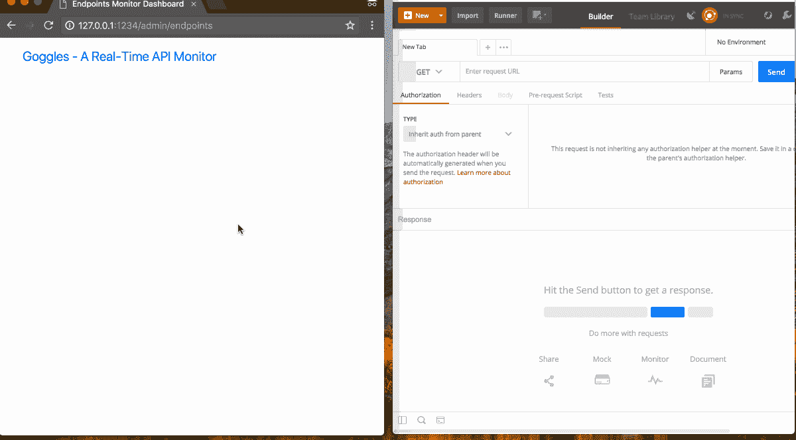

# 使用 GO 和 Pusher 进行实时 API 监控

> 原文：<https://medium.com/hackernoon/real-time-api-monitoring-using-go-and-pusher-4e57c4e80cac>


> 披露:[为开发者提供实时 API 的 Pusher](https://goo.gl/52hnDL) ，此前曾赞助过黑客 Noon。
> 
> 阅读本教程需要对 Go 和 JavaScript 有一个基本的了解。

REST 是一种流行的架构风格，用于在 web 上的计算机系统之间提供标准，使系统之间的通信更加容易。它主要被 API 用来向其他需要数据的系统提供数据。

有时，API 的提供者想要监控它的使用。监控 API 有助于提供有用的信息，例如哪些端点被最频繁地调用，或者哪些区域是使用请求 IP 地址的最大受众。这些信息可以用来优化 API。

在本文中，我们将使用 Pusher 实现对用 GoLang 构建的小型 API 的实时监控。下面是它最终应该是什么样子的预览:



# 要求

要阅读本文，您需要以下内容:

*   您选择的 IDE，例如 [Visual Studio Code](https://code.visualstudio.com/) 。
*   [转到](https://golang.org/doc/install)安装在你的电脑上。
*   GoLang 基础知识。
*   JavaScript (ES6 语法)和 jQuery 的基础知识。
*   使用 CLI 工具或终端的基本知识。

一旦你具备了以上所有要求，我们就开始吧。

# 建立我们的代码库

为了简单起见，我们将使用已经编写好的 GoLang CRUD API，它可以在 [GitHub](https://github.com/neoighodaro/go-pusher-api-monitor/tree/master/api-goggles) 上获得。我们将分叉这个库，并按照 **README.md** 安装指南来设置它。

接下来，我们将在 API 项目中设置 Pusher。Pusher 是一种为我们的 web 和移动应用程序提供实时功能的简单实现的服务。我们将在本文中使用它，为我们的 API monitor 仪表板提供实时更新。

让我们前往 Pusher.com，如果你还没有一个免费账户，你可以[创建一个。在](https://pusher.com/signup?plan=sandbox)[仪表板](https://dashboard.pusher.com/)上，创建一个新应用并复制应用凭证(应用 ID、密钥、密码和集群)。我们将在 API 中使用这些凭证。

现在我们有了 Pusher 应用程序，我们将通过运行以下命令来安装 Pusher Go 库:

```
$ go get github.com/pusher/pusher-http-go
```

# 监控我们的 API

到目前为止，我们已经建立了一个功能性的 CRUD API，现在我们将实现对它的监控调用。在本文中，我们将监控:

*   被调用的端点的详细信息包括名称、请求类型(GET、POST 等)和 URL。
*   对于每个对端点的调用，我们还会注意到:
*   请求 IP 地址删除，
*   特定呼叫的响应状态代码。

既然我们已经定义了要监控的内容，我们将开始创建模型来跟踪我们获取的数据。

# 创建监控模型

基于我们上面的规范，我们将创建两个新的模型文件`EndPoints.go`和`EndPointCalls.go`。正如在基础 API 中所使用的，我们将使用[GORM](http://jinzhu.me/gorm/)(GoLang ORM)来管理数据存储。

> *💡我们的新模型文件将存在于 models 目录中，并属于 models 包。*

在`EndPoints.go`中，我们将定义`EndPoints`对象和一个保存端点的方法:

```
package modelsimport (
    "github.com/jinzhu/gorm"
)// EndPoints - endpoint model
type EndPoints struct {
    gorm.Model
    Name, URL string
    Type      string          `gorm:"DEFAULT:'GET'"`
    Calls     []EndPointCalls `gorm:"ForeignKey:EndPointID"`
}// SaveOrCreate - save endpoint called
func (ep EndPoints) SaveOrCreate() EndPoints {
    db.FirstOrCreate(&ep, ep)
    return ep
}
```

在上面的代码块中，我们的模型没有重新初始化 GORM 实例`db`，但是它被使用了。这是因为在`Movies.go`文件中定义的实例对于包的所有成员都是全局的，所以它可以被`package models`的所有成员引用和使用。

> *💡我们的端点模型有一个属性* `*Calls*` *，它是一个* `*EndPointCalls*` *对象的数组。该属性表示*[](http://jinzhu.me/gorm/associations.html#has-many)**`*EndPoints*`*`*EndPointCalls*`*之间的一对多关系。有关模型关联和关系的更多信息，请参见 GORM* [*文档*](http://jinzhu.me/gorm/associations.html) *。****

**接下来，我们将在`EndPointCalls.go`文件中填充`EndPointCalls`模型的模型定义和方法:**

```
**package modelsimport (
    "github.com/jinzhu/gorm"
    "github.com/kataras/iris"
)// EndPointCalls - Object for storing endpoints call details
type EndPointCalls struct {
    gorm.Model
    EndPointID   uint `gorm:"index;not null"`
    RequestIP    string
    ResponseCode int
}// SaveCall - Save the call details of an endpoint
func (ep EndPoints) SaveCall(context iris.Context) EndPointCalls {
    epCall := EndPointCalls{
        EndPointID:   ep.ID,
        RequestIP:    context.RemoteAddr(),
        ResponseCode: context.GetStatusCode(),
    } db.Create(&epCall)

    return epCall
}**
```

**如上所示，我们的`EndPointCalls`模型定义了一个`SaveCall`方法，它存储了一个现有`EndPoint`对象的请求 IP 地址和响应代码。**

**最后，我们将更新`index.go`文件中的模型迁移，以包含我们的新模型:**

```
**// index.go
// ...func main() {
    // ... // Initialize ORM and auto migrate models
    db, _ := gorm.Open("sqlite3", "./db/gorm.db")
    db.AutoMigrate(&models.Movies{}, &models.EndPoints{}, &models.EndPointCalls{}) // ...
}**
```

# **保存用于监控的端点数据**

**使用我们新创建的模型，我们将编辑`MoviesController.go`文件，以便在端点被调用时保存相关数据。**

**为此，我们将向`MoviesController.go`添加一个私有的助手方法，它将保存模型的端点数据。请看下文:**

```
**// MoviesController.go
// ...func (m MoviesController) saveEndpointCall(name string) {
    endpoint := models.EndPoints{
        Name: name,
        URL:  m.Cntx.Path(),
        Type: m.Cntx.Request().Method,
    } endpoint = endpoint.SaveOrCreate()
    endpointCall := endpoint.SaveCall(m.Cntx)
}**
```

**`saveEndpointCall`方法将端点的名称作为参数。使用控制器的`iris.Context`实例，它读取并保存端点路径和请求方法。**

**现在这个帮助器方法可用了，我们将在`MoviesController.go`文件中的每个端点方法中调用它:**

```
**// MoviesController.go
// ...// Get - get a list of all available movies
func (m MoviesController) Get() {
    movie := models.Movies{}
    movies := movie.Get() go m.saveEndpointCall("Movies List")
    m.Cntx.JSON(iris.Map{"status": "success", "data": movies})
}// GetByID - Get movie by ID
func (m MoviesController) GetByID(ID int64) {
    movie := models.Movies{}
    movie = movie.GetByID(ID)
    if !movie.Validate() {
        msg := fmt.Sprintf("Movie with ID: %v not found", ID)
        m.Cntx.StatusCode(iris.StatusNotFound)
        m.Cntx.JSON(iris.Map{"status": "error", "message": msg})
    } else {
        m.Cntx.JSON(iris.Map{"status": "success", "data": movie})
    } name := fmt.Sprintf("Single Movie with ID: %v Retrieval", ID)
    go m.saveEndpointCall(name)
}// ...**
```

**如上面的代码片段所示，在每个 CRUD 方法中都将调用`saveEndpointCall`助手方法。**

> ***💡将* `*saveEndpointCall*` *方法称为*[*Goroutine*](https://golangbot.com/goroutines/)*。以这种方式调用它会在端点方法执行的同时调用它，并允许我们的监控代码不会延迟或抑制 API 的响应。***

# **创建端点监控仪表板**

**现在，我们已经实现了对 API 调用的监控，我们将在仪表板上显示我们积累的数据。**

# **注册我们的模板引擎**

**GoLang 框架 Iris 具有实现一系列模板引擎的能力，我们将充分利用这一点。**

**在本节中，我们将实现**车把**模板引擎，并且在我们的`index.go`文件中，我们将把它注册到 app 实例:**

```
**// index.go
package mainimport (
    "goggles/controllers"
    "goggles/models"
    "github.com/jinzhu/gorm"
    "github.com/kataras/iris"
)func main() {
    app := iris.New() tmpl := iris.Handlebars("./templates", ".html")  
    app.RegisterView(tmpl) // ... app.Run(iris.Addr("127.0.0.1:1234"))
}**
```

> ***💡我们已经定义了我们的模板引擎(Handlebars)，来渲染包含在* `*templates*` *目录中的* `*.html*` *文件。***

# **创建仪表板的路线和控制器**

**既然我们已经将模板引擎注册到应用程序中，我们将在`index.go`中添加一个路由来呈现我们的 API monitor 仪表板:**

```
**// index.go
// ...func main() {
    app := iris.New() // ... app.Get("/admin/endpoints", func(ctx iris.Context) {
        dashBoard := controllers.DashBoardController{Cntx: ctx}
        dashBoard.ShowEndpoints()
    }) app.Run(iris.Addr("127.0.0.1:1234"))
}**
```

**上面，我们已经为路径/admin/endpoints 添加了定义，我们打算在这里呈现 API 端点及其调用的详细信息。我们还指定路由应该由 DashBoardController 的 ShowEndpoints 方法处理。**

**为了创建 DashBoardController，我们将在 controllers 目录中创建一个 DashBoardController.go 文件。在我们的 DashBoardController.go 文件中，我们将定义 DashBoardController 对象及其 ShowEndpoints 方法:**

```
**// DashBoardController.go
package controllersimport (
    "goggles/models"
    "github.com/kataras/iris"
    "github.com/kataras/iris/mvc"
)// DashBoardController - Controller object for Endpoints dashboard
type DashBoardController struct {
    mvc.BaseController
    Cntx iris.Context
}// ShowEndpoints - show list of endpoints
func (d DashBoardController) ShowEndpoints() {
    endpoints := (models.EndPoints{}).GetWithCallSummary()
    d.Cntx.ViewData("endpoints", endpoints)
    d.Cntx.View("endpoints.html")
}**
```

**在`ShowEndpoints()`中，我们检索我们的端点和它们的呼叫摘要以供显示。然后我们使用`d.Cntx.ViewData("endpoints", endpoints)`将这些数据传递给我们的视图，最后我们使用`d.Cntx.View("endpoints.html")`呈现我们的视图文件`templates/endpoints.html`。**

# **检索端点和呼叫摘要**

**为了检索我们的端点列表和它们的调用摘要，我们将在`EndPoints.go`文件中创建一个名为`GetWithCallSummary`的方法。**

**我们的`GetWithCallSummary`方法应该返回端点和它们的调用摘要，以便显示。为此，我们将使用在`EndPoints.go`文件中显示所需的属性定义一个集合对象`EndPointWithCallSummary`:**

```
**// EndPoints.go
package modelsimport (
    "github.com/jinzhu/gorm"
)// EndPoints - endpoint model
type EndPoints struct {
    gorm.Model
    Name, URL string
    Type      string          `gorm:"DEFAULT:'GET'"`
    Calls     []EndPointCalls `gorm:"ForeignKey:EndPointID"`
}// EndPointWithCallSummary - Endpoint with last call summary
type EndPointWithCallSummary struct {
    ID            uint
    Name, URL     string
    Type          string
    LastStatus    int
    NumRequests   int
    LastRequester string
}**
```

**然后定义`GetWithCallSummary`方法使用如下:**

```
**// EndPoints.go// ...// GetWithCallSummary - get all endpoints with call summary details
func (ep EndPoints) GetWithCallSummary() []EndPointWithCallSummary {
    var eps []EndPoints
    var epsWithDets []EndPointWithCallSummary db.Preload("Calls").Find(&eps) for _, elem := range eps {
        calls := elem.Calls
        lastCall := calls[len(calls)-1:][0] newElem := EndPointWithCallSummary{
            elem.ID,
            elem.Name,
            elem.URL,
            elem.Type,
            lastCall.ResponseCode,
            len(calls),
            lastCall.RequestIP,
        } epsWithDets = append(epsWithDets, newElem)
    } return epsWithDets
}// ...**
```

**上面，`GetWithCallSummary`方法利用了`EndPoints`的`Calls`属性，该属性定义了它与`EndPointCalls`的关系。当从数据库中检索端点列表时，我们使用`db.Preload("Calls").Find(&eps)`加载它的`EndPointCalls`数据。**

**有关 GORM 中的紧急加载的更多信息，请参见[文档](http://jinzhu.me/gorm/crud.html#preloading-eager-loading)。**

**`GetWithCallSummary`初始化一个`EndPointWithCallSummary`数组，并遍历从我们的数据库返回的`EndPoints`对象来创建`EndPointWithCallSummary`对象。**

**这些`EndPointWithCallSummary`对象被附加到初始化的数组中并被返回。**

> ***💡* `*EndPointWithCallSummary*` *不是模型。它是一个集合对象，不需要在我们的数据库中有一个表。这就是为什么它没有自己的文件，也没有传递到* `*index.go*` *进行迁移。***

# **实现仪表板和显示数据**

**现在我们已经有了仪表板的路由、控制器和显示数据，我们将实现仪表板视图来实现端点及其摘要数据的简单列表显示。**

**让我们将`templates/endpoints.html`更新为以下代码:**

```
**<!-- templates/endpoints.html -->
<!DOCTYPE html>
<html>
<head>
    <title>Endpoints Monitor Dashboard</title>
    <link rel="stylesheet" type="text/css" href="[https://cdnjs.cloudflare.com/ajax/libs/twitter-bootstrap/4.0.0-beta.3/css/bootstrap.min.css](https://cdnjs.cloudflare.com/ajax/libs/twitter-bootstrap/4.0.0-beta.3/css/bootstrap.min.css)" />
</head>
<body>
    <div>
        <nav class="navbar navbar-default navbar-static-top">
            <div class="container">
                <div class="navbar-header">
                    <a class="navbar-brand" href="[http://127.0.0.1:1234/](http://127.0.0.1:1234/)">
                        Goggles - A Real-Time API Monitor
                    </a>
                </div>
            </div>
        </nav>
        <div class="container">
            <div class="row">
                <div class="col-xs-12 col-lg-12">
                    <div class="endpoints list-group">
                        {{#each endpoints}}
                            <a id="endpoint-{{ID}}" href="#" class="list-group-item 
                            list-group-item-{{status_class LastStatus}}">
                                <strong>{{name}}</strong>
                                <span class="stats">
                                    {{type}}: <strong>{{url}}</strong> |
                                    Last Status: <span class="last_status">
                                    {{LastStatus}}</span> |
                                    Times Called: <span class="times_called">
                                    {{NumRequests}}</span> |
                                    Last Request IP: <span class="request_ip">
                                    {{LastRequester}}</span>
                                </span>
                            </a>
                        {{/each}}
                    </div>
                </div>
            </div>
        </div>
    </div>
    <script src="[https://cdnjs.cloudflare.com/ajax/libs/jquery/3.2.1/jquery.min.js](https://cdnjs.cloudflare.com/ajax/libs/jquery/3.2.1/jquery.min.js)"></script>
    <script src="[https://cdnjs.cloudflare.com/ajax/libs/twitter-bootstrap/4.0.0-beta.3/js/bootstrap.min.js](https://cdnjs.cloudflare.com/ajax/libs/twitter-bootstrap/4.0.0-beta.3/js/bootstrap.min.js)"></script>
</body>
</html>**
```

**上面，我们使用 [Bootstrap](https://getbootstrap.com/) 和把手模板引擎来呈现端点列表。我们还创建并使用了一个模板函数`status_class`，根据他们最近的通话状态`LastStatus`对我们的列表进行颜色编码。**

**初始化模板引擎后，我们在`index.go`中定义了`status_class`模板函数:**

```
**// index.go// ...func main() {
    app := iris.New() tmpl := iris.Handlebars("./templates", ".html") tmpl.AddFunc("status_class", func(status int) string {
        if status >= 200 && status < 300 {
            return "success"
        } else if status >= 300 && status < 400 {
            return "warning"
        } else if status >= 400 {
            return "danger"
        }
        return "success"
    }) app.RegisterView(tmpl)
}**
```

**然后，在我们的视图文件中，我们将该函数称为:**

```
**class="list-group-item list-group-item-{{status_class LastStatus}}"**
```

> ***💡上面的 LastStatus 是函数的参数。***

# **向我们的仪表板添加实时更新**

**到目前为止，在本文中，我们已经监控了对 API 的调用，并通过仪表板显示了数据。我们现在将使用[推送器](http://pusher.com/)向我们的仪表板提供实时数据更新。**

# **从后端发送实时数据**

**之前，我们安装了 [Pusher Go 库](https://github.com/pusher/pusher-http-go)，我们将使用它在端点被调用时触发一个事件。在处理 API 请求的`MoviesController.go`文件中，我们将初始化 Pusher 客户端:**

```
**// MoviesController.go package controllers import (
        // ...
        "github.com/pusher/pusher-http-go"
    ) // MoviesController - controller object to serve movie data
    type MoviesController struct {
        mvc.BaseController
        Cntx iris.Context
    } var client = pusher.Client{
        AppId:   "app_id",
        Key:     "app_key",
        Secret:  "app_secret",
        Cluster: "app_cluster",
    } // ...**
```

**这里，我们已经使用之前创建的应用程序中的凭证初始化了 Pusher 客户端。**

> ***⚠️用你的 app 凭证替换* `*app_id, app_key, app_secret and app_cluster*` *。***

**接下来，我们将使用 Pusher 客户端来触发一个事件，这将包括要在我们的视图中显示的端点数据。我们将在`saveEndpointCall`方法中这样做，该方法记录一个端点及其调用:**

```
**// MoviesController.go // ... func (m MoviesController) saveEndpointCall(name string) {
        endpoint := models.EndPoints{
            Name: name,
            URL:  m.Cntx.Path(),
            Type: m.Cntx.Request().Method,
        }
        endpoint = endpoint.SaveOrCreate()
        endpointCall := endpoint.SaveCall(m.Cntx)
        endpointWithCallSummary := models.EndPointWithCallSummary{
            ID:            endpoint.ID,
            Name:          endpoint.Name,
            URL:           endpoint.URL,
            Type:          endpoint.Type,
            LastStatus:    endpointCall.ResponseCode,
            NumRequests:   1,
            LastRequester: endpointCall.RequestIP,
        } client.Trigger("goggles_channel", "new_endpoint_request", endpointWithCallSummary)
    }**
```

**上面，我们从`EndPoints`(端点)和`EndPointCalls`创建了一个`EndPointWithCallSummary`对象。该`EndPointWithCallSummary`对象具有在仪表板上显示所需的所有数据，因此将被传递给 Pusher 进行传输。**

# **在仪表板上实时显示数据**

**为了显示端点的实时更新，我们将使用 Pusher JavaScript 客户端和 jQuery 库。**

**在我们的视图文件`templates/endpoints.html`中，我们将首先使用我们应用程序的凭证导入并初始化一个 Pusher 实例:**

```
**<!-- endpoints.html -->
    <script src="//cdnjs.cloudflare.com/ajax/libs/jquery/3.2.1/jquery.min.js"></script>
    <script src="//cdnjs.cloudflare.com/ajax/libs/twitter-bootstrap/4.0.0-beta.3/js/bootstrap.min.js"></script>
    <script src="//js.pusher.com/4.1/pusher.min.js"></script>
    <script>
      const pusher = new Pusher('app_id', {cluster: "app_cluster"});
    </script>**
```

> ***⚠️用你的应用凭证中的值替换* `*app_id and app_cluster*` *。***

**接下来，我们将定义以下内容:**

*   **向视图添加新端点的模板。**
*   **追加新端点并获取端点状态类的函数。**

**最后，我们将订阅`goggles_channel`并监听`new_endpoint_request`事件，在那里我们的端点更新将被传输:**

```
**<!-- endpoints.html -->
    <script>
    // ...

    const channel = pusher.subscribe("goggles_channel");

    channel.bind('new_endpoint_request', function(data) {
        let end_point_id = data.ID;
        if ( $('#endpoint-' + end_point_id).length > 0 ) {
            let status_class = getItemStatusClass(data['LastStatus']),
                endpoint     = $('#endpoint-' + end_point_id);
            let calls = 1 * endpoint.find('span.times_called').text()
            endpoint.find('span.last_status').text(data['LastStatus']);
            endpoint.find('span.times_called').text( (calls + 1) )
            endpoint.removeClass('list-group-item-success');
            endpoint.removeClass('list-group-item-danger');
            endpoint.removeClass('list-group-item-warning');
            endpoint.addClass('list-group-item-' + status_class);
        } else {
            addNewEndPoint(data);
        }
    });

    // ...**
```

**在`new_endpoint_request`事件处理程序中，端点数据被分为更新场景(端点已经存在于仪表板上)或创建场景(创建并追加新的列表项)。**

**最后，您可以构建您的应用程序，当您运行它时，您应该会看到类似于我们在预览中看到的内容:**

****

# **结论**

**在本文中，我们能够监控对 REST API 的实时请求，并演示 Pusher 如何与 GoLang 应用程序一起工作。**

> **这篇文章最初出现在[推广者博客](https://blog.pusher.com/realtime-trade-platform-javascript-pusher/)上。**