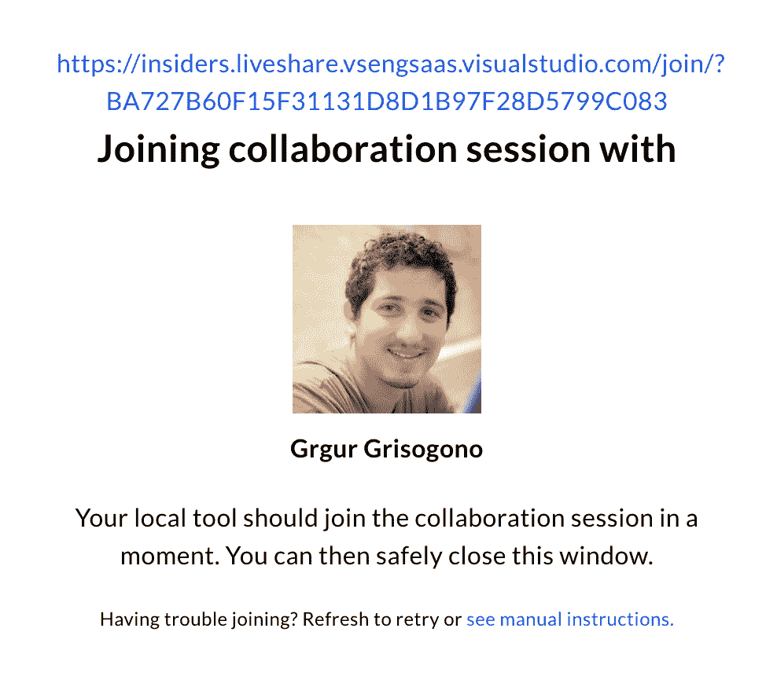
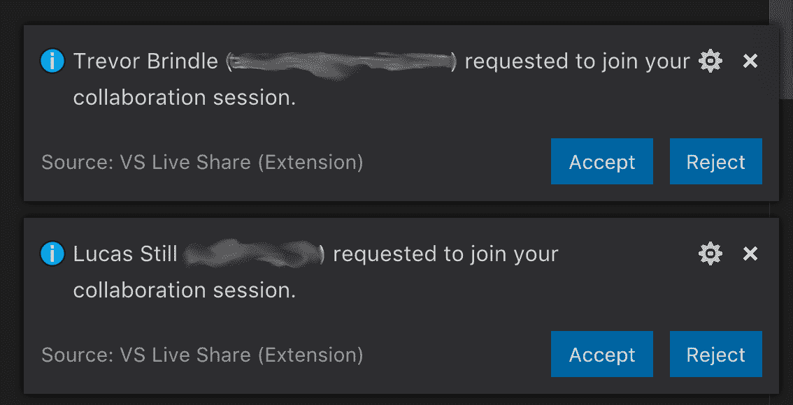
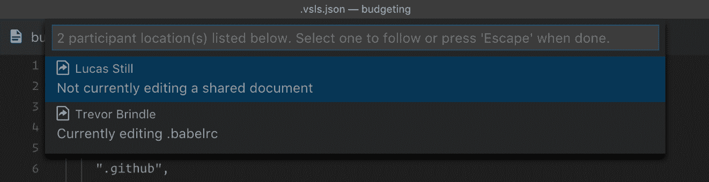
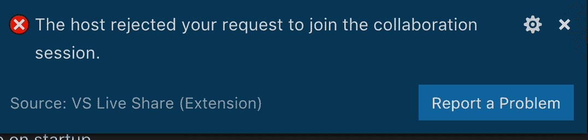
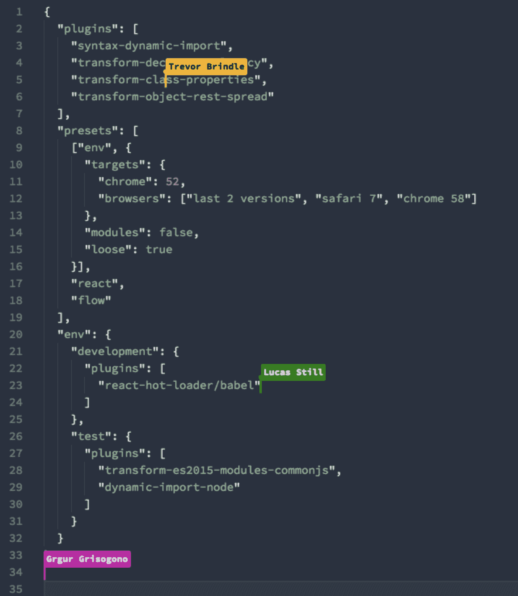
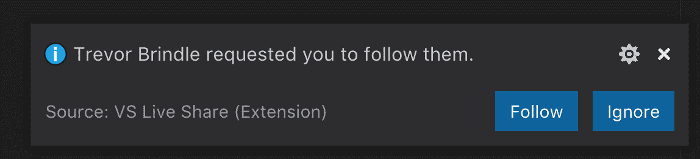
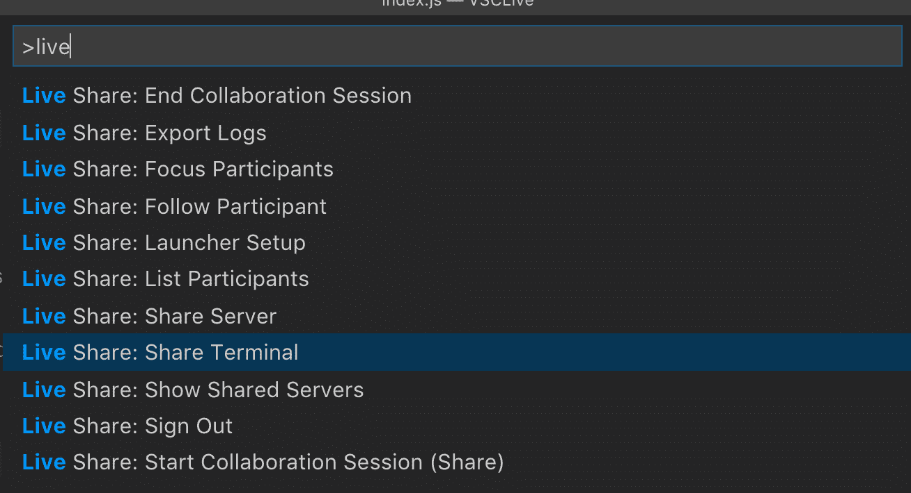
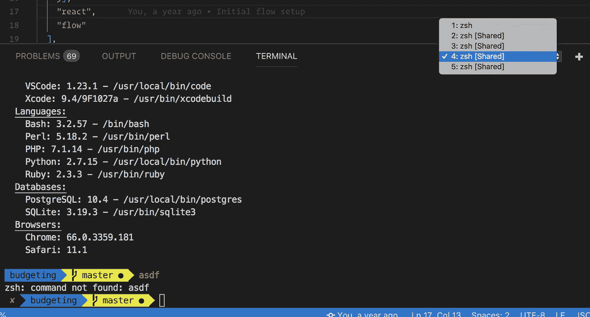

# 与实时共享相比，实时协作变得更加轻松

> 原文：<https://medium.com/hackernoon/real-time-collaboration-made-easy-with-vs-live-share-280e5d4d9d69>


Remote pair programming made easy with VSCode Live Share

[Visual Studio](https://hackernoon.com/tagged/visual-studio) Live Share 让**实时协同编辑调试**变得前所未有的简单。分散和协同定位的团队现在可以享受快速、功能丰富的体验:

*   结对编程
*   远程调试
*   培养
*   小作坊
*   面试求职者
*   入职团队成员

# 设置 Visual Studio 实时共享

Visual Studio 代码是 [GitHub](https://hackernoon.com/tagged/github) 上最受欢迎的开源项目之一。Live Share 扩展为 IDE 及其庞大的用户群带来了远程协作。

设置 VS Live Share 就像安装任何其他 Visual Studio 或 VS Code [扩展](https://marketplace.visualstudio.com/items?itemName=MS-vsliveshare.vsliveshare)一样简单。安装过程会提示用户使用他们的 Microsoft 或 GitHub 凭据登录，以便正确识别参与者。

使用实时共享时，所有协作活动中有两种类型的用户:一个主机和一个或多个来宾。在单个协作会话中连接两方以上的能力尤其引人注目。



All sessions get an easy-to-share link

实时共享会话由唯一的 ID 标识。主机可以将 ID 或生成的链接发送给客户端。默认情况下，任何拥有该链接或 ID 的人都可以连接到该会话。VS 代码提供了一个方便的配置选项，允许主机批准每个连接的访客。

```
"liveshare.guestApprovalRequired": true
```



The host can control who connects to the session

一旦客人被允许进入，主人就可以看到活动的客人以及他们此刻正在处理的文件。



List of active guests shows what they are editing

> **Protip:** 虽然主持人可以看到所有已连接客人的列表，但此时一旦某个客人被允许，就无法删除他们。



Users can be rejected from joining, but cannot be disconnected during a session

# 集中式代码共享

主持人与来宾实时共享代码库。不需要访问代码库，因为文件是直接从主机上访问的。

集中式代码共享释放了 VS 实时共享的许多好处。它允许几乎即时访问项目，同时[保持](https://hackernoon.com/tagged/maintaining)工作设置和环境设置。

**访客保留他们所有的 IDE 设置**，包括扩展和语法高亮。事实上，客人不需要满足任何先决条件。是的，这意味着不需要安装特定版本的 Node，不需要在客户的计算机上运行一个包含种子数据的数据库或一组容器。我们的目标是分享，而 Live Share 恰恰实现了这一点！

# 活动会话期间的交互

两个或两个以上的团队可以处理同一个文件，也可以选择独立浏览文件和文件夹结构。如果他们在同一个文件中，Live Share 可以轻松跟踪其他参与者的光标。



It’s easy to see what collaborators are working on

参与者可以选择要求其他人**关注**他们。聚焦是一个有用的功能，它将所有参与者带到一个目标文件。

一旦两个或更多的参与者在同一个文件中，他们可以**跟随**一个接一个。跟随意味着观察者的编辑器反映了被跟随用户的 IDE。对于较大的文件，它很方便，可以很容易地实时跟踪滚动和变化。



Team members can request others to follow their work

文本消息或语音通信形式的交互目前不可用。虽然有很多独立的应用程序用于远程通信，但在实时共享会话期间拥有一个轻量级的聊天客户端会很有帮助。

# 实时共享中的安全文件共享

有时我们想让客人远离敏感文件。您可以通过添加. vsls.json 文件来排除和包含内容。

下面是一个示例`.vsls.json`文件:

```
{
  "$schema": "[http://json.schemastore.org/vsls](http://json.schemastore.org/vsls)",
  "gitignore":"exclude",
  "excludeFiles":[
    ".env",
    ".vscode",
    "!node_modules"
  ],
  "hideFiles": [
    "build",
    "node_modules"
  ]
}
```

“排除”属性允许您列出不希望来宾访问的所有文件或文件夹。hideFiles 没有那么严格，它只是从导航树中隐藏文件或文件夹。*隐藏*和*排除*的区别在于当使用类似*跟随*的动作时，能够看到隐藏文件的内容。被排除的文件总是显示为空白，即使主人希望客人*跟随*。

> **Protip:** 很容易忘记排除哪些文件。如果让来宾*跟随*主持人处理一个被排除的文件，来宾将会看到一个空白文件，但是仍然能够在其中键入内容。键入的文本将被添加到被排除的文档的前面，只有宿主可以看到。

在开始第一次训练之前，请务必阅读官方安全指南。

# 现场调试

远程调试在实时共享中运行良好。由于宿主集中共享所有代码和环境，共享调试资源变得简单了。Visual Studio 用户已经熟悉的相同调试工作流适用于实时共享会话的所有参与者。

虽然能够调试远程运行的应用程序是不可思议的，但真正的美妙来自于这样一种认识，即来宾不必安装任何东西就可以享受全功能的调试会话。

# 终端共享

分享终端无疑是 Live Share 最精彩的功能之一。主机可以以只读或读写模式共享它们的终端。共享终端包含主机的所有设置，比如 zsh 定制或历史。



Terminal sharing is one of the most thrilling Live Share features

尽管这一特性令人兴奋，但它也伴随着很大的风险，尤其是在支持读写访问的情况下。没有什么可以阻止恶意用户执行危险的终端命令，这是主机在授予写权限之前需要知道的事情。



Shared terminals stack up

> **Protip** :由于所有参与者共享终端实例，读写模式将允许每个人在同一行输入。终端上没有光标，所以不可能知道是谁写的命令。参见问题 [#596](https://github.com/MicrosoftDocs/live-share/issues/596) 。

当主机决定共享终端时，IDE 会创建一个新实例。这种行为的好处是从读写终端切换到只读终端是不可能的。由于 Visual Studio 每次都会创建一个新的实例，因此来宾可以切换回以前的终端实例，并以原来的特权继续使用它。

> **保护**:当你不再需要一个共享的终端窗口时，把它扔掉。

我们创建了几个问题来帮助保护共享终端会话。参见问题 [#600](https://github.com/MicrosoftDocs/live-share/issues/600) 和 [#601](https://github.com/MicrosoftDocs/live-share/issues/601) 。

# 连通性

VS Live Share 通过直接对等连接使用 RPC 通信。当直接连接失败时，云中继充当后备。

在现实生活中，一个 [Modus Create](https://moduscreate.com/?utm_source=Medium&utm_medium=OrgSocial) 团队在三大洲同时测试了 4 个用户的 Live Share，我们几乎察觉不到任何延迟。

> **Protip** :由于性能原因，Live share 目前最多支持 5 个同时参与者

# 依赖源代码控制管理

在实时共享会话期间，频繁的保存和代码提交非常重要，因为实时共享的撤消功能不可靠。在多个用户编写代码以及他们的 IDE 扩展和定制的情况下，很容易出现格式混乱的代码，或者令人不满意的更改。用于撤消的 Cmd+Z(或 Ctrl+Z)很可能会失败，因为实时共享不会跟踪会话中用户的合并更改历史。

> **Protip** :参与者可能希望禁用自动格式化扩展，因为它们可能会与另一个参与者的设置冲突。没有人想要无限的自动格式化循环。参见问题 [#568](https://github.com/MicrosoftDocs/live-share/issues/568) 。

实时共享的目标是解决即时问题或传递知识。与团队成员一起处理特性，最好还是使用成熟的工作流，比如将代码提交到存储库中。这就是为什么古怪的撤销功能不应该是一个节目停止。

# 团队反应

Modus 团队对现场分享感到非常兴奋。这是一个非常棒的工具，可以进行结对编程和调试，与客户一起走一走，让新的团队成员加入进来，进行面试，甚至进行简单的培训。

> *Live Share 让初级开发人员的结对编程变得更加容易和高效 10 倍(卢卡斯)*
> 
> *已经有了其他的云配对 ide，但是现在我可以使用我最喜欢的编辑器，我的配色方案，以及所有我喜欢的插件(Akash A.)*

# 摘要

Live Share 将远程团队与每个开发人员都能欣赏的一系列功能结合在一起:

*   联系远程团队成员的简单方法
*   一组很好的安全配置选项
*   全功能远程调试功能
*   终端共享

绝对**给现场分享一个试试**。当您这样做时，请确保您:

*   当不再需要共享终端会话时，将其丢弃
*   不要依赖撤销功能
*   在开始你的第一次会话之前，仔细阅读[安全](https://docs.microsoft.com/en-us/visualstudio/liveshare/reference/security)
*   配置 Visual Studio 以提示宿主允许连接来宾

在分布式环境中工作是 Modus 的天性。我们有幸与最优秀的人才一起工作，无论他们在地球的哪个角落。Live Share 是我们 7 小时 295 成功分布式文化工具包中的一个强大工具。尝试一下，回馈你自己的*保护*。