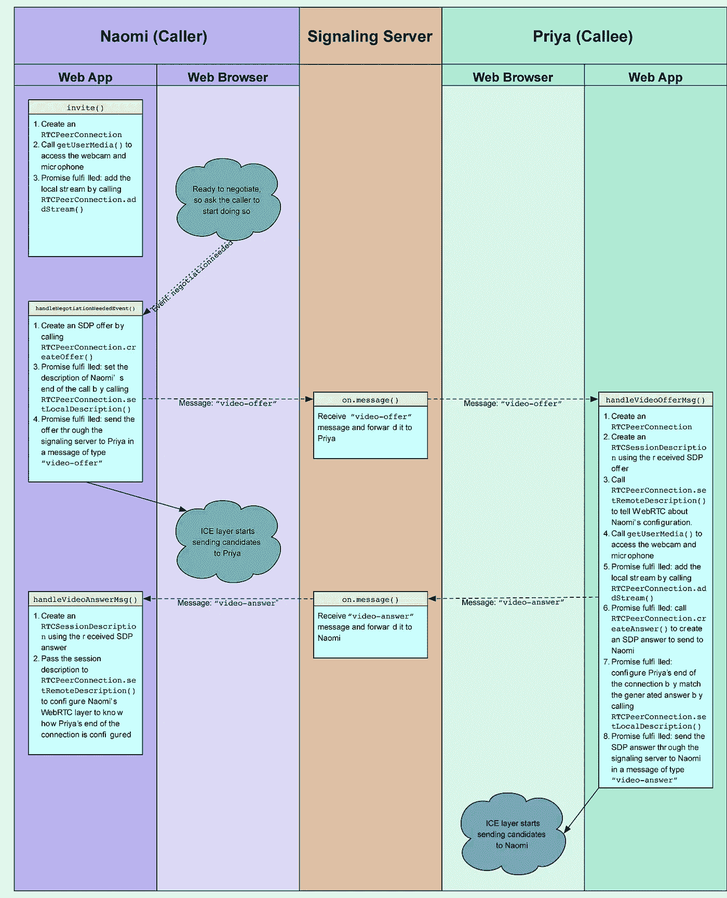

# 在 Android 上与 Webrtc 进行实时通信

> 原文：<https://medium.com/hackernoon/real-time-communication-with-webrtc-on-android-f96cdcfc4771>

> WebRTC 是一个免费的开放项目，它通过简单的 API 为浏览器和移动应用程序提供实时通信(RTC)功能。

Webrtc 是一个具有 rtc 功能的跨平台解决方案。人们可以通过 webrtc 将自己的视频流从摄像机或屏幕录制或任何其他视频传输到任何对等方。如果一个人正在开发一个实时的对等游戏，在对等点之间实时共享数据，webrtc 是一个选择。让我们了解一下在 webrtc 中从一个对等体到另一个对等体的视频呼叫是如何工作的。

# 入门指南

自 2017 年 9 月以来，谷歌开始通过 maven 为 android 分发预编译版本的 webrtc。如果你想摆弄源代码并自己编译，你可以按照[的步骤](https://webrtc.org/native-code/development/)轻松完成(以前你只能在 linux 上编译，但现在所有三大操作系统都支持)。要使用预编译版本，只需添加以下依赖项。

```
compile 'org.webrtc:google-webrtc:1.0.22379'
```

# webrtc 是如何工作的？

在我们开始通过 webrtc 在两个对等体之间交换数据之前，我们需要向对等体提供关于彼此的信息，以便进行媒体格式协商和发现。这是通过以下协议完成的。[交互连接建立(ICE)](http://en.wikipedia.org/wiki/Interactive_Connectivity_Establishment) 用于对等连接。[会话描述协议(SDP)](http://en.wikipedia.org/wiki/Session_Description_Protocol) 用于提供媒体内容的元数据，如分辨率、编码、比特率等。如果两个对等体不在同一个网络上，那么我们将需要为 NAT (STUN) 服务器提供一个[会话遍历实用程序，以提供对等体的公共地址。如果任何网络是防火墙保护的，我们还需要使用 NAT (TURN)](http://en.wikipedia.org/wiki/STUN) 服务器周围的中继来提供[遍历。你可以在这里了解更多关于这些协议的信息。](http://en.wikipedia.org/wiki/TURN)对等体之间交换 ICE 和 SDP 的机制称为信令系统，通常通过 websockets 完成。

# Webrtc android API

我们的大部分 webrtc 代码将利用 *PeerConnection* 和*peer connection factory*API。 [*对等连接*](http://dev.w3.org/2011/webrtc/editor/webrtc.html#peer-to-peer-connections) 相当于 web 世界中的 RTCPeerConnection，用于建立对等连接。 *PeerConnectionFactory* 用于创建 *PeerConnection、MediaStream* 和 *MediaStreamTrack* 对象*。*



Signalling flow diagram for Webrtc ([original photo](https://mdn.mozillademos.org/files/12363/WebRTC%20-%20Signaling%20Diagram.svg) by [Mozilla Contributers](https://developer.mozilla.org/en-US/docs/Web/API/WebRTC_API/Signaling_and_video_calling$history) is licensed under [CC-BY-SA 2.5](http://creativecommons.org/licenses/by-sa/2.5/).)

***创建 PeerConnectionFactory*
在创建工厂对象之前我们需要初始化 webrtc。正如你可以*初始化选项*这里提供了启用/禁用硬件加速(我不得不在某些设备上禁用)和设置现场试验的选项。*现场试验*是为了启用实验性的 webrtc 特性。**

```
val fieldTrials = (PeerConnectionFactory.*VIDEO_FRAME_EMIT_TRIAL* + "/" + PeerConnectionFactory.*TRIAL_ENABLED* + "/")
val options = InitializationOptions.builder(application)
      .setFieldTrials(fieldTrials)
      .setEnableVideoHwAcceleration(videoAccelerationEnabled)
      .createInitializationOptions()
PeerConnectionFactory.initialize(options)
factory = PeerConnectionFactory(PeerConnectionFactory.Options())
val rootEglBase = EglBase.create()
factory?.setVideoHwAccelerationOptions(rootEglBase.*eglBaseContext*, rootEglBase.*eglBaseContext*)
```

***创建媒体流***一旦我们有了 *PeerConnectionFactory* 对象，我们现在就可以创建一个 *MediaStream* 对象，它有*音频轨道*和*视频轨道*与之相关联。

```
val localMediaStream = factory.createLocalMediaStream(MEDIA_ID)
val audioSource = factory.createAudioSource(MediaConstraints())
val audioTrack = factory.createAudioTrack(AUDIO_ID, audioSource)
localMediaStream.addTrack(audioTrack)

videoCapturer = if (Build.VERSION.*SDK_INT* > Build.VERSION_CODES.*LOLLIPOP*) {
   createCameraCapturer(Camera2Enumerator(application))
} else {
   createCameraCapturer(Camera1Enumerator(videoAccelerationEnabled))
}
val videoTrack = factory.createVideoTrack("VideoTrack", factory.createVideoSource(videoCapturer))
localMediaStream.addTrack(videoTrack)
```

***cameravideocapter***
Webrtc 为我们提供了一种非常简单的方式来使用 *Camera* 和 *Camera2* API，具体取决于支持。在受支持的设备上，我们可以使用这两种 API 中的任何一种

```
private fun createCameraCapturer(enumerator: CameraEnumerator): CameraVideoCapturer? {
   val deviceNames = enumerator.*deviceNames
*   for (deviceName in deviceNames) {
      if (enumerator.isFrontFacing(deviceName)) {
         val videoCapturer = enumerator.createCapturer(deviceName, null)
         if (videoCapturer != null) {
            return videoCapturer
         }
      }
   }

   for (deviceName in deviceNames) {
      if (!enumerator.isFrontFacing(deviceName)) {
         Timber.d("Creating other camera capturer.")
         val videoCapturer = enumerator.createCapturer(deviceName, null)
         if (videoCapturer != null) {
            return videoCapturer
         }
      }
   }
   return null
}
```

***SurfaceViewRenderer***因为我们已经准备好本地 *MediaStream* 了，我们需要在视图上渲染它，以便它对用户可见。 *SurfaceViewRenderer* 是 webrtc libray 中的一个*视图*，它为我们渲染 webrtc 帧。我们可以直接在布局 xml 中添加它。

```
localViewRenderer.init(rootEglBase.getEglBaseContext(), null)
localViewRenderer.setEnableHardwareScaler(true)
localViewRenderer.setMirror(true)
localViewRenderer.setScalingType(ScalingType.SCALE_ASPECT_FILL)
val localVideoRenderer = VideoRenderer(localViewRenderer)
videoTrack.addRenderer(localVideoRenderer)
```

***peer connection***
现在我们已经做好了传输的一切准备，该创建 *PeerConnection 了。我们在工厂方法中传递一个 PeerConnection#Observer 实例，当 ICE 候选生成时(我们需要将它发送给另一个对等体)通知它。当远程*媒体流*可用时，观察者也会得到通知。我们将为它附加一个渲染器，就像本地*媒体流*一样。它还需要一个列表 IceServer(STUN 和 TURN 服务器),如果在本地网络上测试，该列表可以为空*

```
val peerConnectionObserver = object : PeerConnection.Observer {
   override fun onIceCandidate(iceCandidate: IceCandidate) {
      localIceCandidatesSource.onNext(iceCandidate)
   }
   override fun onAddStream(mediaStream: MediaStream) {
       mediaStream.addRenderer(remoteRenderer)
   }
   ...
}
peerConnection = factory?.createPeerConnection(getIceServers(), peerConnectionObserver)
```

> 注意:在观察者的 onIceCandidate 中，我们不应该将 IceCandidate 添加到对等连接(peer connection . addicecandidate(ice candidate ),直到我们拥有远程 SDP

***create offer/create answer***
一旦建立了对等连接，我们就需要发起视频通话。发起呼叫的对等体将*创建提议*并设置其本地 SDP ( *对等体连接#setLocalSdp* )。当本地 SDP 被设置时，它将把该 SDP 发送到另一个对等体，该对等体将设置它的远程 SDP ( *对等体连接#setRemoteSdp* )。一旦设置了远程 sdp，它将*用该 sdp 创建应答*,并在创建 asnwer 时设置其本地 sdp，并将本地 SDP 发送给创建提议的对等体。发起方对等体现在将设置其远程 SDP。

```
fun createOffer() {
   peerConnection.createOffer(object : SdpObserver {
       override fun onCreateSuccess(sdp: SessionDescription) {
          setLocalSdp(sdp)
       }
       ...
       }, getPeerConnectionConstraints())
}
fun setLocalSdp(sdp: SessionDescripton) {
   peerConnection.setLocalDescription(object : SdpObserver {
      override fun onSetSuccess() {
         api.sendSdp(peerConnection.*localDescription*)
         drainIceCandidates()
      }
      ...
   }, sdp)}fun onOffer(sdp: SessionDescription) {
   peerConnection.setRemoteDescription(object : SdpObserver {
      override fun onSetSuccess() {
         createAnswer()
      } 
   }, sdp)
}fun createAnswer() {
   peerConnection?.createAnswer(object : SdpObserver {
      override fun onCreateSuccess(sdp: SessionDescription) {
         setLocalSdp(sdp)
      }
   }, getPeerConnectionConstraints())
}
```

***Dispose/Clean up***当对等体决定结束连接时，按照特定的顺序进行清理是非常重要的，因为 C 层会进行引用计数检查，如果没有正确处理对象，就会因断言失败而崩溃。

```
fun cleanUp() { 
    peerConnection.dispose()
    viceoCapturer.dispose()
    videoSource.dispose()
    factory.dispose()
    localVideoRenderer.dispose()
    remoteRenderer.dispose()
    localViewRenderer.release()
    remoteViewRenderer.release()
    rootEglBase.release()
}
```

**接下来的** 使用 [ktor.io](https://ktor.io) 和 webrtc 的视频过滤器实现 webrtc 的基本套接字。

# 参考

*   [https://tech . appear . in/2015/05/25/Introduction-to-WebRTC-on-Android/](https://tech.appear.in/2015/05/25/Introduction-to-WebRTC-on-Android/)
*   [https://developer . Mozilla . org/en-US/docs/Web/API/WebRTC _ API/Signaling _ and _ video _ calling](https://developer.mozilla.org/en-US/docs/Web/API/WebRTC_API/Signaling_and_video_calling)