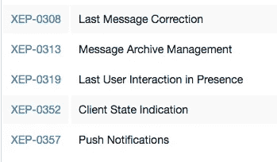
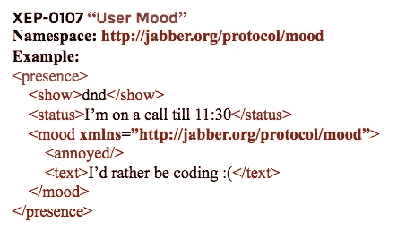
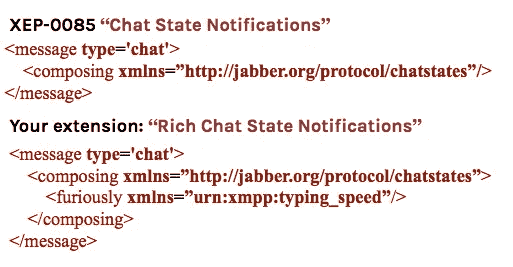
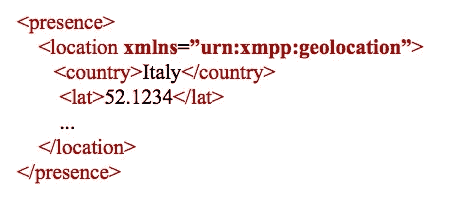

# FOSDEM 2018 的实时体验

> 原文：<https://medium.com/hackernoon/real-time-experience-at-fosdem-2018-6388190a7705>

作者:巴托米耶·戈尔尼

今年，我们抓住机会加入了最大的开源软件家族之一——参加了 [FOSDEM](https://fosdem.org/2018/) 。这是一个免费的开源欧洲开发者大会，于 2 月 3 日至 4 日在布鲁塞尔的布鲁塞尔自由大学 Solbosch 校区举行。FOSDEM 是世界上最大的专注于自由和开源软件开发的活动之一，它的氛围非常独特。

Fig. 1: ‘*Elasticsearch (R)Evolution’, presented* by Philipp Krenn, Fosdem 2018

FOSDEM 2018 一如既往地令人难以置信——巨大、嘈杂、拥挤、疯狂，洋溢着能量、欢乐和永无止境的兴奋。近 14，000 名与会者，653 名发言人和近 700 场支持开源创新的会谈，分布在 57 个主题会议上，这次活动非常成功。大多数会议室爆满，参展商和网络区域从早到晚都很忙，充满了大量的免费开源项目和他们的社区。Github 赞助的免费咖啡，摊位上有各种各样的东西，从铁杆 Perl 黑客到打扮成道路施工锥的 VLC 队，以及 LizardFS 的波兰-爱尔兰团队用伏特加招待参观者！

Fig. 2: Exhibitors Area, FOSDEM 2018

[阿莱西奥·法托里尼](https://twitter.com/ale_fattorini/status/959833999475658752)将福斯德姆描述为“极客的伍德斯托克”。考虑到热情、创造力与技术、创新和知识的结合，我们会说他是对的！

像往常一样，组织者通过多种伴随的社交活动，在增加网络和知识共享机会方面做得很好。2018 年是开源 20 周年，在 Fosdem 举行了庆祝活动。

我们也在那里，代表我们自己的基于开源的消息平台[mongoseem](http://bit.ly/2GhT2o6)，同时在实时休息室闲逛。

# 实时休息室

“实时休息室”是各种开源的、XMPP 驱动的软件解决方案被他们的社区展示的地方，在 XSF (XMPP 标准基金会)的保护下，他们是“实时休息室”的主要主持人。

挤在自动售货机和幸运轮之间的是我们舒适的角落，在那里我们汇集了开源即时消息和实时通信的精华。首先是 XSF，还有基于 XMPP 的软件——Tigase、韵律、MongooseIM、OpenFire 等等。

Fig. 3: Real Time Lounge, FOSDEM 2018

此外，我们的 MongooseIM 代表 Michał Piotrowski 和 bartomiej górny 在实时通信工作室介绍了他们的工作。Michał探索了扩展开源 XMPP 服务器 MongooseIM 的不同方式，bartomiej 分享了他对 XMPP 的看法，认为这是创新之路。

# Michał Piotrowski，“扩展消息系统”

*“在我的演讲中，我描述了 mongoseem 最常见的可扩展性限制，这表明，由于 Erlang VM，扩展单节点 mongoseem 安装或同一数据中心内的多个节点变得非常容易。当我们需要在各大洲之间安装时，真正的乐趣就开始了。在这种情况下，有两种选择。XMPP 联盟，用户被绑定到特定的数据中心。还有一个名为 Geo Distribution 的新 mongoseem 功能，在这种情况下，全球所有 mongoseem 集群都服务于同一个 XMPP 域，因此用户可以连接到任何数据中心，通常是最近的数据中心。”*

可伸缩性取决于 MongooseIM 或任何其他 XMPP 服务器的许多变量。很难说某个特定的选项对每个人都适用，因为我们有幸构建的每个 MongooseIM 安装都是独一无二的。在规划如何扩展 MongooseIM 时，我们需要考虑以下事项:

1.  机器功率(CPU 和内存)
2.  连接用户的类型。从 web 浏览器或桌面使用 XMPP 服务器不同于移动设备。移动设备将比桌面客户端更频繁地(重新)连接。
3.  使用和启用 XMPP 功能。仅使用基本的一对一消息而不进行存档，将比例如与许多活跃用户的大型群组聊天对服务器的要求低得多。

当服务越来越受欢迎，并且越来越多的用户在服务器上产生越来越多的负载时，资源可以被充分利用。通常是内存最先耗尽，但是根据您的具体使用情况，可能会发生这样的情况:首先您会耗尽 CPU 能力，或者您的数据库会开始变慢。

当你达到其中一个极限时，你需要开始攀登 MongooseIM。有几种方法可以做这件事。

首先，由于 Erlang VM，扩展单个 MongooseIM 节点就像添加更多资源(更多 RAM 或更强大的 CPU)一样简单。每个连接的设备被表示为 2-3 个轻量级 Erlang 进程。由于 Erlang scheduler 的作用，这些进程将分布在所有可用的 CPU 内核上。

虽然单个安装能够在非常强大的机器上处理数百万用户，但由于存在单点故障，因此通常不是一个好主意。典型的生产安装包括至少 3 个 MongooseIM 节点，以便能够在单个节点崩溃时存活。对于多节点安装，我们需要记住在所有节点上保留足够的备用资源，以便能够处理来自失效节点的流量。在某些时候，可能需要向群集中添加更多节点。感谢 Erlang VM，这一点非常简单。MongooseIM 使用 Erlang 分布层和 Mnesia 数据库来设置集群，并在集群中的节点之间进行通信。

在某些情况下，一个集群是不够的。在这种情况下，我们可以将 MongooseIM 扩展到集群之外。最简单的解决方案是 XMPP 联合。在这种方法中，我们设置了几个 MongooseIM 集群，每个集群服务于一个 XMPP 域。通过这种设置，用户将被绑定到特定的域，并且将始终需要连接到同一个数据中心。有时这太受限制，我们希望允许我们的用户连接到最近的数据中心。这种需求有了答案——它是 MongooseIM 的新扩展，名为 Geo Distribution。由于这一点，许多不同的 MongooseIM 集群可以服务于同一个域，用户可以连接到任何(通常是最近的)数据中心。

在这里观看视频录制[。](http://bit.ly/2J5CrBt)

# bartomiej górny，“XMPP 是创新之路”

*“我认为 XMPP 的可扩展性是两个世界中最好的:它有一个内置的机制，使它很容易扩展，在它的基础上构建东西，但它也有 XSF，它牢牢地控制着它，确保它以可控、有序的方式增长。该协议及其所有官方扩展涵盖了广泛的功能，但仍然干净整洁。这是它成为创新实施的一个好工具的原因。”*

XMPP 被设计成可扩展的，作为创新的载体。为此，它提供了在现有协议之上构建解决方案的技术手段。但是仅仅有可扩展性还远远不够真正有用——例如，Drupal，一个用 PHP 编写的 CMS，拥有超过 20k 个扩展。对于想找到自己需要的东西的人来说，这是个坏消息。

为了成为一个真正好的创新平台，XMPP 提供了三个支柱:

1.  坚实稳定的基础
2.  内置扩展机制
3.  验证和共享扩展的程序

# 1.基础

基本上，XMPP 用于在客户端之间交换消息和存在信息。它是基于 XML 的客户机-服务器协议。核心 XMPP 文档(RFC)定义了寻址方案，建立了 TCP 会话以及用于状态管理、交换和基本消息传递的过程。

该协议的基本“层”是三种 XML 结构(称为“节”)，每种结构分为几种类型:

1.  智商(获取、设置、结果、错误)
2.  存在(可用、不可用、探测以及一些更专业的类型)
3.  消息(普通、聊天、群聊等)

Fig. 4: A simple message stanza

每个小节都有一个定义好的角色:IQ (info/query)主要用于与服务器通信；在场向服务器和客户的朋友传达关于客户的可用性的信息；消息是客户端与客户端之间的通信，可以用于多种目的。

这些部分是协议的核心，不应该被修改。其余的是扩展，记录在“XMPP 增强建议”(XEPs)中。有很多，但不是太多——只有几百个，这听起来可能仍然很吓人，但这只是因为有很多东西可以用 XMPP 来做。最精彩的部分来了:xmpp.org 上有一个官方支持的 xep 列表，由 XSF (XMPP 标准基金会)维护。这份名单上的所有内容都经过了基金会人员的彻底审查、讨论、校对、改进和投票。换句话说，您可以信任它们，并在。选择您需要的一个也很容易，因为它们通常不会重叠——如果您发现两个 xep 包含相似的功能，那么很可能其中一个已经被标记为不推荐使用，或者很快就会被标记为不推荐使用。

Fig. 5: Part of the list of XMPP extensions

# 2.延伸机制

虽然协议的基础层是由 xml 标记名和属性(消息/聊天等)的狭窄选择定义的，但是扩展是围绕名称空间的概念构建的。整个机制可以用几个要点来描述:

1.  扩展使用一个节作为其传输(消息、存在或 iq)
2.  扩展定义了它唯一的名称空间
3.  扩展被记录在它自己的 XEP 中，因此在扩展、名称空间和 XEP 之间存在一对一的映射。

Fig. 6: Namespace identifying protocol extensions

这是它的要点——名称空间惟一地标识了正在使用的特性，是人类可读的，并且使得为给定的扩展插入专用的处理程序变得容易。

# 3.确认

如果你设计了自己的扩展，最好的测试方法是提交给 XSF。该基金会一直在寻找新的想法，但也极其谨慎和苛刻。如果你提交了你的文件(这个过程在[https://xmpp.org/about/standards-process.html](https://xmpp.org/about/standards-process.html)上有描述)，它将会被真正彻底地评估，你将不得不花大量的时间回答问题，进行修改和改进。它进入官方名单的机会很小，但是你会收到很多反馈。整个过程既耗时又令人沮丧，从基金会的角度来看也相当费力。然而，这是确保协议不被不成熟的想法污染的唯一方法。

# 扩展的正确方法

如果您想扩展 XMPP，下面是要采取的步骤列表:

第一步:仔细阅读 xmpp.org 的 xep 列表。不止一次。

如前所述，有相当多的，涵盖了许多领域，机会是你需要的已经得到了照顾。乍一看可能不明显，所以强烈建议仔细观察。

第二步:再读一遍列表，看看哪些可以作为基础

延期不是一个固定的要么接受要么放弃的事情。它更像是 OOP 中的一个类，你可以照原样使用它，或者在它的基础上构建另一个类。记住:名称空间可以嵌套，所以没有什么可以阻止您在扩展中实现扩展。

Fig. 7: Nested namespaces — extending an extension

第三步:仔细选择诗节

如果没有适合你的目的的东西，你必须从头开始设计一个扩展，在选择一节之前要三思。如果是客户端-服务器通信(比如从服务器获取一些数据，设置参数，执行管理操作)，你很可能会选择 IQ。对于几乎所有其他目的，使用消息。是的，使用“在场”很有诱惑力，有时甚至看起来很明显，它应该是一个“在场”。那么让我给你举个例子:假设我们想要实时发布一个用户的地理位置。第一个想法是“让我们使用存在”。这很符合逻辑，因为用户“出现”在某个位置。让我们设计一个扩展，将地理位置元素添加到存在中，瞧，我们完成了。

Fig. 8: The wrong way to propagate user state info

事实证明，这是一个非常糟糕的主意。首先，无论你的名单(联系人名单)中的每个人是否愿意，你都要有存在感。他不能摆脱它，除非他退订，这意味着他根本不会收到任何存在，位置或没有位置。此外，在线信息从不存档，这可能是您想要的。如果必须的话，使用 message。

顺便说一句，如果你考虑一下，这意味着你没有执行第 2 步——XEP-0163“个人事件协议”是完成这项工作的完美工具。它将每个用户帐户转变为一个发布-订阅节点，您可以订阅和接收事件信息，在本例中是位置，作为消息。更糟糕的是，这意味着您甚至还没有执行第 1 步，因为如果您执行了，您就会发现 XEP-0080 正是您所需要的。

步骤 4 —编写一个 XEP

强烈建议正确记录您扩展。当然，强烈建议您适当地记录您所做的任何事情；我在这里的建议是用记录所有其他扩展的相同方式来记录它。它相当冗长，但至少是一致的；实现你的想法的程序员将不得不阅读大量的 xep 和你正在写的那个。此外，考虑提交给 XSF。即使被拒绝了(很可能会)，你也会得到很多有用的反馈，而且是免费的。

在这里观看视频录制[。](http://bit.ly/2IhEyBk)

今年我们庆祝开源 Erlang[# OpenErlang](https://twitter.com/search?q=%23openerlang&src=typd)20 周年，我们很高兴成为 FOSDEM 的一员，与全球开源社区联系，共同庆祝开源 Erlang 20 周年。