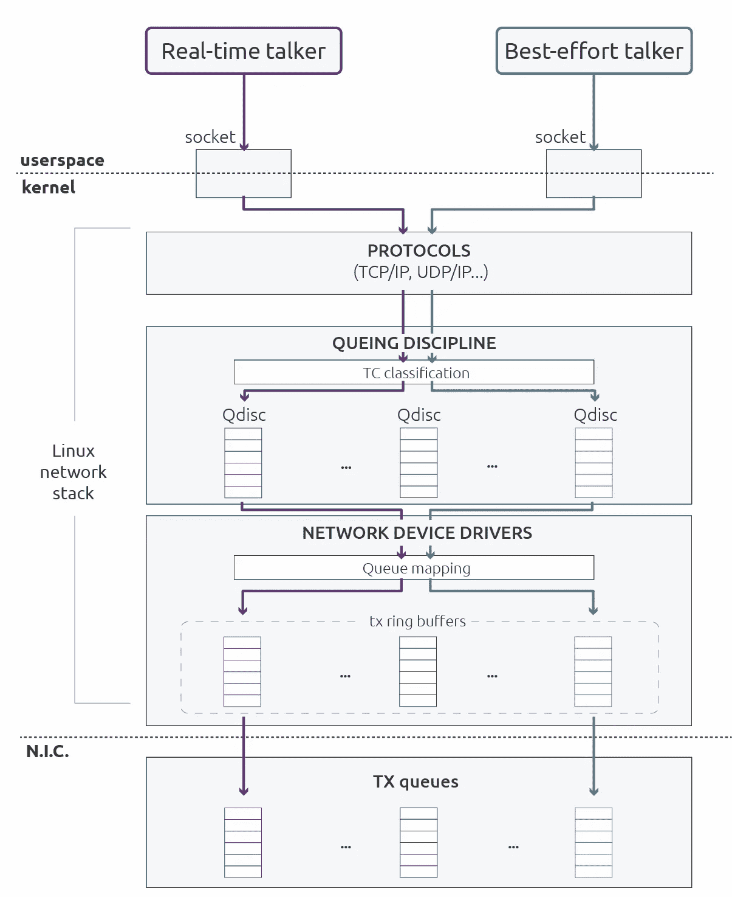
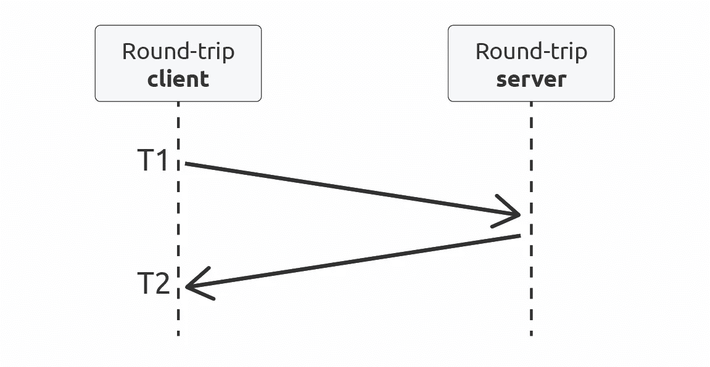
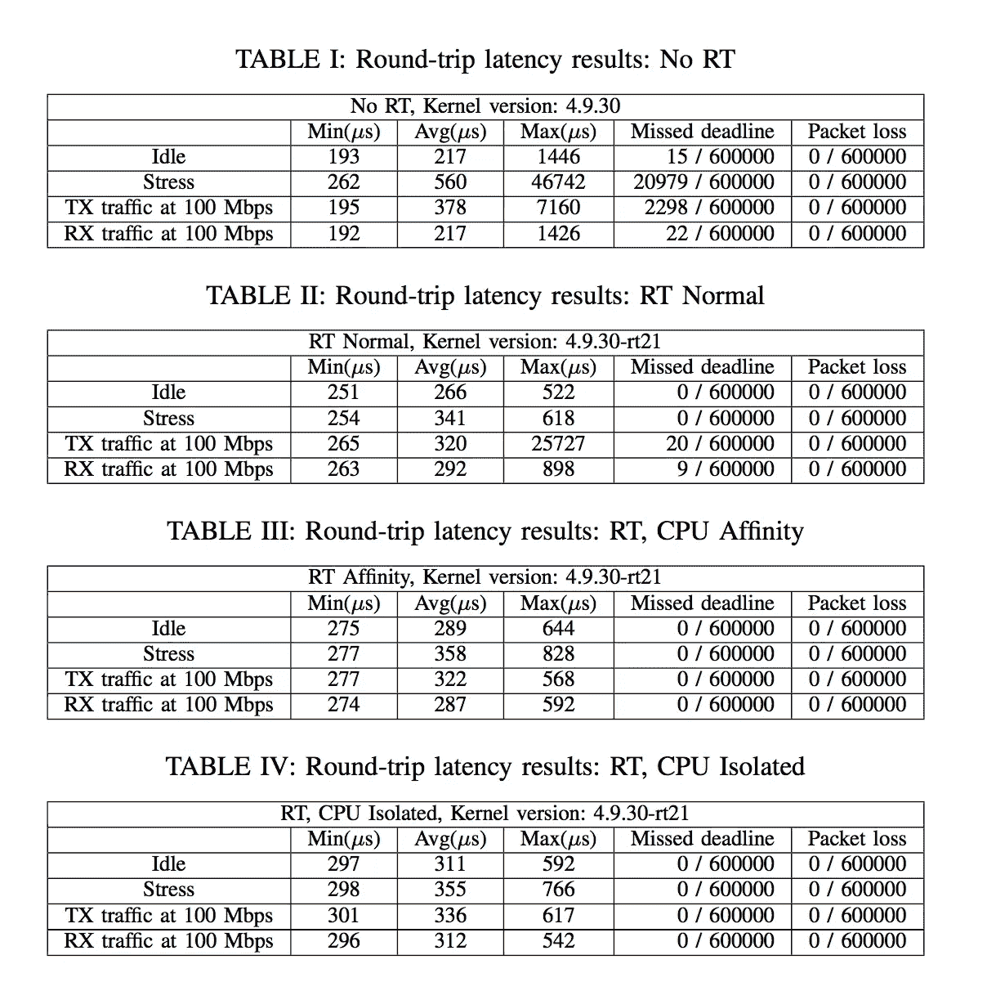
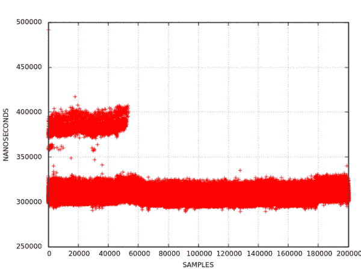
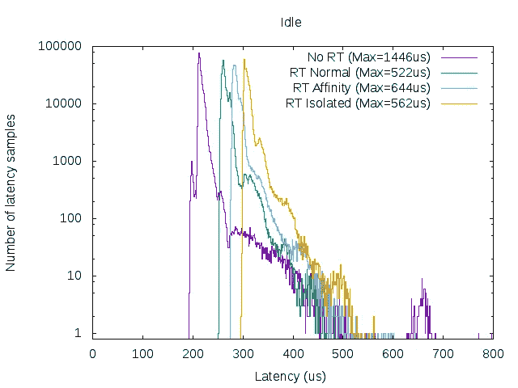
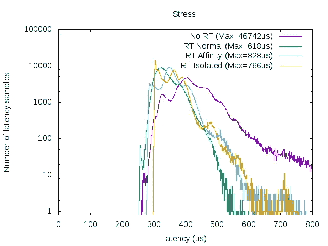
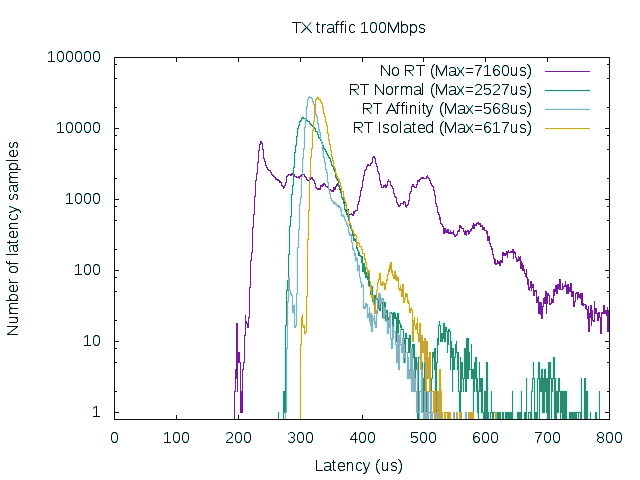
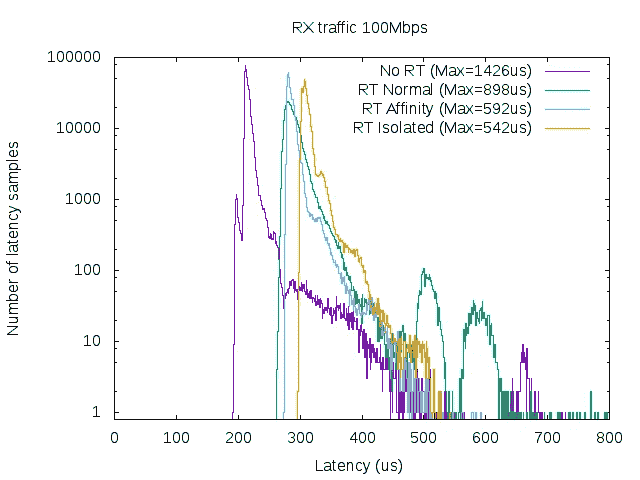

# 实时 Linux 通信

> 原文：<https://medium.com/hackernoon/real-time-linux-communications-2faabf31cf5e>

## 实时机器人应用的 Linux 通信栈的评估

*本文内容来自“*实时 Linux 通信:实时机器人应用的 Linux 通信栈评估*”，可在 https://arxiv.org/pdf/1808.10821.pdf*获得。*同行的有卡洛斯·圣维森特·古铁雷斯、兰德·乌萨特吉·圣胡安和* [*伊拉蒂·扎马罗亚·乌加特*](https://medium.com/u/e9b73593e3f?source=post_page-----2faabf31cf5e--------------------------------) *。*

Linux networking stack transmission path

> 随着机器人系统变得更加分布式，不同机器人模块之间的通信对于整个机器人控制的可靠性起着关键作用。在本文中，我们介绍了一个针对实时机器人应用的 Linux 通信栈的研究。我们以多核嵌入式设备为测试平台，评估了基于 UDP 的 Linux 通信的实时性能。我们证明，在适当的配置下，Linux 内核大大增强了使用 UDP 协议的通信的确定性。此外，我们还证明了并发流量会破坏有限的延迟，并提出了一种通过在 CPU 中分离实时应用程序和相应中断的解决方案。

# 介绍

以太网通信标准因其普及性和低成本而广泛应用于机器人系统。当谈到实时通信时，虽然历史上以太网是一个受欢迎的竞争者，但许多制造商选择了现场总线。正如在以前的工作[1]中介绍的，我们开始观察到一种变化。随着“时间敏感网络”(TSN)标准的到来，以太网有望在实时机器人应用中获得更广泛的采用。目前有几种基于以太网协议的通信技术。Profinet RT [2]或 Powerlink [3]等一些协议使用专门为协议设计的网络堆栈 1。其他协议，如数据分布式服务(DDS) [4]、OPC-UA [5]或 Profinet 都建立在众所周知的 TCP/IP 和 UDP/IP OSI 层之上。这促进了与通用传输协议的互操作过程，并确保了设备之间的高度兼容性。然而，它们相应的网络堆栈和驱动程序通常没有针对实时通信进行优化。与具有特定网络堆栈的其他以太网替代方案相比，实时性能有限。

在这项工作中，我们的目标是测量和评估 Linux 网络子系统与 UDP 和 IP 协议的实时性能。UDP 被几种实时传输协议使用，例如实时发布订阅协议(RTPS)。我们旨在确定哪种配置在混合关键流量场景中提供更好的隔离。为了实现实时性能，网络堆栈将部署在实时操作系统(RTOS)中。在 Linux 的情况下，标准内核不提供实时功能。然而，使用实时抢占补丁(PREEMPT-RT)，可以实现实时计算能力，如所示[6]。尽管 Linux 网络子系统没有针对有限的最大延迟进行优化，但通过这项工作，我们期望使用 PREEMPT-RT 实现合理的确定性通信，以及合适的配置。

# 在 Linux 中设置实时通信

## 实时抢占补丁(PREEMPT-RT)

目前有不同的方法将 Linux 用于实时应用程序。一种常见的方法是将最关键的任务留给嵌入式 RTOS，而将最高级别的命令交给 Linux。第二种方法是使用像 Xenomai [7]和 RTAI [8]这样的双核方案，它们部署了一个与独立的 Linux 内核并行运行的微内核。这种解决方案的问题是它需要特殊的工具和库。

第三种方法是使用单内核。实时 Linux (RTL)合作项目[9]是与这一选择最相关的开源解决方案。该项目基于 PREEMPT-RT 补丁，旨在创建一个可预测和确定的环境，将 Linux 内核转变为一个可行的实时平台。RTL 项目的最终目标是主线 PREEMPT-RT 补丁。这项工作背后的重要性与创建基于 Linux 的 RTOS 无关，而是为 Linux 内核提供实时功能。主要的好处是可以使用 Linux 标准工具和库，而不需要特定的实时 API。此外，Linux 得到了广泛的使用和有力的支持，这有助于操作系统不断更新新的技术和特性，这在较小的项目中由于资源限制常常是一个问题。

## Linux 网络架构

虽然可以使用定制驱动程序或用户空间网络库绕过 Linux 网络栈，但我们对使用 Linux 网络栈感兴趣；主要是因为它更容易维护和集成用户空间应用程序或通信中间件。此外，Linux 网络栈支持广泛的驱动程序，这些驱动程序允许在不同的设备上部署应用程序。

**Linux 流量控制** 联网子系统的一个重要模块是 Linux 内核包调度器，它是用用户空间工具 Linux 流量控制(TC) [10]配置的。TC 提供了控制排队数据包发送和接收方式的机制。它提供了一系列功能，如整形、调度、监管和丢弃网络流量。

Linux 数据包调度程序模块的主要元素是排队规则(Qdisc ),它是为接收和传输创建队列和服务质量(QoS)规则的网络流量规则。有入口和出口分别用于接收和发送。出口 Qdisc 为从网络协议层到网络接口环形缓冲区的数据传输提供整形、调度和过滤功能。另一方面，入口 Qdisc 为从网络接口环形缓冲区到网络协议层的接收路径提供过滤和丢弃能力(尽管这些通常很少使用)。

对于出口 Qdisc，有两种基本类型的规程:无类 Qdisc 和有类 Qdisc。无类的 Qdisc 不包含另一个 Qdisc，所以只有一级排队。无类 Qdisc 仅确定数据包是被分类、延迟还是被丢弃。有类的 Qdisc 可以包含另一个 Qdisc，所以可以有几个级别的队列。在这种情况下，可能有不同的过滤器来确定将从哪个 Qdisc 发送分组。

Qdisc 可用于避免传输路径上非实时流量的流量拥塞(见图)。对于无类 Qdisc，默认规则是 PFIFO_FAST，它有三个 FIFO 优先级带。在有类 Qdisc 的情况下，有 PRIO qdisc，它可以包含任意数量的不同优先级的类。还有指定给多队列网络设备的特定出口 Qdisc，例如 MQPRIO Qdisc [11]，它是一种排队规则，根据数据包的优先级将流量映射到硬件队列。该 Qdisc 将使具有较高优先级的分组出列，从而避免传输路径中的争用问题。除了优先级 Qdisc 之外，通常还会附加一个整形器来限制低优先级流量带宽，例如“令牌桶过滤器”TBF Qdisc [12]。

最近，由于对 Linux 网络栈中支持 TSN 的兴趣，新的 Qdiscs 已经被创建或者正在开发中。IEEE 802.1Q-2014 基于信用的整形器(CBS) [13]，Qdisc 已经包含在内核 4.15 中。CBS 用于通过限制流量类别的数据速率来加强服务质量。目前有两个正在开发中的 Qdisc，一个是“最早传输时间优先(ETF)”[ 14]，它提供基于每个队列传输时间的调度，另一个是“时间感知优先级调度器”(TAPRIO)，它提供每个端口的调度。这些 Qdisc 将允许在软件中创建确定性调度，或者如果支持的话，将工作卸载到网络硬件。

**流量分类** 为了将流量导向 Qdisc 或环形缓冲区，通常必须通过标记优先级来对流量进行分类。有几种方法可以设置特定通信流的优先级:a)从用户空间使用套接字选项 SO_PRIORITY 和 IP_TOS，b)使用 iptables，c)使用 net_prio cgroups。设置流的优先级会将来自套接字(或应用程序)的流量映射到套接字缓冲区(SKB)优先级，这是内核网络层的内部优先级。MQPRIO Qdisc 使用 SKB 优先级将业务流映射到 Qdisc 的业务类别。同时，每个流量类别被映射到一个 TX 环形缓冲区。

**网络硬 IRQ 线程和软 irq
在接收路径，数据包的处理由内核中断处理机制和“新 API”(NAPI)网络驱动程序驱动。NAPI 是一种旨在提高高网络负载性能的机制。当有大量输入流量时，会产生大量中断。当有许多分组已经排队时，处理每个中断来处理分组不是很有效。因此，当检测到高带宽输入数据包时，NAPI 会使用中断缓解。然后，内核切换到基于轮询的处理，定期检查是否有排队的数据包。当负载减少时，中断会再次重新启用。总之，Linux 内核默认使用中断驱动模式，只有当传入数据包的流量超过某个阈值(称为网络接口的“权重”)时，才会切换到轮询模式。这种方法作为延迟和吞吐量之间的折衷非常有效，使其行为适应网络负载状态。问题是 NAPI 可能会引入额外的延迟，例如当有突发流量时。**

PREEMPT-RT 和普通内核处理中断的方式有所不同，因此在接收路径上处理数据包的方式也有所不同。PREEMPT-RT 的修改允许配置系统以改进网络堆栈确定性。

在 PREEMPT-RT 中，大多数中断请求(IRQ)处理程序被迫运行在专门为该中断创建的线程中。这些线程被称为 IRQ 线程[15]。将 IRQ 作为内核线程处理允许单独管理优先级和 CPU 关联性。在线程中运行的 IRQ 处理程序本身也可以被中断，这样就减少了中断造成的延迟。对于多队列网卡，网络接口的每个 TX 和 RX 队列都有一个 IRQ，允许对每个队列的处理分别进行优先级排序。例如，可以为实时流量使用一个队列，并提高该队列的优先级，使其高于其他队列 IRQ 线程。

另一个重要的区别是软中断执行的环境。从版本 3.6.1-rt1 开始，软 IRQ 处理程序在产生该软 IRQ 的线程的上下文中执行[16]。这意味着 NET_RX 软 IRQ 通常将在网络设备 IRQ 线程的上下文中执行，这允许对网络处理上下文进行精细控制。但是，如果网络 IRQ 线程被抢占或者耗尽了它的 NAPI 权重时间片，它将在 ksoftirqd/n(其中 n 是 CPU 的逻辑号)中执行。

在 ksoftirqd/n 上下文中处理数据包对于实时来说很麻烦，因为该线程被不同的进程用于延迟工作，并且会增加延迟。此外，由于 ksoftirqd 使用 SCHED_OTHER 策略运行，线程执行很容易被抢占。实际上，软 IRQ 通常在 NIC IRQ 线程和 ksoftirqd/n 线程的上下文中执行，用于高网络负载和高压力(CPU、内存、I/O 等)。).

**套接字分配** 网络堆栈对于有限延迟的当前限制之一是套接字内存分配。[网络](https://hackernoon.com/tagged/network)栈中的每个数据包都需要一个保存数据包元数据的 sckbuff 结构。需要为每个分组分配该结构，并且分配所需的时间代表了处理分组和抖动源的大部分开销。

Linux 网络开发者的最后一个项目是 XDP 或快速数据路径[17]，其目的是在 Linux 内核中提供高性能、[可编程的](https://hackernoon.com/tagged/programmable)网络数据路径。XDP 将通过消除套接字元数据分配来提供更快的数据包处理。尽管实时通信不是这个项目背后的主要动机，但 XDP 看起来像是一个有趣的功能，可以用作实时通信的快速数据通道[18]。

# 实验结果

为了评估网络堆栈的实时性能，我们使用了两个嵌入式设备，测量往返测试的延迟。

## 往返测试

网络延迟以往返时间(RTT)来衡量，也称为乒乓测试。为了进行测试，我们在一个设备中使用一个客户端，在另一个设备中使用一个服务器。往返延迟是指消息从客户端传输到服务器，再从服务器传输回客户端所需的时间。对于客户端和服务器，我们使用了 cyclict test[19]的修改版本，它允许我们保存统计数据并创建延迟直方图，以显示测试的抖动量和最坏情况下的延迟。此外，对于 1 毫秒的目标循环时间，我们计算错过截止日期的次数。

对于定时循环，我们使用了 clock_nanosleep 原语。我们还使用了内存锁定、FIFO 调度程序，并将实时优先级设置为 80。在所有测试中，我们使用套接字选项 SO_PRIORITY 将流量标记为优先级流量。为了在系统中生成负载，我们使用了程序 stress，为了生成流量，我们使用了程序 iperf。

Graphical presentation of the measured round-trip latency. T1 is the time-stamp when data is send from the round-trip client and T2 is the time-stamp when data is received again at the round-trip client. Round-trip latency is defined as T2 — T1.

## 任务和 IRQ 关联以及 CPU 屏蔽

在实时系统中，实时任务和中断可以被固定到特定的 CPU 上，以将它们的资源与非实时任务分开。这是防止非实时过程干扰的有效方法。

有几种方法可以设置任务和 IRQ 与 CPU 的密切关系。在实验中，我们决定比较两种隔离级别。在第一种情况下，我们将实时任务和实时业务队列的 IRQ 固定在同一个 CPU 上。我们使用“pthread_setaffinity_np”和“smp irq affinity”来设置 irq 的优先级。

在第二种情况下，我们使用 cpusets [20]，它是 Linux cgroups 的一部分，用于为实时任务分配 CPU。通过这种方法，我们还可以迁移在隔离的 CPU 中运行的所有进程，以便只允许实时任务在该 CPU 中运行。我们还设置了所有 IRQ 与非实时 CPU 的亲缘关系，而(网络设备的)实时队列的 IRQ 在隔离的 CPU 中设置亲缘关系。

在实验设置中，我们使用所描述的方法来隔离发送和接收实时流量的应用。使用不同的配置运行测试: *no-rt* 、 *rt-normal* 、 *rt-affinities* 和 *rt-isolation* 。在第一种情况下， *no-rt* ，我们使用一个普通内核。在第二种情况下， *rt-normal* ，我们使用 PREEMPT-RT 内核，没有将往返程序和网络 IRQ 绑定到任何 CPU。在第三种情况下， *rt-affinities* ，我们将优先级队列的 IRQ 线程以及客户端和服务器程序绑定到每个设备的 CPU 1。最后，在第四种情况下， *rt-isolation* ，我们在一个隔离的 CPU 中运行往返应用程序。在所有情况下，我们将 RTT 测试客户端和服务器的优先级设置为 80。

为了直观地了解每个配置的确定性，我们运行了一个 1 小时的 cyclictest，获得了以下最坏情况下的延迟:no-rt: 13197 s，rtnormal/rt-affinities: 110 s，rt-isolation: 88 s。

**系统和网络负载** 对于每种情况，我们在不同的负载条件下运行测试:空闲、压力、tx-traffic 和 rx-traffic:

*   **空闲**:除了客户端和服务器端，没有其他用户空间程序运行。
*   **压力**:我们生成一些负载来给 CPU 和内存以及块内存施加压力。
*   **tx-traffic** :我们在客户端的传输路径上生成一些并发流量。我们从客户端向 PC 发送 100 Mbps 的流量。
*   **rx-traffic** :我们在服务器的接收路径中生成一些并发流量。我们从电脑向服务器发送 100 Mbps 的流量

当产生并发流量时，两台设备的 MAC 队列中也会出现拥塞。但是，由于测试的流量具有优先级，因此链路层增加的延迟对测试没有意义。

## 结果

我们比较了 3 小时往返测试的结果，以 1 毫秒的速率发送 500 字节的 UDP 数据包。下表显示了在不同条件下使用的不同配置的统计数据。对于实时基准测试，最重要的指标是最坏情况(Max)、数据包丢失和错过截止日期的次数。在这种情况下，我们决定设置一个 1 毫秒的截止时间来匹配发送速率。

从表 1 中可以看出，非实时内核产生了看似最佳的平均性能，但相比之下，它错过了大量的最后期限，并且最大延迟值也很高；即使系统空闲时也是如此。当系统由于内核中缺少抢占而承受压力时，延迟尤其严重。

对于 rt-normal(表 II)，当系统承受压力时，延迟是有限的。当生成并发流量时，我们观察到较高的延迟值和一些遗漏的致命性。

对于 rt-affinity，我们可以看到与前面的场景相比有所改进。特别是并发流量(表三)。我们还可以看到，当将往返线程和以太网 IRQ 的优先级固定到同一个 CPU 时，延迟似乎是有限的。

在非隔离的情况下(表 IV)，当与亲和的情况相比时，我们欣赏类似的行为。我们可以看到，给非隔离 CPU 施加压力会对隔离内核的任务产生一些影响。然而，在空闲情况下，对于短测试，我们观察到非常低的抖动。据我们所知，这种延迟的主要原因之一是调度器 ticker，它每 10 毫秒生成一次。虽然可以在客户机中避免它，因为它是在一个定时循环中运行的，但是在服务器端，不可能避免跑马灯。由于两个设备不同步，在某些时候，服务器端的时钟会偏离客户端，并且调度器跑马灯会干扰服务器的执行。下图中可以看到这种效果:

Time-plot for isolated CPU. At the beginning, we can observe the effect of the scheduler ticker preempting the real-time task and adding latency to the round-trip test latencies.

当使用 200 Mbps 接收流量运行测试时，我们观察到尽力而为流量在 ksoftirqd/0 上下文中被连续处理。这在所有情况下都会产生高延迟尖峰，即使对于隔离情况也是如此。为了跟踪这些延迟尖峰的来源，我们应该跟踪内核在延迟发生时拍摄快照。

Real-time Ethernet round-trip-time histograms for idle system.

Real-time Ethernet round-trip-time histograms for system under load (stress).

Real-time Ethernet round-trip-time histograms for concurrent low priority traffic in the transmission path.

Real-time Ethernet round-trip-time histograms for concurrent low priority traffic in the reception path.

# 结论和未来工作

所获得的结果证明，所提出的 Linux 实时设置大大提高了使用 UDP 协议的通信的确定性。首先，我们确认，通过利用实时内核和以实时优先级运行应用程序，减轻了当系统处于重负载下时引起的通信延迟。其次，我们证明了，无论何时有并发流量，简单地设置实时进程的优先级是不够的。在 CPU 中分离实时应用程序和相应的中断似乎是避免高延迟的有效方法。然而，对于更高的并发流量负载，我们仍然可以看到无限的延迟，需要进一步的研究来克服我们当前设置的这一限制。

我们的结论是，在某些情况下，对于各种压力和流量过载的情况，Linux 确实可以满足一些实时通信的限制。在此，我们对用于实时机器人应用的 Linux 通信栈进行了评估。未来的工作应考虑到网络堆栈尚未针对低延迟和有限延迟进行充分优化；当然还有改进的余地。在我们看来，在 Linux 网络栈内部有一些正在进行的工作，例如 XDP [17]项目，显示了改进实时性能的前景。在未来的工作中，测试这些特性并比较结果可能会很有趣。

# 参考

[1] C. S. V. Gutiérrez，L. U. S. Juan，I. Z. Ugarte 和 V. M. Vilches，“机器人的时间敏感网络”，CoRR，第 abs/1804.07643 卷，2018 年。【在线】。可用:[http://arxiv.org/abs/1804.07643](http://arxiv.org/abs/1804.07643)

[2]“ProFi net 领先的工业以太网标准，” [https://www .](https://www.)profibus.com/technology/profinet/,访问时间:2018–04–12。

[3]“POWERLINK—POWERLINK 标准化组”， [https://www .](https://www.)ethernet-powerlink.org/powerlink/technology,访问时间:2018-04-12。

[4]《数据分发服务规范，1.4 版》， [https://www .](https://www.)omg.org/spec/DDS/1.4/,访问时间:2018-04-12。

[5]“OPC-UA—OPC 统一架构(UA)，” [https://opcfoundation。](https://opcfoundation.)org/about/OPC-technologies/OPC-ua/，访问时间:2018–04–12。

[6] H. Fayyad-Kazan，L. Perneel，M. Timmerman，“Linuxpreempt-rt 与商业 rtoss:性能差距有多大？”《GSTF 计算杂志》(JoC)，2018 年第 3 卷第 1 期。【在线】。可用:[http://dl6.globalstf.org/index.php/joc/article/view/1088](http://dl6.globalstf.org/index.php/joc/article/view/1088)

[7]“Xenomai 项目主页”，2018 年 4 月，[访问时间:2018–04–12]。【在线】。可用:[https://xenomai.org/](https://xenomai.org/)

[8]“Rtai 项目主页”，2018 年 4 月，[访问时间:2018–04–12]。【在线】。可用:[https://www.rtai.org/](https://www.rtai.org/)

[9]“RTL 合作项目”，[https://wiki.linuxfoundation.org/](https://wiki.linuxfoundation.org/)实时/rtl/start，访问时间:2018–04–12。

[10]《流量控制— linux 排队规则》，[http://man7.org/linux/](http://man7.org/linux/)man-pages/man 8/TC . 8 . html，访问时间:2018–04–12。

[11]“多队列优先级 Qdisc — linux 手册页”， [https://www .](https://www.)systutorials.com/docs/linux/man/8-tc-mqprio/,访问时间:2018–04–12。

[12]“令牌桶过滤器— linux 排队规则”， [https://www .【systutorials.com/docs/linux/man/8-tc-tbf/, 访问时间:2018-04-12。](https://www.)

[13]“CBS—基于信用的整形器(CBS) Qdisc”，[http://man7.org/linux/](http://man7.org/linux/)手册页/man8/tc-cbs.8.html，访问时间:2018–04–12

[14]“预定分组传输:Etf”，[访问时间:2018–04–12]。【在线】。可用:[https://lwn.net/Articles/758592/](https://lwn.net/Articles/758592/)

[15] J. Edge，“将中断移动到线程”，2008 年 10 月，[访问时间:2018–04–12]。【在线】。可用:[https://lwn.net/Articles/302043/](https://lwn.net/Articles/302043/)

[16] J. Corbet，“软件中断和实时”，2012 年 10 月，[访问时间:2018–04–12]。【在线】。可用:【https://lwn.net/Articles/】T2520076/

[17]“XDP(快速数据路径)文档”，[https://lwn.net/Articles/](https://lwn.net/Articles/)701224/，访问时间:2018–04–12。

[18]“通往 linux tsn 基础设施之路，jesus sanchezpalencia”，2018 年 4 月，[访问时间:2018–04–12]。【在线】。可用:[https://elinux.org/images/5/56/ELC-2018-USA-TSNonLinux.pdf](https://elinux.org/images/5/56/ELC-2018-USA-TSNonLinux.pdf)

[19]“循环测试”，2018 年 4 月，[访问时间:2018–04–12]。【在线】。可用:[https://wiki . Linux foundation . org/real time/documentation/how to/](https://wiki.linuxfoundation.org/realtime/documentation/howto/)tools/cyclic test

[20] S. Derr，" CPUSETS "，[https://www.kernel.org/doc/Documentation/](https://www.kernel.org/doc/Documentation/)c group-v1/CPUSETS . txt，访问时间:2018–04–12。